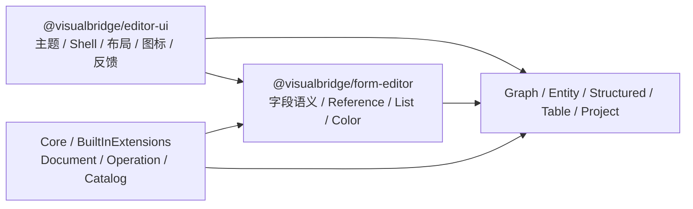

# Authoring 编辑器共享 UI

## 文档定位

本文定义当前内置 Authoring Webview 的共享视觉层、主题契约和复用边界。领域文档状态、Operation、Reference、保存、Undo/Redo 与 Host 消息仍由各领域和 VS Code Host 负责；共享 UI 只提供呈现与无领域语义的交互组合。

共享视觉参考方向为：Graph 使用现代节点工作流的清晰层级，Entity/Table 使用紧凑、整齐的属性面板。参考产品只用于确定信息层级，不引入其字体、主题色、构建体系或资源。所有普通文本使用 VS Code UI 字体，稳定 ID、路径和代码使用 VS Code Editor 字体。

## 包与依赖边界

`Editors/Ui` 是 workspace 包 `@visualbridge/editor-ui`，拥有主题 Token、基础控件外观、编辑器外壳、布局、状态反馈和通用图标。`Editors/Form` 依赖它并继续拥有字段值语义、Reference、List、Object、Color 和 JSON 编辑。Graph、Entity、Structured、Table 与 Project Settings 组合这两个层级，不复制全局控件样式。

`@visualbridge/editor-ui` 不得依赖任何 `@visualbridge/*` 领域包、VS Code API、Webview Host 消息或 Document 状态。根依赖门禁检查这一方向，并要求所有内置编辑器显式依赖共享 UI 包。公共组件采用 children/slot 组合；它们不能自行发送 Operation。

## 主题契约

`Editors/Ui/src/styles.css` 是基础视觉的唯一所有者。`--vb-*` 语义 Token 在 `:root` 中映射到当前 `--vscode-*`：

- `--vb-font-ui` 与 `--vb-font-code` 分离普通界面和机器信息字体。
- `--vb-color-background`、`--vb-color-surface`、`--vb-color-sidebar`、`--vb-color-toolbar` 表达表面层级。
- `--vb-color-foreground`、`--vb-color-muted`、`--vb-color-border`、`--vb-color-focus` 表达文本和边界。
- `--vb-control-*` 表达 Input、Select、Textarea 与 Checkbox 的公共视觉。
- `--vb-property-*` 与 `--vb-color-swatch-*` 表达属性面板密度。
- React Flow 的 `--xy-*` 和 Graph 局部 Token 继续映射到上述 Token 或 VS Code 图表色，不保存参考站点的固定深色值。

Webview 不读取或缓存主题 ID。VS Code 在主题切换时更新 `--vscode-*` 与 body 主题 class，已打开页面依靠 CSS 级联立即更新，不重新创建 React State。禁止为具体 `data-vscode-theme-id` 编写特例，也禁止外部字体和 CDN 资源。

高对比度使用 `--vscode-contrastBorder`、`--vscode-contrastActiveBorder` 和 Focus Outline 增强边界。Dirty、Pending、Error、Graph Data/Flow Port 等状态同时使用文字、形状或边框，不能只依赖颜色。

## 公共组件

`@visualbridge/editor-ui` 当前提供：

- `EditorShell`、`EditorToolbar`、`EditorToolbarGroup`、`ToolbarSpacer`、`EditorStatusBar`：统一编辑器框架。
- `SaveState`：统一 saved/dirty/pending 的文字和状态点。
- `SplitWorkspace`、`NavigatorPane`、`InspectorPane`、`InspectorRail`：主从导航与检查器布局。
- `PropertyGrid`、`PropertySection`：属性行和属性分区。
- `CommonIcon`、`IconButton`、`ListItemActions`：通用图标与列表项操作顺序。
- `FeedbackSurface`：Empty、Loading、Notice 和 Error 表面。

公共 CSS 统一拥有 `body`、字体、Button、Focus、基础 Input Token、Shell、状态栏和 `.vb-field*` 布局。字段控件的 Object/List/Reference/Color 细节由 `Editors/Form` 拥有。领域 CSS 只保留 Canvas、卡片、记录导航、对话框和领域状态等特有结构。

## 属性密度

属性系统提供三个预设，通过 `PropertyGrid` 的 `density` 或祖先的 `data-vb-property-density` 选择：

| 预设 | 使用位置 | 约束 |
| --- | --- | --- |
| `regular` | Entity、Table、Structured 主属性区 | 稳定标签列、适合完整表单 |
| `sidebar` | Graph Inspector | 缩小标签列和列间距 |
| `compact` | Graph Node、动态端口 | 最小可用间距，不改变字段值语义 |

嵌套 Object/List 继承当前密度。Entity、Table 与 Structured 只通过 CSS Custom Property 调整主面板宽度，不重新声明 `.vb-field*`。Table 是“记录导航 + 属性编辑器”；不使用 Spreadsheet/Data Grid 视觉。记录虚拟列表的 `.record-item-shell` 高度必须与 `TABLE_RECORD_ROW_HEIGHT` 同步保持 `48px`。

## 编辑器视觉边界

### Graph

Graph 的 React Flow Canvas、节点卡片、连线、端口、MiniMap、Controls 和 Inspector 保留领域 CSS。节点使用较大的圆角、分层表面、轻量阴影和清晰选中轮廓；Data Port 保持方形，Flow Port 保持圆形。连线颜色来自数据类型或 VS Code 图表 Token。高对比度下边框和形状仍能独立表达状态。

### Entity、Table 与 Structured

三者共用 Form Field 与 `regular` 属性布局。Entity 的 Component 卡片、Table 的 Sheet/记录导航、Structured 的单文档容器属于领域布局。字段标签、Control、Object/List、Reference、Color、Focus 和错误态属于公共层。普通 UI 不使用 Tweakpane 的字体。

### Project Settings

Project Settings 使用共享 Shell、Toolbar、Status、SaveState、字体、Button 与 Focus。Document Type、Provider 和工程配置卡片仍由 Project CSS 负责。

## 扩展规则

新增内置编辑器时：

1. 依赖 `@visualbridge/editor-ui`；需要字段语义时再依赖 `@visualbridge/form-editor`。
2. 从 `EditorShell`、公共状态和布局组件开始组合，不复制其他编辑器的全局 CSS。
3. 使用 `--vb-*` 或 `--vscode-*` 表达颜色；新增跨编辑器视觉值时先提升为 `--vb-*` Token。
4. 领域 CSS 不得重新拥有 `body/button/input` 或 `.vb-field*`。
5. 新增依赖必须重新评估许可证、维护状态、React 兼容性、包体积与 CSP。
6. 主题验证至少覆盖亮色、暗色和高对比度；运行时切换不能重载 Webview 或丢失未保存状态。

`@visualbridge/editor-ui` 是内置私有 VSIX 的实现包，不是已公开的项目 Webview SDK。未来项目自定义 Webview 仍需独立设计 Trust、CSP、版本和隔离契约。

## 验证

自动化门禁包括固定 Node/npm 工具链下的依赖检查、TypeScript 检查、Editor 测试、构建、VS Code Host、VSIX 打包/隔离安装、文档检查和 `git diff --check`。自动化不能替代真实 VS Code 中的视觉验收；涉及公共视觉的变更还应打开维护样例，检查 Graph、Entity、Table、Structured 与 Project Settings 的亮色、暗色、高对比度和窄窗口表现。
