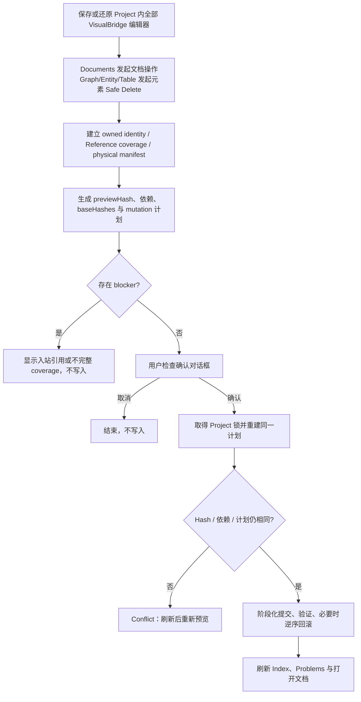

# VisualBridge Authoring 使用手册

## 1. 使用前提

本手册说明 Unity 接入前版本的人工编辑闭环。开始前应已按 [安装与快速开始](GettingStarted.md) 安装 VSIX，并打开一个包含有效 `VisualBridge.project.vbjson`、Document Type 和 Catalog 的本地工作区。仓库维护样例位于 [`Samples/PreUnityAuthoring`](../Samples/PreUnityAuthoring/README.md)。

Graph、Entity 和 Structured Config 是文本 Document，通过 `WorkspaceEdit` 参与 VS Code Undo/Redo 与普通保存；Table 使用 Custom Document 和正式 Codec 读写 CSV family 或整个 XLSX Workbook。Webview 只是权威源文件的视图，所有持久修改都必须先转换为领域 Operation、完整校验，再由宿主持久化。

## 2. 通用编辑和保存规则

### 保存状态

- Webview 中的“未保存”表示修改已进入 VS Code 文档状态，但尚未成为磁盘权威字节。
- 文本编辑器使用普通 **Save**、**Undo** 和 **Redo**。不要同时在 Text Editor、其他 VS Code 窗口或外部工具中修改同一文件。
- Table 编辑器使用 VS Code Custom Editor 的 Save/Undo/Redo。CSV family 的多个物理分表和 XLSX 的整个 Workbook 是一个逻辑保存单元。
- Lifecycle 和 Reference Refactor 会跨物理来源提交；执行前必须保存或还原当前 Project 中所有未保存的 VisualBridge 文本和 Table 编辑器。Lifecycle 允许 Table 保持已打开且干净。普通 Documents / Reference 入口发起的 Reference Refactor 要求关闭该 Project 的全部 Table 编辑器；只有直接从当前干净的目标 Table 编辑器发起行 Key Rename 时，才允许该目标 Table 保持打开，其他 Table 编辑器仍须关闭。

### 外部修改冲突

Graph、Entity 和 Structured Config 在提交下一次 Operation 前发现磁盘基线变化时显示两个明确选择：

- **覆盖**：保留当前编辑器内容并覆盖已经检测到的外部变更。只有确认外部内容不需要保留时才选择。
- **放弃并刷新**：丢弃尚未保存的当前编辑内容，以磁盘文件重新建立编辑基线，然后重试操作。

Table 不提供静默覆盖。任一 CSV 分表或 XLSX Workbook 自打开后被外部修改，Operation/Save 会拒绝并要求重新加载。先保留需要审查的外部文件，随后使用 VS Code Revert/关闭后重开恢复最新磁盘状态。

若 Project Transaction 返回 `writeInProgress`、`baseHashMismatch`、`dependencyChanged` 或 `changedBeforeReplace`，不要删除锁、journal、`.tmp` 或 `.rollback` 文件，也不要原地重复提交旧预览。保存/还原编辑器、刷新 Project、重新读取最新内容并重新发起操作。无法确定磁盘权威状态时按 [Project Transaction 恢复手册](ProjectTransaction.md#8-operational-recovery-manual) 处理。

## 3. 创建文档

优先使用 **VisualBridge: Create Document**，选择 Project 和业务 Document Type，再选择落在该类型唯一 `include` 范围内的目标路径。也可以使用：

- **VisualBridge: Create Graph Document**；
- **VisualBridge: Create Entity Document**；
- **VisualBridge: Create Structured Config**；
- **VisualBridge: Create Table Document**。

创建不是直接写空文件：领域 factory 根据 Catalog 和创建参数生成合法初始语义，Lifecycle 预览验证目标不存在、Project/Catalog 依赖和来源集合，再以 `create` transaction mutation 提交。创建 Table 时必须显式选择 `csv` 或 `xlsx` 载体；`xlsx` 生成真实 Workbook，`csv` 生成 Project Table Layout 对应的 UTF-8 CSV-compatible 载体。目标路径仍须匹配所选 Document Type，但扩展名不会替用户推断 `format`。

## 4. Graph V3

### 打开和创建

样例为 `Logic/Opening.encounter`，Document Type 为项目自定义后缀。通过 **Documents** 或 **VisualBridge: Open Document** 打开。创建 Graph 时选择匹配的 Graph Document Type、目标路径和根 Graph Type；Catalog 声明的 initial nodes 会随类型一起建立。

### 核心编辑

1. 在画布空白处打开创建菜单，按 Catalog 根标题和 `menuPath` 搜索节点类型。
2. 拖动节点调整位置；连接 flow/data 端口时，编辑器检查方向、数据类型、Graph Type selector 和连接数量限制。
3. 在节点内联区域编辑标题、数值、颜色、选择项、对象、List 和 Reference 字段。数据输入端口已连接时，对应字面值编辑器会隐藏；断开后恢复原值。
4. 使用 Graph Inspector 只编辑当前 Graph 的标题和 Graph Type 声明字段；Inspector 不管理公开接口。进入 child Graph 后，在画布上不可删除的 **Input Parameters** / **Output Parameters** 接口节点中新增、重命名、排序或删除公开参数。动态接口参数和 List 元素使用稳定 ID，拖动排序不会改变已有连线身份。
5. 通过子图创建菜单建立 typed embedded subgraph。父图只能经过公开接口连接子图，不能直接连接内部节点。
6. 右键节点选择安全替换。只有不会丢失属性或连线的候选可提交；单连接端口的受控替换会在同一 Operation 批次中先移除旧边再添加新边。
7. 多选普通原子节点后可 Copy、Paste 或 Duplicate；只复制两端都在选择集内的边，并为粘贴内容生成新 ID。当前 clipboard 不包含受 Graph Type 最小实例数约束的 singleton node 或 embedded subgraph。
8. 删除节点、接口或动态端口走 Safe Delete；存在外部入站引用、Reference coverage 不完整或 Graph Type 数量约束不满足时会拒绝。

Reference 字段的选择按钮调用共享 Reference Picker，跳转按钮定位目标。`graph.element` 跳转会进入所属 Graph、选择并居中节点，并临时高亮接口或动态端口。Graph Type 一经分配不能在当前版本任意迁移。详细语义见 [Graph Semantic Model](GraphSemanticModel.md) 和 [VS Code Graph Editor](VSCodeGraphEditor.md)。

## 5. Entity V1

样例为 `Entities/Hero.character`。Entity Editor 保存根标题、根属性和有序 Component 实例，不使用 `ScriptableObject`。

1. 编辑 Entity 标题和 Catalog 声明的共享字段。
2. 使用 Component 搜索按 Group、菜单路径、类型或 alias 查找可添加类型；Entity Type 和 Group 限制会过滤非法候选。
3. Component 卡片可以启用/禁用、拖动排序和 Duplicate。复制会生成新的 Component 稳定 ID，并深复制字段值。
4. 在卡片内编辑数值、颜色、选择项、递归对象、List 和 Reference。List 通过拖动手柄排序，并在一次字段提交中更新。
5. 删除 Component 使用 Safe Delete。若 `entity.component` 被其他文档引用，删除不会级联，必须先处理引用或取消操作。
6. 从引用节点执行 **Rename Reference Target** 可以在预览确认后同时修改 Component ID 及全部唯一解析到该位置的入站引用。

添加、复制、排序和字段修改均为原子 Entity Operation；任何一项失败或新引入 error，整批都不会写入。完整格式和限制见 [Entity / Component 编辑模型](EntityComponentModel.md)。

## 6. Structured Config V1

样例为 `Config/Game.settingsdata`。Project Document Type 的稳定 `id` 是唯一 Config Type 绑定，文件本身不保存第二份类型名，也不能在编辑器中切换 Config Type。

1. 打开文档后确认 Catalog ready，页面会递归呈现 Config Type 的完整字段。
2. 使用共享 Form 编辑数值、颜色、选择项、对象、List、JSON 和 Reference；提交转为 `structured.setField`。
3. 引用字段通过 Picker 选择稳定值或跳转定义；无效、缺失或歧义引用显示在字段和 Problems 中。
4. 使用普通 VS Code Undo/Redo 和 Save；外部修改时按“覆盖”或“放弃并刷新”处理。

Structured V1 不支持任意未知字段、旧格式迁移或 `ScriptableObject` 工作流。详细契约见 [Structured Config V1](StructuredConfigModel.md)。

## 7. Table V1

### 语义模型与导航

样例为 `Tables/Skills_A.csv`。Table Editor 同时支持 UTF-8 CSV-compatible 文件和 `.xlsx`，但 UI、MCP、Validator 与 Reference 始终面对同一 Table Semantic Model，而不是直接编辑原始行或 Workbook 对象。

1. 左侧记录列表按 `rowDisplayNamePattern` 显示并支持搜索；虚拟化窗口使 DOM 数量不随总记录数线性增长。
2. 选择记录后在右侧 Form 编辑 Catalog Column；单元格编码负责在稳定字段值与 CSV/XLSX cell 之间转换。
3. 可以插入、拖动排序、Duplicate 和 Safe Delete Row。稳定 key 的重命名属于项目级 Reference Refactor，不是普通 cell 修改。
4. `table.row` Reference 只解析去重策略后的有效行；跳转会打开逻辑 Table、选择 Sheet/Row 并滚动到记录。
5. 使用 **Validate All Documents** 检查分表、重复 key、类型、范围和引用诊断。

### CSV family

匹配 `{part}` 命名模板的多个 CSV 文件可以组成一个逻辑 Table。Editor 展示完整 family，并按 Catalog 的 `error`、`keepFirst` 或 `keepLast` 策略解析重复行；被策略遮蔽的物理行仍保留在原来源中。

- 保存、Lifecycle、Refactor 和回滚总是覆盖完整物理 source manifest，不能只提交一个分表。
- partitioned CSV family 不支持 **Save As**；请在原位保存。需要移动时使用 Document Browser 的 Lifecycle Move，它会保持每个成员 basename 并移动完整 family。
- 任一分表 Hash 改变都会拒绝整个 Operation/Save，避免把其他来源的新内容覆盖掉。

### XLSX

XLSX 以整个 Workbook 为权威物理来源。V1 面向受约束的普通游戏数据工作表：

- 简单 cell 修改会保留已知 typed cell、工作表顺序、无关 Sheet 和现有样式。
- 结构化行修改会重写配置的数据区域，并尽可能复制来源行样式。
- 支持读取公式的缓存结果，但不提供公式创作，也不保证复杂公式驱动数据区在结构修改后的任意往返保真。
- 宏、`.xls`、Pivot Table、Chart、外部链接和任意 Workbook 保真不在 V1 承诺内。

发生保存失败时不要手工拼接临时文件。保留磁盘和事务恢复材料，重新加载并验证整个逻辑 Table。详细 Codec、分表和限制见 [Table Semantic Model V1](TableSemanticModel.md)。

## 8. Document Browser

Activity Bar 的 **VisualBridge / Documents** 是语义浏览入口，不替代原生 Explorer，也不维护第二份文件状态。它按 Project、Document Type、Document、物理来源、诊断、Outgoing References 和 Incoming References 分组。

常用操作：

- **Search Documents**：按标题、稳定 ID、类型、路径、诊断和引用搜索。
- **Create Document**：在选定 Document Type 下进入统一创建流程。
- **Validate All Documents**：刷新完整语义索引，汇总 errors、warnings 和 references，并可打开 Problems。
- **Open Document**：使用 Project Registry 的同一路由打开语义文档或精确位置。
- **Refresh Documents**：合并刷新事件、显示进度并丢弃陈旧 generation。

CSV family 展开后能看到全部物理来源；不要把单个来源节点误认为独立逻辑 Document。完整树结构见 [Document Browser V1](DocumentBrowser.md)。

## 9. Document Lifecycle

Document Browser 的文档右键菜单提供：

- **Copy Document (Remap Stable IDs)**：为 Graph/Entity/Structured 内部可寻址身份自动生成新 ID；Table 会要求显式输入新 row key。副本内部引用随 remap 更新，指向副本外部目标的引用保持不变。
- **Rename Path (Keep Stable IDs)**：只改变物理路径，稳定 ID 和引用值不变。
- **Move Document (Keep Stable IDs)**：跨目录移动完整物理 source manifest，稳定 ID 和引用值不变。
- **Safe Delete Document**：删除完整文档；不提供通用级联删除，闭包外入站引用会阻止提交。

普通 Explorer/Git/外部脚本不参与 VisualBridge 协作锁。Lifecycle 只能通过 Hash、目标不存在性和重新索引检测它们的修改。完整边界见 [Document Lifecycle](DocumentLifecycle.md)。

## 10. Reference 与项目级 Refactor

当前内置 Reference kind 为 `document`、`entity.component`、`graph.element` 和 `table.row`；Project Provider V2 可以增加只读自定义 kind。共享字段只保存 string/number 稳定键，显示标题和导航位置来自 Provider。

使用方式：

1. 在字段中打开 Reference Picker，搜索并选择候选；或点击跳转按钮定位当前稳定值。
2. 在 Documents 中展开 Outgoing/Incoming References，查看解析状态和精确来源。
3. 对唯一 `resolved` 的引用节点运行 **Reveal Reference** 进入目标。
4. 保存或还原 Project 中全部 VisualBridge 编辑器。若从 Documents / Reference 入口发起，关闭该 Project 的全部 Table 编辑器；若直接从当前干净的目标 Table 编辑器发起行 Key Rename，可以只保留该目标 Table，并关闭其他 Table 编辑器。
5. 运行 **Rename Reference Target**，输入保持相同 JSON primitive 类型的新稳定值。
6. 检查预览中的目标、影响 occurrence 和物理文件数量，确认后一次性提交目标与所有入站引用。

Refactor 不做字符串搜索替换，也不按扩展名猜测文件。目标不唯一、跨 Project、编辑器未保存、新值碰撞、Provider unavailable 或预览后任一来源/Catalog 改变都会拒绝。完整语义见 [Reference System](ReferenceSystem.md) 和 [Project Refactoring](ProjectRefactoring.md)。

## 11. Project Settings 与 Catalog Browser

### Project Settings

运行 **VisualBridge: Open Project Settings**，或点击 Catalogs 视图标题的齿轮。页面通过结构化 Project Operation 管理：

- Project ID 与 Document Roots；
- Document Type 的稳定 ID、`editor`、include/exclude 和 Catalog；
- 一基的 Table `nameKeyRow` / `dataStartRow`；
- Project Provider 的 `.mjs` 入口、参数和 Reference/Validator 能力。

新增 Provider 先建立页面 Draft，填写真实入口和能力后再提交。保存前 Host 会重新验证 glob 交集、实际文件唯一归属、路径/符号链接边界、Catalog Registry、Structured/Table 类型绑定和外部修改。成功修改通过 `WorkspaceEdit`，支持 VS Code Undo/Redo；无效批次不会部分写入。

### Catalog Browser

**VisualBridge / Catalogs** 是只读视图。它显示 Registry ready 状态、类型/alias、物理 Catalog、`contentHash`、来源 `unknown/current/stale`、冲突和诊断。点击 Catalog 只打开文本，不会通过 Browser 改写或格式化由外部维护的 Catalog。

遇到 `catalog.sourceStale` 时让 Catalog 的外部维护者重新生成。VS Code Host 不扫描或加载 C#；Unity 项目可通过 Integration Profile 与 Package 的 batch/menu Exporter 重新生成受管 Structured Catalog。详见 [Project Settings 与 Catalog Browser](ProjectCatalogManagement.md) 与 [Unity Editor 接入架构](UnityIntegrationArchitecture.md)。

## 12. Problems、Output 与 Restricted Mode

- **Problems** 是 Project、Catalog、Document、Reference 和 Provider 诊断的统一入口。先修复 error，再判断 warning 是否为业务允许状态。
- **Output / VisualBridge** 记录 Project/Index 刷新、Provider stderr/生命周期、Lifecycle、Refactor 和事务摘要。MCP 的协议输出只在 stdout，诊断在启动 MCP 的 Host stderr。
- **Validate All Documents** 用于完整工程检查；后台增量刷新只重建受影响的语义单元，取消或被新 generation 取代的结果不会发布。
- Restricted Mode 允许扩展激活和声明式 Authoring 能力，但不启动 Project Provider。需要自定义 Reference/Validator 时先审查 `.mjs`，再信任工作区并刷新 Project。

若 Provider 报告 `externalModification`，停止写入并审查版本控制 diff；VisualBridge 不会自动回滚 Provider 绕过协议直接写入的文件。Provider Trust、授权和错误表见 [Project Provider V2](ProjectProvider.md)，索引刷新与大表行为见 [Workspace Index 与大工程编辑性能](WorkspaceIndexPerformance.md)。
