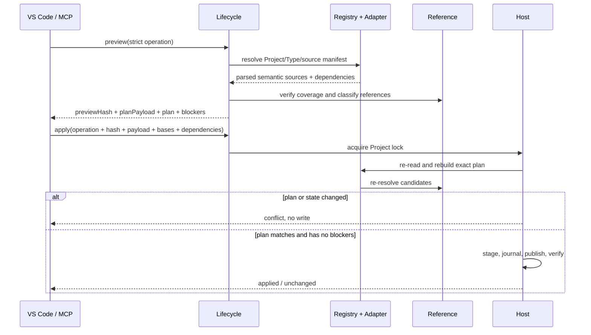
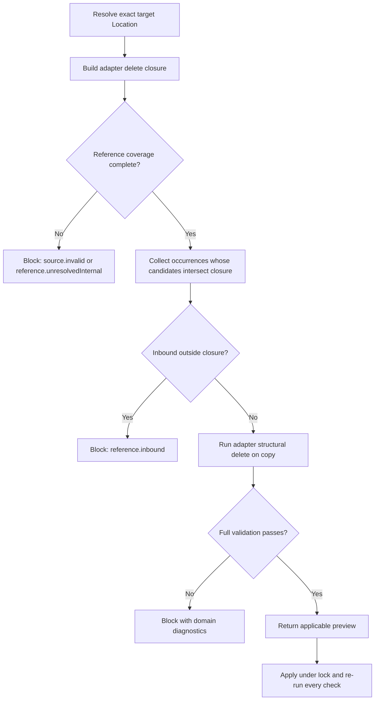
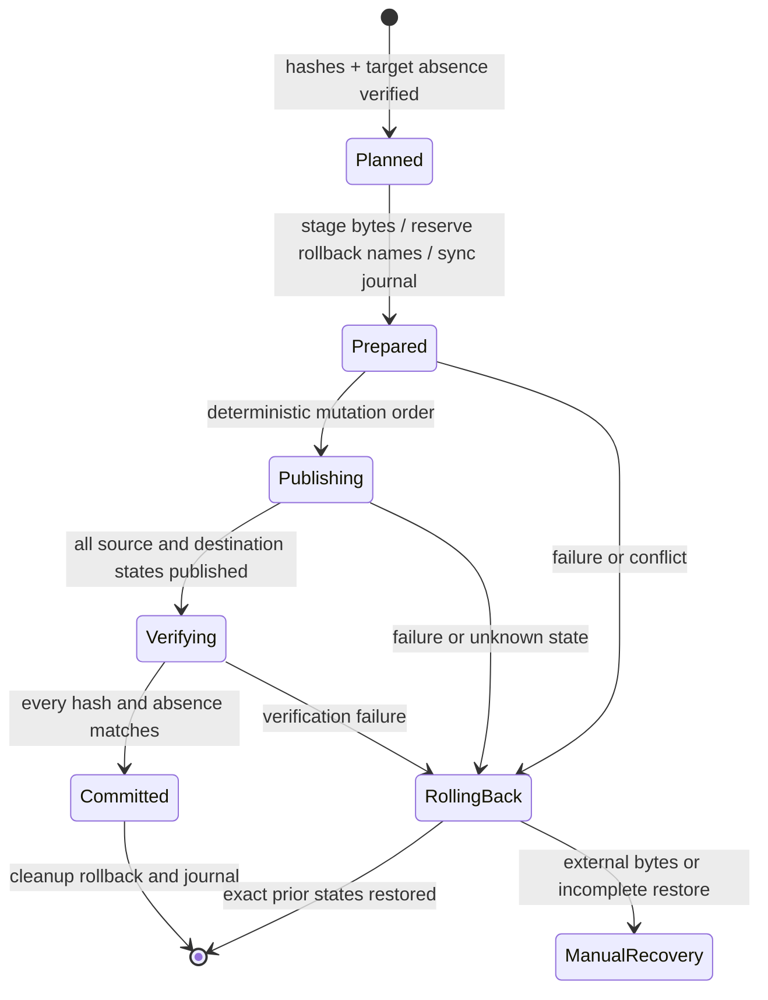

# VisualBridge Document Lifecycle

## 1. Status and scope

本文是 PU-03 已交付的正式 Document Lifecycle V1 契约。VS Code、Document Browser 与 MCP 共同复用 Core `DocumentLifecycleService`、四领域 Lifecycle Adapter、Project-wide identity index、Reference Service 和 Node Host Project Transaction；MCP 提供七工具中的 `visualbridge_document_lifecycle`，并以真实 stdio、Extension Host 和事务恢复测试固定相同行为。Project Registry、Document Adapter、Project Refactoring 与 Workspace Document Index 是本契约复用的基础。

V1 Lifecycle 只处理同一 Authoring Project、同一 Project Document Type 内的：

- 创建 Document；
- 复制完整逻辑 Document；
- 重命名或移动物理路径；
- 安全删除完整逻辑 Document、Entity Component、Graph Element 或 Table Row，并为会移除这些可寻址目标的普通 Operation 提供统一 guard。

跨 Project、跨 Document Type 的复制或移动属于导入/转换，不在 V1。Unity Catalog Exporter、Importer、Runtime 和 Debug 也不在本契约范围内。

## 2. Path is not identity

物理路径、文件名、扩展名和显示名称都不是语义身份。路径只负责 Project Registry 归属、物理载体定位和导航；稳定身份来自 Document 内容或 Catalog 定义：

| 对象 | 稳定身份 | 路径变化时 |
| --- | --- | --- |
| Graph / Entity / Structured Document | `documentId` | 保持不变 |
| Entity Component | Component `id` | 保持不变 |
| Graph Element | Graph / Node / Interface Port / Dynamic Port `id` | 保持不变 |
| Table Row | Catalog key 列的严格类型值 | 保持不变 |
| Table 逻辑 Document | V1 没有独立稳定 Document ID；Project Document Type 与 manifest 只是类型和位置 | 重新定位 manifest，不伪造 `documentId` |

因此“重命名路径”和“重命名稳定 ID”是两个不同命令：

- Path Rename / Move 只改变物理 source manifest，文件内容和全部 Reference value 不变。
- Stable ID Rename 继续使用 [`ProjectRefactoring.md`](ProjectRefactoring.md)，修改目标身份及所有唯一解析到该目标的入站引用。
- Copy 创建新的身份；不能通过复制文件字节保留原 Document ID 或可寻址内部元素 ID。

所有路径使用 `/` 分隔的 Project 相对规范形式。V1 拒绝绝对路径、`.` / `..`、反斜杠、symlink/reparse alias、Project Root 越界、大小写或规范化碰撞，以及不能唯一解析回原 Project Document Type 的目标路径。

## 3. One Lifecycle Service

Core 只定义一个宿主无关 `DocumentLifecycleService`，由 Host 注入异步 `planBuilder(operation)` 和 `hashPayload(payload)`；Core 统一负责 normalize、canonical payload、preview Hash 和 apply 比较。VS Code、Document Browser 和 MCP 的最终形态不能分别定义复制、引用判断或删除规则。Lifecycle Service 组合：

- Project Registry 与唯一 Document Type 匹配；
- 领域 Lifecycle Adapter、Parser、Catalog Registry、Validator、Serializer 和 Codec；
- Workspace Document Index 与 Reference Service；
- Project Refactoring 的稳定身份变换原语；
- Host 的 Project Transaction 与编辑器生命周期适配。

领域 `SemanticDocumentAdapter.lifecycle` 提供 owned identity 收集、完整 remap 和 contained target 删除；MCP 与 VS Code 复用该入口。V1 的职责边界如下，领域规则不得回流为 Host 私有字符串或 JSON 处理：

- 创建模板和默认值物化；
- 逻辑 Document 的完整物理 source manifest；
- Copy `stableIdRemap` 及其唯一性作用域；
- Copy 内部 Reference occurrence 的替换；
- Delete closure 和底层领域 Operation；
- 渲染后完整校验。

没有 Adapter 声明的身份、未知 JSON 字段或按字符串猜测出的引用都不能进入生命周期计划。

## 4. Strict preview and apply

所有 Lifecycle 修改都使用无状态的 `preview` / `apply` 两阶段协议。输入是 strict schema；未知字段、缺少判别字段或 editor 与 Project Document Type 不一致都会被拒绝。

V1 request 由 `operation.kind` 判别。`source` / `target` 都是完整 `DocumentLifecycleSelector`，包含 `projectId`、`documentTypeId`、`editor` 和 Project 相对 `path`：

| `operation.kind` | 必填字段 | 说明 |
| --- | --- | --- |
| `create` | `target`, `parameters` | `parameters` 使用下面按 editor 固定的 strict union；Project/type/editor/path 只出现于 `target`。 |
| `copy` | `source`, `target`, `stableIdRemap` | 调用方显式提交源文档全部 owned identity 的完整映射。 |
| `move` | `source`, `target` | 只改变完整物理 source manifest。 |
| `delete` | `source`, `target` | `target` 使用下面的 strict stable-target union。 |

Delete target 只允许：

- `{ "kind": "document" }`；
- `{ "kind": "entity.component", "componentId": "..." }`；
- `{ "kind": "graph.element", "graphId": "...", "elementKind": "graph", "elementId": "..." }`；
- `{ "kind": "graph.element", "graphId": "...", "elementKind": "node|interfacePort", "elementId": "..." }`；
- `{ "kind": "graph.element", "graphId": "...", "elementKind": "dynamicPort", "elementId": "...", "nodeId": "..." }`；
- `{ "kind": "table.row", "sheetId": "...", "rowId": "..." }`，其中两个 Operation-facing ID 原样取自语义 read 结果。

Create parameters 只允许：

| editor | strict `parameters` |
| --- | --- |
| Graph | `{ "documentId": stableId, "rootGraphId": stableId, "graphTypeId"?: stableId, "initialNodeIds"?: stableId[] }` |
| Entity | `{ "documentId": stableId, "entityTypeId": stableId, "title"?: string }` |
| Structured | `{ "documentId": stableId }` |
| Table | `{ "format": "csv" | "xlsx", "physicalName"?: string }` |

Graph `initialNodeIds` 缺省为 `[]`，但指定 Graph Type 物化初始节点时必须提供恰好足够的 ID。Table `format` 是唯一载体类型来源，不能从目标扩展名推断；CSV `physicalName` 缺省为目标 carrier stem，XLSX 不接受 `physicalName`。Entity `title` 缺省为 `New Entity`。未知参数一律拒绝。

`preview` 不写文件，返回：

- `plan.operation` 中规范化后的完整 operation；
- `previewHash`；
- `plan.dependencies` 中共享 Core builder 生成的四项规范依赖：一个 Project、一个聚合全部 Document Type Catalog source 的 Catalog、一个按物理 path/hash 建立的 document set，以及一个去除显示标题和诊断后规范化的 Reference index；
- `plan.baseHashes` 中 operation source 的完整物理来源 Hash：Create 固定为空对象，Copy / Move / Document Delete / contained Delete 均覆盖 source 的整个 physical manifest；
- `plan.mutations`，其中 Create/Copy/Move 目标以 `targetMustBeAbsent: true` 表达不存在性前置条件；
- 稳定排序的物理 source mutations；
- 调用方提交并经校验、稳定排序的完整 `stableIdRemap`；
- Copy 的内部/外部引用分类，或 Delete 的 closure/inbound references；
- `blockers`；preview 信封仍为 `status: "preview"`，无 blocker 的 preview 才可 apply。

Copy 的 `stableIdRemap` 是 request 和规范计划的一部分。调用方必须为 Adapter 报告的每个 `ownedIdentity.identityKey` 精确提供一个 `{ identityKey, from, to }`，不得缺少、重复、增加未知键、改变值类型或把 `to` 留为原值；目标值必须独立于目标路径并满足相同作用域的唯一性。Preview 只校验并规范化调用方提交的映射，不自动生成 ID。即使 remap manifest 无效，已经解析出的 target blocker 仍保留在 blocked plan 中。Create 的所有新身份同样由调用方通过领域 `parameters` 显式提交，不在 apply 阶段随机生成。

Core 通过四领域 Lifecycle Adapter 的 `collectOwnedIdentities` 为整个 Project 建立 collision index，并以严格值类型、`kind` 和 `collisionScope` 判断 Create/Copy 目标冲突。该检查不依赖 Reference Provider，也不从 ID、路径或扩展名猜测身份，因此没有 Reference definition 的 Graph Edge 和 Table dedup identity 同样必须与所有现存 Document 保持唯一。MCP 与 VS Code 使用同一个 Core helper 和同一批 Adapter 输出。

所有 plan、dependency、path、blocker、mutation 和 canonical JSON object key 的规范排序使用显式 UTF-16 code-unit 全序，不使用受系统 locale/ICU 影响的 `localeCompare`。相同数据即使输入反序，或字符串包含组合字符、非 BMP surrogate pair，也必须得到相同 `planPayload` / `previewHash`；不同 code-unit 序列仍保持不同，不做 Unicode 归一化。

Preview 返回 `previewHash`、不透明但确定性的 `planPayload`、结构化 `plan`，并把 `baseHashes` / `dependencies` 作为顶层 data 字段重复提供以便严格回传。MCP 请求还在顶层携带 `projectFile`：Preview 只允许 `projectFile`、`action: "preview"` 和 `operation`；Apply 原样带回相同 `projectFile`、`operation`、`previewHash`、`planPayload`、`plan.baseHashes` 和完整 `plan.dependencies`，不重复提交一个可以与 `planPayload` 分叉的第二份 mutation/remap。服务端在 Project 锁内重建当前 preview 并逐项比较。任一 operation、plan payload、依赖、来源、目标不存在性或 Reference 候选发生变化，都返回 `conflict`，不会套用旧计划。Apply 的当前计划若含 blocker 返回 `blocked`；无法建立可信 Project/Catalog/Document 快照、路径不合法或 I/O/事务状态不确定则返回 Tool Error。可由当前 Schema 接受的完整请求示例见 [`VisualBridgeMcp.md`](VisualBridgeMcp.md#document-lifecycle-工具)。

MCP 结果沿用 V2 公共信封。Preview 为 `{ contractVersion: 2, status: "preview", data: { projectFile, previewHash, planPayload, plan, baseHashes, dependencies } }`。成功 Apply 为 `status: "applied"`，`data` 含 `projectFile`、当前 `previewHash`、规范 `operation`、已提交的 `mutations` 和可选维护结果；当前计划有 blocker 时为 `status: "blocked"`，并返回重建后的 preview 数据及 `blockers`；预览授权或事务前置条件变化时为 `status: "conflict"`，并返回结构化 `reason` / `message`。这些业务状态不设置 MCP `isError`；Schema、Project、路径、Catalog、无法建立可信快照、I/O 或不确定事务故障使用 `status: "error"` 且设置 `isError`。

## 5. Create

Create 继续使用各领域现有 factory 和 Catalog 默认值，不允许 Host 拼接最低限度 JSON：

- Graph 选择 root-compatible Graph Type，创建 root Graph 和声明的初始节点；
- Entity 选择 Entity Type，物化根字段默认值；
- Structured 以 Project Document Type ID 解析唯一 Config Type，物化全部字段；
- Table 根据 Table Type、`tableLayout` 和目标 carrier 创建真实 XLSX 或 UTF-8 CSV-compatible 来源。

目标路径必须匹配所选 Project Document Type 且在 preview 与 apply 时都不存在。Create 使用 Project Transaction 的 `create` mutation，并在 mutation 中保存 `targetMustBeAbsent: true`；普通 `writeFile` 覆盖不是生命周期创建。Document ID 和初始内部 ID 由 strict `parameters` 显式提供，必须在各自作用域唯一，apply 不重新生成。

## 6. Copy and explicit remap

Copy 以完整逻辑 Document 为单位读取和写入。它保留业务值、显示名称、未知但由 Codec 明确保留的物理内容和解析到副本外的引用，同时应用调用方提交的完整 `stableIdRemap`：

| editor | 必须 remap 的身份 |
| --- | --- |
| `graph` | `documentId`、全部 Graph / Node / Interface Port / Dynamic Port / Edge ID，以及 `rootGraphId`、`subgraphId`、Edge endpoint 中的对应使用位置。 |
| `entity` | `documentId` 和全部 Component instance ID。 |
| `structured` | `documentId`。 |
| `table` | 没有 Document ID；每个 `kind: "table.row"` 的 typed key-column identity 必须映射到同类型的新值。若分表去重列不同于 key 列，每个 `kind: "table.dedup"` identity 也必须完整映射；相同列不重复。目标载体的 operation-facing Row ID 与 physical Sheet ID 由 Table Codec 重新派生，不进入 `stableIdRemap`。 |

Graph/Entity/Structured 的新 `documentId` 在同一 Project Document Type 内唯一。Entity Component 和 Graph Reference Provider 可寻址的元素 ID 也必须在其 Provider 作用域内唯一。Edge ID 虽不是当前 Reference kind，仍作为副本内部稳定身份 remap。领域 Adapter 定义稳定的 `identityKey`，例如 Graph 的 `document`、`graph:<graphId>`、`node:<graphId>:<nodeId>`，Entity 的 `document`、`component:<componentId>`，Structured 的 `document`，以及 Table 的 `table.row:<sheet/key tuple>` / `table.dedup:<sheet/value tuple>`；调用方不按数组位置匹配。

副本中的每个 Reference occurrence 必须通过正式 Provider 解析：

- 唯一解析到 Copy closure 内目标的 occurrence 使用 `stableIdRemap` 更新；
- 唯一解析到 closure 外目标的 occurrence 原样保留；
- `allowMissing: true` 的 missing occurrence 是已声明的可空外部引用，Copy 原样保留其值并记录不带目标位置的 `outboundPreserved`；其他 missing occurrence 拒绝 Copy；
- ambiguous、invalid target、Provider unavailable，或 Catalog/Parser 缺失导致 Reference coverage 不完整时同样拒绝 Copy。

Copy 不修改原件，也不把原件的外部入站引用改指向副本。副本拥有 remap 后的新身份，因此 Copy 只记录 `internalRetarget` / `outboundPreserved`，不记录表示同一身份换了物理位置的 `targetLocationChanged`；该 impact 只属于 Move。Table Copy 必须通过 Table Codec 保留未知物理列、XLSX 无关 Worksheet、样式和未改内容；非空 Table 不能用逐字节复制制造重复 key。

## 7. Move and physical source manifests

Move 保持来源字节和全部稳定身份不变，不调用领域 Serializer 重新格式化。目标仍必须唯一解析为同一 Project Document Type。

Move 的 `targetLocationChanged` 描述同一 owned identity 的 `ReferenceLocation.path` 从 source manifest 迁移到 target manifest；Reference value 和 identity value 均不改变。

Graph、Entity 和 Structured 通常有一个物理来源。Table 的 `path` 只是逻辑入口：

- CSV family 的全部成员作为一个 manifest 移动，不能只移动其中一个分表；V1 family Copy/Move 只允许改变目录，所选入口和每个成员都保留 basename；
- 每个目标文件名仍必须匹配同一 Sheet `namePattern`，source-to-destination 映射由 Table Lifecycle Adapter 明确返回；单载体 CSV 可以在 Project 声明仍唯一匹配时重命名；
- XLSX 移动整个 Workbook，内部 Worksheet 名称不变；
- 任一目标已存在或任一 family 成员变化都会使完整 Move 冲突。

成功后 Host 更新或重新打开编辑器 URI，清除 Reference cache 并刷新 Workspace Document Index。Reference Location 中的物理路径随索引更新，持久 Reference value 不改变。

## 8. Safe delete closure

Safe Delete 不提供通用级联。Lifecycle Adapter 先建立删除闭包：

- Document closure 包含该 Document 的身份及其中所有可寻址 Component、Graph Element 或有效 Table Row；
- Entity Component closure 包含该 Component；
- Graph Node closure 包含 Node、其 Dynamic Port、连接边，以及该 Node 所拥有的完整 subgraph hierarchy；
- 非 root Graph 通过 owning subgraph Node 删除；root Graph 只能随 Document 删除；
- Interface Port / Dynamic Port closure 包含该端口和直接连接边；
- Table Row closure 包含目标物理 Row 与对应稳定 key target。

Document Delete 的 `plan.ownedIdentities` 是整个 Document 的 identity 集；contained Delete 的该字段只包含实际删除闭包中的 identities。MCP 与 VS Code 不得一个返回整文档、另一个返回闭包。

闭包内相互引用随目标一起删除，不算外部入站引用。任何闭包外 occurrence，只要解析候选包含闭包目标，就属于 blocker；它来自同一文档、`allowMissing: true` 字段或其他文档都不例外。

Delete 之前必须证明 Reference coverage 完整。已经建立可信快照后发现入站引用或领域删除约束时返回 blocker；Project、Catalog、Document 或 Provider 无法建立可信快照时，MCP 返回 `lifecycle.invalidSource` Tool Error，VS Code 将其呈现为 `source.invalid` / `lifecycle.indexUnavailable` 并拒绝执行。具体包括：

- 相关 Project/Catalog/Document 不能解析或校验（快照建立失败）；
- 未知 Node/Component/字段结构可能隐藏 Reference；
- `reference.invalidTarget` 或 `reference.providerUnavailable`；
- ambiguous occurrence 的候选包含删除闭包，或无法证明不包含闭包；
- 目标已有入站引用；
- 底层领域 Operation 会违反 Graph Type、Entity Type、Table 或其他结构约束。

当 `operation.kind: "delete"` 的 target 是 `document` 时，计划删除完整物理 source manifest；Table Document 因而删除全部 CSV family 成员或一个 XLSX Workbook。当 target 是 Component、Graph Element 或 Table Row 时，Lifecycle 在通过 closure/Reference 检查后对语义副本执行对应低层领域 Operation，并以 `replace` mutation 写回原载体。物理删除成功前来源只移动到本事务 rollback 路径；事务 committed 并验证后才清理恢复材料。Safe Delete 不承诺操作系统回收站或长期恢复。

## 9. Ordinary Operation guard

元素级删除守卫已整体移除。文件内的编辑操作——包括 `entity.removeComponent`、`graph.removeNode`、`graph.removeInterfacePort`、`graph.removeDynamicPort` 与 `table.removeRow`——都是普通的单文件 Operation，可由公共编辑入口和 `visualbridge_apply_operations` 直接提交，**不依赖引用方文件的保存状态**。安全边界如下：

- 同文档内仍引用被删目标的删除会被原子拒绝（`entity.removedComponentReferenced`、`graph.removedElementReferenced`）。
- 跨文档悬空引用由持有方文档的 Reference 校验兜底：读取/校验时报告 missing target 诊断。
- 稳定 ID 重命名仍必须走 Reference Refactor（`refactor.required`）。
- 显式 Lifecycle Delete（`entity.component`、`graph.element`、`table.row` target）仍可用于需要完整闭包预览与授权计划的调用方，行为不变。

整文档级 Lifecycle 操作（create/copy/move/delete）保留完整授权流程。VS Code Host 的 Lifecycle preview 与 apply 仍要求 Project 内没有未保存的 VisualBridge TextDocument（`lifecycle.workspaceDirty`）；报错信息会列出具体未保存的文件，并提供"管理未保存的文档"入口。

## 10. Project Transaction states

Lifecycle 扩展 Project Transaction，使每个稳定排序的 physical mutation 明确声明 before/after 状态：

| mutation | before | after |
| --- | --- | --- |
| `replace` | `baseHash` | `nextHash` |
| `create` | absent (`targetMustBeAbsent`) | `nextHash` |
| `delete` | `baseHash` | absent |
| `move` | source `baseHash` + destination absent (`targetMustBeAbsent`) | source absent + destination same hash |

Mutation 的 `targetMustBeAbsent` 与 `plan.baseHashes` 一样是并发前置条件。Host 在阶段化、每次 publish 前和最终验证时都复核存在性与 Hash。事务 journal 记录 mutation kind、规范逻辑路径、绝对路径、临时/rollback 路径及 before/after 状态；恢复只能恢复已由同一事务发布且仍处于预期 Hash/absence 的目标，遇到未知外部字节时保留外部内容和恢复材料并返回 Tool Error。

Project Transaction 仍只保证本地文件系统进程并发和进程中断恢复；非协作外部写者、Remote Workspace 和突然断电不获得数据库级隔离。

## 11. Dirty editors and external writers

VS Code Host 的 Lifecycle preview 和 apply 都要求 Project 中没有未保存的 VisualBridge TextDocument，也不允许相关 Table Custom Editor 保留未保存状态；否则以 `lifecycle.workspaceDirty` 拒绝请求。独立 MCP 看不到 VS Code 内存缓冲区，只以已保存磁盘字节建立计划；调用方在交叉使用两个 Host 前必须先保存或还原编辑器。MCP 的 Hash 与 dependency manifest 会拒绝已经落盘的外部变化，但不能把未保存缓冲区纳入授权。

VisualBridge 无法阻止 Explorer、Git、脚本或其他进程直接复制、移动或删除文件。此类操作属于外部写入：文件监听器刷新 Project/Reference Index，打开编辑器进入外部修改处理，缺失或重复身份成为诊断；系统不会假装这些操作已经通过 Safe Delete，也不会自动修复引用。

Lifecycle 成功后必须清除受影响 Reference 缓存、刷新 Workspace Document Index，并使旧 Location/URI 明确失效，不能按同名路径或元素猜测新目标。若用户已经通过 `Validate All Documents` 启用 Workspace Diagnostic 发布，刷新后的诊断同步更新 Problems；否则索引保留诊断，直到用户显式发布。

## 12. Host entry points

Document Browser、各领域编辑器和 MCP 以同一个 Core `DocumentLifecycleService` 的规范化、canonical payload 与 apply 比较为边界，并复用领域 Adapter。MCP 已提供单一 `visualbridge_document_lifecycle` 工具，只有 `preview` 和 `apply` 两个 action；具体操作由 `operation.kind` 判别。它不把路径修改伪装成 Document Operation，也不复制 Reference/Codec/Transaction 规则。

当前 MCP V2 共八个工具，Lifecycle Schema、四领域 Adapter、Project Transaction、stdio 垂直切片、VS Code Browser/Editor 入口和跨宿主确定性回归均已交付，不保留按 editor 拆分的兼容别名。

VS Code 用户从 Document Browser 发起文档级 Copy、Move 或 Safe Delete；Graph、Entity 和 Table 领域编辑器只从具体 Node/Port/Component/Row 入口发起其拥有的元素级 Safe Delete，Structured 没有可单独删除的内部目标。Host 先显示 preview 的来源、目标、引用影响、blocker 与完整物理文件范围；只有用户确认后才 apply。若编辑器有未保存内容、preview 已过期或发生外部修改，Host 保持源文件不变并要求用户保存/还原、刷新后重新预览。日常操作步骤与故障处理见 [`AuthoringUserGuide.md`](AuthoringUserGuide.md)。
