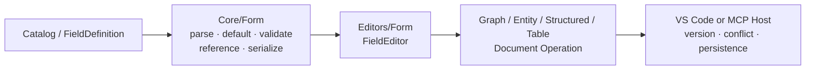
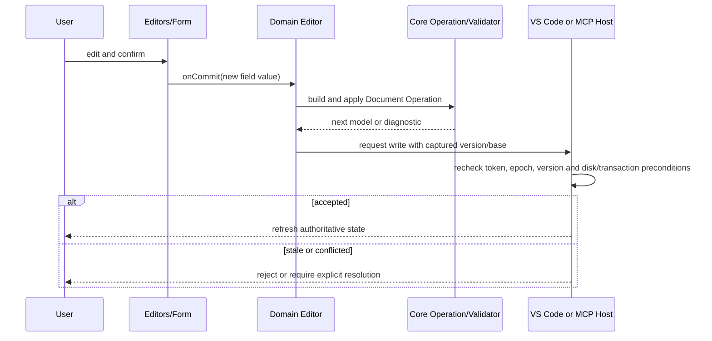

# Form Field Editor

## 文档定位

本文定义 VisualBridge 已落地的共享字段模型和 React 字段编辑器。`Core/Form` 拥有宿主无关的字段定义、默认值、校验、引用遍历和确定性序列化；`Editors/Form` 只负责把这些语义呈现为 Webview 控件并把一次用户提交上送给领域编辑器。Graph、Entity、Structured 和 Table 四类编辑器都复用这套能力，但各自仍拥有自己的 Document Operation、领域校验和持久化边界。

共享 Form 不是独立文档格式，也不直接访问 VS Code、文件系统或 MCP。宿主集成见 [`VSCodeHost.md`](VSCodeHost.md)，领域与宿主事务分层见 [`VisualBridgeArchitecture.md`](VisualBridgeArchitecture.md)。

## 分层与所有权

- `Core/Form` 不依赖 React、DOM、VS Code 或 Unity，决定字段值是否有效以及引用如何收集、替换。
- `Editors/Form` 使用 React 组件渲染字段，维护输入草稿、弹层和拖拽等短期 UI 状态。
- 领域编辑器把 `onCommit` 转换为正式 Operation，并负责原子应用、领域级 Validator 和 Serializer。
- Host 在 Operation 之外检查文档版本、Webview epoch、磁盘基线和 Project Transaction 前置条件。

因此，控件显示成功不表示内容已经持久化；只有领域 Operation 通过并由 Host 接受，才构成一次编辑。

## 字段契约

`FieldValueDefinition` 定义任意字段值的形态、默认值、编辑提示、Reference 与递归子结构；`FieldDefinition` 在其上增加稳定 `id`、`aliases`、`title` 和可选 `description`，用于对象中的命名字段。Graph 动态端口项直接使用无名称的 `FieldValueDefinition`，Graph/Entity/Structured 属性与 Table Column 使用 `FieldDefinition`，因此它们共享同一套递归语义而不为 Graph 复制字段类型。值的 JSON 形态由 `valueType` 决定：

| `valueType` | JSON 形态 | 递归定义 |
| --- | --- | --- |
| `string` | 字符串 | 无 |
| `number` | 有限数值 | 无 |
| `boolean` | 布尔值 | 无 |
| `object` | 对象 | `fields` |
| `array` | 数组 | `item` |
| `json` | 任意有限 JSON value，包括 `null` | 无 |

`dataTypeId` 保留运行时语义类型，不能由 JSON 形态替代。例如 `int` 与 `float` 都是 `number`，但前者还应通过 `editor.integer` 声明整数约束。`defaultValue` 用于创建完整的新值，Core 会复制对象和数组，避免不同实例共享可变默认值。

`null` 是 `valueType: "json"` 的合法显式值，也可以作为 JSON default、与该 shape 相容的 select option 或递归 JSON 内容；它不会因为“看起来为空”而回退到 Catalog default。只有字段值缺失（实现边界中的 `undefined`）才使用 default。`string`、`number`、`boolean`、`object` 和 `array` 仍要求各自声明的 JSON 形态，不能用 `null` 代替。

编辑器提示 `editor.kind` 当前包括 `text`、`multiline`、`number`、`checkbox`、`select`、`color`、`reference` 和 `json`。`readOnly`、整数、最小值、最大值、步长和选项属于同一声明；Core 会拒绝与 `valueType` 不兼容的编辑器组合，而 Webview 属性不能代替 Core 校验。

`select` 与 `json` 是显式呈现覆盖：即使 `valueType` 是递归 `object` 或 `array`，Form 也先使用 select 或 JSON 控件，而不是展开 Object/List UI。覆盖只改变呈现，不放宽语义；select 的每个 option 和 JSON 控件解析出的值仍必须通过原 `valueType`、递归字段及有限数值校验。

解析器只接受登记字段，并递归解析 `object.fields` 和 `array.item`。校验器递归检查值的 JSON 形态；未知对象属性会被保留并产生 warning，避免编辑已知字段时静默丢失尚未识别的数据。标准化和序列化保持确定性。

## 递归 Object 与 List

Object 由子 `FieldDefinition` 递归渲染。子字段提交后，Form 创建新的父对象并替换对应属性，再把完整父字段值向上提交；它不原地修改传入对象。

List 使用一个递归 `item` 定义，因此元素既可以是 primitive，也可以继续是 object 或 list。列表支持新增、删除和重排；空列表显示同一套新增入口。每次动作产生新的完整数组值，再通过父级 `onCommit` 上送。

列表操作使用共享 `ListItemActions`，按钮顺序和语义固定为拖拽、新增其后、删除。图标来自同一 Lucide 封装，按钮来自同一 Base UI 封装；鼠标、触摸和键盘拖拽都通过 dnd-kit 进入同一个重排提交路径。领域编辑器不得复制另一套含义不同的列表按钮。

## Reference 字段

Reference 只允许使用 `string` 或 `number` 作为存储值，并声明统一的 `kind`、结构化 `target` 和 `allowMissing`。Core 使用同一递归遍历收集或替换 object/list 深处的引用；Graph、Entity、Structured 和 Table 不应以文本搜索替代它。

Webview 中的 Reference 输入本身只读，选择和打开分别通过 Host bridge 发出 `pickReference` 与 `revealReference`。选择请求带唯一 request id；返回值只有在保持原始 string/number primitive 类型且确实变化时才提交，数字 `1` 与字符串 `"1"` 不可互换，取消或 bridge dispose 不产生编辑。候选解析、跨文档定位和 reveal 的权限属于 Host/Reference Service，而不是 Form。

## 数值与颜色

数值控件允许用户维护暂存文本；空字符串、纯空白、不能解析的内容和 `Infinity`/溢出等非有限结果都不会提交，失焦时恢复当前值。只有已变化的有限数值会进入领域 Operation。`min`、`max`、`step` 和整数属性同时提供输入提示，但最终约束由 Core 再次验证，从而保证 Webview 与 MCP 得到相同结果。JSON 控件同样拒绝包含非有限数值的解析结果。

颜色使用 `#RRGGBB` 或 `#RRGGBBAA`。颜色弹层维护独立草稿：Apply 才提交，Cancel 不提交；提交值标准化为大写十六进制。带 alpha 的原值继续保留 alpha 通道，不带 alpha 的 RGB 值按控件语义处理，但所有结果都必须再次通过 Core 的颜色校验。

## 控件提交粒度

一次用户确认动作对应一次字段提交，而不是每个渲染帧或每个临时字符都写文档：

- 单行、长文本和 JSON 在失焦时提交；单行 Enter 通过失焦进入相同路径。
- 数值在失焦且草稿可解析时提交。
- checkbox 与 select 在明确选择时立即提交。
- 颜色弹层只在 Apply 时提交；直接输入合法十六进制则在失焦时提交。
- Reference 只在 picker 返回有效且不同的值时提交。
- Object 子字段与 List 新增、删除、重排均提交新的完整父字段值。

JSON 文本只有成功解析后才提交；解析失败只保留控件错误状态，不把非法文本送入领域模型。Form 会抑制未变化的值，但 Operation 是否仍适用必须由领域层结合当前版本判断。

## Operation 与宿主事务边界

Form 的提交粒度只是 UI 手势边界。领域层可以把一个完整字段替换映射为一个 Graph、Entity、Structured 或 Table Operation；Operation 必须在当前文档上原子应用并完成领域校验。Host 随后负责持久化边界：

- VS Code 文本文档通过 `TextDocument`/`WorkspaceEdit` 进入原生 Undo/Redo，并在异步步骤后复核版本与 Webview epoch。
- Table 通过 `CustomDocument` edit event 提供 Undo/Redo，再由 save/backup 路径处理 CSV/XLSX 物理载体。
- Lifecycle、Reference Refactor、Table 多来源保存和 MCP 写入使用 Project Transaction 的锁、Hash、journal 和恢复语义。

Form 不持有 `baseHash`，不宣布保存成功，也不在冲突后自动重放提交。完整 Host 行为见 [`VSCodeHost.md`](VSCodeHost.md)，Project Transaction 见 [`ProjectTransaction.md`](ProjectTransaction.md)。

## 扩展规则

新增字段种类时必须同时决定 Core 的解析、默认值、兼容性、校验、引用遍历与确定性序列化，以及 React 控件的草稿和提交时机。只增加 Webview 控件会让 MCP 和非 UI 调用缺少相同语义，因此不构成完整扩展。

业务专用 UI 可以包装共享 `FieldEditor`，但不能绕过稳定字段 ID、递归值定义或领域 Operation。需要动态候选时优先使用 Reference bridge 或 Project Provider；不要让通用 Form 直接读取工程文件或启动业务代码。
