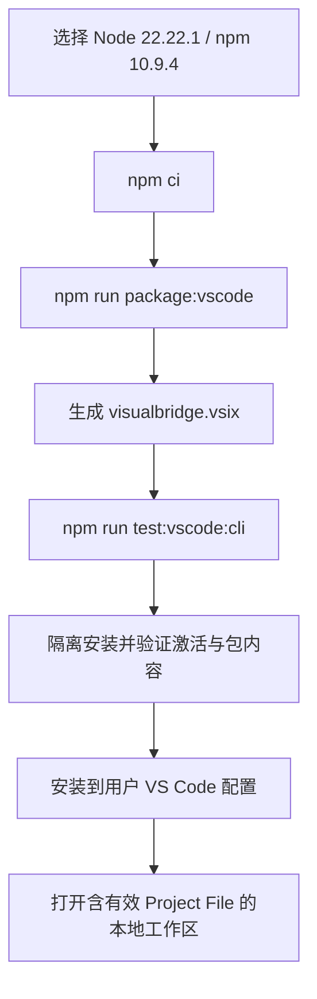
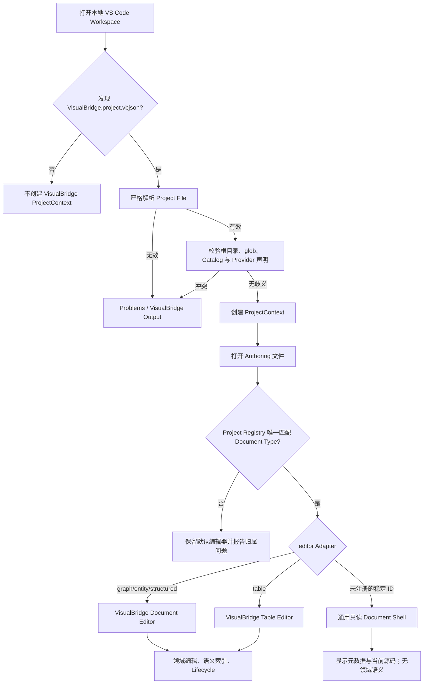

# VisualBridge 安装与快速开始

## 1. 适用范围

本手册面向第一次安装 VisualBridge VSIX 并打开 Authoring Project 的使用者。当前版本只支持本地文件系统工作区；VS Code Virtual Workspace 不受支持。Unity Catalog Exporter、Importer、Compiler、Editor Bridge、Runtime 和 Debug 尚未实现，因此本手册从已提交 Catalog 和 Authoring 源文件开始。

VisualBridge 是私有 `UNLICENSED` 工具，没有 Marketplace 安装入口。VSIX 必须由仓库构建或从受信任的内部构建产物取得。

## 2. 构建并验证 VSIX

仓库固定使用 Node.js `22.22.1` 和 npm `10.9.4`。`.npmrc` 启用了严格引擎检查；不要用其他 Node/npm 版本更新 lockfile。

在 PowerShell 中进入仓库根目录：

```powershell
nvm use 22.22.1
node --version   # v22.22.1
npm --version    # 10.9.4
npm ci
npm run package:vscode
```

产物固定为 `Tools/VSCodeExtension/artifacts/visualbridge.vsix`。在安装到日常 VS Code 配置前运行：

```powershell
npm run test:vscode:cli
```

该命令会重新打包 VSIX，创建隔离的 VS Code User Data 与 Extensions 目录，验证 `kyl.visualbridge` 身份、版本、运行入口、Schema、图标和五个 UI bundle（四类文档编辑器与 Project Settings），然后启动固定 VS Code 运行时证明 `workspaceContains` 激活和 Graph Custom Editor 路由。隔离目录不会修改用户现有配置，也不会替代真实编辑交互测试。



## 3. 安装到 VS Code

在 VS Code Command Palette 中运行 **Extensions: Install from VSIX...** 并选择生成的文件，或从仓库根目录执行：

```powershell
code --install-extension .\Tools\VSCodeExtension\artifacts\visualbridge.vsix --force
```

重新安装同版本时保留 `--force`。安装成功只证明扩展包存在；只有打开包含有效 `VisualBridge.project.vbjson` 的工作区后，Project 功能才会激活。

## 4. 打开维护样例

仓库的 `Samples/PreUnityAuthoring` 是 Unity 接入前的正式最小样例，包含：

- Graph V3：`Logic/Opening.encounter`；
- Entity V1：`Entities/Hero.character`；
- Structured Config V1：`Config/Game.settingsdata`；
- Table V1：`Tables/Skills_A.csv`；
- 四类匹配 Catalog；
- 一个默认受 Trust/allowlist 限制的 Project Provider V2 示例。

安装 VSIX 后打开样例目录：

```powershell
code .\Samples\PreUnityAuthoring
```

确认以下状态：

1. Activity Bar 出现 **VisualBridge** 容器，内含 **Documents** 和 **Catalogs** 两个视图。
2. 状态栏显示当前发现的 VisualBridge Project 数量。
3. **Documents** 按 Project 和 Document Type 列出四类样例。
4. **Catalogs** 显示四类 Registry、类型、alias、来源状态和内容 Hash。
5. Command Palette 能找到 **VisualBridge: Refresh Projects**、**VisualBridge: Open Document** 和 **VisualBridge: Open Project Settings**。

如果没有出现这些入口，先运行 **VisualBridge: Refresh Projects**，再查看 **Problems** 与 **Output / VisualBridge**。无效 Project File、重复 Project ID、glob 歧义、Catalog 缺失或类型绑定错误会阻止相应 ProjectContext 建立。

## 5. Project 发现与激活

扩展 manifest 使用 `workspaceContains:**/VisualBridge.project.vbjson` 激活。激活后，Project Registry 只接受成功通过严格解析和工作区校验的 Project File。一个工作区可以包含多个 Project；打开文档时以文件所在目录向上最近的有效 Project File 确定候选 Project，再依据 Project 的 `documentRoots`、`include`、`exclude` 和 Document Type 唯一匹配确定编辑器。



文件扩展名不决定业务类型。Project Schema 与 Core 接受任意合法的稳定 `editor` ID；当前 VSIX 只为 `graph`、`entity`、`structured` 和 `table` 注册领域 Adapter。匹配未注册 ID 的文本文件仍可通过 **VisualBridge: Open Document** 或工作区编辑器关联打开：VS Code 显示通用只读 Document Shell，其中包含 Project、Document Type、Adapter ID、路径和当前源码，但不提供领域编辑、Catalog 语义、语义索引、Reference、Lifecycle 或其他领域操作。MCP 的 Project 读取与文档清单仍保留该声明并返回 `adapterAvailable: false`；Catalog、Document、Apply Operations、Reference、Refactor 和 Lifecycle 等需要语义 Adapter 的操作不可用。稳定的 Document Type `id` 表示项目业务子类，`include` / `exclude` 才拥有文件归属。

扩展 manifest 为 `.vbgraph`、`.vbentity` 和 `.vbconfig` 提供静态便利 selector，但 Custom Editor 仍会执行 Project Registry 校验；这些后缀不会绕过 Project File。`.csv`、`.xlsx` 和项目自定义后缀默认不被全局强制接管。

## 6. 打开任意扩展名

样例故意使用 `.encounter`、`.character` 和 `.settingsdata`，用于证明扩展名不是类型判别器。可以通过三种方式打开：

1. 在 **VisualBridge / Documents** 中选择语义文档；这是最直接的入口。
2. 在原生 Explorer 中右键文件，运行 **VisualBridge: Open Document**。
3. 为当前工程的 `.code-workspace` 配置工作区级 `workbench.editorAssociations`；不要建立接管所有 `.json`、`.csv` 或 `.xlsx` 的用户级全局关联。

Table 文件也可以使用 **Open With... / VisualBridge Table Editor**。无论从哪个入口打开，最终都必须由 Project Registry 唯一解析到同一个 Document Type。文件不属于有效 Project、同时匹配多个类型，或 `editor` 与 Catalog 不一致时不会猜测路由。

## 7. 创建或接入自己的 Project

当前扩展不会在空目录中自动生成 Project File。新项目应以维护样例为起点，或依据 [Project Settings 与 Catalog Browser](ProjectCatalogManagement.md) 和正式 [Project Schema](../Protocol/Schema/visualbridge-project.schema.json) 创建 `VisualBridge.project.vbjson`，并准备匹配的 Catalog。

Project File 成功发现后：

1. 运行 **VisualBridge: Open Project Settings**。
2. 配置 Document Roots、Document Type 的稳定 `id` 与可扩展稳定 `editor` ID、include/exclude、Catalog、Table Layout 和可选 Provider；当前四个内置 ID 才提供完整领域能力。
3. 页面显示配置有效后使用普通 VS Code Save 保存。
4. 运行 **VisualBridge: Refresh Projects**，在 **Problems** 中消除归属、Catalog 和来源状态问题。
5. 使用 **VisualBridge: Create Document** 选择业务 Document Type；也可以使用四个领域创建命令。

Project Settings 通过结构化 Operation 修改已经存在的 Project File，不替代首次 Project File 和 Catalog 的建立。

## 8. Trust、Problems 与日志

扩展声明支持 Restricted Mode。未信任工作区仍可发现 Project、读取源文档和 Catalog，并使用声明式内置能力；Project Provider 是当前用户权限下的工程代码，只会在 Workspace Trust 允许时启动。Restricted Mode 不会启动 Provider，因此自定义 Reference 或 Validator 可能显示 unavailable，已有字段值不会因此丢失。

排障入口：

- **Problems**：Project/Catalog/Document/Reference/Provider 诊断和 Catalog stale 状态。
- **Output / VisualBridge**：Project 刷新、Provider stderr/结构化生命周期、Lifecycle/Refactor/Transaction 结果。
- **VisualBridge / Documents**：执行 **Validate All Documents**，查看错误、警告、引用和物理 Table 来源。
- **VisualBridge / Catalogs**：检查 Registry、alias、`contentHash` 与 `unknown/current/stale` 来源状态。

Provider 的声明、Trust、MCP allowlist 和故障处理见 [Project Provider V2](ProjectProvider.md)。四类编辑器与安全修改步骤继续阅读 [Authoring 使用手册](AuthoringUserGuide.md)。
