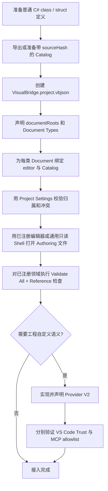
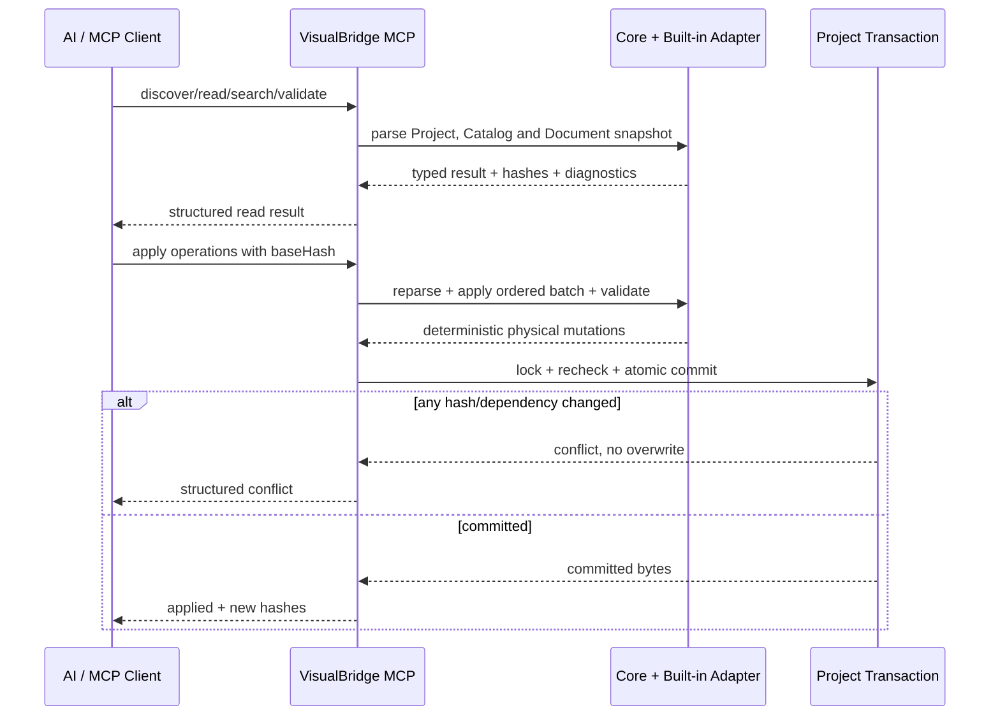

# VisualBridge 项目接入与运维手册

## 1. 适用范围

本文面向把现有游戏配置工程接入 VisualBridge 的开发者，说明本地 Authoring 能力：Project、任意扩展名 Document Type、外部 Catalog、共享字段、Project Provider V2、stdio MCP、并发保护、日志与故障恢复。

Authoring 源文件是唯一权威数据。当前 Unity Package 已能从 Profile 显式登记的普通 C# class / struct 导出 Structured Catalog V1，并在 Editor 中离线校验、物化与编译 Structured Document；它不引入 `ScriptableObject`。Editor Bridge、Runtime、Debug、DAP、Player、WebSocket 和独立产品 CLI 尚未实现，Unity Profile 与 batch 接入见 [`UnityIntegrationArchitecture.md`](UnityIntegrationArchitecture.md)。

可运行的最小工程位于 [`Samples/PreUnityAuthoring`](../Samples/PreUnityAuthoring/README.md)。接入新工程时应先复制其组织方式，再替换稳定 ID、Catalog 和业务文件，不要根据文件扩展名反推领域语义。

## 2. 接入顺序



接入过程必须保持以下依赖方向：

```text
Protocol -> Core -> BuiltInExtensions -> VS Code / MCP Host
```

Catalog、Parser、Validator、Operation、Reference 和 Serializer 只在 Core / Built-in 语义包中实现一次。VS Code 与 MCP 仅提供宿主生命周期和持久化适配；Provider 只能增加 Reference kind 与 Validator，不能复制或绕过领域 Operation。

## 3. Project File 与文件路由

每个 Project 使用一个 `VisualBridge.project.vbjson`。正式结构由 [`visualbridge-project.schema.json`](../Protocol/Schema/visualbridge-project.schema.json) 固定，完整样例是 [`Samples/PreUnityAuthoring/VisualBridge.project.vbjson`](../Samples/PreUnityAuthoring/VisualBridge.project.vbjson)。关键字段如下：

| 字段 | 约束 |
| --- | --- |
| `formatVersion` | 当前固定为 `1`。 |
| `projectId` | Project 的稳定身份；不能使用目录名代替。 |
| `documentRoots` | Project 内规范化相对目录；用于限制 Authoring 来源范围。 |
| `documentTypes` | 业务子类清单；每项声明稳定 `id`、`editor`、`include`、`exclude` 和 Catalog。 |
| `tableLayout` | 全 Project 共用的 1-based `nameKeyRow` 与 `dataStartRow`。 |
| `providers` | 可选的受信任 Provider V2 入口、参数与能力上限。 |

`editor` 是可扩展的稳定 Adapter ID；Schema 与 Core 接受任意合法稳定 ID，当前内置并可操作的 ID 为 `graph`、`entity`、`structured` 和 `table`。未注册 ID 仍是有效 Project 声明：VS Code 可以用通用只读 Document Shell 显示匹配文件的 Project、Document Type、Adapter ID、路径和当前源码，但不提供领域编辑、Catalog 语义、语义索引、Reference、Lifecycle 或其他领域操作；MCP 的 Project 读取与文档清单返回 `adapterAvailable: false`，需要语义 Adapter 的工具操作返回不支持。Host 和 MCP 都不能把未知 ID 猜成四个内置 ID 之一。业务文件后缀不属于编辑器协议：例如样例把 `.encounter` 路由到 Graph、`.character` 路由到 Entity、`.settingsdata` 路由到 Structured。Table 可以使用 CSV、XLSX 或项目约定的扩展名，但载体格式由创建参数或已解析载体决定，不靠后缀猜测。

文件匹配顺序为 Project 发现、规范路径检查、Document Root 限制、include / exclude 匹配、唯一 Document Type 归属、editor 适配。零匹配文件不是 VisualBridge Document；多匹配是配置错误，不会任选一个类型打开。Project Settings 会拒绝路径越界、不安全 glob、重叠归属、重复 ID、无效 Catalog 绑定和不合法的 Table 行布局。

修改 Project File 后执行 `VisualBridge: Refresh Projects`。不要同时手工编辑 Project JSON 和在 Project Settings 中保存；外部字节变化会触发 Hash 冲突，必须刷新后重做编辑。

## 4. Catalog 接入

四类 Catalog 分别由 Graph V4、Entity V1、Structured V1 和 Table V1 Schema 约束。Catalog 中的 `catalogId`、类型 ID、alias 和 C# source 名称职责不同：

- 稳定 ID 是持久身份，进入 Document、Reference 和 Operation；重命名必须经过项目级重构。
- alias 只用于兼容查找，Registry 中不能产生跨 Catalog 歧义。
- C# 全名和程序集只放在 `source` 追踪信息中，不能作为持久身份。
- `sourceHash` 表示定义来源内容；`contentHash` 表示当前 Catalog 字节。来源未知必须显式为 `unknown`，不能伪造 current。
- Catalog 是外部定义导出的只读描述。Catalog Browser 只显示 Registry、来源、冲突和过期状态，不承担通用 Catalog 编辑。

所有 Catalog 路径由对应 Document Type 显式声明。一次 Project Snapshot 会把 Project File、所有 Catalog 和匹配的 Authoring 物理来源纳入依赖 Hash；Catalog 内容变化会只失效依赖它的 Document Type 和语义索引分区。

## 5. 共享字段与领域边界

Entity、Structured、Graph 属性与 Table 单元格共享 [`Form Field`](FormFieldEditor.md) 语义和控件。Catalog 应使用同一组 JSON 形态描述数值、字符串、布尔、颜色、选择项、Reference、递归普通结构和 List，并用 `dataTypeId` 保留 `int`、`float`、颜色或游戏结构等运行时语义。

共享 Form 只负责字段值、递归布局、验证和一次字段提交。Document 稳定 ID、组件顺序、Graph 连接、Table 行身份和多文件保存仍由各领域 Operation 负责。List 的交互顺序统一为拖拽手柄、在后添加、删除；宿主收到的是一次完整 Operation，而不是 DOM 直接写文件。

## 6. Project Provider V2

只有内置 Reference / Validator 无法表达的工程语义才需要 Provider。详细协议见 [`ProjectProvider.md`](ProjectProvider.md)，JSON-RPC Schema 见 [`visualbridge-project-provider.schema.json`](../Protocol/Schema/visualbridge-project-provider.schema.json)。

Provider 必须是已经构建的 Project 相对 `.mjs` 文件，以独立 Node 进程运行，stdout 只输出单行 JSON-RPC 2.0，日志写 stderr。当前仅允许：

- 为 Project 声明的自定义 Reference kind 提供 target 校验、稳定分页搜索和解析；
- 为 Project 声明的 Document Type 返回作用域内诊断。

Provider 不是系统沙箱，它继承当前用户文件权限。Host 会在请求前后比较 Project、Catalog 和 Authoring 来源的完整 SHA-256 Manifest；Provider 直接新增、删除或修改来源时返回 `provider.externalModification` 并隔离进程，VisualBridge 不替它自动回滚。

VS Code 只有在本地文件工作区已信任时启动 Project 声明的入口。MCP 默认禁用 Provider，必须在启动进程前同时设置 `VISUALBRIDGE_PROVIDER_ENABLED=1` 和由规范绝对路径组成的 `VISUALBRIDGE_PROVIDER_ALLOWLIST`；任何 MCP Tool 参数都不能临时提升权限。

## 7. MCP 接入

构建和启动方式见 [`VisualBridgeMcp.md`](VisualBridgeMcp.md)。MCP 是 stdio Server，不是 CLI；当前固定七个工具：Project、Catalog、Document、Apply Operations、References、Reference Refactor、Document Lifecycle。



读取响应给出的 `baseHash` 只能用于同一物理快照。调用者必须把整个有序 Operation 批次一次提交；冲突时重新读取、重建语义操作，不能用旧 Hash 重试。Refactor 和 Lifecycle 必须先 preview，再原样回传 `previewHash`、`planPayload`、完整 `baseHashes` 与 dependencies；preview 请求不能携带 apply-only 字段。

Provider 授权是 MCP Server 启动配置，Project 选择和 Tool action 不是授权边界。stdout 仅供 MCP transport，服务日志和 Provider stderr 都写进程 stderr。

## 8. Hash、锁与原子性

完整契约见 [`ProjectTransaction.md`](ProjectTransaction.md) 和 [`ProtocolContracts.md`](ProtocolContracts.md)。常见 Hash 的含义：

| Hash | 保护对象 |
| --- | --- |
| `baseHash` | 一份已读取物理来源的完整字节。 |
| `sourceHash` | Catalog 所描述的外部定义来源。 |
| `catalogHash` | Project 当前 Catalog Snapshot。 |
| `previewHash` | 规范化 Lifecycle / Refactor 计划及其版本。 |
| dependency Hash | Project、Catalog、Document Set、Reference Index 或 Provider Snapshot。 |

所有参与写入的 VS Code Lifecycle / Refactor / Table 和 MCP 操作共用 Project 根目录的 `.visualbridge-transaction.lock`。事务在锁内恢复旧 journal、重读权威来源、重建计划、暂存完整输出，并在每次替换前重新比对 Hash。CSV family 的所有分表是一个事务；XLSX 以整个 workbook 字节作为一个物理来源，同时由 codec 保留无关 Sheet、样式和公式。

`conflict` 表示已知并发变化且没有覆盖，可以刷新后重做；`transaction.*Failed` 表示无法证明全部目标已提交或已回滚，需要人工保留证据并检查。`transaction.finalizationPending` 已经提交，只是清理待完成，调用方不能重复写入。

## 9. 日志、诊断与恢复

| 入口 | 位置 | 用途 |
| --- | --- | --- |
| VS Code | `VisualBridge` Output Channel | Project 发现、索引刷新、编辑器、事务和带 `[provider]` 前缀的 Provider 事件。 |
| VS Code | Problems | Catalog、Document、Reference、Provider 和 Project 配置诊断。 |
| MCP | Server stderr | MCP transport 错误，以及由 Host 转发的 Provider stderr；stdout 不能混入日志。Project/路径/Schema/工具失败通过结构化 Tool Error 返回。 |
| Provider | Provider stderr，经 Host 转发 | Provider 自身诊断；stdout 只允许 JSON-RPC。 |
| Project 根目录 | `.visualbridge-transaction.json`、`.visualbridge-transaction.lock`、`.visualbridge-transaction-recovery/` | 未完成事务与恢复所有权。 |
| 业务来源旁 | `*.visualbridge-<transactionId>.tmp` / `.rollback` | 暂存输出与回滚字节。 |

普通 `baseHashMismatch`、`dependencyChanged` 或 `changedBeforeReplace`：关闭或处理未保存编辑器，刷新 Project，再从最新来源重新 preview。不要自动覆盖。

遇到 `rollbackFailed`、`recoveryFailed`、`committedStateChanged`、`finalizationFailed` 或 `journalInvalid`：

1. 停止该 Project 的 VS Code 与 MCP 写入者；
2. 保留 journal、lock、recovery guard、`.tmp` 和 `.rollback` 文件；
3. 将当前目标、before/after Hash 和回滚字节逐一比对；
4. 任何不匹配已知 Hash 的字节都视为外部用户修改并保留；
5. 确认权威版本后再人工恢复或完成提交；
6. 恢复后运行全 Project 与 Reference 校验。

直接删除 lock 或 journal 不是受支持的恢复方式。

## 10. 接入验收

使用 Node.js `22.22.1` 和 npm `10.9.4`，从仓库根目录运行：

```powershell
npm ci
npm run check
npm test
npm run build
npm run package:vscode
npm run test:vscode:cli
npm run check:docs
git diff --check
```

新工程还应完成以下人工验收：

- Project Settings 无归属歧义、越界路径、重复 ID 或无效 Catalog；
- 四类样例都能通过自定义扩展名打开、修改、保存和重新加载；
- Validate All 不存在未解释 error；所有稳定 Reference 可解析或明确允许缺失；
- CSV family 去重和显示名符合 Catalog，XLSX 无关内容往返保留；
- Restricted Mode 不启动 Provider，信任后才运行；MCP 未授权时保持禁用；
- 人为制造外部修改时 VS Code 与 MCP 都拒绝覆盖；
- Provider/MCP 日志和事务恢复材料的位置已纳入团队运维说明。

[`PreUnityDevelopmentRoadmap.md`](PreUnityDevelopmentRoadmap.md) 已完成并由 `v0.1.0` 固化；首个 Unity Structured offline slice 的实现、验证与后续 Editor Bridge 任务见 [`UnityIntegrationRoadmap.md`](UnityIntegrationRoadmap.md)。该切片不包含 Runtime、Debug 或 Player。
