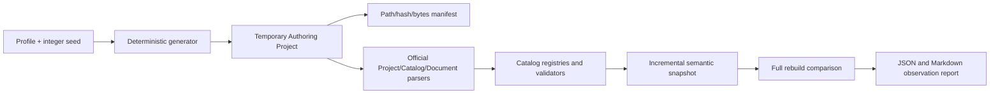

# 大工程确定性验证与性能报告

## 目标

大工程验证工具用于证明 VisualBridge 在大量 Graph、Entity、Structured 和 Table 数据下仍使用正式语义链路，并为同一机器、同一 Node 版本上的前后版本比较提供可复现数据。仓库不提交巨型固定样例；每次运行都在临时目录中生成语料，结束后删除。

生成器只接收正整数 seed 和显式计数。文档、节点、组件和 Table Row 的身份均由 `seed + 递增计数` 派生，不使用时间、UUID 或系统随机数。清单使用相对路径，记录每个文件的 SHA-256 和字节数，所以临时目录位置不影响确定性。



## Profiles

- `correctness`：自动化测试使用。生成 36 个 JSON 语义文档、2 个 Table 分表和 100 行数据，覆盖 8 个 Catalog 文件。
- `benchmark`：人工基准使用。生成 3,000 个 JSON 语义文档、10 个 Table 分表和 50,000 行数据。

两个 profile 使用完全相同的 Project、Catalog、Parser、Registry、Validator 和增量快照实现，区别只有计数。CLI 也允许用显式参数覆盖各类计数。

## 使用方式

运行纳入根测试流程的正确性验证：

```powershell
npm run test:large-corpus
```

生成默认 benchmark 报告：

```powershell
npm run benchmark:large-corpus
```

报告输出到 `output/large-corpus/large-corpus-benchmark.json` 和同名 Markdown 文件。该目录是运行产物，不进入 Git。

如需只生成可检查的工程，目标目录必须不存在或为空：

```powershell
npm run generate:large-corpus -- --profile benchmark --seed 42 --output D:\Temp\VisualBridgeCorpus
```

可选计数参数为 `--graph-documents`、`--entity-documents`、`--structured-documents`、`--table-partitions` 和 `--table-rows-per-partition`。

## 正确性判定

自动化测试要求：

1. 同一 seed、profile 的两次生成得到完全相同的 manifest，包括路径、hash、字节数和计数。
2. Project File、8 个 Catalog、Catalog Registry 以及所有 Graph、Entity、Structured、Table 文件通过正式 Parser 与 Validator。
3. 修改一个 Structured 源文件后，`IncrementalSemanticSnapshotStore` 只重新加载该源，其余源全部复用。
4. 增量快照与清空缓存后的完整重建进行深比较，结果必须完全相等。

## 性能报告边界

JSON 和 Markdown 报告记录 Node 版本、操作系统、CPU、逻辑核心数、RAM、profile、seed、文件/行计数、各阶段耗时，以及阶段前后的 Node 内存数据。耗时使用单调时钟测量。

报告故意不设置跨机器固定阈值。硬件、操作系统、Node/V8 版本、实时病毒扫描和磁盘状态都会显著影响结果；应只比较等价环境中的前后报告，并结合正确性测试判断回归。
