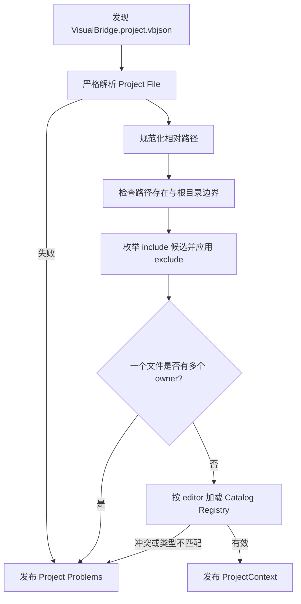
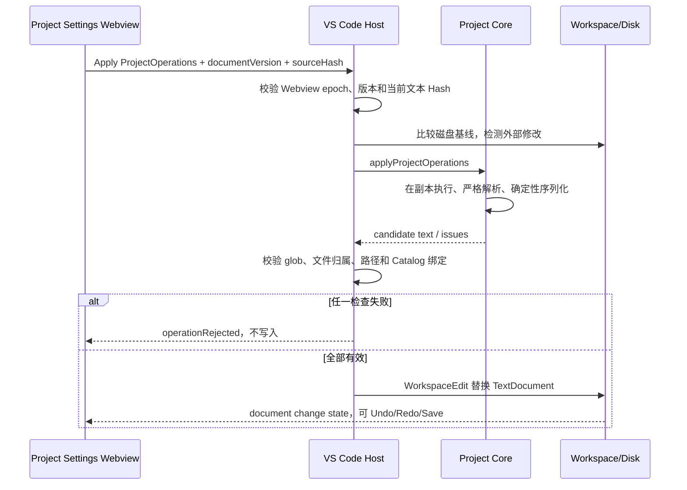
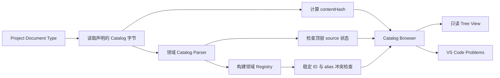

# Project Settings 与 Catalog Browser

## 1. 目标与边界

Project Settings 是 `VisualBridge.project.vbjson` 的结构化编辑入口，Catalog Browser 是 Catalog Registry 的只读检查入口。二者共同解决文件路由、Catalog 绑定、来源状态与工程扩展配置，但不把 Catalog 变成手写业务数据，也不实现 Unity Catalog Exporter、Importer、Runtime 或 Debug。

正式 Authoring 文件仍由 Project 的 Document Type 声明识别；扩展名没有全局固定表。Catalog 文件由外部工具生成或维护，Catalog Browser 只读取、解析和报告，不执行写入。

## 2. Project File

Project 根目录用固定文件名 `VisualBridge.project.vbjson` 标识。格式版本为 `1`，字段含义如下：

- `projectId`：Workspace 内无重复的稳定 Project ID。
- `documentRoots`：Project 相对的可编辑根目录；`.` 表示 Project 根本身。
- `documentTypes`：文件路由与编辑器大类。每项包含稳定 `id`、`editor`、`include`、`exclude` 和零到多个 `catalogs`。
- `tableLayout`：可选的工程级 1-based `nameKeyRow` 与 `dataStartRow`。
- `providers`：可选的 Project Provider 数组；每项包含 `.mjs` 入口、参数数组和显式 Reference/Validator 能力。

示例：

```json
{
  "formatVersion": 1,
  "projectId": "sample.game",
  "documentRoots": ["Config", "Tables"],
  "documentTypes": [
    {
      "id": "sample.hero",
      "editor": "entity",
      "include": ["Config/Heroes/**/*.herojson"],
      "exclude": ["Config/Heroes/**/Generated/**"],
      "catalogs": ["Catalog/Hero.vbentitycatalog"]
    }
  ],
  "tableLayout": {
    "nameKeyRow": 2,
    "dataStartRow": 3
  }
}
```

路径和 glob 必须使用 `/`、保持 Project 相对，不能包含空、`.` 或 `..` 段。安全 glob 语法刻意限制为字面量段、普通段内至多一个 `*`，以及独立的 `**` 段；不支持 `!`、`?`、字符类、brace 或 extglob。该限制避免通过 glob 展开编码父目录，并让跨 Document Type 的重叠判定保持完整、可重复。Project Registry 会对声明路径和每个实际 Authoring 文件解析现有符号链接；即使词法路径位于 Project 内，只要规范路径逃出 Project 根就不会被路由或写入。

## 3. 文件归属与绑定校验

Project File Parser 负责结构、未知字段、重复 ID、重复路径、重复 glob、Provider 能力冲突和路径规范。VS Code Project Registry 再依据实际 Workspace 执行以下校验：

- 相同 include glob 被多个 Document Type 声明，或不同 glob 可构造出共同匹配样例；
- 实际文件同时匹配多个 Document Type；
- 同一 Catalog 路径绑定到不同编辑器大类；
- Document Root、Catalog 或 Provider 入口不存在；
- 声明路径或符号链接逃出 Project 根；
- Catalog 不能由绑定编辑器的正式 Parser/Registry 正确加载；
- Structured Document Type ID/alias 不能解析到 Config Type，或 Table Document Type ID/alias 不能解析到 Table Type；
- Workspace 内 `projectId` 重复。

跨 Document Type 的 include 语言必须天然不相交；`exclude` 只用于过滤该类型内部的文件，不能拿来消除两个 include 的重叠。文件只有在 `documentRoots` 内，至少匹配一个 include 且不匹配该 Document Type 的 exclude 时才归其所有。归属不明确时不会按声明顺序猜测编辑器。



## 4. Project Operation 与并发

Project Settings 页面不直接拼接 JSON。Webview 发送有类型的 `ProjectOperation` 批次，Core 在内存副本上完整执行后确定性序列化，并重新通过 Project Parser。Host 随后检查 Workspace 归属和 Catalog 绑定；任何一步失败，整个批次都不写入。

Operation 覆盖：

- 修改 Project ID 与 Document Roots；
- 新增、更新、重命名、删除和移动 Document Type；
- 设置或清除 Table Layout；
- 新增、更新、重命名、删除和移动 Provider。

Document Type 重命名会在同一批次更新 Provider Validator 的 `documentTypes` 绑定。列表顺序是显式作者顺序，页面使用共享图标和拖动排序；序列化固定对象字段顺序、两空格缩进和末尾换行。新增 Provider 先在页面内创建未写入的 Draft，用户可以填写真实的现有 `.mjs` 入口和能力后再按保存图标提交；提交使用只允许新增的 `project.addProvider`，若 ID 已存在会拒绝而不会覆盖，取消 Draft 也不会修改 Project File。

每次页面状态包含当前 `documentVersion` 和实际文本 SHA-256 `sourceHash`。同一 Project File 的多个分屏会共享 Host 侧串行修改队列；Apply 前后 Host 都检查页面 Hash、当前 TextDocument 和磁盘基线，并执行 Project/Catalog 校验。陈旧页面、验证期间发生的文本变化、外部磁盘修改或验证失败均拒绝覆盖。成功修改通过 `WorkspaceEdit` 进入 VS Code Undo/Redo 与保存流程。



## 5. Catalog 来源与 Hash

每个当前格式 Catalog 都必须有顶层 `source`。`sourceHash` 是外部定义快照的 SHA-256；`contentHash` 是 Host 对当前 Catalog UTF-8 文本字节计算的 SHA-256，只出现在查询与 UI 状态中，不回写 Catalog。

来源状态是显式可判定的联合类型：

```json
{ "status": "unknown" }
```

```json
{
  "status": "current",
  "providerId": "unity",
  "sourceHash": "1111111111111111111111111111111111111111111111111111111111111111"
}
```

```json
{
  "status": "stale",
  "providerId": "unity",
  "sourceHash": "1111111111111111111111111111111111111111111111111111111111111111",
  "currentSourceHash": "2222222222222222222222222222222222222222222222222222222222222222"
}
```

- `unknown`：当前没有可信的外部来源 Hash；这是 Unity 未接入阶段允许的明确状态。
- `current`：Catalog 内容来自 `sourceHash` 指定的来源快照。
- `stale`：Catalog 仍来自 `sourceHash`，但外部系统已报告不同的 `currentSourceHash`。两个 Hash 相同会被 Parser 拒绝。

未来 Unity Exporter/Bridge 负责计算并更新来源状态；VS Code 与 MCP 不扫描或解释 C# 来自行推测 Hash。Catalog 类型内部已有的 `source.providerId`/`typeName` 是类型导航元数据，与顶层 Catalog 来源快照不是同一概念。

## 6. Catalog Browser

Activity Bar 的 **VisualBridge / Catalogs** 视图按 Project 和 Document Type 显示：

- Registry 是否 ready；
- 所有已注册类型的 kind、稳定 ID、标题和 alias；
- 每个物理 Catalog 的路径、Catalog ID、标题与内容 Hash；
- 来源 provider、`sourceHash`、当前来源 Hash 和 `unknown/current/stale` 状态；
- Parser、Registry 冲突、不可用文件和过期诊断。

过期与冲突同时发布到 VS Code Problems。点击 Catalog 节点只打开文本预览；Browser 不注册 Catalog Operation，不调用 `WorkspaceEdit`，也不会保存或格式化 Catalog。



## 7. 使用步骤

1. 打开包含 `VisualBridge.project.vbjson` 的 Workspace。
2. 运行 **VisualBridge: Open Project Settings**，或在 Catalogs 视图点击齿轮按钮。
3. 编辑 Project ID、根目录、Document Type、glob、Catalog、Table Layout 或 Provider；列表可拖动排序，功能按钮使用统一图标。新增 Provider 时先完成 Draft 的入口与能力配置，再按勾选图标提交。
4. 页面显示“配置有效”后使用普通 VS Code 保存；若报告归属、路径或 Catalog 错误，权威文本不会被无效 Operation 改写。
5. 打开 **VisualBridge / Catalogs**，检查 Registry、来源状态、类型与 alias；使用刷新按钮重新读取。
6. 在 Problems 中处理 Catalog 不可用、冲突或 `catalog.sourceStale`。Catalog 需要由它的外部维护者重新生成，不能在 Browser 中直接修补。

## 8. 自动化验证

Core 测试覆盖 Catalog 来源联合类型、Hash 规则、安全 glob、Project Operation 严格负载、原子性、重命名关联更新与确定性序列化。真实 Extension Host 测试覆盖 Project Settings Custom Editor 激活、陈旧 Hash 拒绝、分屏并发串行化、当前及未来 glob 歧义拒绝、Structured/Table 类型绑定、目录链接越界拒绝、WorkspaceEdit/Undo，以及 Catalog Browser 的过期状态、内容 Hash、类型查询和只读字节不变。VS Code CLI 门禁安装最终 VSIX，并显式检查 Project Editor 的 JS/CSS 和 Catalog Source Schema 均存在。当前阶段没有 Unity 测试。
