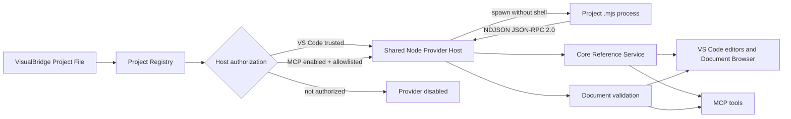
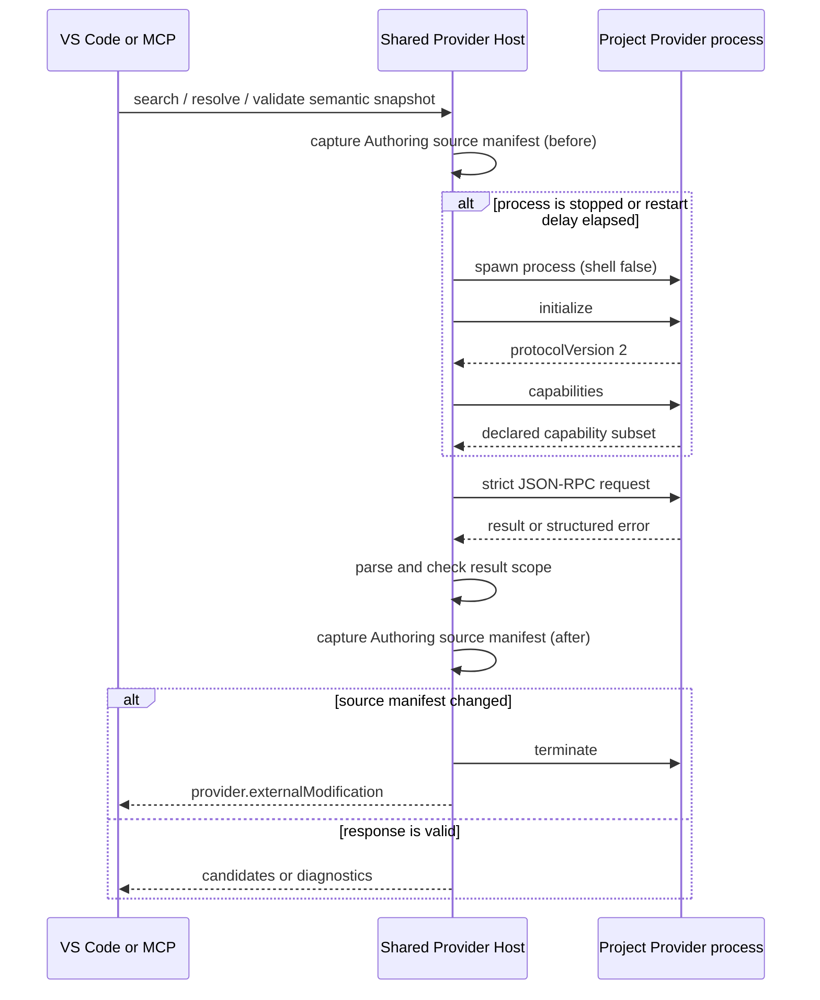

# Project Provider V2

Project Provider V2 允许工程在不修改 VisualBridge Core 的情况下增加自定义 Reference kind 和项目校验。Provider 是由 Project File 显式声明、由共享 Node Host 作为独立进程运行的工程代码；VS Code 与 MCP 复用同一协议、候选约束、诊断约束和源文件保护逻辑。

V2 不提供 Document Operation、导入、转换、通用命令、Unity Runtime 或 Debug 能力。Provider 返回语义结果，不能通过协议写入 Authoring 文件。完整 JSON-RPC 结构由 [`visualbridge-project-provider.schema.json`](../Protocol/Schema/visualbridge-project-provider.schema.json) 固定，Project 声明由 [`visualbridge-project.schema.json`](../Protocol/Schema/visualbridge-project.schema.json) 固定。

## 1. 架构与职责



职责边界：

- Project 声明授权的 Provider ID、构建后 `.mjs` 入口、逐项参数和能力上限。
- Core 定义严格的 Project File、JSON-RPC、Reference Candidate 和 Diagnostic 契约。
- `Tools/NodeHost` 负责路径校验、进程生命周期、超时、取消、退避、响应解析、候选/诊断作用域检查和源文件变更检测。
- VS Code 只补充 Workspace Trust、Project 文件发现、Authoring source manifest 和 Output 日志。
- MCP 只补充进程启动时的显式授权与入口 allowlist；Tool 参数不能启用 Provider。
- Provider 只解释业务 target、返回候选和读取宿主传入的不可变语义快照。它不直接接收 VS Code API、文件句柄或写入事务。

## 2. Project 声明

固定样例位于 [`TestData/ProviderSemanticProject`](../TestData/ProviderSemanticProject)。声明的最小结构为：

```json
{
  "providers": [
    {
      "id": "sample.provider",
      "entry": "Providers/sample-provider.mjs",
      "args": ["--mode", "healthy"],
      "capabilities": {
        "reference": {
          "kinds": ["sample.asset"]
        },
        "validator": {
          "documentTypes": ["sample.provider.settings"]
        }
      }
    }
  ]
}
```

该片段放入完整 `VisualBridge.project.vbjson` 的顶层。约束如下：

- `id` 在 Project 内唯一，使用稳定 identifier；变更它会建立新的 Provider 身份。
- `entry` 必须是 Project 内规范化、使用 `/` 分隔、无 `.`/`..` 的 `.mjs` 相对路径。宿主解析真实路径后拒绝越界、符号链接别名和未授权入口。
- `args` 必须是字符串数组。宿主固定使用当前 Node 可执行文件和 `shell: false` 启动 `[entry, ...args]`，不解析 Shell 字符。
- `reference.kinds` 在整个 Project 唯一，不能覆盖内置 `document`、`entity.component`、`graph.element` 或 `table.row`。
- `validator.documentTypes` 只能引用同一 Project 已声明的 Document Type。
- `capabilities` 至少声明 `reference` 或 `validator` 一项。Provider 运行时上报的能力可以是声明的子集，不能越权增加能力。
- 当前入口是构建后的 ESM JavaScript，不直接运行 `.ts`，不隐式安装依赖。工程自行构建并分发入口及其依赖。

## 3. stdio JSON-RPC 协议

每条消息是单行 UTF-8 JSON，使用 JSON-RPC `2.0`；stdout 只能输出协议消息，普通日志写 stderr。Host 请求使用非负整数或非空字符串 `id`，响应必须回传同一 `id`，且只能包含 `result` 或 `error` 之一。单行上限为 1 MiB。

| 方向 | Method | 用途 | 成功结果 |
| --- | --- | --- | --- |
| Host → Provider | `initialize` | 协商 `protocolVersion: 2`、Provider ID、Project ID/Hash | `{ "protocolVersion": 2 }` |
| Host → Provider | `capabilities` | 获取实际启用能力 | `{ "capabilities": ... }` |
| Host → Provider | `reference/validateTarget` | 校验 kind 的结构化 target | `valid` / `invalidTarget` / `providerUnavailable` |
| Host → Provider | `reference/search` | 按 kind、target、query、limit 和可选 continuation 搜索 | `ok` page / cursor 状态 / `invalidTarget` / `providerUnavailable` |
| Host → Provider | `reference/resolve` | 按严格 string/number value 解析 | `resolved` / `missing` / `ambiguous` / 失败状态 |
| Host → Provider | `validator/diagnostics` | 校验宿主解析的语义快照 | `ok` diagnostics / `providerUnavailable` |
| Host → Provider | `shutdown` | 请求正常退出 | `{}` |
| Host → Provider | `projectChanged` | 无 `id` 通知 Project/Document Set 版本变化 | 无响应 |
| Host → Provider | `$/cancelRequest` | 请求超时或调用方取消后通知对应 `id` | 无响应 |

`reference/search` 第一页不传 `cursor`/`snapshotHash`；续页必须同时原样传回 Provider 上一页给出的不透明 `nextCursor` 和稳定 SHA-256 `snapshotHash`。成功结果始终包含 `snapshotHash`，有下一页时才包含 `nextCursor`；单页最多 200 条且不能超过请求 `limit`，Provider continuation 最多 16,384 个字符。Provider 必须对同一 Snapshot 使用统一稳定排序，续页严格位于上一页边界之后。损坏 continuation、换 query/target、候选 Snapshot 改变分别返回 `cursor.invalid`、`cursor.queryMismatch`、`cursor.snapshotChanged`，不能静默从第一页重放。

Host 再把 Provider continuation 包进 Core 外层 Cursor，并绑定 Provider ID、Host 实例、入口代码 SHA-256、进程 generation、Provider `snapshotHash` 和 Project Semantic Snapshot。Provider 入口变化、Host 重建、进程重启或候选变化后，旧 Cursor 都明确返回 `cursor.snapshotChanged`。因此即使 Project/Catalog/Document Manifest 没变化，Provider 私有数据变化也不能继续消费旧分页。

Reference Candidate 必须保持请求的 `kind` 和规范化 `target`。Resolve Candidate 的 `value` 还必须与请求值类型和值完全相同。可选 `location` 必须属于当前 Project，并且 `documentTypeId`/`path` 必须解析为当前 Project 声明的 Authoring Document。搜索返回数不能超过 Host 传入的 `limit`。

Validator 只接收 Host 已通过正式 Parser 建立的不可变快照：`documentTypeId`、Project 相对 `path`、`sourceHash` 和 JSON `content`。返回诊断只能指向本次请求包含的 Document 和 Provider 声明的 Document Type；越界诊断是协议违规，不会发布到其他文档。

结构化 JSON-RPC error 使用固定 code/kind 映射：标准 `-32700` 至 `-32603`，以及 `-32001 providerUnavailable`、`-32002 protocolVersionMismatch`、`-32003 protocolViolation`。`data.retryable` 明确调用方是否可以稍后重试。

## 4. 调用流程



超时或 `AbortSignal` 取消时，Host 先发送 `$/cancelRequest`；Provider 未在宽限期内结束请求时，Host 终止进程。异常退出进入有上限的指数退避，连续失败超过上限进入 `quarantined`。一次稳定运行可以清零重启计数。Project 定义变化会释放旧 Host；普通 Authoring source 变化发送带递增 `revision` 和 `documentSetHash` 的 `projectChanged` 通知。

Workspace Validator 只缓存一次完整成功的 `validator/diagnostics` 结果。每次查询即使存在相同 Document 缓存，也必须先重新检查当前 Workspace Trust、Project 是否仍有 Provider 声明、Project Root 是否仍为本地 `file` scheme，并读取当前 Project File hash 取得仍存活的 Host generation；未授权时立即清除该 Project 缓存并释放旧 Host，不能从缓存返回诊断。缓存键包含 Project URI、当前 Project File hash、Host 实例 generation、各 Provider 进程的 generation/state、Project Semantic Snapshot 依赖键、Document Type、规范路径和 `sourceHash`。首次 RPC 可能把进程从 stopped 推进为 ready，因此成功结果按 RPC 完成后的 generation 写入。Provider 定义、Host 重建或进程重启、Project/Catalog/Document 依赖、Document 内容任一变化都不能命中旧结果。

缓存值是冻结的诊断快照。只有 `unavailableProviderIds` 为空、没有 `externalModification` 且调用方 `AbortSignal` 未取消时才允许写入；取消、timeout/crash/quarantine、Provider 返回 unavailable、协议违规和外部修改诊断只返回当前调用，且同时使该 Project 的既有成功缓存失效。Project/Authoring source 事件、Trust 授权变化和 Host 重建都会推进缓存 revision；一次 RPC 即使随后成功，只要它启动后的 revision 已失效，就只能把结果返回给原调用方，不能回填缓存。Reference 请求同样贯通 `AbortSignal`，分页 Cursor 绑定 Provider/Project Snapshot 依赖键。首次真实 RPC 仍执行请求前后的物理 Manifest 检查，缓存层不绕过 Host 的能力、诊断作用域或源文件保护边界。详见 [`WorkspaceIndexPerformance.md`](WorkspaceIndexPerformance.md)。

## 5. Trust、授权与源文件保护

Provider 独立进程仍继承当前用户的文件权限，因此“独立进程”只提供故障隔离，不是操作系统沙箱。只能运行已经审查的工程代码。

| Host | 启用条件 | 入口允许范围 |
| --- | --- | --- |
| VS Code | Workspace 已信任、Project 有 Provider 声明、Project 位于本地文件系统 | 当前有效 Project 声明的每个规范化入口 |
| MCP | 启动环境显式启用、Project 有声明、入口真实路径位于启动 allowlist | `VISUALBRIDGE_PROVIDER_ALLOWLIST` 的绝对路径全集 |

MCP 默认禁用。PowerShell 启动示例：

```powershell
$entry = (Resolve-Path '.\TestData\ProviderSemanticProject\Providers\sample-provider.mjs').Path
$env:VISUALBRIDGE_PROVIDER_ENABLED = '1'
$env:VISUALBRIDGE_PROVIDER_ALLOWLIST = ConvertTo-Json -Compress @($entry)
$env:VISUALBRIDGE_WORKSPACE = (Resolve-Path '.\TestData\ProviderSemanticProject').Path
node .\Tools\VisualBridgeMcp\dist\server.js
```

`VISUALBRIDGE_PROVIDER_ENABLED` 只接受 `0`/未设置或 `1`。启用时 allowlist 必须是非空 JSON 数组，元素必须是无冗余段的规范化绝对路径。授权在 Server 启动时读取；`visualbridge_project` 或其他 Tool 的输入均没有提升权限字段。

每次启动、请求、通知和关闭前后，Host 都重新枚举 Project File、显式 Catalog 与所有 Document Type include/exclude 命中的 Authoring source，并比较路径集合和 SHA-256。新增、删除或修改均优先报告 `provider.externalModification`，Provider 随即进入隔离状态；即使它同时超时、崩溃或返回非法响应，也不允许较弱错误掩盖外部写入。VisualBridge 不自动回滚 Provider 的直接写入，使用者应从版本控制或备份审查并恢复。

## 6. Provider 开发与使用手册

1. 先为业务选择稳定且 Project 内唯一的 Reference kind，或选择要校验的已有 Document Type；不要复用文件后缀作为 kind。
2. 实现一个读取 stdin、逐行解析 JSON、按 `id` 回写单行 JSON 的 `.mjs` 进程。可参考 [`sample-provider.mjs`](../TestData/ProviderSemanticProject/Providers/sample-provider.mjs)。
3. `initialize` 必须确认协议版本，`capabilities` 只返回 Project 声明的子集。未知 method 返回标准 `methodNotFound`，业务暂不可用返回 `providerUnavailable`。
4. Reference target 必须是稳定结构化 JSON；候选 value 只用 string/number 稳定键，显示名放 `title`，导航信息放 `location`。搜索要实现 V2 continuation/snapshot 配对、稳定排序和三个固定 cursor business status。
5. Validator 只读取请求的 `content`，不要自行按扩展名重读或修改文件。诊断 `path` 使用领域语义路径，`documentPath` 必须原样来自请求快照。
6. stdout 仅用于协议，调试输出写 stderr。处理 `$/cancelRequest`，收到 `shutdown` 后尽快返回 `{}` 并退出。
7. 在完整 Project File 的 `providers` 数组声明入口和能力，运行 Core/Node Host/MCP/VS Code Host 自动化验证。

VS Code 使用步骤：

1. 打开包含有效 `VisualBridge.project.vbjson` 的工作区并确认 Workspace Trust。
2. 执行 `VisualBridge: Refresh Projects` 或重新加载窗口，使 Project 定义变化生效。
3. 在共享 Reference Picker、Document Browser 或 `VisualBridge: Validate All Documents` 中触发 Provider。
4. 在 `VisualBridge` Output Channel 查看以 `[provider]` 开头的结构化事件；Problems 显示 Provider 诊断或 unavailable/external-modification 信息。
5. Restricted Mode 下 Provider 不会启动；信任工作区后由 Host 重新建立 Provider。

MCP 使用步骤：

1. 先构建 Server 与 Provider，并在启动 Server 前设置上面的授权环境。
2. 调用 `visualbridge_project` 发现 Project，再用 `visualbridge_references` 搜索/解析自定义 kind；Document 读取、校验和 Operation 结果会合并 Provider Validator 诊断。warning 作为诊断保留，error 会在写入前拒绝该 Operation，VS Code 与 MCP 使用相同规则。
3. Provider error、非法响应或外部修改不会被普通写入覆盖。修复 Provider 或文件状态后重启 MCP Server；单次 Tool 调用不能解除 quarantine 或改变 allowlist。

## 7. 故障定位

| 现象或代码 | 含义与处理 |
| --- | --- |
| `provider.entryNotAllowed` / `provider.invalidPath` / `provider.entryAlias` | 检查 Project 相对入口、真实路径、符号链接和 MCP allowlist。 |
| `provider.capabilityMismatch` | Provider 上报了 Project 未授权能力；同步声明与实现，不能由运行时自行扩权。 |
| `provider.invalidJson` / `provider.invalidResponse` / `provider.protocolViolation` | 检查 stdout 是否混入日志、响应 method 结构、Candidate 和 Diagnostic 作用域。 |
| `provider.timeout` / `provider.cancelled` | 处理取消通知、减少同步阻塞；Host 可能终止并按退避策略重启进程。 |
| `provider.crashed` / `provider.quarantined` | 查看结构化日志和 stderr，修复后重新加载 Project/窗口或重启 MCP。 |
| `provider.externalModification` | Provider 绕过事务改变了 Authoring source；停止使用、审查 diff，从版本控制恢复或接受后重新建立干净基线。 |
| `reference.providerUnavailable` | Provider 未授权、未启动或失败；已有字段值保留，安全 Lifecycle 操作 fail closed。 |

## 8. 自动化基线与非目标

固定自动化覆盖 Project 声明、协议 Parser/Schema、能力越权、参数无 Shell 解释、超时/取消、崩溃/退避、非法 JSON/结果、stderr、候选与诊断越界、源文件新增/覆盖、外部修改优先级、VS Code Trusted/Restricted Host，以及 MCP 默认禁用、显式 allowlist、自定义 Reference/Validator 和直接写入拒绝。

当前不实现 Unity Catalog Exporter、Importer、Runtime、Debug、DAP、Provider Operation、自定义 Webview Module 加载或独立 VisualBridge CLI。这些能力不能借 Provider V2 绕过现有 Core Parser、Operation、Lifecycle、Project Transaction 和 `baseHash` 规则。
