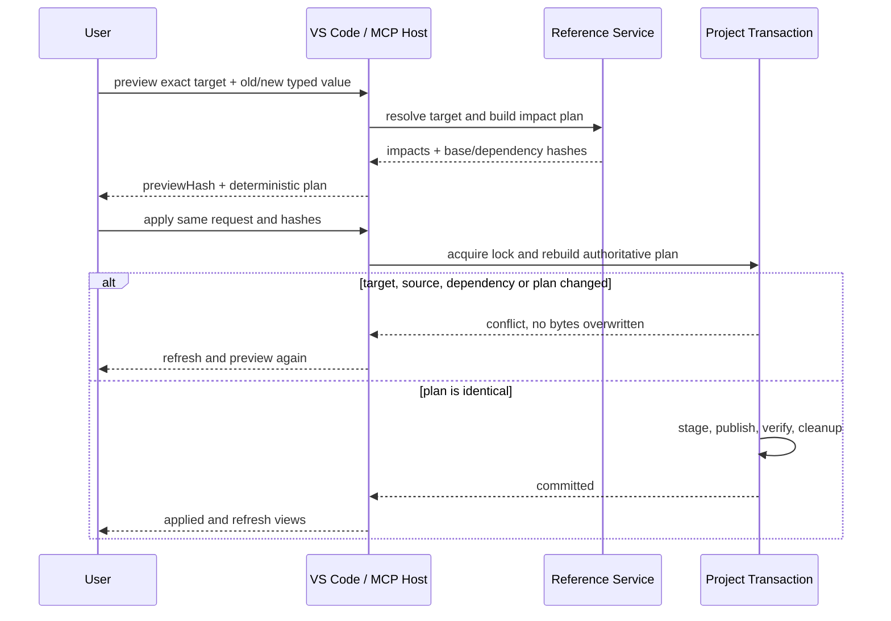

# VisualBridge Project Refactoring

## 1. 定位

Project Refactoring 在整个 Authoring Project 范围内修改一个语义身份及其引用。它不是文本查找替换，也不按文件扩展名猜测文档类型。Core 根据 Reference Provider 已解析出的目标位置建立确定性影响计划，各 Document Type 使用既有 Catalog、Parser、Operation、Validator 和 Serializer 生成修改，VS Code Host 只负责交互、并发检查与多载体提交。

当前落地 `document`、`entity.component`、`graph.element` 和 `table.row` 四类目标重命名，并同步修改 Graph、Entity、Structured 和 Table 中所有唯一解析到同一完整 Location 的 Reference Occurrence。Unity Catalog Exporter、Importer、Runtime 和 Debug 不在本阶段范围内。

## 2. 身份与匹配规则

稳定引用值与显示名称、文件路径分离。重构计划以 Reference Provider 返回的完整 `ReferenceLocation` 作为目标身份，包括 Project、Document Type、物理路径，以及 Document/Component、Graph/Node/Port 或 Sheet/Row 作用域；旧值只用于并发校验，不单独决定目标。

Project Refactoring 只处理稳定语义身份重命名。物理文件或 Table source manifest 的路径重命名/移动保持身份和值不变，属于 [`DocumentLifecycle.md`](DocumentLifecycle.md)；Copy 生成新身份，Safe Delete 检查删除闭包，也由同一个 Lifecycle Service 编排。两者共享 Reference Provider、确定性 preview hash、Project/Catalog 依赖 Hash 和 Project Transaction，但不把 Path Move 伪装成稳定 ID 重构，也不建立重复的规划器。

因此 V1 遵守以下规则：

- 只允许重命名 `resolved` 且只有一个候选的引用；缺失、歧义或 Provider 不可用的引用不参与自动修改。
- 只更新“旧值类型相同且解析到同一完整目标位置”的 occurrence；另一个表中恰好相同的数值或字符串不会被误改。
- 字符串与数值引用不能互相改型；数值输入必须是有限数。
- 新值如果已经能够解析到其他目标，或者同一物理表中存在隐藏于分表去重结果之外的重复键，重构被拒绝。
- `document` 只重命名 Graph、Entity 和 Structured 文件内容中的稳定 Document ID；Table 没有伪造的 Document ID。
- `entity.component` 只重命名 Entity Document 内的稳定 Component 实例 ID。Provider 在整个 Project Document Type 范围检查新值冲突，目标适配器再次校验 `documentId`、`componentId` 与当前源一致。
- `graph.element` 只重命名 Graph、Node、Interface Port 和 Dynamic Port。Graph ID 会同步 `rootGraphId`、`subgraphId`；Node/Port ID 会同步所有受影响 Edge Endpoint 和父图子图调用端口。Catalog 中的类型、静态端口和 Component ID 不属于实例身份重构。
- `table.row` 修改目标物理行的 `keyColumnId` 单元格，并额外检查被分表去重隐藏的物理重复键。

## 3. Core 与 Document Type 适配

`Core/Reference/referenceRefactor.ts` 输出稳定排序的 `ReferenceValueRenamePlan`。计划包含目标、旧值、新值以及每个受影响文档的语义 occurrence path，不包含 VS Code URI、文件锁或 UI 状态。

共享 Field 模型提供递归 reference value 替换，覆盖对象、数组和 Catalog 默认值物化。Entity、Structured 与 Table 直接复用该能力；Graph 适配 Graph 属性和动态端口。四类文档适配都通过各自既有语义变换并重新校验，不能绕过 Document Type 规则直接做文本或未知 JSON 对象替换。Entity Component 使用 `entity.renameComponent` Operation；Graph Element 使用 `graph.renameElement` Operation；Document ID 使用对应 Document Core 的 rename 语义；Table Row 使用 `table.setCell`。

## 4. VS Code 影响预览

Document Browser 选中文件后，`Problems / References` 详情 View 的 Outgoing/Incoming Reference 项提供通用 Replace 图标。命令先输入同类型的新值，再显示模态影响预览：

- 目标物理载体；
- Reference Occurrence 数量；
- 将写入的物理文件数量；
- 前 20 个文档路径和语义字段路径。

用户确认前不修改源文件。若索引到预览之间 occurrence、Catalog、Document Type 或目标键发生变化，准备阶段拒绝继续。

VS Code 用户从 Document Browser 的 `References` / `Referenced By` 项或编辑器稳定身份入口执行 Replace，核对预览中的目标、occurrence 和物理来源后确认。出现 conflict 时刷新 Project 后重新开始；出现 `refactor.committedRefreshFailed` 时文件已经提交，只刷新 Table Editor / Document Index，不能重复执行写入。完整操作步骤见 [`AuthoringUserGuide.md`](AuthoringUserGuide.md)。

## 5. 多文件事务

重构准备阶段重新读取全部载体并保存 SHA-256 基线。Graph、Entity 和 Structured 使用确定性 JSON Serializer；CSV 分表逐物理源使用原 CSV Codec；XLSX 使用现有 Workbook Codec，保留无关 Worksheet、样式和未修改单元格。

提交遵守以下顺序：

1. 拒绝 Project 内任何未保存的 VisualBridge Text Document，并要求关闭该 Project 的全部 Table Custom Editor，避免尚未进入 Workspace Index 的引用变化被遗漏或覆盖宿主内存状态；确认预览后提交前再次检查。
2. VS Code Host 与 MCP 都通过 `Tools/NodeHost` 取得同一个 Project Transaction lock；同一 Project 的所有协作写者共享物理锁、journal 与恢复协议。
3. 对所有载体再次比较基线哈希，并在原目录写入、同步临时文件。
4. 每次替换前再次检查源哈希，将旧文件移动为 rollback 副本，再将临时文件原子改名为目标文件。
5. 校验全部落盘哈希；任何失败都按逆序恢复已经替换的源文件。VS Code 与 MCP 共用 prepared/committed journal，并在下次写入前恢复死亡持锁进程留下的事务。
6. 物理提交成功后清除 Reference 缓存，并分别刷新已打开的 Table Editor 与 Workspace Document Index。刷新失败不回滚或自动重放已经提交的写入，也不能返回“未应用”；Host 返回 `refactor.committedRefreshFailed` maintenance，明确说明源文件已经提交、列出 `tableEditor` / `documentIndex` 故障，并要求用户只刷新受影响视图或索引。只有物理事务提交前失败才返回 `refactor.commitFailed`。

这是单机本地工作区事务；不承诺跨 Remote Workspace 或不遵守文件锁的外部进程具备数据库级隔离。`baseHash` 检查仍保证已检测到的并发修改不会被静默覆盖。完整锁、journal、恢复和错误契约见 [`ProjectTransaction.md`](ProjectTransaction.md)。

## 6. MCP 非交互入口

`visualbridge_refactor_reference` 使用与 VS Code 相同的 Core 影响计划、Reference Provider、Document Parser/Registry/Operation/Serializer 和物理 Table Codec。`preview` 不写文件，返回 `previewHash`、影响 occurrence、Project/Catalog 依赖哈希，以及物理源 `baseHash` 和 `nextHash`。`apply` 必须提交同一请求、`previewHash` 和完整 `baseHashes`；服务端取得所有 MCP 修改共用的 Project Transaction lock，在锁内重新建立计划并最终复核依赖，阶段化全部来源、记录恢复 journal，并在任一失败时条件逆序回滚。恢复遇到未知外部字节时不会删除它，而是保留 journal/rollback 并返回 Tool Error。

调用者不得把单文件 Graph/Table 写入工具的旧哈希代替项目重构的来源清单。项目重构的并发基线按物理源逐一记录，CSV 分表中的每个成员都必须匹配。

## 7. 与 Document Lifecycle 的边界

当前本文件描述的四类 stable ID rename 已经落地。Document Lifecycle V1 在其上增加 Create、Copy、Path Move 和 Safe Delete：

- Copy 只能更新唯一解析到副本闭包内部的 occurrence，并要求调用方在 preview 请求中提交完整显式 `stableIdRemap`；
- Path Move 不调用 Refactor Adapter，文件内容和 Reference value 都不变；
- Safe Delete 的入站检查基于完整目标 Location 和删除闭包，不以旧值文本搜索替代解析；
- Lifecycle apply 与 Refactor apply 都必须在 Project 锁内重建相同计划并复核所有来源和依赖。

## 8. 扩展约束

新增 Reference Provider 时，应同时定义其可编辑目标适配器，再复用 Core 计划与 Host 事务；不能在 Project Refactoring 中添加按字符串猜测目标的特殊分支。Catalog Type、Unity Asset 和 Runtime Instance 只有在正式 Provider、Location 作用域和目标适配器同时存在后才能加入。
