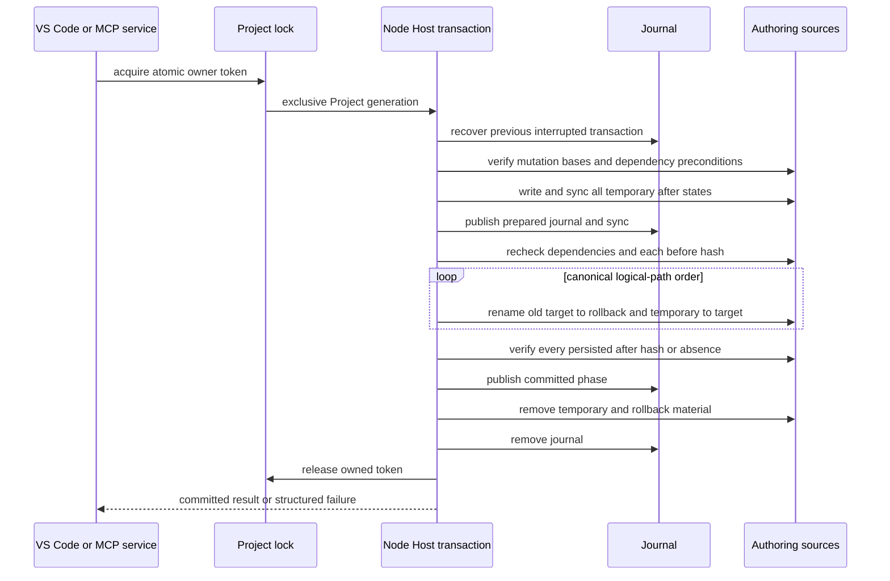
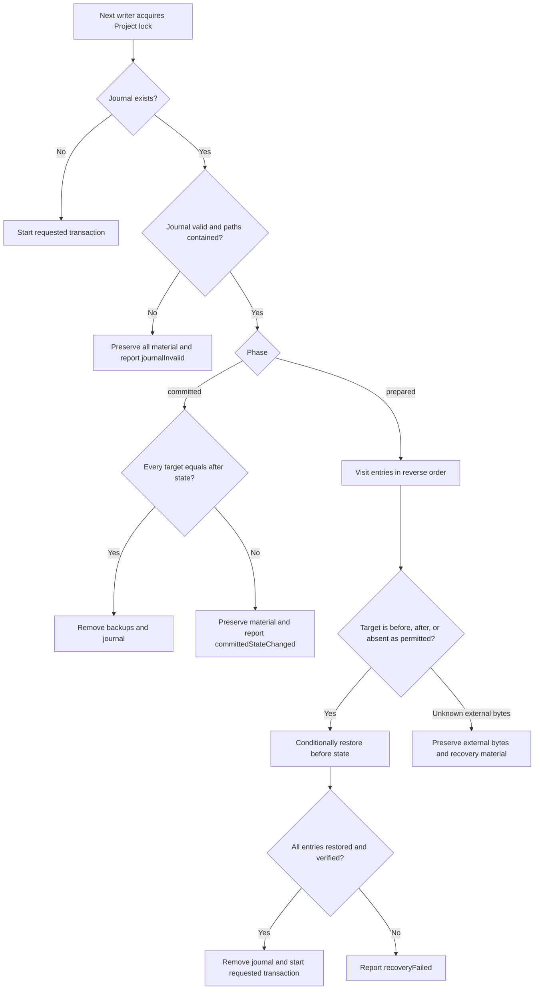

# VisualBridge Project Transaction

## 1. Status and scope

This document defines the local Project Transaction contract used before Unity integration. The implementation lives in `Tools/NodeHost` and is shared by the VS Code host and `Tools/VisualBridgeMcp`; neither host maintains a private transaction implementation.

Project Transaction protects a deterministic set of physical Authoring sources inside one local VisualBridge Project root. It is used by:

- MCP document operations, lifecycle operations, and reference refactors;
- VS Code document lifecycle and reference refactors;
- VS Code Table saves, including a complete CSV family.

Ordinary VS Code text-document editing still uses the VS Code `CustomTextEditor` / `WorkspaceEdit` undo model and its editor-session base hash. External processes that do not use VisualBridge are not participants in the cooperative lock, so every transaction also checks byte hashes immediately before publication.

This is not a database transaction, distributed lock, remote-workspace protocol, or durability guarantee across sudden power loss. The current implementation requires a local filesystem and same-volume atomic rename plus hard-link support. Unity Import, Runtime, Debug, WebSocket, and Project Discovery are outside this contract.

## 2. Authoritative state and identity

A transaction accepts logical Project-relative paths and resolved absolute paths. Both representations are checked before any write:

- the logical path is normalized, uses `/`, is relative, and contains no empty, `.` or `..` segment;
- the absolute path resolves to exactly `projectRoot/logicalPath`;
- the target and parent cannot escape through a symbolic link or another path alias;
- one transaction cannot mutate the same physical target twice;
- mutation and precondition order is canonical UTF-16 code-unit order by logical path.

The concurrency identity of an existing source is the lowercase hexadecimal SHA-256 of its complete bytes. Absence is an explicit state, not an empty hash. Table logical documents may have multiple physical sources: every CSV family member is a separate mutation and the XLSX carrier is the complete workbook byte source.

## 3. Mutation model

The Host-level mutation has a `before` byte state and an `after` byte state. Omitting one side expresses required absence:

| Semantic operation | `before` | `after` | Required effect |
| --- | --- | --- | --- |
| `replace` | bytes | bytes | Existing hash becomes the staged hash. |
| `create` | absent | bytes | Target must remain absent until publication. |
| `delete` | bytes | absent | Existing source is removed only after rollback material exists. |
| `move` | source bytes plus destination absence | source absence plus identical destination bytes | Source identity and bytes move without a semantic-ID rewrite. |

Additional preconditions protect dependencies that are not themselves written, such as Project, Catalog, reference snapshot, or another physical source. A precondition is either an expected SHA-256 or explicit expected absence. Preconditions are checked after lock acquisition, again after all outputs are staged, and before the first target is replaced.

Domain services remain responsible for semantics. They must parse, apply ordered Operations, validate, serialize deterministically, and prepare the exact mutation/precondition set before calling Project Transaction. The transaction layer never interprets Graph, Entity, Structured, Table, Reference, or Lifecycle content.

## 4. Lock and publication protocol

All cooperating writers use the Project-root `.visualbridge-transaction.lock`. Lock acquisition is Project-wide across host processes because VS Code and MCP both call the same Node Host implementation.



The lock file contains a random owner token, process ID, and start time. It is published with an atomic hard link so two writers cannot both become owner. A live owner produces `writeInProgress`. A dead owner is removed only after a monotonically named recovery guard elects one recovery process; malformed owner metadata becomes stale only after the fixed age threshold.

The lock is cooperation, not the only concurrency defense. A non-participating process can edit a source while the lock is held, so the transaction compares the current hash with `beforeHash` immediately before every replacement. It never overwrites a detected external byte state.

## 5. Journal and recovery

The Project root reserves:

- `.visualbridge-transaction.lock`;
- `.visualbridge-transaction.json`;
- `.visualbridge-transaction-recovery/`;
- their temporary or stale variants;
- `<source>.visualbridge-<transactionId>.tmp` and `.rollback` files.

Document discovery and broad Project globs must ignore these names. Journal V2 records a UUID transaction ID, `prepared` or `committed` phase, and the normalized path, absolute path, temporary path, rollback path, optional `beforeHash`, and optional `afterHash` of every entry. Recovery validates the complete shape and ensures the generated file names, physical paths, and Project boundary all agree before touching a business source.



A `prepared` journal is rolled back in reverse entry order. The backup is restored only when its hash is the recorded `beforeHash` and the target is absent, already restored, or still the recorded `afterHash`. Unknown external target bytes are preserved and recovery stops with an error. A `committed` journal is cleanup-only: all targets must still match their recorded after state before recovery removes rollback material.

Successful publication whose targets are verified but whose cleanup cannot yet finish may return `transaction.finalizationPending`. This is still a committed result; the caller must not repeat the mutation. The next writer retries cleanup under the Project lock.

## 6. Result and error semantics

Known concurrency changes are `ProjectTransactionConflict` and do not authorize overwrite or automatic retry:

| Reason | Meaning | Caller action |
| --- | --- | --- |
| `writeInProgress` | Another live writer or recovery owner holds the Project lock. | Wait for the active operation, then rebuild the semantic request from a fresh read. |
| `baseHashMismatch` | A mutation target no longer matches its declared before state. | Re-read the logical document and rebuild Operations. |
| `dependencyChanged` | A non-mutated hash/absence precondition changed. | Rebuild the preview and dependency manifest. |
| `changedBeforeReplace` | A source changed after staging but before publication. | Treat as an external-change conflict and start again from current bytes. |

`ProjectTransactionFailure` means the Host could not prove the requested atomic outcome. Important codes include:

- `transaction.commitFailed` and `transaction.verificationFailed` for a failed commit whose normal rollback path ran;
- `transaction.rollbackFailed` and `transaction.recoveryFailed` when every source could not be proven restored;
- `transaction.committedStateChanged` when a committed journal's target was externally changed before cleanup;
- `transaction.finalizationFailed` when neither committed targets nor finalization could be proven;
- `transaction.journalInvalid` for an untrusted or malformed recovery journal;
- `transaction.pathInvalid`, `transaction.pathMismatch`, `transaction.pathOutsideProject`, and `transaction.pathAlias` for unsafe targets;
- `transaction.duplicateTarget` and `transaction.emptyMutation` for an invalid mutation set.

MCP maps expected conflicts to its structured `status: "conflict"` result. Failures whose safe state cannot be proven are Tool Errors. VS Code surfaces the same distinction to the user and refreshes the Workspace Index only after a committed mutation.

## 7. Service integration rules

Every service that performs a preview/apply workflow follows the same ordering:

1. Build a trusted Project/Catalog/Document/Reference snapshot.
2. Produce the complete deterministic semantic plan and target manifest.
3. Return the plan hash, dependency hashes, source base hashes, and blockers without writing.
4. On apply, acquire the shared Project lock and recover any prior journal.
5. Re-read authoritative sources and rebuild the same plan inside the lock.
6. Reject any operation, plan, hash, target-absence, dependency, or reference-candidate change.
7. Stage and commit the full physical mutation set once.
8. Publish diagnostics/index refresh only after commit; a committed-but-refresh-failed state is not retried as a write.

An ordinary single-document MCP operation is still one Project Transaction mutation. A CSV family is never committed as independent per-file saves. XLSX edits replace the whole workbook source after the Table codec has preserved unrelated sheets, cells, formulae, styles, visibility, and carrier metadata required by the Table contract.

## 8. Operational recovery manual

When a write reports a conflict, do not remove transaction files. Save or discard any VS Code editor buffers as appropriate, refresh the Project, read the latest hashes, and issue a new preview or Operation batch.

When a failure reports `rollbackFailed`, `recoveryFailed`, `committedStateChanged`, `finalizationFailed`, or `journalInvalid`:

1. stop VisualBridge writers for that Project;
2. preserve `.visualbridge-transaction.json`, `.rollback`, `.tmp`, lock, and recovery-guard files;
3. compare each journal `beforeHash` / `afterHash` with the current target and rollback bytes;
4. keep any byte state whose hash is neither recorded value, because it may be an external user's change;
5. restore or finalize only after the intended authoritative state is known;
6. run full Project validation and reference validation before resuming writes.

Deleting the journal or lock without examining retained bytes is not a supported recovery procedure. The reserved files are deliberately human-inspectable JSON and colocated rollback material so an uncertain state is visible rather than silently overwritten.

Host/MCP 接入方应把结构化 conflict 与不确定 failure 分开处理，完整调用顺序和验收清单见 [`IntegrationGuide.md`](IntegrationGuide.md)。终端用户不应手工删除保留文件；编辑器内的保存、刷新与恢复操作见 [`AuthoringUserGuide.md`](AuthoringUserGuide.md)。

## 9. Verification

The repeatable Node Host tests cover replace/create/delete/move, target absence, dependency changes, duplicate targets, path traversal/alias rejection, simultaneous writers, dead-owner takeover, prepared rollback, committed cleanup, malformed journals, and preservation of unknown external bytes. MCP stdio and real Extension Host tests cover service-level mapping, CSV/XLSX multi-source behavior, lifecycle/refactor integration, and post-commit refresh.

Run the relevant gates from the repository root:

```text
npm test --workspace @visualbridge/node-host
npm test --workspace @visualbridge/mcp
npm run test:vscode:host
npm run check:docs
```
