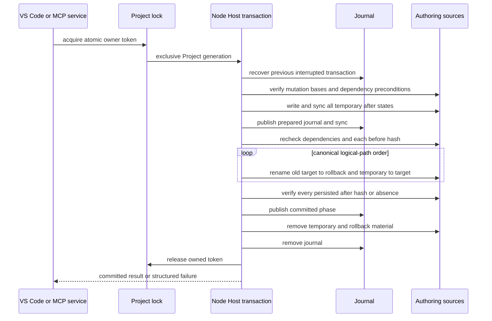
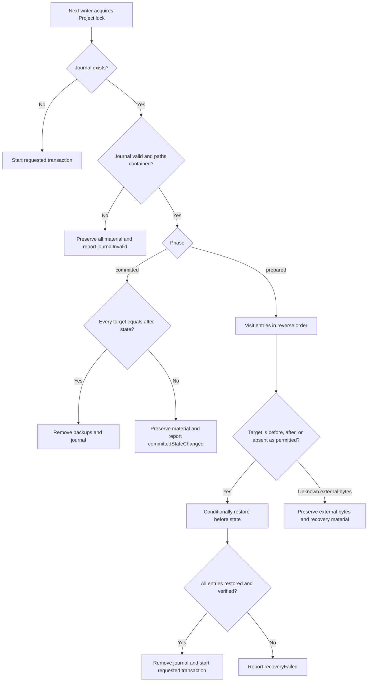

# VisualBridge Project Transaction

## 1. 状态与范围

本文定义 Unity 接入前使用的本地 Project Transaction 契约。实现位于 `Tools/NodeHost`，由 VS Code 宿主和 `Tools/VisualBridgeMcp` 共享；两个宿主都不维护私有的事务实现。

Project Transaction 保护单个本地 VisualBridge Project 根目录内一组确定性的物理 Authoring 来源。它被以下场景使用：

- MCP 文档操作、生命周期操作和 Reference 重构；
- VS Code 文档生命周期与 Reference 重构；
- VS Code Table 保存，包括完整的 CSV 家族。

普通的 VS Code 文本文档编辑仍使用 VS Code `CustomTextEditor` / `WorkspaceEdit` 撤销模型及其编辑器会话 base hash。不使用 VisualBridge 的外部进程不是协作锁的参与者，因此每个事务在发布前还会立即检查字节 hash。

这不是数据库事务、分布式锁、远程工作区协议，也不是突然断电下的持久性保证。当前实现要求本地文件系统，以及同卷原子 rename 和硬链接支持。Unity Import、Runtime、Debug、WebSocket 和 Project Discovery 都在本契约之外。

## 2. 权威状态与身份

事务接受逻辑上的 Project 相对路径和解析后的绝对路径。两种表示在任何写入前都会被检查：

- 逻辑路径已规范化、使用 `/`、是相对路径，且不含空段、`.` 或 `..` 段；
- 绝对路径精确解析为 `projectRoot/logicalPath`；
- 目标及其父目录无法通过符号链接或其他路径别名逃逸；
- 一个事务不能两次变更同一物理目标；
- 变更与前置条件的顺序是按逻辑路径的规范化 UTF-16 码元顺序。

既有来源的并发身份是其完整字节的小写十六进制 SHA-256。缺失是显式状态，而不是空 hash。Table 逻辑文档可以有多个物理来源：每个 CSV 家族成员是独立的变更，XLSX 承载文件则是完整的工作簿字节来源。

## 3. 变更模型

Host 级变更有 `before` 字节状态和 `after` 字节状态。省略其中一侧表示要求缺失：

| 语义操作 | `before` | `after` | 要求的效果 |
| --- | --- | --- | --- |
| `replace` | 字节 | 字节 | 既有 hash 变为暂存 hash。 |
| `create` | 缺失 | 字节 | 目标在发布前必须保持缺失。 |
| `delete` | 字节 | 缺失 | 既有来源只有在回滚材料存在之后才被移除。 |
| `move` | 源字节加上目标缺失 | 源缺失加上相同的目标字节 | 来源身份和字节被移动，不重写语义 ID。 |

额外的前置条件保护那些本身不被写入的依赖，例如 Project、Catalog、Reference 快照或另一个物理来源。前置条件要么是期望的 SHA-256，要么是显式的期望缺失。前置条件在获得锁之后检查一次，在所有输出暂存完成之后再检查一次，并在第一个目标被替换之前再检查。

领域服务仍对语义负责。它们必须解析、按序应用 Operation、校验、确定性序列化，并在调用 Project Transaction 之前准备好确切的变更/前置条件集合。事务层从不解释 Graph、Entity、Structured、Table、Reference 或 Lifecycle 内容。

## 4. 锁与发布协议

所有协作写入方都使用 Project 根目录下的 `.visualbridge-transaction.lock`。加锁在宿主进程之间是 Project 级的，因为 VS Code 和 MCP 调用的是同一个 Node Host 实现。



锁文件包含随机 owner token、进程 ID 和开始时间。它通过原子硬链接发布，因此两个写入方不可能同时成为 owner。存活的 owner 会产生 `writeInProgress`。死亡的 owner 只有在一个按单调递增命名的恢复守卫选出一个恢复进程之后才会被移除；畸形的 owner 元数据只有在固定的存活时长阈值之后才会被视为过期。

锁是协作机制，而不是唯一的并发防线。持有锁期间，未参与协作的进程仍可能编辑来源，因此事务在每次替换之前都会立即比较当前 hash 与 `beforeHash`。它从不覆盖已检测到的外部字节状态。

## 5. Journal 与恢复

Project 根目录保留以下名称：

- `.visualbridge-transaction.lock`;
- `.visualbridge-transaction.json`;
- `.visualbridge-transaction-recovery/`;
- 它们的临时或过期变体；
- `<source>.visualbridge-<transactionId>.tmp` 和 `.rollback` 文件。

文档发现与宽泛的 Project glob 必须忽略这些名称。Journal V2 记录 UUID 事务 ID、`prepared` 或 `committed` 阶段，以及每个条目的规范化路径、绝对路径、临时路径、回滚路径、可选的 `beforeHash` 和可选的 `afterHash`。恢复会校验完整形状，并在触碰任何业务来源之前确保生成的文件名、物理路径与 Project 边界全部一致。



`prepared` journal 按相反的条目顺序回滚。只有当备份的 hash 是记录的 `beforeHash` 且目标处于缺失、已恢复或仍是记录的 `afterHash` 状态时，才会恢复备份。未知的外部目标字节会被保留，恢复以错误停止。`committed` journal 只做清理：在恢复移除回滚材料之前，所有目标必须仍匹配其记录的 after 状态。

目标已校验但清理尚未完成的成功发布可能返回 `transaction.finalizationPending`。这仍是一个已提交的结果；调用方不得重复该变更。下一个写入方会在 Project 锁下重试清理。

## 6. 结果与错误语义

已知的并发变化属于 `ProjectTransactionConflict`，不授权覆盖或自动重试：

| 原因 | 含义 | 调用方动作 |
| --- | --- | --- |
| `writeInProgress` | 另一个存活的写入方或恢复 owner 持有 Project 锁。 | 等待当前操作完成，然后从新的读取重建语义请求。 |
| `baseHashMismatch` | 某个变更目标不再匹配其声明的 before 状态。 | 重新读取逻辑文档并重建 Operation。 |
| `dependencyChanged` | 某个未被变更的 hash/缺失前置条件发生了变化。 | 重建预览与依赖 manifest。 |
| `changedBeforeReplace` | 某个来源在暂存之后、发布之前发生了变化。 | 按外部变更冲突处理，并从当前字节重新开始。 |

`ProjectTransactionFailure` 表示 Host 无法证明所请求的原子结果。重要错误码包括：

- `transaction.commitFailed` 和 `transaction.verificationFailed`：提交失败且常规回滚路径已执行；
- `transaction.rollbackFailed` 和 `transaction.recoveryFailed`：无法证明所有来源都已恢复；
- `transaction.committedStateChanged`：已提交 journal 的目标在清理前被外部改动；
- `transaction.finalizationFailed`：既无法证明已提交的目标，也无法证明完成收尾；
- `transaction.journalInvalid`：不可信或畸形的恢复 journal；
- `transaction.pathInvalid`、`transaction.pathMismatch`、`transaction.pathOutsideProject` 和 `transaction.pathAlias`：不安全的目标；
- `transaction.duplicateTarget` 和 `transaction.emptyMutation`：非法的变更集合。

MCP 把预期的冲突映射为其结构化的 `status: "conflict"` 结果。无法证明安全状态的失败属于 Tool Error。VS Code 向用户呈现同样的区分，并且只在变更提交之后才刷新 Workspace Index。

## 7. 服务接入规则

每个执行预览/应用流程的服务都遵循相同的顺序：

1. 构建可信的 Project/Catalog/Document/Reference 快照。
2. 产出完整的确定性语义计划与目标 manifest。
3. 在不写入的情况下返回计划 hash、依赖 hash、来源 base hash 和阻塞项。
4. 在应用时获取共享的 Project 锁并恢复任何先前的 journal。
5. 在锁内重新读取权威来源并重建相同的计划。
6. 拒绝任何 Operation、计划、hash、目标缺失状态、依赖或 Reference 候选的变化。
7. 一次性暂存并提交完整的物理变更集合。
8. 只在提交之后发布诊断/索引刷新；已提交但刷新失败的状态不会作为写入重试。

普通的单文档 MCP 操作仍然是一次 Project Transaction 变更。CSV 家族绝不会被当作互相独立的逐文件保存来提交。XLSX 编辑在 Table 编解码器保留了无关工作表、单元格、公式、样式、可见性以及 Table 契约要求的承载元数据之后，替换整个工作簿来源。

## 8. 运维恢复手册

当写入报告冲突时，不要删除事务文件。视情况保存或放弃 VS Code 编辑器缓冲区，刷新 Project，读取最新 hash，然后发起新的预览或 Operation 批处理。

当失败报告 `rollbackFailed`、`recoveryFailed`、`committedStateChanged`、`finalizationFailed` 或 `journalInvalid` 时：

1. 停止该 Project 的所有 VisualBridge 写入方；
2. 保留 `.visualbridge-transaction.json`、`.rollback`、`.tmp`、锁和恢复守卫文件；
3. 将 journal 中每条 `beforeHash` / `afterHash` 与当前目标和回滚字节进行比较；
4. 保留 hash 不是任一记录值的字节状态，因为它可能是外部用户的改动；
5. 只有在明确了预期的权威状态之后才恢复或收尾；
6. 在恢复写入之前运行完整的 Project 校验和 Reference 校验。

在不检查被保留字节的情况下删除 journal 或锁不是受支持的恢复程序。保留文件刻意采用人类可读的 JSON 和就地存放的回滚材料，使不确定状态可见，而不是被静默覆盖。

Host/MCP 接入方应把结构化 conflict 与不确定 failure 分开处理，完整调用顺序和验收清单见 [`IntegrationGuide.md`](IntegrationGuide.md)。终端用户不应手工删除保留文件；编辑器内的保存、刷新与恢复操作见 [`AuthoringUserGuide.md`](AuthoringUserGuide.md)。

## 9. 验证

可重复的 Node Host 测试覆盖 replace/create/delete/move、目标缺失、依赖变化、重复目标、路径穿越/别名拒绝、并发写入方、死亡 owner 接管、prepared 回滚、committed 清理、畸形 journal 以及未知外部字节的保留。MCP stdio 和真实 Extension Host 测试覆盖服务级映射、CSV/XLSX 多来源行为、生命周期/重构集成以及提交后刷新。

在仓库根目录运行相关门槛命令：

```text
npm test --workspace @visualbridge/node-host
npm test --workspace @visualbridge/mcp
npm run test:vscode:host
npm run check:docs
```
