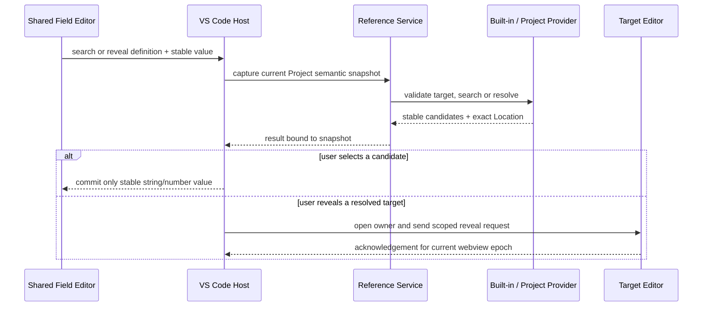

# VisualBridge Reference System

## 1. 范围

Reference System 为 Graph、Entity、Structured 和 Table Document 提供同一套跨文档引用契约。字段所属模块只声明“引用什么”，不直接扫描文件、解析业务表或实现选择器。Core 负责稳定契约、Provider 注册、搜索、解析和诊断；VS Code 与 MCP 只负责宿主交互和持久化边界。

当前内置 `document`、`entity.component`、`graph.element` 和 `table.row` 四类 Provider。它们分别引用 Project Document Type 下的稳定 Document ID、Entity 文档中的稳定 Component 实例 ID、Graph 文档内部的稳定元素 ID，以及 Table Type/Sheet 下的有效记录。Project Provider V2 还能由 Project File 显式声明自定义 kind，并通过独立 stdio 进程接入同一 Reference Service；完整运行与安全契约见 [`ProjectProvider.md`](ProjectProvider.md)。Unity Asset 和运行时实例仍不在当前范围；本阶段不增加 Unity Exporter、Importer、Runtime 或 Debug 代码。

## 2. 字段契约

Reference 是共享 Field Definition 的可选语义，不是独立 JSON 对象包装。文档中继续只保存 C# 字段对应的字符串或数值稳定键：

```json visualbridge-schema=visualbridge-entity-catalog.schema.json#/$defs/field
{
  "id": "primarySkillId",
  "title": "Primary Skill",
  "valueType": "number",
  "dataTypeId": "int",
  "defaultValue": 101,
  "editor": {
    "kind": "reference",
    "readOnly": false,
    "integer": true
  },
  "reference": {
    "kind": "table.row",
    "target": {
      "tableTypeId": "sample.table.skills",
      "sheetId": "skills"
    },
    "allowMissing": false
  }
}
```

- `kind` 选择一个稳定的 Reference Provider。
- `target` 是 Provider 解释的结构化选择器，只允许 JSON 值，不保存显示名称或物理文件名。
- `allowMissing` 明确缺失目标是否允许；省略时为 `false`。
- 引用字段的 `valueType` 只能是 `string` 或 `number`，解析使用严格类型相等；数值 `101` 不等于字符串 `"101"`。
- `editor.kind` 只决定使用通用引用控件，字段值的 JSON 形态和运行时 `dataTypeId` 仍由 Field Definition 决定。

Graph 属性、Graph 动态端口值、Entity 根字段、Component 字段、Structured 字段和 Table 单元格均递归收集 Reference Occurrence。对象、List 和 Catalog 默认值沿用同一遍历规则，不为每种 Document 重复实现引用解析。

## 3. 内置 Provider

### `document`

`document` 的 `target` 只包含必填的 `documentTypeId`。Provider 按 Project File 的 `include` / `exclude` 和 Document Type 大类加载 Graph、Entity 或 Structured 文档，候选值为文件内容中的 `documentId`；文件扩展名和路径不承担身份。相同 Document ID 出现在不同 Document Type 中不冲突，同一 Document Type 内重复则解析为 `ambiguous`。

### `graph.element`

`graph.element` 的 `target` 只包含 `documentTypeId` 和 `elementKind`，其中 `elementKind` 为 `graph`、`node`、`interfacePort` 或 `dynamicPort`。候选值始终是对应元素的稳定 ID。可重命名的 `documentId`、`graphId` 和 `nodeId` 不允许进入 target，否则重命名父级会让 Catalog 选择器自身悬空；同一 Document Type 与 Element Kind 下重复的值明确解析为 `ambiguous`。

Graph 元素 Location 显式保存 `elementKind`、`elementId`、`graphId`、`nodeId` 和 `portId`。端口 ID 允许只在其 Graph 或 Node 作用域内唯一，因此不能退化为只有 `elementId` 的定位。

### `entity.component`

`entity.component` 的 `target` 只包含 `documentTypeId`，持久值是 Component 实例的稳定 `id`。可重命名的 `documentId` 不进入 target；Provider 扫描该 Project Document Type 声明的全部 Entity 文档，同值跨文档重复时返回 `ambiguous`，不会按路径、标题或加载顺序猜测目标。

候选 Location 保存 `documentId`、`componentId`、`elementKind: "component"` 和与组件 ID 相同的 `elementId`。因此 target 保持稳定，导航和重构仍能校验完整所属文档。Component Type ID 只决定结构与显示名称，不是 Component 实例引用值。

### `table.row`

`table.row` 的 `target` 为：

```json visualbridge-schema=visualbridge-primitives.schema.json#/$defs/jsonObject
{
  "tableTypeId": "sample.table.skills",
  "sheetId": "skills",
  "documentTypeId": "sample.table.skills"
}
```

`tableTypeId` 和 `sheetId` 必填，接受 Catalog 规范 ID 或 alias；`documentTypeId` 可选，用于同一 Table Type 被多个项目子类使用时进一步限定范围。目标不得包含未声明键。被引用 Sheet 必须声明 `keyColumnId`，候选值来自该稳定列。

Provider 通过 Project Registry 发现所有 `editor: "table"` 的 Document Type，并遵守项目自定义的 `include`、`exclude`、任意文件扩展名、CSV 分表规则和 XLSX Worksheet 规则。候选来自 `resolveEffectiveTableRows`，因此跨分表重复项采用 Catalog 的 `error`、`keepFirst` 或 `keepLast` 策略。显示名称使用 `rowDisplayNamePattern`，持久值仍是 key 列的严格类型值。

候选定位保存 Project ID、Document Type ID、项目相对路径、物理 Sheet ID 和 Row ID。路径只用于导航，不参与引用身份。

## 4. 搜索、解析与诊断

Reference Service 注册少量按 `kind` 唯一的 Provider：

- `search` 是第一页便利入口；分页搜索按结构化 `target`、规范查询、Reference Snapshot 依赖键和不透明 Cursor 返回稳定候选，单页数量受限。
- `resolve` 按严格类型值返回 `resolved`、`missing`、`ambiguous` 或 `providerUnavailable`。
- `analyzeOccurrences` 对每个 occurrence 只解析一次，同时返回统一 `DocumentDiagnostic` 和解析结果；`validate` 委托该单遍分析。

内置 Provider 与 Project Provider 进入同一个 Registry。Project File Parser 拒绝自定义 kind 与内置 kind 或另一 Project Provider 重名；独立进程返回的 Candidate 还要经过共享 Host 的 kind、target、value、Project 和已声明 Document Location 检查，不能把候选注入其他作用域。

统一诊断代码为：

| Code | Severity | Meaning |
| --- | --- | --- |
| `reference.invalidTarget` | error | Provider 存在，但结构化 target 不符合该 kind 的契约。 |
| `reference.missingTarget` | error | `allowMissing: false` 且没有匹配目标。 |
| `reference.ambiguousTarget` | error | 同一个严格类型值解析到多个有效目标。 |
| `reference.providerUnavailable` | warning | 当前宿主没有注册该 kind；原始值必须保留。 |

Document Operation 仍先在副本上完整执行。宿主分别校验修改前后引用，只拒绝这次批次新引入的 reference error；既有坏引用会持续显示诊断，但不会阻止用户修复同一文档的其他问题。

### Lifecycle 的 Reference coverage

普通字段 Operation 的“只拒绝新错误”规则不能用于证明 Copy 或 Delete 安全。当前 Document Lifecycle contract 要求 preview 与 apply 都建立全 Project Reference 快照，并以 fail-closed 方式证明 coverage 完整：相关 Project、Catalog、Document、未知 Node/Component/字段结构、非法 target 或不可用 Provider 中任何一项无法解析，都会阻止可能改变或删除身份的 Lifecycle 操作。完整流程见 [`DocumentLifecycle.md`](DocumentLifecycle.md)。

Copy 对每个 occurrence 使用正式 Provider 分类：唯一解析到 Copy closure 内的目标才按调用方显式提交的完整 `stableIdRemap` 更新；唯一解析到 closure 外的目标原样保留。`allowMissing: true` 的 missing occurrence 是已声明的可空外部引用，原样保留并记录 `outboundPreserved`；其他 missing、ambiguous、Provider unavailable 或 invalid target 必须阻止 Copy，不能通过字符串相等猜测副本内部引用。

Safe Delete 先由领域 Adapter 建立删除闭包。闭包内互相引用随目标删除；闭包外 occurrence 只要解析候选与闭包相交就是 blocker。该规则同样适用于同一文档内引用和 `allowMissing: true` 字段；`allowMissing` 只控制目标已经缺失时的字段诊断，不授予删除现存目标的权限。Ambiguous occurrence 若包含闭包候选，或无法证明不包含，也必须拒绝删除。

## 5. VS Code 编辑闭环



共享 Form Editor 用只读稳定值加通用搜索、跳转图标呈现引用，不允许绕过 Provider 手输不受约束的值。Graph 自有属性布局复用同一 Webview Reference Bridge，Entity、Structured 和 Table 直接复用共享字段控件。

选择按钮向 Extension Host 发送结构化 definition 和当前值，由原生 Quick Pick 展示候选；Webview 只接收最终稳定值。跳转按钮先解析引用，歧义时要求选择具体目标。Table 目标由 Table Editor 定位物理 Sheet/Row；Document 目标打开其声明的 Authoring Document；Graph Element 目标会切换到指定 Graph，选择并居中 Node，或居中并临时高亮 Port；Entity Component 目标会打开所属 Entity、展开对应卡片、滚动聚焦并临时高亮。Graph 与 Entity Webview 未就绪或隐藏重建时，Host 会保留带请求 ID 的最新定位请求，直到 Webview 返回处理结果；完整作用域失效时明确失败，不按同名元素猜测。

工作区索引和 Reference Service 共享同一份已提交的不可变 Project Semantic Snapshot，不各自扫描或解析 Project。已打开 Table Custom Document 的当前语义快照作为 Picker 临时覆盖层合并到同一查询视图；未保存的新增、删除或改单元格会参与交互式搜索与解析，但不会原地修改已提交 Workspace Index。关闭文档后移除覆盖并回到磁盘基线。

Reference Cursor 绑定 kind、规范 target、规范查询、稳定排序所需的候选边界和 Project Snapshot 依赖键。MCP 内置 Provider 的依赖键同时包含物理来源 Manifest 与本次实际解析得到的精确语义快照，Provider 直接消费这组已捕获只读对象，不在生成候选时二次读取磁盘；因此并发写入即使把物理 Hash 改回旧值，也不能让另一组候选冒用旧 Snapshot。Project Provider 的 Core 外层 Cursor 还安全封装 Provider ID、Host 实例、入口代码 Hash、进程 generation、Provider 不透明 continuation 与 Provider `snapshotHash`；内置 Provider 不携带这段状态。每一页必须按同一 comparator 确定性排序并严格大于上一页边界。Snapshot、Provider 实例/进程/入口或候选依赖变化时旧 Cursor 返回 `cursor.snapshotChanged`，调用方必须从第一页重新搜索；损坏状态与跨查询复用分别返回 `cursor.invalid`、`cursor.queryMismatch`，不得把旧位置应用到新候选集合。完整性能、取消和分页契约见 [`WorkspaceIndexPerformance.md`](WorkspaceIndexPerformance.md)。

Document Browser 使用同一 Reference Service 的解析候选展示每个文档的出站引用，并按候选 Location 的 Project、Document Type 与物理路径派生 `Referenced By` 关系。反向关系仅是工作区索引视图，不写回任何 Authoring Document；缺失或歧义引用继续使用本文件定义的诊断和解析状态。完整 Browser 契约见 [`DocumentBrowser.md`](DocumentBrowser.md)。

Project Refactoring 使用解析候选的完整 Location，而不是仅按引用值，批量重命名 `document`、`entity.component`、`graph.element` 或 `table.row` 目标及所有唯一解析到该位置的入站 occurrence。Entity Component 通过 `entity.renameComponent` 修改实例身份；Graph 元素通过 `graph.renameElement` 原子更新结构身份、连线端点和子图调用映射；CSV 分表和 XLSX 与文本 Document 参与同一个带哈希检查与回滚的 Host 事务。完整契约见 [`ProjectRefactoring.md`](ProjectRefactoring.md)。

Document Lifecycle 复用相同 Provider、Location 和 occurrence，不维护第二套引用扫描器。Stable ID Rename 进入 Project Refactoring；物理 Path Move 保持 Reference value 不变；Copy 与 Safe Delete 使用上面的 closure/coverage 规则。

## 6. MCP

`visualbridge_references` 提供两个动作：

- `search`：传入 `kind`、`target`、可选 `query`、`limit`、`allowMissing` 和不透明 `cursor`，返回结构化候选、定位及可选 `nextCursor`。
- `resolve`：传入相同 definition 与字符串或数值 `value`，返回解析状态和候选。

Graph、Entity、Structured、Table 的读取与校验结果会附加共享 Reference 诊断。四类 Operation 写入在 `baseHash` 与可恢复 Project Transaction 之外，还会拒绝本次批次新引入的 Reference error。MCP 不重新实现任何类型的 Registry、分表去重、行显示名或字段递归规则。

`visualbridge_refactor_reference` 提供 `preview` 和 `apply`。预览返回稳定 `previewHash`、完整影响列表、每个物理源的 `baseHash` 与预计结果哈希；提交必须原样提供 `previewHash` 和全部 `baseHashes`。服务端在 Project Transaction 锁内重新扫描 Project、重新解析同一目标并重建语义计划，最终复核 Project/Catalog 依赖和全部来源；任一来源、候选、Catalog 或分表成员变化都返回 `conflict`，不会自动套用旧计划。中断恢复发现未知外部字节时保留现场并返回 Tool Error。

## 7. 自动化基线

`npm test` 覆盖 Field Definition 解析、嵌套 occurrence、四个内置 Provider 的稳定排序与完整定位、严格类型解析、缺失与歧义诊断、自定义 Project Provider V2 的协议/候选边界、超过 200 条的完整分页、错查询/损坏 Cursor/Snapshot 与进程代变化拒绝、Entity / Graph 身份传播、Entity / Graph Editor 定位计划、Table 有效行候选和定位。真实 stdio MCP 测试覆盖 Project Provider 的默认禁用与显式授权、Graph Element 预览、Entity Component 提交、错误 `baseHash`、Project 锁与中断恢复；真实 Extension Host 分别验证 Trusted 与 Restricted Workspace。测试不包含 Unity。
