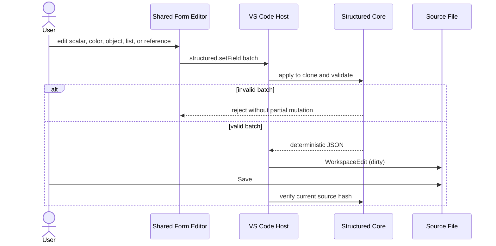

# VisualBridge Structured Config V1

## 1. 目标与边界

Structured Config 用于编辑一个普通 C# class 或 struct 对应的单根配置对象。它替代以 `ScriptableObject` 作为配置编辑载体的工作流，但不要求游戏运行时类型继承框架基类，也不把 Unity 序列化结构写入 Authoring 文件。

V1 已落地严格的 Catalog/Registry、Project 类型绑定、共享字段校验、`structured.setField` 原子操作、VS Code 编辑器和 stdio MCP。Unity Package 现已从 Profile 显式登记的普通 C# class / struct 确定性导出同一 Catalog V1，并以只读 Authoring consumer 生成 Editor 派生物与 source mapping。当前仍不实现 Editor Bridge、Runtime、Debug、Player 或 `ScriptableObject` 兼容。

Structured Catalog 顶层使用全平台 Catalog `source` 契约声明来源未知、当前或过期状态；Host 计算只读内容 Hash，完整规则见 [`ProjectCatalogManagement.md`](ProjectCatalogManagement.md)。

## 2. 类型身份只由 Project 绑定

Structured 是 Project File 中的编辑器大类，业务子类由 Document Type 的稳定 `id` 定义。文件后缀不是类型身份，可以由 `include` / `exclude` 使用任意工程约定：

```json visualbridge-schema=visualbridge-project.schema.json#/properties/documentTypes/items
{
  "id": "sample.game.settings",
  "editor": "structured",
  "include": ["Config/**/*.gamesettings"],
  "exclude": [],
  "catalogs": ["Catalog/Game.vbstructuredcatalog"]
}
```

加载时，Document Type ID 必须解析到所声明 Structured Catalog Registry 中一个 Config Type 的规范 ID 或 alias。Document Type 是文件关联和 Config Type 绑定的唯一权威来源；Structured 文件不重复保存 `configTypeId`，因此不存在两份类型身份不一致的状态。

默认便利后缀为 `.vbconfig`，但它不具有比项目自定义后缀更高的语义优先级。创建和打开文档都必须先通过 Project Registry 的完整匹配。

## 3. Structured Catalog V1

Catalog 保存从普通 C# 运行时结构导出的编辑契约：

```json visualbridge-schema=visualbridge-structured-catalog.schema.json visualbridge-parser=structured-catalog
{
  "formatVersion": 1,
  "catalogId": "sample.structured.catalog",
  "title": "Game Settings",
  "source": { "status": "unknown" },
  "configTypes": [
    {
      "id": "sample.game.settings",
      "title": "Game Settings",
      "aliases": ["legacy.game.settings"],
      "source": {
        "providerId": "csharp",
        "typeName": "Game.GameSettings"
      },
      "properties": []
    }
  ]
}
```

- `catalogId`、Config Type `id` 和 alias 在合并后的 Registry 中必须全局无歧义。
- `source` 只记录定义来源，不能成为持久身份，也不要求运行时类型依赖 VisualBridge。
- `properties` 直接使用 Core 的共享 Field Definition；Structured 不复制字段类型或编辑器规则。
- alias 只用于读取旧身份和 Project 绑定解析。新建文档和 Operation 必须使用规范 ID。
- Parser 拒绝未知键和非 V1 版本；当前开发阶段不提供旧格式兼容解析或迁移层。

共享 Field 支持数值、布尔、文本、颜色、选择项、引用、普通嵌套对象和 List。`valueType` 描述 JSON 形态，`dataTypeId` 保留 `int`、`float`、`UnityEngine.Vector3` 或游戏自定义结构等 C# 语义。字段定义的确定性序列化由 Core 提供，Entity、Structured、Table 和 Graph 不分别维护副本。

## 4. Structured Document V1

文件只保存文档身份和运行时结构值：

```json visualbridge-schema=visualbridge-structured.schema.json visualbridge-parser=structured-document
{
  "formatVersion": 1,
  "documentId": "sample.game.settings.default",
  "properties": {
    "maxPlayers": 5,
    "accent": "#4D88FFFF",
    "spawn": {
      "position": { "x": 2, "y": 0, "z": 4 }
    }
  }
}
```

- `documentId` 是独立于路径和显示名称的稳定文档身份。
- `properties` 使用 Config Type 中的规范字段 ID。普通对象按字段定义递归保存，不引入框架包装对象。
- 所有声明字段都是文档完整形态的一部分；创建命令会递归物化全部 Catalog 默认值。
- 文档不保存标题、文件路径、C# 类型名或 Project Document Type ID 等可从上下文得到的重复信息。
- Serializer 固定顶层顺序并递归规范化对象键；重复序列化必须产生相同 UTF-8 JSON 文本。

Parser 只验证 V1 结构和 JSON 值；字段完整性、范围、颜色、对象、List、引用和 Project 类型绑定由带 Catalog/Project 上下文的语义校验完成。结构有效但存在既有字段或引用诊断的文档仍可通过 Operation 逐步修复；一次操作不得新引入语义错误。

## 5. Operation 与事务

V1 只暴露一个聚焦操作：

```json visualbridge-schema=visualbridge-authoring-contracts.schema.json#/$defs/structuredOperation
{
  "type": "structured.setField",
  "fieldId": "spawn",
  "value": {
    "position": { "x": 1, "y": 0, "z": 3 }
  }
}
```

共享 Form Editor 修改嵌套字段或 List 时，提交所属顶层字段的完整新值。一个非空 Operation 数组按顺序作用于文档副本：先严格解析并校验新值，再执行完整批次、校验修改后文档和引用，最后仅在没有新错误时提交。未知字段、alias 字段 ID 或任一无效操作会拒绝整个批次。

VS Code 通过 `WorkspaceEdit` 保留 Undo/Redo，并在外部文件 Hash 改变时要求覆盖或刷新。MCP 必须携带读取/校验返回的 SHA-256 `baseHash`；它与 Graph、Entity、Table 和 Refactor 共用 Project Transaction 锁、写前 Hash 复核、同目录阶段文件、prepared/committed journal、持久化验证和条件回滚。冲突或无效批次不修改源文件；恢复发现未知外部字节时保留现场并返回 Tool Error。



## 6. VS Code 编辑器

Structured Editor 复用 `Editors/Form` 的 `FieldsEditor` 与 Reference Bridge。数值、颜色、嵌套普通结构、List 拖动排序、增加、删除、引用选择和跳转与 Entity/Table 保持同一交互语义，不在字段下方重复显示类型文本。

共享字段控件的类型、视觉、List 操作顺序、颜色弹层和引用桥接由 [`FormFieldEditor.md`](FormFieldEditor.md) 统一约束；这里不定义第二套 Structured 专用控件。

编辑区只显示 Config Type 标题、可选描述和字段；文件路径、Document Type 小写 ID、C# 完整类型名等不在主编辑内容中重复堆叠。诊断进入 VS Code Problems，保存状态和错误摘要位于通用状态区。

`VisualBridge: Create Structured Config` 会选择 Project 和 Structured Document Type，加载 Registry，以 Document Type ID 解析唯一 Config Type，根据 `include` 推导建议目录/后缀，再次验证目标路径并写入包含全部默认字段的新文档。

## 7. Document Lifecycle V1

Structured 的 Create、whole-document Copy、Path Move 和 Safe Delete 使用共享 [`DocumentLifecycle.md`](DocumentLifecycle.md)。Path Move 保持文件字节、`documentId` 和 Reference value 不变；Copy 要求调用方在 preview operation 的完整 `stableIdRemap` 中映射 `documentId`，并只更新唯一解析到副本闭包内部的 occurrence；Delete closure 包含完整 Structured Document。Reference coverage 不完整或闭包外存在入站 occurrence 时拒绝 Delete。

当前创建命令的领域 factory 和默认值物化仍是 Create 计划的唯一内容来源，但 PU-03 实现后不再直接 `writeFile`：目标路径在 preview/apply 时必须保持不存在，并通过 Project Transaction 的 `create` mutation 提交。Structured 没有可单独寻址的内部元素删除，因此没有额外的普通 Operation delete guard。

Structured Delete 的 strict target 只有 `{ "kind": "document" }`；它删除该 source selector 对应的完整物理文件，而不是删除某个嵌套字段。

## 8. MCP 工具

Structured 使用 MCP V2 的统一工具，不再暴露类型专用工具：

- `visualbridge_catalog` 以 `editor: "structured"` 读取或搜索 `configTypes`；
- `visualbridge_document` 以 `read`、`search` 或 `validate` 访问语义实例；
- `visualbridge_apply_operations` 用读取返回的 `baseHash` 原子应用非空 `structured.setField` 批次。

请求必须显式带回 Project 发现结果中的 `projectFile`、`documentTypeId` 和 `editor`。最终类型绑定仍由 Project Registry 和 Structured Adapter 决定；MCP 只负责 Project/路径解析、结构化工具 Schema、并发控制和持久化，不复制 Catalog、Field、Operation 或 Reference 规则。完整 V2 信封与使用方式见 [`VisualBridgeMcp.md`](VisualBridgeMcp.md)，编辑器操作见 [`AuthoringUserGuide.md`](AuthoringUserGuide.md)。

## 9. 固定样例与后续 Unity 约束

`TestData/StructuredSemanticProject` 使用 `.gamesettings` 和 `.skillstable` 自定义后缀，覆盖嵌套结构、List、颜色、int/float 语义以及指向 Table Row 的引用。语义测试验证 Registry/alias、严格字段校验、默认值、引用收集、Operation 原子性和确定性序列化；stdio 测试验证真实 MCP Schema、Catalog 搜索、读取、实例搜索、校验、无效批次不落盘和有效多字段原子写入。跨进程冲突、Reference 重构和事务恢复由同一 MCP 套件的 Graph/Entity/Project Transaction 固定样例覆盖。

当前 Unity Catalog Exporter 从游戏实际使用的普通 C# class/struct 生成同一 Catalog V1，并保持稳定 ID；Compiler 只读取 Project、Catalog 与 Structured Document，不回写 Authoring。两者均不得重新引入 `ScriptableObject` Authoring 资产、Unity 专属字段副本或另一套字段编辑协议。Profile、确定性、路径安全、派生物 ownership 与验证门槛见 [`UnityIntegrationArchitecture.md`](UnityIntegrationArchitecture.md)。
