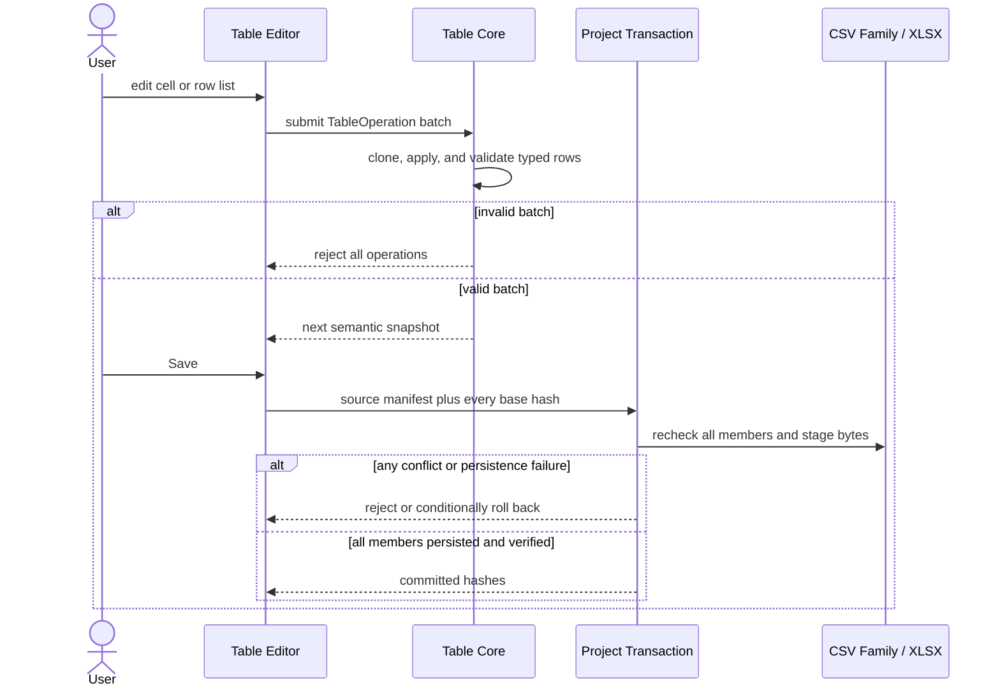

# VisualBridge Table Semantic Model V1

## 1. Scope

Table V1 edits constrained game-data tables carried by UTF-8 CSV-compatible text files or `.xlsx` workbooks. The editor, validation and current MCP V2 adapter share one semantic model and one Table Operation API; a future Unity compiler must consume the same model. They do not implement separate CSV and Excel business rules.

The current implementation includes Table Catalog V1, CSV and XLSX codecs, atomic Table Operation batches, a record-oriented VS Code table editor, project-defined file associations, partitioned logical tables, fixed semantic fixtures and a stdio MCP adapter for semantic query/search/validation/editing. It does not add Unity code. Unity Catalog export, authoring import, runtime compilation and debugging remain future work.

Every Table Catalog uses the shared top-level `source` contract to declare unknown, current, or stale external definitions. The Host computes its read-only content Hash; see [`ProjectCatalogManagement.md`](ProjectCatalogManagement.md).

## 2. C# owns the data definition

The future C# exporter is the source of truth for:

- stable Table Type, Sheet and Column IDs and aliases;
- ordinary runtime `class` / `struct` source type names;
- column display names and physical `nameKey` values;
- JSON shape and runtime `dataTypeId` values such as `int`, `float`, enum IDs and ordinary game structs;
- default values, editor constraints and enum options;
- scalar, JSON and delimiter-based cell encodings;
- logical sheet and partition rules.

The exported result is a `.vbtablecatalog` JSON file. Authoring data does not depend on `ScriptableObject`, Unity sub-assets or editor-only wrapper types. The future exporter may inspect only the ordinary C# types used by the game; it must not execute gameplay initialization methods to obtain defaults.

Table columns reuse the project-wide Core Field model and shared Form Editor. Numeric, boolean, text, color, select, List and recursively nested ordinary structures therefore behave the same in Entity, Structured, Table and Graph editors.

## 3. Project-level row layout

`VisualBridge.project.vbjson` declares the physical header layout once for the whole project. Row numbers are one-based:

```json visualbridge-schema=visualbridge-project.schema.json#/properties/tableLayout
{
  "nameKeyRow": 2,
  "dataStartRow": 3
}
```

Rows before `dataStartRow` are header rows and are preserved by the codecs. A common layout is:

1. description row;
2. name-key row;
3. first data row.

`dataStartRow` must be greater than `nameKeyRow`. The semantic column mapping always reads `nameKeyRow`; it never assumes that a field remains at the same physical column index. Reordered columns and exported `nameKeyAliases` remain readable. Missing or ambiguous required name keys are errors.

## 4. Table Catalog V1

A Document Type selects the broad editor with `"editor": "table"`; its stable Document Type ID resolves a Table Type ID or alias. File extensions remain project-defined by `include` and `exclude` patterns.

```json visualbridge-schema=visualbridge-table-catalog.schema.json visualbridge-parser=table-catalog
{
  "formatVersion": 1,
  "catalogId": "game.tables",
  "title": "Game Tables",
  "source": { "status": "unknown" },
  "tableTypes": [
    {
      "id": "game.table.skills",
      "aliases": ["legacy.table.skills"],
      "title": "Skills",
      "source": {
        "providerId": "csharp",
        "typeName": "Game.SkillConfig"
      },
      "csv": { "delimiter": "\t" },
      "sheets": [
        {
          "id": "skills",
          "title": "Skills",
          "name": "Skills",
          "rowDisplayNamePattern": "{id}",
          "keyColumnId": "id",
          "columns": [
            {
              "id": "id",
              "title": "ID",
              "valueType": "number",
              "dataTypeId": "int",
              "defaultValue": 1,
              "editor": { "kind": "number", "integer": true },
              "nameKey": "Id",
              "cellEncoding": { "kind": "scalar" }
            }
          ]
        }
      ]
    }
  ]
}
```

Catalog IDs, Table Type IDs, Sheet IDs and Column IDs are persistent identities. Display titles, C# type names, physical sheet names and physical name keys are not identities. Aliases provide explicit migration without silently guessing renamed types, sheets or columns.

Each Sheet definition also declares how a row is named in the editor:

```json visualbridge-schema=visualbridge-table-catalog.schema.json#/$defs/sheet/properties/rowDisplayNamePattern
"{id}_{name}"
```

Placeholders must use exact, stable Column IDs. Physical `nameKey` values and aliases are rejected so exported column renames cannot silently change the authoring identity shown to users. The formatted value is presentation only: it drives the record list, selected-record title and search text, while row identity and duplicate detection continue to use their explicit semantic IDs and key columns.

## 5. Cell encoding

Every column carries the shared Field definition plus a physical `nameKey` and a C#-exported `cellEncoding`:

- `scalar`: primitive string, number or boolean value;
- `json`: JSON text inside one cell;
- `delimited`: an array or struct with an explicit separator and optional nested item encoding.

For example, C# `RewardItem[]` can define `;` between array items and `|` between the fields of each item. The cell `1001|2;1002|1` then maps to two typed objects. Delimiters are never inferred from current data. A structured field without explicit encoding is rejected.

The codec preserves unknown physical columns. Simple XLSX cell edits patch known cells in place. CSV serialization preserves the configured header rows, original line-ending style and untouched raw cell values.

## 6. Logical table partitioning

One logical Sheet definition may be split into multiple physical CSV files or XLSX worksheets. All partitions necessarily share the same columns because they resolve to the same Sheet definition.

```json visualbridge-schema=visualbridge-table-catalog.schema.json#/$defs/partition
{
  "namePattern": "Skills_{part}",
  "deduplicateByColumnId": "id",
  "duplicatePolicy": "keepFirst"
}
```

`namePattern` contains exactly one `{part}` placeholder. Examples matching the definition include `Skills_A` and `Skills_Season2`. Physical names that do not match the template do not join this logical table.

The de-duplication column is a stable Column ID, normally the first/key column. Policies are:

- `error`: duplicates across partitions are errors and new invalid operations are rejected;
- `keepFirst`: retain the first row in the effective logical row stream and emit a warning;
- `keepLast`: retain the last row in the effective logical row stream and emit a warning.

De-duplication does not delete or rewrite source rows. Codecs preserve every physical row, while `resolveEffectiveTableRows` supplies the policy-resolved logical view to future compilers and query services. Physical order is deterministic: XLSX uses workbook sheet order; a CSV family uses lexicographically sorted paths.

For CSV, partitions are discovered beside the opened file when they have the same physical extension, resolve to the same Project and Document Type, and match the naming template. The editor opens them as one logical document with partition tabs. An operation batch is applied to the combined semantic document; saving checks every member's base hash before writing any changed member. A conflict rejects the save instead of overwriting an external edit.

For XLSX, matching worksheets are partitions inside one workbook. Unrelated worksheets remain outside the Table semantic document and are preserved during write-back.

## 7. Semantic document and operations

The in-memory Table Document contains physical sheets, preserved header rows, resolved column indexes and typed rows. Source row numbers and raw cells are codec metadata; editors must not treat them as stable business identities.

V1 operations are:

- `table.setCell`;
- `table.insertRow`;
- `table.removeRow`;
- `table.moveRow`;
- `table.duplicateRow`.

MCP 与 VS Code 使用相同结构化字段：

| `type` | 必填字段 | 可选字段 |
| --- | --- | --- |
| `table.setCell` | `sheetId`, `rowId`, `columnId`, `value` | — |
| `table.insertRow` | `sheetId`, `rowId` | `index`, `cells` |
| `table.removeRow` | `sheetId`, `rowId` | — |
| `table.moveRow` | `sheetId`, `rowId`, `index` | — |
| `table.duplicateRow` | `sheetId`, `rowId`, `newRowId` | `index` |

针对既有行的 Operation，其 `sheetId` 和 `rowId` 必须原样取自 `visualbridge_document.read` 返回的语义页，而不是 Catalog 的 `sheetDefinitionId` 或业务 key。CSV 分表常见形态分别为 `skills:Skills_B` 和 `Skills_B:key-202`；调用方不得自行拼接或只传 `skills` / `202`。`table.insertRow.rowId` 和 `table.duplicateRow.newRowId` 则由调用方生成，必须是同一物理 Sheet 内唯一的非空新 ID。`cells` 是以稳定 Column ID 为键的 JSON object，`index` 是从零开始的目标位置。

The Core clones the document, applies the whole batch, validates the result and publishes it only if the batch introduces no new errors. This gives Table Operations atomic semantic behavior and keeps the record editor as a view layer. VS Code undo and redo restore complete semantic snapshots.

## 8. VS Code editor and persistence

The Table editor uses the Project Registry instead of hardcoded extensions. `VisualBridge: Open Document` routes any matching Table Document to the same custom editor. The carrier is detected from content: an XLSX ZIP package uses the workbook codec; other table files use the configured UTF-8 CSV codec.

The editor follows a record-oriented master-detail layout suitable for game configuration: a searchable record list is shown on the left and the selected record uses the project-wide shared Field editor on the right. The list and detail title both use `rowDisplayNamePattern`. Each record row uses the project-wide list action order: drag, insert-after and delete remain together; reordering is disabled while a filtered result hides rows. Search matches the formatted title and all encoded cells through the shared Table search normalizer. Add and duplicate generate non-conflicting key/de-duplication values across every physical partition of the same logical Sheet; duplicate also gives the first non-key string used by the display pattern a `·副本` name.

The record list uses `@tanstack/react-virtual` with a fixed 48 px row estimate, stable `row.id` keys and bounded overscan. Only the visible window is mounted, so 1,000 and 50,000 row inputs have the same DOM-node upper bound for the same viewport. Search text and source indexes are prepared once per semantic revision; rendering does not call `indexOf` for every row. Virtual positioning is outside the dnd-kit sortable row, preserving drag, selection, Reveal, add-after and delete semantics. The detailed contract and automated upper-bound check are documented in [`WorkspaceIndexPerformance.md`](WorkspaceIndexPerformance.md).

`VisualBridge: Create Document`, the dedicated Table create command and the Document Browser type action can create an empty carrier from the resolved Table Type. The create parameters explicitly select `format: "xlsx"` for a real workbook or `format: "csv"` for UTF-8 CSV-compatible bytes using the exported delimiter; the target extension never selects that format implicitly. The configured name-key row is filled with Column `nameKey` values, the first available description row is filled with Column titles, and a partitioned Sheet initially replaces `{part}` with `Main`. The new path is accepted only when Project Registry resolves it back to the selected Table Document Type.

Colors, Lists and nested ordinary structures therefore behave the same as Entity fields instead of becoming special table controls. Shared Lists use one dnd-kit sortable layout across Document Types, with drag, add-after and delete controls grouped beside each element. Accessible buttons use Base UI, functional controls use the shared Lucide icon set, and colors use the shared `react-colorful` popover. XLSX handling uses `exceljs`.

Columns may also declare the shared `reference` contract. Table cells therefore use the same Reference Picker, diagnostics and target navigation as Entity and Graph properties. The first Provider, `table.row`, indexes Catalog key columns over effective partition rows. Open Table editors publish their current unsaved semantic snapshot to the workspace reference index, so cross-document selection and validation do not lag behind the visible Table state. See `ReferenceSystem.md` for the complete contract.

Every opened source records a SHA-256 base hash. Table Operations and save both recheck those hashes. Save stages bytes to a sibling temporary file and replaces the target only after serialization succeeds. A detected external change is never overwritten implicitly.



CSV family and XLSX editing steps, partition switching, filtered reorder constraints, diagnostics, and conflict recovery are covered in [`AuthoringUserGuide.md`](AuthoringUserGuide.md).

## 9. XLSX boundary

V1 supports ordinary game-data worksheets. Known typed cells, worksheet ordering, unrelated sheets and existing cell styles are preserved for simple cell edits. Structural row changes rewrite the configured data region and copy source-row styles where possible.

Macros, `.xls`, pivot tables, charts, external links, formula authoring and arbitrary workbook round-trip fidelity are outside V1. Formulas can be read through their cached result, but the Table editor does not promise to preserve complex formula-driven data-region semantics after structural row edits.

## 10. Document lifecycle target contract

Table lifecycle uses the shared [`DocumentLifecycle.md`](DocumentLifecycle.md) and treats the complete logical carrier as one unit:

- A partitioned CSV family includes every matched physical member in its source manifest. Copy, Move and Delete cannot operate on only the currently selected partition.
- An XLSX logical Document moves or deletes the whole Workbook; worksheet names and unrelated worksheets remain workbook content, not independent lifecycle paths.
- Path Move preserves all bytes and business keys. Every destination must still resolve to the same Project and Project Document Type; each CSV family destination must match the same partition naming rule.
- Table has no invented Document ID. Whole-document Copy requires one complete `stableIdRemap` entry for every `kind: "table.row"` referenceable strict-type key-column identity. If `deduplicateByColumnId` differs from the key column, every `kind: "table.dedup"` identity also requires a same-type, non-conflicting target; the same physical column is never mapped twice. Internal `table.row` references use only the row-key mapping, while external references remain unchanged. The target carrier's operation-facing Row IDs and physical Sheet IDs are re-derived by the Table Codec and are not stable identities.
- Safe Delete Document closes over all physical sources and effective rows. Safe Delete Row closes over the exact physical Row and its stable key target; any outside occurrence that can resolve to that target blocks deletion.

`table.removeRow` remains the low-level semantic mutation used by an authorized Lifecycle plan. Under the PU-03 guard, direct public submission returns `lifecycle.required`; record-list Delete must use Lifecycle preview/apply. Existing-row Operation IDs remain operation-facing physical IDs, while Reference identity remains the strict typed key-column value.

Row Safe Delete uses `{ "kind": "table.row", "sheetId": "...", "rowId": "..." }`, taking both IDs unchanged from the current semantic read; it does not accept a business key in place of `rowId`. Whole logical Table Delete instead uses `{ "kind": "document" }` and removes every CSV family member or the complete XLSX Workbook.

Lifecycle preview/apply requires every related Table Custom Editor to be clean; an opened but saved editor is allowed. The physical workbook/family manifest and workspace reference index must therefore share the same disk baseline. External Excel, Explorer or script writes are detected through member hashes and manifest/absence checks; they are not prevented by the cooperative Project lock.

## 11. MCP and deferred Unity work

No Unity Table Exporter, importer, runtime, `ScriptableObject` layer or Debug feature is implemented in this phase. Future Unity integration must export Table Catalog JSON from ordinary game structures and consume the same effective logical rows and encodings documented here.

The stdio MCP V2 adapter uses the same unified tools as the other document types: `visualbridge_catalog` reads/searches Table Type, Sheet and Column definitions; `visualbridge_document` reads/searches/validates semantic tables; and `visualbridge_apply_operations` applies a non-empty TableOperation batch with the `baseHash` returned by the read. Table read uses `selector.sheetId`; search uses `selector.sheetDefinitionId` and `selector.effectiveOnly`. It returns typed cells rather than raw CSV rows or workbook objects. Search Cursor 绑定规范查询、selector、物理来源 Manifest Hash 和相关 Catalog Hash；任一来源或 Catalog 在页间变化都返回 `cursor.snapshotChanged`，不能在新表上继续旧分页位置。

Partitioned CSV families use one combined `baseHash` over sorted member paths and source hashes; XLSX uses the workbook hash. Any changed source, added/removed partition, active Project Transaction or newly introduced reference error rejects the complete modification request. All Graph, Entity, Structured, Table and Refactor writes share one Project Transaction lock. Changed sources are staged before replacement, recorded in a recoverable journal and verified after persistence. A failed prepared transaction restores backups in reverse order; if recovery encounters unknown external bytes it preserves them and returns a Tool Error instead of overwriting them. The public outcomes are `applied`, `unchanged`, `invalid` and `conflict`; I/O, verification or recovery uncertainty is an error. AI must not bypass this semantic layer by editing workbook bytes or raw CSV cells directly.
