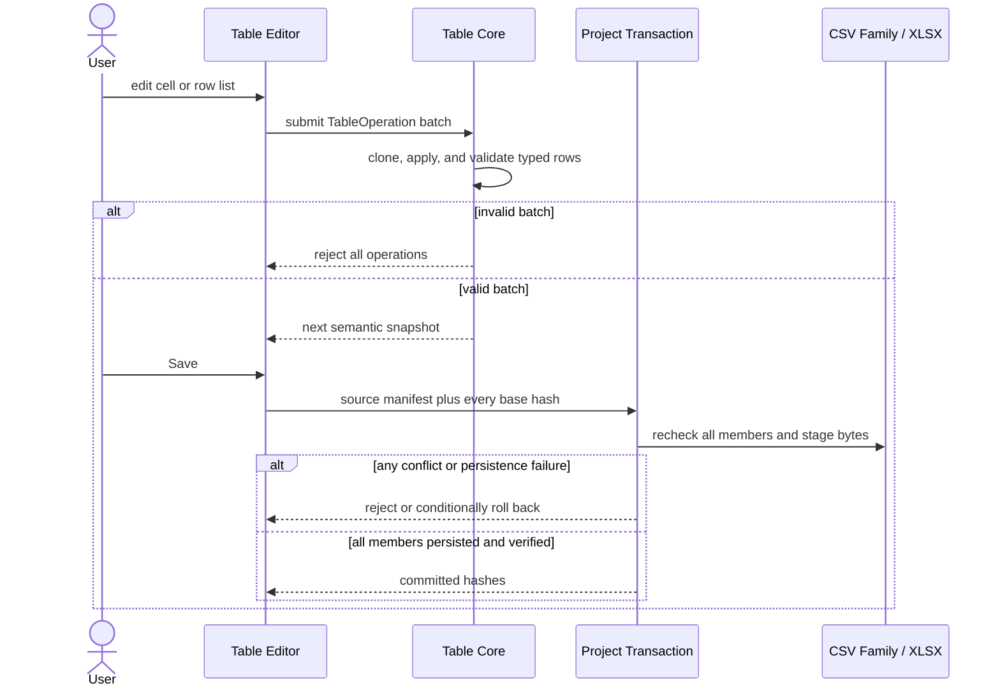

# VisualBridge Table 语义模型 V1

## 1. 范围

Table V1 编辑由 UTF-8 CSV 兼容文本文件或 `.xlsx` 工作簿承载的受约束游戏数据表。编辑器、校验与当前 MCP V2 适配器共享同一套语义模型和同一个 Table Operation API；未来的 Unity 编译器也必须消费同一模型。它们不为 CSV 和 Excel 实现各自独立的业务规则。

当前实现包含 Table Catalog V1、CSV 与 XLSX 编解码器、原子 Table Operation 批处理、面向记录的 VS Code 表格编辑器、项目级文件关联、分区逻辑表、固定语义 fixtures，以及用于语义查询/搜索/校验/编辑的 stdio MCP 适配器。它不新增 Unity 代码。Unity Catalog 导出、Authoring 导入、运行时编译与调试仍是未来工作。

每个 Table Catalog 都使用共享的顶层 `source` 契约来声明未知、最新或过期的外部定义。Host 计算其只读内容 Hash；见 [`ProjectCatalogManagement.md`](ProjectCatalogManagement.md)。

## 2. C# 拥有数据定义

未来的 C# 导出器是以下内容的权威来源：

- 稳定的 Table Type、Sheet 和 Column ID 及别名；
- 普通运行时 `class` / `struct` 源类型名；
- 列显示名与物理 `nameKey` 值；
- JSON 形状以及 `int`、`float`、枚举 ID 和普通游戏 struct 等运行时 `dataTypeId` 值；
- 默认值、编辑器约束与枚举选项；
- 标量、JSON 与基于分隔符的单元格编码；
- 逻辑 Sheet 与分区规则。

导出结果是一个 `.vbtablecatalog` JSON 文件。Authoring 数据不依赖 `ScriptableObject`、Unity 子资产或仅编辑器可用的包装类型。未来的导出器只能检视游戏使用的普通 C# 类型；它不得执行玩法初始化方法来获取默认值。

表格列复用全项目共享的 Core Field 模型和共享 Form Editor。因此数值、布尔、文本、颜色、下拉选择、List 和递归嵌套的普通结构在 Entity、Structured、Table 和 Graph 编辑器中行为一致。

## 3. Project 级行布局

`VisualBridge.project.vbjson` 为整个项目一次性声明物理表头布局。行号从 1 开始：

```json visualbridge-schema=visualbridge-project.schema.json#/properties/tableLayout
{
  "nameKeyRow": 2,
  "dataStartRow": 3
}
```

`dataStartRow` 之前的行是表头行，由编解码器保留。常见布局为：

1. 描述行；
2. name-key 行；
3. 首个数据行。

`dataStartRow` 必须大于 `nameKeyRow`。语义列映射始终读取 `nameKeyRow`；它从不假设某个字段仍停留在同一物理列索引上。重排后的列和导出的 `nameKeyAliases` 仍可读取。必需 name key 缺失或有歧义即为错误。

## 4. Table Catalog V1

Document Type 通过 `"editor": "table"` 选择所属编辑器；其稳定的 Document Type ID 解析到一个 Table Type ID 或别名。文件扩展名仍由项目通过 `include` 与 `exclude` 模式定义。

```json visualbridge-schema=visualbridge-table-catalog.schema.json visualbridge-parser=table-catalog
{
  "formatVersion": 1,
  "catalogId": "game.tables",
  "title": "Game Tables",
  "source": { "status": "unknown" },
  "tableTypes": [
    {
      "id": "game.table.skills",
      "aliases": ["legacy.table.skills"],
      "title": "Skills",
      "source": {
        "providerId": "csharp",
        "typeName": "Game.SkillConfig"
      },
      "csv": { "delimiter": "\t" },
      "sheets": [
        {
          "id": "skills",
          "title": "Skills",
          "name": "Skills",
          "rowDisplayNamePattern": "{id}",
          "keyColumnId": "id",
          "columns": [
            {
              "id": "id",
              "title": "ID",
              "valueType": "number",
              "dataTypeId": "int",
              "defaultValue": 1,
              "editor": { "kind": "number", "integer": true },
              "nameKey": "Id",
              "cellEncoding": { "kind": "scalar" }
            }
          ]
        }
      ]
    }
  ]
}
```

Catalog ID、Table Type ID、Sheet ID 和 Column ID 是持久身份。显示标题、C# 类型名、物理工作表名和物理 name key 不是身份。别名提供显式迁移，不会静默猜测被重命名的类型、Sheet 或列。

每个 Sheet 定义还声明行在编辑器中的命名方式：

```json visualbridge-schema=visualbridge-table-catalog.schema.json#/$defs/sheet/properties/rowDisplayNamePattern
"{id}_{name}"
```

占位符必须使用精确、稳定的 Column ID。物理 `nameKey` 值和别名会被拒绝，因此导出时重命名列不会静默改变展示给用户的 Authoring 身份。格式化后的值仅用于呈现：它驱动记录列表、所选记录标题和搜索文本，而行身份与重复检测仍继续使用显式语义 ID 和 key 列。

## 5. 单元格编码

每列都携带共享的 Field 定义，外加一个物理 `nameKey` 和一个由 C# 导出的 `cellEncoding`：

- `scalar`：原始字符串、数值或布尔值；
- `json`：单个单元格内的 JSON 文本；
- `delimited`：带显式分隔符和可选嵌套项编码的数组或 struct。

例如，C# `RewardItem[]` 可以定义数组项之间用 `;`、每个项的字段之间用 `|`。这样单元格 `1001|2;1002|1` 就映射为两个带类型的对象。分隔符从不由当前数据推断。缺少显式编码的结构化字段会被拒绝。

编解码器保留未知的物理列。简单的 XLSX 单元格编辑会原地修补已知单元格。CSV 序列化保留已配置的表头行、原始换行风格和未改动的原始单元格值。

## 6. 逻辑表格分区

一个逻辑 Sheet 定义可以拆分为多个物理 CSV 文件或 XLSX 工作表。所有分区必然共享相同的列，因为它们都解析到同一个 Sheet 定义。

```json visualbridge-schema=visualbridge-table-catalog.schema.json#/$defs/partition
{
  "namePattern": "Skills_{part}",
  "deduplicateByColumnId": "id",
  "duplicatePolicy": "keepFirst"
}
```

`namePattern` 恰好包含一个 `{part}` 占位符。匹配该定义的示例包括 `Skills_A` 和 `Skills_Season2`。不符合模板的物理名称不会并入该逻辑表。

去重列是一个稳定的 Column ID，通常是首个/key 列。策略有：

- `error`：跨分区重复即为错误，新的非法 Operation 会被拒绝；
- `keepFirst`：保留有效逻辑行流中的第一行并发出警告；
- `keepLast`：保留有效逻辑行流中的最后一行并发出警告。

去重不会删除或改写源行。编解码器保留每一个物理行，而 `resolveEffectiveTableRows` 向未来的编译器和查询服务提供按策略解析后的逻辑视图。物理顺序是确定性的：XLSX 使用工作簿内工作表顺序；CSV 家族使用按字典序排序的路径。

对 CSV 而言，当相邻文件具有相同物理扩展名、解析到同一 Project 和 Document Type 且匹配命名模板时，会在被打开文件所在目录发现分区。编辑器把它们作为一个带分区标签页的逻辑文档打开。Operation 批处理作用于合并后的语义文档；保存时在写入任何被改动的成员之前检查每个成员的 base hash。发生冲突时会拒绝保存，而不是覆盖外部编辑。

对 XLSX 而言，匹配的工作表是同一工作簿内部的分区。无关工作表保持在 Table 语义文档之外，并在写回时被保留。

## 7. 语义文档与操作

内存中的 Table Document 包含物理 Sheet、被保留的表头行、已解析的列索引和带类型的行。源行号和原始单元格属于编解码器元数据；编辑器不得把它们当作稳定的业务身份。

V1 的 Operation 有：

- `table.setCell`;
- `table.insertRow`;
- `table.removeRow`;
- `table.moveRow`;
- `table.duplicateRow`.

MCP 与 VS Code 使用相同结构化字段：

| `type` | 必填字段 | 可选字段 |
| --- | --- | --- |
| `table.setCell` | `sheetId`, `rowId`, `columnId`, `value` | — |
| `table.insertRow` | `sheetId`, `rowId` | `index`, `cells` |
| `table.removeRow` | `sheetId`, `rowId` | — |
| `table.moveRow` | `sheetId`, `rowId`, `index` | — |
| `table.duplicateRow` | `sheetId`, `rowId`, `newRowId` | `index` |

针对既有行的 Operation，其 `sheetId` 和 `rowId` 必须原样取自 `visualbridge_document.read` 返回的语义页，而不是 Catalog 的 `sheetDefinitionId` 或业务 key。CSV 分表常见形态分别为 `skills:Skills_B` 和 `Skills_B:key-202`；调用方不得自行拼接或只传 `skills` / `202`。`table.insertRow.rowId` 和 `table.duplicateRow.newRowId` 则由调用方生成，必须是同一物理 Sheet 内唯一的非空新 ID。`cells` 是以稳定 Column ID 为键的 JSON object，`index` 是从零开始的目标位置。

Core 会克隆文档、应用整个批处理、校验结果，并且仅当该批处理未引入新错误时才发布它。这使 Table Operation 具备原子语义行为，并让记录编辑器保持为视图层。VS Code 的撤销和重做恢复完整的语义快照。

## 8. VS Code 编辑器与持久化

Table 编辑器使用 Project Registry，而不是硬编码的扩展名。`VisualBridge: Open Document` 把任何匹配的 Table Document 路由到同一个自定义编辑器。承载格式从内容检测：XLSX ZIP 包使用工作簿编解码器；其他表格文件使用已配置的 UTF-8 CSV 编解码器。

编辑器采用适合游戏配置的、面向记录的主从布局：左侧显示可搜索的记录列表，右侧使用全项目共享的 Field 编辑器展示所选记录。列表和详情标题都使用 `rowDisplayNamePattern`。每条记录行使用全项目统一的列表操作顺序：拖拽、后插和删除保持相邻；筛选结果隐藏了行时禁用重排。搜索通过共享的 Table 搜索规范化器匹配格式化标题和所有已编码单元格。新增和复制会在同一逻辑 Sheet 的每个物理分区上生成不冲突的 key/去重值；复制还会把显示模式使用的首个非 key 字符串命名为 `·副本`。

记录列表使用 `@tanstack/react-virtual`，采用固定的 48 px 行高估算、稳定的 `row.id` key 和有界的 overscan。只有可见窗口会被挂载，因此 1,000 行和 50,000 行输入在同一视口下具有相同的 DOM 节点上限。搜索文本和源索引在每次语义修订时只准备一次；渲染不会对每一行调用 `indexOf`。虚拟定位位于 dnd-kit 可排序行之外，保留了拖拽、选择、Reveal、后插和删除语义。详细契约与自动化上限检查记录在 [`WorkspaceIndexPerformance.md`](WorkspaceIndexPerformance.md) 中。

`VisualBridge: Create Document`、专用的 Table 创建命令和 Document Browser 类型操作都可以从解析出的 Table Type 创建空的承载文件。创建参数显式选择 `format: "xlsx"` 生成真正的工作簿，或 `format: "csv"` 生成使用导出分隔符的 UTF-8 CSV 兼容字节；目标扩展名从不隐式决定该格式。已配置的 name-key 行填入各列的 `nameKey` 值，第一个可用的描述行填入列标题，分区的 Sheet 初始时把 `{part}` 替换为 `Main`。只有当 Project Registry 能把新路径反向解析回所选的 Table Document Type 时，新路径才被接受。

因此颜色、List 和嵌套普通结构与 Entity 字段行为一致，而不会变成特殊的表格控件。共享 List 在各 Document Type 间使用同一套 dnd-kit 可排序布局，拖拽、后插和删除控件成组放在每个元素旁。无障碍按钮使用 Base UI，功能控件使用共享的 Lucide 图标集，颜色使用共享的 `react-colorful` 弹出层。XLSX 处理使用 `exceljs`。

列还可以声明共享的 `reference` 契约。因此表格单元格与 Entity 和 Graph 属性使用相同的 Reference Picker、诊断和目标导航。第一个 Provider `table.row` 对有效分区行上的 Catalog key 列建索引。打开的 Table 编辑器会把它当前未保存的语义快照发布到工作区 Reference 索引，因此跨文档选择和校验不会落后于可见的 Table 状态。完整契约见 `ReferenceSystem.md`。

每个打开的来源都记录 SHA-256 base hash。Table Operation 和保存都会复查这些 hash。保存时先把字节暂存到同目录的临时文件，只有序列化成功后才替换目标。检测到的外部改动从不会被隐式覆盖。



CSV 家族与 XLSX 的编辑步骤、分区切换、筛选重排约束、诊断与冲突恢复见 [`AuthoringUserGuide.md`](AuthoringUserGuide.md)。

## 9. XLSX 边界

V1 支持普通游戏数据工作表。简单单元格编辑会保留已知的带类型单元格、工作表顺序、无关工作表和既有单元格样式。结构性行变更会重写已配置的数据区域，并在可行时复制源行样式。

宏、`.xls`、透视表、图表、外部链接、公式编辑和任意工作簿往返保真都在 V1 范围之外。公式可以通过其缓存结果读取，但 Table 编辑器不承诺在结构性行编辑之后仍保留由复杂公式驱动的数据区域语义。

## 10. 文档生命周期目标契约

Table 生命周期使用共享的 [`DocumentLifecycle.md`](DocumentLifecycle.md)，并把完整的逻辑承载视为一个单元：

- 分区 CSV 家族在其来源 manifest 中包含每一个匹配的物理成员。复制、移动和删除不能只作用于当前选中的分区。
- XLSX 逻辑文档移动或删除的是整个工作簿；工作表名称和无关工作表仍是工作簿内容，而不是独立的生命周期路径。
- 路径移动保留全部字节和业务 key。每个目标位置必须仍解析到同一 Project 和 Project Document Type；每个 CSV 家族成员的目标位置必须匹配同一分区命名规则。
- Table 没有虚构的 Document ID。整文档复制要求为每个 `kind: "table.row"` 可引用的严格类型 key 列身份提供一个完整的 `stableIdRemap` 条目。如果 `deduplicateByColumnId` 与 key 列不同，则每个 `kind: "table.dedup"` 身份还要求一个同类型、不冲突的目标；同一物理列绝不会被映射两次。内部 `table.row` Reference 只使用行 key 映射，而外部 Reference 保持不变。目标承载文件中面向 Operation 的 Row ID 和物理 Sheet ID 由 Table Codec 重新推导，不是稳定身份。
- 安全删除文档覆盖所有物理来源和有效行。安全删除行覆盖确切的物理 Row 及其稳定 key 目标；任何能解析到该目标的外部出现都会阻止删除。

`table.removeRow` 仍是被授权的 Lifecycle 计划使用的底层语义变更。在 PU-03 守卫下，直接公开提交会返回 `lifecycle.required`；记录列表的删除必须使用 Lifecycle 预览/应用。既有行的 Operation ID 仍是面向 Operation 的物理 ID，而 Reference 身份仍是严格的带类型 key 列值。

行安全删除使用 `{ "kind": "table.row", "sheetId": "...", "rowId": "..." }`，两个 ID 都原样取自当前语义读取；它不接受用业务 key 代替 `rowId`。整逻辑 Table 删除则使用 `{ "kind": "document" }`，删除每个 CSV 家族成员或整个 XLSX 工作簿。

Lifecycle 预览/应用要求每个相关的 Table Custom Editor 都处于干净状态；打开但已保存的编辑器是允许的。物理工作簿/家族 manifest 和工作区 Reference 索引因此必须共享同一磁盘基线。外部的 Excel、资源管理器或脚本写入会通过成员 hash 与 manifest/缺失检查被发现；协作式 Project 锁并不阻止它们。

## 11. MCP 与延期的 Unity 工作

本阶段没有实现任何 Unity Table Exporter、导入器、运行时、`ScriptableObject` 层或 Debug 功能。未来的 Unity 集成必须从普通游戏结构导出 Table Catalog JSON，并消费与本文档所述相同的有效逻辑行和编码。

stdio MCP V2 适配器使用与其他文档类型相同的统一工具：`visualbridge_catalog` 读取/搜索 Table Type、Sheet 和 Column 定义；`visualbridge_document` 读取/搜索/校验语义表格；`visualbridge_apply_operations` 使用读取返回的 `baseHash` 应用一个非空的 TableOperation 批处理。表格读取使用 `selector.sheetId`；搜索使用 `selector.sheetDefinitionId` 和 `selector.effectiveOnly`。它返回带类型的单元格，而不是原始 CSV 行或工作簿对象。Search Cursor 绑定规范查询、selector、物理来源 Manifest Hash 和相关 Catalog Hash；任一来源或 Catalog 在页间变化都返回 `cursor.snapshotChanged`，不能在新表上继续旧分页位置。

分区 CSV 家族对排序后的成员路径和来源 hash 使用一个合并的 `baseHash`；XLSX 使用工作簿 hash。任何被改动的来源、新增/移除的分区、进行中的 Project Transaction 或新引入的 Reference 错误都会拒绝整个修改请求。所有 Graph、Entity、Structured、Table 与 Refactor 写入共享一个 Project Transaction 锁。被改动的来源在替换前先暂存、记录进可恢复的 journal，并在持久化后校验。失败的 prepared 事务会按相反顺序恢复备份；如果恢复过程中遇到未知的外部字节，会保留它们并返回 Tool Error，而不是覆盖它们。公开的结果是 `applied`、`unchanged`、`invalid` 和 `conflict`；I/O、校验或恢复的不确定性属于错误。AI 不得通过直接编辑工作簿字节或原始 CSV 单元格来绕过这个语义层。
