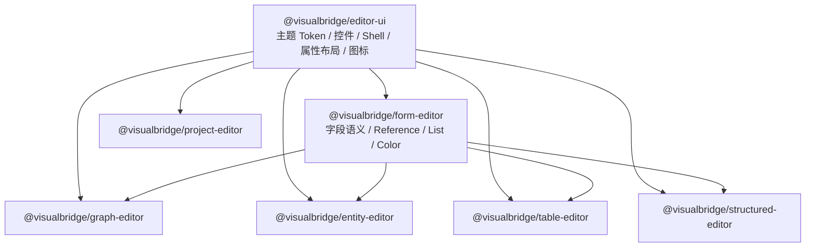

# Authoring 编辑器共享视觉系统改造计划

## 文档状态

- 状态：`pending`，仅完成现状分析与实施设计，尚未开始代码改造。
- 创建日期：2026-08-31。
- 执行门禁：只有在当前功能开发完成、相关改动已经稳定，并由维护者明确确认可以开始后，才执行本文。
- 完成处理：改造完成并将长期约束合入正式文档后，删除本文。

## 已确认的视觉方向

- Graph 以 [Bleu AI](https://buildbleu.com/) 在 [React Flow Showcase](https://reactflow.dev/showcase) 中的节点工作流观感为主要参考。
- Entity 与 Table 的属性编辑以 [Tweakpane](https://tweakpane.github.io/docs/) 的整齐、紧凑、成组布局为主要参考。
- 不沿用 Tweakpane 的字体。普通界面字体跟随 VS Code，代码、ID、路径和表达式使用 VS Code 编辑器字体。
- Table 不是电子表格式 Data Grid；其产品模型保持为“分表/记录导航 + 单条记录属性编辑”，属性编辑与 Entity 共用同一套实现。
- 视觉改造必须优先公共化，不能为 Graph、Entity、Table 分别建立互不相干的控件和样式体系。
- Bleu AI 与 Tweakpane 只作为视觉层级、密度和交互组织参考，不复制对方源码、品牌资产或固定配色。

## 目标

1. 建立一个宿主无关、领域无关的共享 Webview UI 包，供当前和未来 Authoring 编辑器复用。
2. 让 Graph、Entity、Structured、Table、Project Settings 使用同一套主题 Token、基础控件、编辑器壳、属性布局和反馈状态。
3. 保留各领域真正不同的工作区：Graph Canvas、Entity Component、Table Record Navigator 等仍由领域编辑器负责。
4. 让 VS Code 主题在运行时切换后，已经打开的 Webview 无需重新加载即可正确更新。
5. 在不改变 Document、Operation、消息协议、保存、Undo/Redo、Reference 和 Reveal 语义的前提下完成改造。
6. 不增加新的 UI 框架依赖，继续使用 React、Base UI、Lucide React、React Flow、`react-colorful` 和现有 DnD/虚拟列表能力。

## 非目标

- 不把 Table 改造成 Spreadsheet 或 Data Grid。
- 不修改 Core、Protocol、Catalog、Document Schema 或序列化格式。
- 不修改 VS Code Extension Host 与 Webview 之间的消息契约。
- 不引入外部字体、CDN 样式、shadcn/Tailwind 或已归档的 VS Code Webview UI Toolkit。
- 不在这次视觉改造中重做 Graph 编辑能力、Entity 组件语义或 Table 行操作。
- 不修改 Unity Package、UnityProject 或 Runtime/Debug 功能。

## 当前实现结论

### 已有的公共基础

`Editors/Form` 已经提供共享 `FieldsEditor` 和 `FieldValueEditor`，负责以下字段类型：

- Select、Reference、JSON。
- Object、Array。
- Boolean、Number、Color、String。

当前消费者包括：

- Entity 文档属性与 Component 属性。
- Table 单条记录的列属性。
- Structured Config 属性。
- Graph 节点属性、Graph 属性和动态端口值。

因此本次不应再创建第二套属性渲染器。Tweakpane 方向应落到现有 Form 的公共视觉层和组合组件上。

### 当前重复和漂移

目前每个领域编辑器都在自己的 CSS 中重复定义 `body`、Button、Input、Toolbar、Status、Card 和 `.vb-field*` 样式。已经出现明确漂移：

- Entity 字段标签列从 `130px` 起，列间距为 `12px`。
- Table 与 Structured 字段标签列从 `150px` 起，列间距为 `18px`。
- Graph 节点内嵌属性使用约 `68px` 的紧凑标签列，Graph Inspector 又有另一套纵向字段样式。
- `CommonIcon`、`IconButton` 和 `ListItemActions` 位于 `Editors/Form`，但 Project、Entity、Table 和 Graph 都在使用；这些能力实际上属于通用 UI，而不是 Form 语义。
- Entity、Structured、Project 分别实现了相似的 42px Toolbar、25px Status 和居中内容卡片。

这意味着只调整各编辑器 CSS 会继续扩大维护成本。公共层必须先于视觉换皮落地。

### Table 虚拟列表约束

Table 左侧记录列表当前使用固定 `48px` 行高；CSS 的 `.record-item-shell` 与 `TABLE_RECORD_ROW_HEIGHT` 必须保持一致。如果视觉改造改变列表密度，必须同时更新虚拟化常量和对应测试，不能只改 CSS。

### 架构边界

正式架构规定 Webview 只是权威源文件的可视化视图，所有编辑仍通过领域 Operation 回到权威 Document。因此共享 UI 包只能负责呈现、交互基元和组合布局，不得拥有领域文档状态或直接执行 Graph、Entity、Table Operation。

## 目标依赖结构

新增 `Editors/Ui` workspace，包名建议为 `@visualbridge/editor-ui`。



依赖要求：

- `editor-ui` 只依赖 React、Base UI 和 Lucide React 等纯 UI 能力，不依赖 Core 或任何领域模块。
- `form-editor` 依赖 `editor-ui` 和 Core Field 定义，继续拥有字段值解析、Reference、List 和 Color Editor。
- 领域编辑器组合 `editor-ui` 与 `form-editor`，保留自己的领域状态、Operation 和复杂工作区逻辑。
- `editor-ui` 不导入 Graph、Entity、Structured、Table 或 VS Code Extension Host 代码。
- 最终状态只保留一个通用图标和按钮所有者，不长期保留 Form 与 UI 两份兼容实现。

## 共享 UI 包边界

### 主题与视觉 Token

建议在 `Editors/Ui/src/theme.css` 中建立 `--vb-*` 语义 Token。Token 值必须映射到 `--vscode-*`，而不是复制某个深色主题的具体颜色。

第一批 Token 至少覆盖：

- 字体：普通 UI、代码、字号、字重。
- 表面：Editor、Panel、Raised、Toolbar、Status。
- 文本：Primary、Muted、Disabled、Link。
- 边框：Default、Active、Focus、High Contrast。
- 控件：Input、Button、Checkbox、Hover、Selection。
- 状态：Success、Warning、Error、Dirty、Pending。
- Graph：Canvas、Grid、Edge、Selected Edge、Flow Port、Data Port。
- 尺寸：Control Height、Toolbar Height、Status Height、Radius、Spacing、Label Width。

示意映射：

```css
:root {
  --vb-font-ui: var(--vscode-font-family, system-ui, sans-serif);
  --vb-font-code: var(--vscode-editor-font-family, monospace);
  --vb-foreground: var(--vscode-foreground);
  --vb-muted-foreground: var(--vscode-descriptionForeground);
  --vb-surface-editor: var(--vscode-editor-background);
  --vb-surface-panel: var(--vscode-sideBar-background);
  --vb-surface-raised: var(--vscode-editorWidget-background);
  --vb-border: var(--vscode-panel-border);
  --vb-focus-border: var(--vscode-focusBorder);
  --vb-control-height: 28px;
  --vb-radius-small: 3px;
}
```

示意代码只说明映射方向，实际实现前需要逐项核对 VS Code Theme Color Reference，并为官方允许缺省的颜色设计同样来自 VS Code Token 的回退链。

### 主题切换契约

主题支持是硬性约束：

- 不在 React State 中缓存计算后的主题颜色。
- 不通过启动时读取主题 ID 来选择一份静态主题。
- CSS 始终引用 `--vb-*`，`--vb-*` 始终引用当前 `--vscode-*`。
- React Flow 的 `--xy-*` 变量也通过 `--vb-*` 映射，不能写死 Bleu AI 的深色值。
- `body.vscode-light`、`body.vscode-dark` 和 `body.vscode-high-contrast` 只用于确有必要的结构或对比度修正。
- 不为具体主题名称编写 `data-vscode-theme-id="..."` 特例。
- 高对比度模式不能只依赖阴影、透明度或颜色区分状态；使用 `contrastBorder`、`contrastActiveBorder`、Focus Outline、端口形状和文本共同表达。
- 外部浏览器或 JSDOM 所需的 fallback 只服务测试和开发预览，不能成为 VS Code 内的主配色来源。

运行时验收必须覆盖：在 Graph、Entity、Table 已打开且包含当前未保存编辑状态时，依次切换亮色、暗色和高对比度主题；Webview 不重载，文档状态不丢失，所有表面、文本、控件、选中态、Focus 和 Graph 连线立即更新。

### 公共组合组件

首批只抽取已经重复出现的稳定结构，不建立万能页面生成器：

- `EditorShell`：Toolbar、Content、Status 三个 Slot。
- `EditorToolbar`、`EditorToolbarGroup`、`EditorToolbarSpacer`。
- `EditorStatusBar`、`SaveState`、诊断计数和状态文本布局。
- `SplitWorkspace`、`NavigatorPane`、`InspectorPane`、可折叠 Inspector Rail。
- `PropertyPanel`、`PropertySection`、`PropertySectionHeader`、`PropertyGrid`。
- `Button`、`IconButton`、`Checkbox` 的统一外观封装。
- `CommonIcon` 与不含领域语义的通用操作图标。
- Empty、Loading、Error、Notice 等反馈表面。

公共组件采用 Slot/children 组合，不读取任何领域 Document，也不发送 Operation。

### 属性布局预设

共享属性系统提供少量密度预设，而不是由每个编辑器重新写 `.vb-field*`：

- `regular`：Entity、Table、Structured 的主属性面板。
- `sidebar`：Graph Inspector 等窄侧栏。
- `compact`：Graph Node 内嵌属性与动态端口。

预设只改变尺寸和排版，不改变 `FieldValueEditor` 的值语义。标签列宽、列间距、行间距和 Control Height 通过 CSS Custom Property 覆盖，嵌套 Object/List 继承当前上下文。

## 各编辑器目标

### Graph

保留当前 React Flow、Dot Background、MiniMap、Controls、右侧 Inspector、节点内属性和动态端口能力，仅调整视觉组合：

- Canvas、Toolbar、Inspector 和浮层使用共享 Shell 与主题 Token。
- 节点采用 Bleu AI 方向的清晰卡片层级：紧凑 Header、明确标题、弱化辅助元数据、稳定的内容分区和状态层级。
- 保留当前 Data Port 方形、Flow Port 圆形的语义区分；颜色继续来自数据类型和 VS Code 主题映射。
- Selected、Revealed、Connected、Disabled、Invalid 等状态必须在亮色、暗色、高对比度下都可区分。
- Graph Inspector 改用共享 `PropertyPanel`；Graph Node 内属性使用同一 Field 控件的 `compact` 预设。
- Context Menu、Node Picker、MiniMap 和 Controls 使用公共浮层、按钮和边框语言。
- 不引入 React Flow UI 的 shadcn/Tailwind 依赖，也不改动 Graph Operation 和交互事件路径。

### Entity

- 顶部 Toolbar、底部 Status、Loading、Diagnostics 改为公共组件。
- Entity 基础属性和 Component 属性继续共用现有 `FieldsEditor`。
- 当前较大的独立 Card 逐步收敛为 Tweakpane 方向的紧凑 `PropertySection`：Section Header 负责折叠、启用、标题和操作，Body 使用 `regular` 属性布局。
- 组件拖拽、复制、插入、删除、Reveal 和未知类型保留原行为。
- Entity 标题、Document ID、Catalog 来源等机器信息使用共享 Typography 规则；普通标签不使用代码字体。

### Table

- 保持“Sheet Tabs + 左侧记录导航 + 右侧记录属性”结构，不出现 Cell Grid。
- 右侧记录编辑与 Entity 使用完全相同的 `PropertyPanel`、`PropertyGrid` 和 Field 控件。
- 左侧记录导航使用共享 Navigator、Search 和 Item 状态样式，但行排序、虚拟化和 Table Operation 仍由 Table Editor 负责。
- 如保持 48px 记录行高，则不改虚拟化常量；如视觉确认需要新密度，必须同步修改 CSS、`TABLE_RECORD_ROW_HEIGHT` 和虚拟化测试。
- Sheet Tabs、Record Header、Copy/Add/Delete、Dirty Marker 采用公共控件和状态 Token。

### Structured 与 Project Settings

它们不是本次主要视觉参考对象，但必须迁移或兼容共享 UI：

- Structured 应直接复用 `regular` 属性布局，删除与 Entity/Table 重复的 `.vb-field*` 基础定义。
- Project Settings 应复用 Shell、Toolbar、Status、Button、Icon、Field 和 Section 基础组件。
- 不要求二者在本次获得新的产品布局，但不能继续保留一套平行的全局控件样式，否则未来扩展仍会分叉。

## 建议文件规划

新增：

- `Editors/Ui/package.json`
- `Editors/Ui/index.ts`
- `Editors/Ui/src/theme.css`
- `Editors/Ui/src/controls.css`
- `Editors/Ui/src/shell.tsx`
- `Editors/Ui/src/shell.css`
- `Editors/Ui/src/propertyLayout.tsx`
- `Editors/Ui/src/propertyLayout.css`
- `Editors/Ui/src/icons.tsx`
- `Editors/Ui/src/feedback.tsx`

调整：

- 根 `package.json` 与 `package-lock.json`：登记 workspace、构建和检查顺序。
- `Editors/Form`：依赖 `@visualbridge/editor-ui`；保留字段语义、Reference、List 和 Color；迁移通用 Icon/Button 所有权；拆分当前 `listEditor.css` 中的公共与字段专用样式。
- `Editors/Graph`、`Editors/Entity`、`Editors/Table`：依赖并组合 `@visualbridge/editor-ui`，删除已迁移的基础样式。
- `Editors/Structured`、`Editors/Project`：接入公共 Shell、控件和属性布局，至少消除重复的全局基础样式。
- `Tools/DependencyPolicy`：登记新的 workspace 和依赖方向约束，防止 `editor-ui` 反向依赖领域模块。
- VSIX 构建契约：确认新增 workspace 在干净 checkout、根构建和打包路径中都被构建。

原则上不应修改：

- `Core/`
- `Protocol/`
- `BuiltInExtensions/` 的 Document、Catalog、Operation 和 Serializer
- `Tools/VSCodeExtension/src/editor/` 的消息处理与事务逻辑
- `Packages/` 与 `UnityProject/`

如果实际实施发现必须修改上述目录，应暂停并重新审查范围，而不是把行为变更混入视觉任务。

## 实施阶段

### 阶段 0：等待和冻结基线

1. 等待当前功能开发结束，不自动开始本计划。
2. 由维护者明确确认可以执行。
3. 确认 `main` 与远端状态，并识别所有已有工作区修改的归属。
4. 执行 `codegraph sync .`，重新核对本计划涉及的符号和依赖；不能假设本文记录的行号与实现仍未变化。
5. 在固定示例上保存 Graph、Entity、Table、Structured、Project 的亮色、暗色和高对比度基线截图。

### 阶段 1：建立公共 UI 包

1. 创建 `@visualbridge/editor-ui` workspace 和依赖边界。
2. 落地主题 Token、字体、基础 Control 和 High Contrast 契约。
3. 迁移 `CommonIcon`、`IconButton` 和通用操作样式。
4. 建立 Shell、Status、Property 和 Feedback 组合组件。
5. 先保持现有消费者视觉基本不变，验证公共包集成和 CSS Bundle 正常。

### 阶段 2：迁移现有编辑器

1. 迁移 Form 的公共属性布局和控件样式。
2. 迁移 Structured，作为最简单的 `regular` 属性布局验证消费者。
3. 迁移 Entity 和 Table，确保二者的属性区完全共用。
4. 迁移 Project Settings 的 Shell 与基础控件。
5. 迁移 Graph Inspector 与 Graph Node `compact` 属性布局。
6. 删除各编辑器中已经由公共层拥有的重复 CSS，最终不保留双重所有权。

### 阶段 3：应用目标视觉

1. Graph 应用 Bleu AI 方向的层级、节点卡片、Canvas、Inspector 和浮层视觉。
2. Entity/Table 应用 Tweakpane 方向的紧凑 Section 和属性对齐。
3. 使用 VS Code UI 字体替代参考站点字体，机器字段使用编辑器字体。
4. 调整 Responsive、窄编辑器列、长中文标签、长 ID、嵌套 Object/List 和大字段数量场景。
5. 在不改变语义的前提下统一 Hover、Focus、Selection、Dirty、Pending、Error 和 Reveal 状态。

### 阶段 4：验证和收尾

1. 在不重载 Webview 的情况下执行亮色、暗色、高对比度运行时主题切换。
2. 对 Graph 执行节点选择、拖动、连接、动态端口、右键菜单、Node Picker、MiniMap、Inspector 和 Reveal 检查。
3. 对 Entity 执行属性修改、组件折叠/启用/拖动/复制/添加/删除、Reference 和 Color 检查。
4. 对 Table 执行 Sheet 切换、搜索、虚拟滚动、记录选择/排序/复制/添加/删除和属性修改检查。
5. 对 Structured 与 Project Settings 做完整视觉和基本交互回归。
6. 将仍需长期维护的视觉和共享 UI 边界写入正式文档，删除本文。

## 验收标准

### 公共化

- Graph、Entity、Table、Structured、Project 不再各自声明一套 `body/button/input` 基础视觉。
- Entity 与 Table 的属性区由同一公共组件和同一 `regular` 预设渲染。
- Graph Inspector 复用公共 Property 组合；Graph Node 只通过 `compact` 预设改变密度。
- 新编辑器能够只依赖 `@visualbridge/editor-ui` 与必要的 `@visualbridge/form-editor`，无需复制现有编辑器 CSS。
- 公共 UI 包不包含任何领域 Operation、Document 状态或 Host 消息处理。

### 主题

- 亮色、暗色和高对比度主题均可读、可操作。
- 主题运行时切换不重载 Webview、不丢失未保存状态、不产生固定旧颜色。
- 任何关键状态都不只通过颜色表达。
- Focus Ring、选中边框和 High Contrast 额外边框清晰可见。
- 没有针对具体主题 ID 的硬编码选择器，没有外部字体和 CDN 资源。

### 视觉

- Graph 达到 Bleu AI 方向的现代节点工作流层级，同时仍自然融入 VS Code。
- Entity 与 Table 达到 Tweakpane 方向的紧凑、整齐属性对齐，但使用 VS Code 字体。
- Table 始终表现为记录导航和属性编辑器，不出现 Spreadsheet 视觉暗示。
- 机器信息和普通 UI 文本的字体用途明确且一致。
- 窄窗口、长文本、嵌套字段和大记录列表不会出现遮挡、错位或虚拟滚动空洞。

### 行为

- Document、Operation、Undo/Redo、Save、Dirty、Reference、Reveal 和诊断行为不变。
- 不新增 Core、Protocol、Catalog 或 Unity 变更。
- 不新增未经评估的 UI 依赖。

## 验证命令

实施时使用仓库锁定的 Node.js 22.22.1 和 npm 10.9.4，至少执行：

```powershell
codegraph sync .
npm run check
npm test
npm run build
npm run check:docs
npm run package:vscode
npm run test:vscode:host
npm run test:vscode:cli
git diff --check
```

以上自动化不能替代真实 VS Code 中的主题切换和交互验收。Webview 改造还必须提供 Graph、Entity、Table 的亮色、暗色、高对比度截图，并记录 Structured 与 Project Settings 的兼容检查结果。

## 风险与控制

- CSS 级联污染：公共样式使用稳定 `vb-ui-` / `vb-field-` 前缀和显式容器作用域，避免无边界全局选择器。
- Graph 密度污染：Graph Node 使用独立 `compact` 预设，不能继承 Entity/Table 的完整属性面板尺寸。
- Structured 回归：Shared Form 的默认行为先以 Structured 验证，领域差异通过容器 Token 覆盖，不复制字段 CSS。
- Table 虚拟列表错位：列表 Item Height 与虚拟化常量同源或同步更新，并保留测试约束。
- 高对比度失效：不能用 Shadow 或半透明背景作为唯一层级；额外边框与 Focus Outline 必须存在。
- 参考产品漂移：Bleu AI/Tweakpane 只定义方向，最终验收以本文冻结的 VisualBridge 规则为准，不追随外部站点后续改版。
- 改造范围扩张：公共层只抽取已经重复出现的稳定模式；新的领域抽象必须有至少两个实际消费者后再加入。

## 参考

- [Bleu AI](https://buildbleu.com/)
- [React Flow Showcase：Bleu AI](https://reactflow.dev/showcase)
- [Tweakpane 文档](https://tweakpane.github.io/docs/)
- [Tweakpane Theming](https://tweakpane.github.io/docs/theming/)
- [VS Code Webview Theming](https://code.visualstudio.com/api/extension-guides/webview#theming-webview-content)
- [VS Code Theme Color Reference](https://code.visualstudio.com/api/references/theme-color)
