# VisualBridge Unity 领域扩展与 Runtime 接入任务清单

## 1. 目标与边界

本清单是 [`UnityIntegrationRoadmap.md`](UnityIntegrationRoadmap.md)（VB-UI 系列）之后的下一大阶段任务规划。前置条件 VB-UI-07 已于 2026-08-31 关闭；当前进度：**阶段 A（离线领域扩展）全部完成**——VB-UX-00 至 VB-UX-06（语言规范、Entity/Graph Catalog Export、Entity/Table/Graph Import/Compile、Adapter API 复核决策）已关闭；VB-UX-07（Runtime 产物形态决策）已关闭，VB-UX-08（Runtime 发现流程 spike 与威胁模型）已关闭，VB-UX-09（共享协议核与 Runtime Bridge）已关闭，VB-UX-10（调试语义进入 Runtime 协议）待开始。

本阶段分三段：

- **阶段 A（离线领域扩展）**：Entity、Table、Graph 三个领域的 Unity Catalog Export 与派生编译。全部 Editor-only、离线、确定性，复用 VB-UI-04/05 已冻结的 Profile、Schema 先行、batch Generate/Check、EditMode 与产物原子性方法论。
- **阶段 B（本机 Runtime 接入）**：仅本机回环（`127.0.0.1`）的 Runtime 通道、调试语义、VS Code DAP 适配器与 MCP Debug Tool。Editor 内 Play 模式与同机 Player 构建是同一 Runtime 发现流程的两种实例来源。
- **阶段 C（远程与设备连接）**：独立后续阶段，只登记范围与出口标准，不进入阶段 B 依赖链，不承诺与阶段 B 同协议版本落地。任务拆分由该阶段自己的 spike 产出。

2026-08-30 规划决策记录（项目方逐项确认）：

- 阶段切分为先离线领域编译、后 Runtime 连接；Runtime 连接协议在领域产物形态确定后设计，spike 以真实领域产物为负载。
- 领域顺序为 Entity → Table → Graph，按实现风险递进；Unity Adapter API 复核作为独立决策任务，卡在 Entity（第二个真实 Exporter/Compiler）之后。
- `ScriptableObject` Authoring 包装层不安排任何任务。它是旧设计迁移过来的残留；新体系固定为「C# 定义运行时数据类型 → 工具导出结构描述与约束（Catalog）→ VS Code 编辑器编辑数据 → 编译回 Unity」，Entity 扫描只认普通 `class`/`struct` 的既有约束保持不变。
- 协议分层：共享一套最小协议核（NDJSON 行分帧、token 认证、协议版本/能力协商、实例 generation、错误分类）独立版本化；各通道消息 Schema 独立；Editor 与 Runtime 的发现流程分开；Editor Bridge 保持 open/reveal 范围不变，禁止向其 Schema 添加 Runtime/Debug/Player 字段。
- 阶段 B 仅监听本机回环；跨网络边界的远程与设备场景独立成阶段 C，先行做自己的 spike 与威胁模型。
- 调试采用单一事实源：调试语义进入 Runtime 协议，VS Code DAP 适配器与 MCP Debug Tool 都接同一服务；MCP Debug Tool 排在最后，允许项目方降级为预留接口。
- Runtime 产物形态（Editor 物化 vs Runtime 库直读）不预先拍板，作为阶段 B 首个 spike 任务；为此阶段 A 各领域任务要求对产物结构、稳定 ID 与 source mapping 做设计留档（只约束设计记录，不约束产物格式本身）。
- 项目方要求在执行任何任务之前先完成仓库语言规范梳理：全部文档与关键代码注释统一中文、注释保持精简、清理任务残留的临时文档；规范本身写入 `AGENTS.md`（VB-UX-00）。

本清单不冻结阶段 B 的任何连接设计。[`UnityIntegrationArchitecture.md`](UnityIntegrationArchitecture.md) 中「后续 Unity 连接与 Debug 设计入口」一节列出的待决项，必须由对应任务的 spike、威胁模型和真实垂直切片逐项关闭后才能进入 Protocol Schema；本清单任何文字都不构成跳过该流程的授权。

状态含义与 [`UnityIntegrationRoadmap.md`](UnityIntegrationRoadmap.md) 相同：`pending`、`in_progress`、`complete`、`blocked`。

## 2. 依赖顺序

```mermaid
flowchart LR
    UX00["VB-UX-00 repo language conventions"]
    UI07["VB-UI-07 release hardening"]
    UX01["VB-UX-01 Entity Catalog Exporter"]
    UX02["VB-UX-02 Entity Import / Compile"]
    UX03["VB-UX-03 Unity Adapter API decision"]
    UX04["VB-UX-04 Table Import / Compile"]
    UX05["VB-UX-05 Graph Catalog V4 Exporter"]
    UX06["VB-UX-06 Graph Import / Compile"]
    UX07["VB-UX-07 Runtime artifact spike"]
    UX08["VB-UX-08 Runtime discovery spike"]
    UX09["VB-UX-09 shared core and Runtime Bridge"]
    UX10["VB-UX-10 debug semantics"]
    UX11["VB-UX-11 VS Code DAP adapter"]
    UX12["VB-UX-12 MCP debug tool"]
    UX13["Phase C remote and devices"]

    UX00 --> UX01
    UI07 --> UX01
    UX01 --> UX02 --> UX03 --> UX04 --> UX05 --> UX06 --> UX07 --> UX08 --> UX09 --> UX10 --> UX11
    UX10 --> UX12
    UX09 -.-> UX13
```

Entity → Table → Graph 是风险递进的范围控制。VB-UX-03 不阻塞 Table/Graph 的调研，但在它产出 Adapter API 决策之前，后续领域任务不得自行发明新的注册方式。VB-UX-07 依赖三个领域的产物设计留档齐全，因此排在阶段 A 末尾。

## 3. 前置任务：仓库语言规范梳理

### VB-UX-00 仓库语言规范梳理 — `complete`

依赖：无。先于本清单全部任务执行，且不依赖 VB-UI-07。

范围：

- 仓库全部文档统一中文（含 `AGENTS.md`、各级 README），机器契约（命令、Schema 字段、标识符）保持英文。
- 源码中的关键注释统一中文并保持精简，只解释约束、意图与非显然行为。
- 语言规范写入 `AGENTS.md`，约束后续全部任务。
- 删除任务过程残留的临时文档。

实施与验证记录：2026-08-31 完成。`AGENTS.md` 全文中文化并新增「语言规范」一节；`Samples/PreUnityAuthoring/README.md`、`Tools/Documentation/README.md`、`Tools/ProtocolContract/README.md` 翻译为中文并修正其中过时的能力描述（Protocol Contract 工具已生成 C#、Unity Exporter/Compiler/Editor Bridge 已实现）；`Tools/VSCodeExtension/README.md` 的过时能力描述与英文标题同步修正。TypeScript/mjs/cjs 与 Unity Package C# 的全部手写注释中文化；协议生成器模板注释中文化并重新生成四个确定性产物。`Doc/Temp` 仅余 `.gitkeep`，无残留临时文档。`npm run check:docs`、`npm run check:protocol`、`npm run check`、两个 Unity 生成 csproj 的 `dotnet build` 与 `git diff --check` 通过；注释级变更未重跑 Unity batchmode 与 EditMode（以 dotnet 编译为证据）。

同日复查发现首轮仅核对了各文档主标题，`GraphSemanticModel.md`、`ProjectTransaction.md`、`ReleaseQuality.md`、`TableSemanticModel.md`、`VSCodeGraphEditor.md` 五份领域文档为英文正文；已整篇译为中文（代码围栏、行内代码与链接目标逐字节保留），并同步 `AuthoringUserGuide.md` 与 `VisualBridgeMcp.md` 中三处指向这些文档的锚点链接及 `LargeProjectValidation.md` 的英文小节标题。`npm run check:docs` 复验通过。

Exit criteria：

- 语言规范进入 `AGENTS.md`，后续任务与新增文档、注释可据此执行。
- 既有文档与关键注释无英文正文残留；生成产物注释与生成器模板一致。
- 全部 Node/dotnet/docs 门槛通过。

## 4. 阶段 A：离线领域扩展（Editor-only）

阶段 A 所有任务共同遵守：

- 公开 wire shape 先进 Protocol Schema/manifest，再生成 TypeScript/C# 契约；禁止手写第二来源 DTO。
- 复用 VB-UI-04/05 的确定性、Generate/Check、原子提交与失败不破坏上次产物语义。
- 每个任务收尾时把产物结构、稳定 ID 与 source mapping 的设计记录写入 [`UnityIntegrationArchitecture.md`](UnityIntegrationArchitecture.md)，作为 VB-UX-07 的 spike 输入。
- 不引入 `ScriptableObject` 扫描、不执行业务初始化方法、C# 全名只作 `source` 追踪信息。

### VB-UX-01 Entity Catalog Exporter — `complete`

依赖：VB-UI-07。

范围：

- Entity Catalog Schema 进入 Protocol 与生成闭包，复用共享字段模型语义。
- 扫描普通运行时 `class` / `struct` 与显式 metadata，导出 Entity Type、Component Group、Component Type 与递归 Field ID；数值、颜色、List 与普通自定义结构映射到全项目共享字段模型。
- batchmode Generate/Check 入口、菜单与 EditMode 测试复用同一 Exporter 服务。

实施记录：2026-08-31 完成。`visualbridge-entity-catalog.schema.json` 进入 Protocol C# 生成闭包（第九个命名空间）；Integration Profile 的 `catalogExports[].output` 扩展名路由（`.vbstructuredcatalog`/`.vbentitycatalog`，Schema pattern 与 C# loader 同步放开）。`VisualBridge.Runtime` 新增 `VisualBridgeEntityCatalog`/`VisualBridgeEntityComponentGroup`（assembly 级）与 `VisualBridgeEntityType`/`VisualBridgeEntityComponent`（类型级）四个 attribute，字段沿用共享 `VisualBridgeField`（两侧 field $defs 完全同构）。`VisualBridgeEntityCatalogExporter` 复用 Structured Exporter 的字段构建/序列化/原子写共享实现（internal 成员共享，两遍处理使组引用与注册顺序无关），配套严格校验器 `VisualBridgeEntityCatalogValidator` 与 batch 入口 `VisualBridgeEntityCatalogBatch`（菜单 Generate Entity Catalogs）。Structured Exporter 与 Structured Compiler 均按扩展名过滤非 Structured 导出单元，混合 Profile 可共存。设计留档见 [`UnityIntegrationArchitecture.md`](UnityIntegrationArchitecture.md) 第 13.1 节。

验证记录：EditMode 新增 15 例（Entity Exporter 14 例 + Compiler 混合 Profile 回归 1 例）随全套 70/70 通过；batchmode 垂直切片：refresh、Entity Catalog Generate/Check、Structured Catalog Check、Structured Compile Generate/Check 退出码全 0；开发宿主样例（Hero/Enemy 实体、Health/Movement 组件、Hero.vbentity 文档）产出提交 Catalog `Gameplay.vbentitycatalog`，并经 Node 生产 `parseEntityCatalog`/`parseEntityDocument`/`buildEntityCatalogRegistry` 与身份/别名解析校验；`npm run check:protocol` 漂移检查通过；扫描面不含 `ScriptableObject`（`catalog.unityObjectUnsupported`/`catalog.unityTypeUnsupported` 继承自共享实现）。

Exit criteria：

- Schema/manifest/生成产物通过 `npm run check:protocol` 与 `npm run generate:protocol` 漂移检查；不存在手写 C# DTO。
- Exporter 确定性（canonical source snapshot、`sourceHash`、Generate/Check）由 EditMode 测试与 batchmode 垂直切片双重锁定。
- 相关 Unity 生成 csproj 的 `dotnet build`、batchmode refresh/import、EditMode 全套通过；Node/docs 门槛通过。
- 产物设计留档进入架构文档；扫描面不含 `ScriptableObject` 与 Editor-only 程序集。

### VB-UX-02 Entity Import / Compile — `complete`

依赖：VB-UX-01。

范围：

- 严格读取 Project、Catalog 与 Entity 文档，按 Document Type 唯一路由解析 Config/Entity 类型。
- 生成确定性派生产物、source mapping 与 managed manifest，失败不破坏上次有效派生物。
- batchmode Generate/Check 与 EditMode 测试复用同一 Compiler 服务。

实施记录：2026-08-31 完成。`VisualBridgeEntityCompiler`（镜像 Structured Compiler 生命周期，文档校验为纯 JSON 级对照 Catalog 定义并物化默认值）+ `VisualBridgeEntityCompilerBatch`（菜单 Generate/Check Entity Compiled Data）。产物 kind `visualbridge.entity.compiled/.sourceMapping/.compileManifest`，manifest 独立为 `manifest.entity.json` 与 Structured 互不接管托管集；事务原子性/回滚/Win32 文件身份复用 Structured Compiler 的共享实现（24 处 private→internal）。组白名单采用严格语义（空白名单即全不允许），与 VS Code 侧 `isEntityComponentTypeAllowed` 一致。设计留档见 [`UnityIntegrationArchitecture.md`](UnityIntegrationArchitecture.md) 第 13.2 节。

验证记录：EditMode 新增 14 例（确定性双跑、默认值物化与零业务构造、drift 不写盘、stale 删除/保留、entityTypeUnknown/Mismatch、unknownField、typeMismatch、componentGroupNotAllowed、componentIdentityConflict、失败保留产物、ambiguousRoute、别名 canonical 化、Structured+Entity 共存）随全套 84/84 通过；batchmode 垂直切片：Entity Compile Generate/Check、Structured Catalog/Compile Check、Entity Catalog Check 退出码全 0；开发宿主样例 `Hero.vbentity` 产出 artifact/mapping/manifest 并通过二次运行字节一致校验；`dotnet build` 两个 csproj 0 错误。

Exit criteria：

- 编译闭环「Unity C# 类型 → Catalog Export → Node 侧 Schema/Parser/Registry 检查 → batchmode Import/Compile → 确定性产物 + mapping → 二次运行字节一致」真实执行通过。
- 负面路径（路由歧义、文档缺失/非法、Catalog 过期）有自动化覆盖与明确错误码。
- 全部 Node/dotnet/Unity/docs 门槛通过；产物设计留档进入架构文档。

### VB-UX-03 Unity Adapter API 复核（独立决策任务）— `complete`

依赖：VB-UX-02。此时仓库拥有 Structured 与 Entity 两个真实 Exporter/Compiler，满足 [`UnityIntegrationArchitecture.md`](UnityIntegrationArchitecture.md) 第 13 节的复核条件。

决策记录：2026-08-31 完成。对比两切片的生命周期、诊断、artifact plan 与注册方式后决定**不建立公开 Unity Adapter API**（方案 B：维持 per-domain batch 服务模式 + internal 共享层），理由为仅 2/4 领域落地且 Graph/Table 是抽象反例、公开 API 是永久契约而产物格式待 VB-UX-07 重估、无现实第三方消费者、复用价值已由 internal 共享兑现。重开条件（Graph 后第三次复核、真实第三方需求、Runtime 产物冻结）与 Table/Graph 边界声明见 [`UnityIntegrationArchitecture.md`](UnityIntegrationArchitecture.md) 第 13.3 节。本任务为纯决策记录，无代码变更；既有 84 例 EditMode 与全部 batchmode 门槛维持通过状态。

范围：

- 对比两个切片的生命周期、诊断、artifact plan 与注册方式，评估是否存在值得公开的 Unity Adapter API（Catalog Generator / Importer / Compiler / Debug Mapping 注册点）。
- 产出「建/不建/怎么建」的冻结决策与理由，进入架构文档；若决定建立，公开 API 作为 Package 契约一并落地并纳入 parity 测试。

Exit criteria：

- 决策记录（含证据、备选方案与拒绝理由）进入架构文档正式章节，不再留「待定」。
- 若建立公开 API：两个既有切片迁移到该 API 且全部既有门槛回归通过；若不建立：Table/Graph 任务继续按 per-domain batch 服务模式实施，边界写明。

### VB-UX-04 Table Import / Compile — `complete`

依赖：VB-UX-03。

范围：

- Unity 侧为纯消费方：消费 Catalog 定义的 Semantic Table、cell encoding、partition 与 effective row 语义；不按 CSV 列位置或 XLSX 内部对象自行猜测业务结构，不建立 Table Exporter。
- Table 文档 → 确定性派生产物 + source mapping，模式对齐 VB-UX-02。
- 任务开始时先小设计产物形态（分区与行编码在 Unity 侧落地的数据结构），结论写入架构文档。

实施与验证记录：2026-08-31 完成。产物形态设计先行冻结进 [`UnityIntegrationArchitecture.md`](UnityIntegrationArchitecture.md) 第 13.4 节（V1 仅 CSV family——XLSX 需 OOXML 解析栈、以 `table.xlsxUnsupported` 拒绝；产物按 documentType 聚合、Table 无虚构 Document ID）。实现 `VisualBridgeTableCompiler`/`VisualBridgeTableCompilerBatch`（复用 internal 共享事务/序列化/Hash 层，零新增 private→internal）+ 严格校验器 `VisualBridgeTableCatalogValidator`；`visualbridge-table-catalog.schema.json` 进入 Protocol C# 生成闭包；`VisualBridgeAuthoringProject` 暴露 `TableLayout`。消费语义完整复刻权威链路：nameKey 映射、cell encoding（scalar/json/delimited 递归）、key column/rowId、跨分区有效行去重（error/keepFirst/keepLast）。

验证记录：EditMode 新增 14 例随全套 98/98 通过；batchmode 垂直切片：Table Compile Generate/Check、Structured/Entity Catalog 与 Compile 全部退出码 0（Project File 变更引发的输入 Hash drift 属设计内行为，统一重新 Generate 后全绿）；开发宿主样例（`Gameplay.vbtablecatalog` + `Tables/Skills_Main.csv`）产出 `sample.unity.skills` 产物，rowId 形态与 VS Code 约定一致，catalog 经 Node 生产 `parseTableCatalog`/`buildTableCatalogRegistry`/`matchTableSheetDefinitions` 校验；`npm run generate:protocol`/`check:protocol` 漂移检查通过；`dotnet build` 两个 csproj 0 错误。

Exit criteria：

- 消费语义只来自 Catalog 定义；载体（CSV/XLSX）内部结构不进入任何决策路径，有测试锁定。
- 编译闭环、负面路径、全部 Node/dotnet/Unity/docs 门槛与产物设计留档要求同 VB-UX-02。

### VB-UX-05 Graph Catalog V4 Exporter — `complete`

依赖：VB-UX-04。

范围：

- 输出 Graph Catalog V4：稳定 `catalogId` 与显示根 `title`、Graph/Node Type 的显式全局无歧义 ID、节点 Catalog 归属、Graph 用途、`supportedCatalogIds`、`portConnectionRules`、允许节点 selector、实例数量约束、初始节点与 typed subgraph 目标类型；不输出旧 Catalog 版本。
- C# 全名只作为 `source` 追踪信息；端口身份、连接规则与 List port mode 按领域正式文档映射。
- Schema 进 Protocol、batch Generate/Check 与 EditMode 测试模式同 VB-UX-01。

实施与验证记录：2026-08-31 完成。设计冻结进 [`UnityIntegrationArchitecture.md`](UnityIntegrationArchitecture.md) 第 13.5 节；`visualbridge-graph-catalog.schema.json` 进入 Protocol C# 生成闭包（第十个命名空间），Profile 扩展名路由放开 `.vbgraphcatalog`。`VisualBridge.Runtime` 新增 13 个类型（8 个 attribute + 5 个枚举）；`VisualBridgeGraphCatalogExporter`（两遍处理、data 端口 DataTypeId 由 CLR 类型推导、端口按声明序、绑定校验镜像 Entity）+ 严格校验器 + batch/菜单。三方 parity fixture `visualbridge-graph-catalog-cases.json`（18 例）由 AJV（generate.mjs `verifyGraphCatalogExamples`）、Unity 校验器（EditMode `GraphSchemaAndValidatorShareParityFixture`）与扩展宿主（`visualbridge.test.parseGraphCatalog` 命令 + host 测试）共同消费。开发宿主样例（Encounter root graphType、Encounter Branch subgraph、Log/Compare/MessageList/EncounterBranchCall 节点、flow/data 端口、list 动态端口组）经 batchmode Generate/Check 产出提交 Catalog，并通过 Node 生产 `parseGraphCatalog`/`buildGraphCatalogRegistry`（含 selector/subgraph/端口/动态组语义）校验。EditMode 新增 16 例随全套 114/114 通过；`npm run check:protocol`、`dotnet build`、`npm run check` 通过。

Exit criteria：

- Graph Catalog V4 Schema/生成契约进 Protocol 闭包并通过漂移检查。
- 端口身份、连接规则、typed subgraph 与实例约束的正反例 fixture 三方 parity（AJV / Unity strict validator / 扩展宿主）通过。
- 全部 Node/dotnet/Unity/docs 门槛通过；产物设计留档进入架构文档。

### VB-UX-06 Graph Import / Compile — `complete`

依赖：VB-UX-05。

范围：

- Graph 实例文档 → 确定性派生产物 + source mapping，唯一路由、原子性与失败恢复对齐 VB-UX-02。
- 任务验收含第三次真实切片后的 Adapter API 边界轻量复核：确认 VB-UX-03 的决策仍然成立，若被推翻须先修订架构文档再继续。

实施与验证记录：2026-08-31 完成。产物形态设计先行冻结进 [`UnityIntegrationArchitecture.md`](UnityIntegrationArchitecture.md) 第 13.6 节（不要求 documentType.id 解析 graphType——对齐 VS Code 语义，root 图 graphTypeId 自行校验；VS Code warning 级类型别名在编译器静默 canonical 化、未知类型 fail-closed；缺失属性物化默认值）。实现 `VisualBridgeGraphCompiler`/`VisualBridgeGraphCompilerBatch`，零新增 private→internal（Entity/Table 建立的共享层原样承载第三切片——**第三次 Adapter API 轻量复核结论：VB-UX-03 决策 B 成立，见架构文档 §13.3 追加记录**）。

验证记录：EditMode 新增 19 例（确定性双跑、默认值物化与 alias canonical 化、Check 不写盘、stale 生命周期、subgraph 正路径、11 个错误码负路径含连接规则/端口方向/kind/dataType/上限、失败保留产物、Batch 契约）随全套 133/133 通过；batchmode 垂直切片：Graph Compile Generate/Check 与 Structured/Entity/Table 编译、Graph Catalog 共六项退出码全 0；样例 `Encounter.vbflow` 编译产物经二次运行字节一致校验，四套 manifest 共存互不干扰；`dotnet build` 0 错误。

Exit criteria：

- 编译闭环、负面路径（连接规则违反、端口不匹配、subgraph 类型漂移）有自动化覆盖。
- 全部 Node/dotnet/Unity/docs 门槛通过；Adapter API 边界复核结论记录进架构文档。

## 5. 阶段 B：本机 Runtime 接入（仅回环）

阶段 B 所有任务共同遵守：

- 任何协议语义冻结前必须先完成对应 spike 与威胁模型；结论进入架构文档后才允许写正式实现。
- 传输只监听 `127.0.0.1`；跨网络边界的问题一律留给阶段 C。
- 不得向 Editor Bridge Schema 添加 Runtime/Debug/Player 字段；Editor Bridge 的 open/reveal E2E 必须在阶段 B 每个任务后保持通过。
- 多实例、多窗口、Domain Reload 场景沿用显式选择与实例 generation 模式，不建立全局「当前 Unity」。

### VB-UX-07 Runtime 产物形态 spike 与冻结决策 — `complete`

依赖：VB-UX-06。

范围：

- 以三个领域任务的产物设计留档为输入，评估两种形态：Editor 侧物化（编译链路把数据物化为 Unity 原生资产，Player 走常规加载路径）与 Runtime 库直读（产物格式升级为公开跨语言 Schema，`VisualBridge.Runtime` 升级为 Player 内运行时库并保留语义身份）。
- 用真实领域产物做负载验证 Player 加载、内存、调试映射与远程场景差异；两种形态不互斥，允许混合结论。
- 产出冻结决策进架构文档；本任务不写正式实现。

决策记录：2026-08-31 完成。负载实测（Unity 同款 Newtonsoft，.NET harness：四域真实产物 0.03-0.08 ms；合成 10k 行 Table 836 KB / 32-36 ms，约 3.5 μs/行）与两方案对比后冻结决策 B——`VisualBridge.Runtime` 分两步升级为 Player 运行时加载库直读编译产物，产物格式保持内部但版本化（formatVersion/kind 判别），公开化推迟到 VB-UX-09；Editor 物化被拒绝的理由与内部格式演进边界见 [`UnityIntegrationArchitecture.md`](UnityIntegrationArchitecture.md) 第 13.7 节。独立 Player 构建的产物接线（StreamingAssets 等）登记为 VB-UX-09 及后续任务的遗留项。本任务为纯决策记录，无代码变更；既有 133 例 EditMode 与全部 batchmode 门槛维持通过状态。

Exit criteria：

- 决策记录（证据、负载实测数据、备选方案与拒绝理由）进入架构文档；`VisualBridge.Runtime` 的定位（维持 metadata marker / 升级运行时库）明确无歧义。
- 若决定公开产物格式：版本兼容与向后兼容原则在同章节冻结；若不公开：内部格式的演进边界写明。

### VB-UX-08 Runtime 发现流程 spike 与威胁模型 — `complete`

依赖：VB-UX-07。

范围：

- 回答架构文档「后续 Unity 连接与 Debug 设计入口」的实例发现待决项：Editor 内 Play 模式与同机 Player 构建两种实例来源如何注册、生命周期跟随谁（Play 随 Editor 域重载、Player 随进程）、发现信息保存在哪里、代际与陈旧记录如何区分、多实例如何显式选择。
- 产出威胁模型（本机信任边界内：token 分发、端点不暴露、进程重启、记录残留）。
- 用真实 Unity Editor 与同机 Player 构建做实测；结论冻结进架构文档后才允许进入 VB-UX-09。

实施与验证记录：2026-08-31 完成。真实 Unity Editor（batchmode Play 模式，四组对照 Run A/B/C/D）与同机 Windows x64 Player 构建（97.5 MB/36.7s）实测：注册记录写入与心跳、TCP echo（Player 6ms）、干净退出与强杀的 pid+心跳双信号陈旧检测、Play/Player 多实例并存、跨 Play 会话的 generation 磁盘恢复与端口重绑；关键否定事实——mid-play domain reload 不重跑 RuntimeInitializeOnLoadMethod（监听/心跳全灭、记录泄漏且 pid 仍活），冻结对策为编辑器侧 [InitializeOnLoad] 兜底 + 心跳超时判定。冻结设计与威胁模型（含与 Editor Bridge 的信任模型分界、BuildPlayer 污染工程设置的工程告示）见 [`UnityIntegrationArchitecture.md`](UnityIntegrationArchitecture.md) 第 17 章。spike 为临时脚本实测，无产品代码变更；工作区清理干净。

Exit criteria：

- 发现流程、实例代际、陈旧判定与显式选择的冻结设计进入架构文档；实测证据（含 Domain Reload、进程重启、多实例并存）留档。
- 威胁模型覆盖本机边界内的全部已识别攻击面，与 Editor Bridge 威胁模型边界清晰分界。

### VB-UX-09 共享协议核与 Runtime Bridge — `complete`

依赖：VB-UX-08。

范围：

- 把 VB-UI-06 验证过的机制沉淀为最小共享协议核：NDJSON 行分帧、token 认证、协议版本/能力协商、实例 generation、错误分类。共享核独立版本化，与各专用层协议版本互不牵连；只放任何通道必然需要的内容，带领域语义的一律下沉专用层。
- Runtime 消息集为独立 Schema（长连流式状态/事件、请求/响应配对），进 Protocol 生成闭包；Editor Bridge Schema 保持不变。
- Unity 侧与 VS Code 侧双端实现；客户端并发模型必须规避 Mono 命名管道已知死锁，本机回环 TCP 优先。

实施与验证记录：2026-08-31 完成。协议设计冻结进 [`UnityIntegrationArchitecture.md`](UnityIntegrationArchitecture.md) 第 18 章（共享核落地为 Runtime Schema 的 core 形状 + `coreVersion 1` 声明，Editor Bridge Schema 字节不变并事后认定为 core 兼容先例）。`visualbridge-runtime-bridge.schema.json`（消息集 hello/welcome/getSnapshot/artifactsChanged/error + 发现记录，`runtimeBridge` 版本 1）进入 Protocol C# 生成闭包（第 16 个 Schema）；三方 parity fixture `visualbridge-runtime-bridge-cases.json`（24 例）由 AJV（generate.mjs `verifyRuntimeBridgeExamples`）、Unity 严格校验器与扩展宿主（`visualbridge.test.parseRuntimeBridgeMessage`/`parseRuntimeBridgeDiscoveryRecord` + host 测试）共同消费。Unity 侧：`VisualBridge.Runtime` 按第 13.7 节决策 B 升级（asmdef 增 Newtonsoft 预编译引用），新增 `VisualBridgeRuntimeBridgeValidator`/`VisualBridgeRuntimeArtifactStore`（Play 读 `Library/VisualBridge/Compiled`，Player 回退 StreamingAssets）/`VisualBridgeRuntimeBridgeServer`（监听/记录/心跳/事件推送）/`VisualBridgeRuntimeBridgeDiscovery`（心跳+pid 双信号陈旧判定）；`VisualBridge.Editor` 侧 `[InitializeOnLoad]` Host 管理 Play 生命周期（含 mid-play reload 兜底）。VS Code 侧：`runtimeBridgeProtocol.ts` + `RuntimeBridgeService`（枚举/连接/订阅）+ 测试命令。

验证记录：EditMode 新增 11 例（parity fixture 26 断言、服务器全链路含并发/错误码、真实四域产物快照与 digest 确定性、artifactsChanged 事件、陈旧判定）随全套 144/144 通过；**Runtime Play 模式 E2E（`npm run test:runtime-e2e`，batchmode Play + 隔离 Extension Host）全链路通过**：发现→连接（welcome 代际一致）→getSnapshot（四域产物、字段断言）→修改产物→artifactsChanged 事件→恢复产物→Unity 干净退出（修了客户端响应竞态与 Batch 的 `[InitializeOnLoad]` reload 重挂接缺陷，E2E 编排改 batchmode 避免弹窗干扰桌面）；`npm run test:bridge-e2e` Editor Bridge 回归 `open=ok; reveal=ok` 退出码 0；`check:protocol` 漂移检查、`npm run check`、`dotnet build` 通过。调试语义（断点/调用栈）按设计留在 VB-UX-10。

Exit criteria：

- 共享核 + Runtime 消息 Schema 进 Protocol，`npm run check:protocol` 漂移检查通过；三方 parity fixture 覆盖正反例。
- 无效 token、版本/能力不匹配、陈旧 generation、进程重启、记录残留与断线重连退避有自动化覆盖。
- Play 模式 E2E：真实 Unity Editor Play 模式与隔离 VS Code Extension Host 完成状态/事件全链路验证；仅有协议单元测试或 batchmode 不能替代。
- Editor Bridge open/reveal E2E 回归通过；`npm run test:bridge-e2e` 退出码 0。

### VB-UX-10 调试语义进入 Runtime 协议 — `in_progress`

依赖：VB-UX-09。

范围：

- 单一调试事实源：断点、调用栈、变量、求值、事件等待、分页与上限的最小消息集进入 Runtime 协议。
- 多客户端权限模型（单控制者、租约或其他）冻结：抢占、断线与恢复行为明确。
- Source Document 元素与运行版本、Runtime Instance 的稳定可校验映射；Source/Catalog 漂移必须显式呈现并阻止把新 Authoring 身份错误映射到旧 Runtime。

Exit criteria：

- 权限模型与漂移防护的冻结设计进入架构文档；文件名、数组索引或对象地址不作为稳定跨进程标识有测试锁定。
- 断点/调用栈/变量/事件的正反例与上限行为有自动化覆盖；Play 模式 E2E 扩展覆盖调试链路。

### VB-UX-11 VS Code DAP 适配器 — `pending`

依赖：VB-UX-10。

范围：

- VS Code 扩展内实现 DAP → Runtime 调试服务的薄翻译层；DAP 会话生命周期（launch/attach、终止、重启）映射到 Runtime 实例选择与权限模型。
- 不在适配器内建立第二份调试状态；断点集合、暂停状态、调用栈版本只存在于 Runtime 服务。

Exit criteria：

- 真实 VS Code 调试 UI（断点、暂停、继续、调用栈、变量查看）经隔离 Extension Host E2E 验证。
- 多客户端并存（DAP + 预留 MCP 路径）时状态不分叉有测试锁定；Editor Bridge 与阶段 A 门槛全部回归通过。

### VB-UX-12 MCP Debug Tool — `pending`

依赖：VB-UX-10。可与 VB-UX-11 并行。

范围：

- 作为同一调试事实源的第三个客户端接入 MCP Server；权限模型沿用 VB-UX-10 的冻结结论。
- 允许项目方决策降级为「预留接口不实现」：单一事实源设计保证后续补齐时不需要改动 VB-UX-09/10/11 的任何冻结面；降级决策须记录进架构文档。

Exit criteria：

- 实现时：MCP 工具进 Protocol manifest 并通过 `npm run check:mcp --workspace @visualbridge/protocol-contract` 校验，与 DAP 客户端并存状态不分叉有 E2E 覆盖。
- 降级时：架构文档记录预留接口边界与重启条件，本任务标记 `complete` 前须取得项目方明确确认。

## 6. 阶段 C：远程与设备连接（范围登记，不分配任务号）

阶段 C 在阶段 B 主体完成后由独立 spike 启动，届时依据实测结论再拆分任务并沿用本清单的工作流与状态语义。当前只登记范围与出口标准：

- **范围**：跨网络边界的端点安全暴露（防火墙、设备/实例寻址）、配对与凭据生命周期（首次信任建立、撤销、轮换）、传输加密、跨机器审计与错误恢复；不承诺与阶段 B 同协议版本，若远程要求传输层换形，按其自身版本演进。
- **出口标准（最低）**：spike 与威胁模型先行并冻结进架构文档；跨机器实例发现、配对、撤销与重连有自动化或可复现手工验证；本机阶段全部门槛回归不受影响；`ScriptableObject` 排除条款与单一权威源原则不被任何远程能力绕过。

## 7. 强制工作流与验证门槛

本清单任务执行 [`UnityIntegrationRoadmap.md`](UnityIntegrationRoadmap.md) 第 4 节强制工作流与第 5 节 Unity 验证门槛（dotnet 快速编译、batchmode refresh/import、EditMode 与垂直切片、Bridge E2E），不再重复。在此之上补充：

- 阶段 A 每个领域任务收尾时，产物结构、稳定 ID 与 source mapping 的设计记录进入 [`UnityIntegrationArchitecture.md`](UnityIntegrationArchitecture.md)（VB-UX-07 的 spike 输入）。
- 阶段 B 每个任务在冻结任何协议语义前完成 spike 与威胁模型；Play 模式 E2E 与同机 Player 构建 E2E 是独立发布门槛，协议单元测试或 batchmode 不能替代。
- 阶段 B 任何任务不得破坏 Editor Bridge open/reveal E2E、阶段 A 各领域 Generate/Check 与全部 Node/VSIX/docs 门槛。

## 8. 完成定义

- 阶段 A/B 全部任务 `complete`，阶段 C 已由 spike 启动或由项目方明确推迟并记录。
- 三领域离线编译闭环、本机 Runtime 通道、调试链路与 DAP 适配器全部经真实 Unity Editor/Player 与隔离 Extension Host 验证。
- 架构文档同步收录：领域产物设计记录、Adapter API 决策、Runtime 产物形态决策、发现流程与威胁模型、协议分层与调试权限模型。
- 既有 VB-UI 系列全部 exit criteria 保持通过；仓库不引入 Runtime 行为越界（`VisualBridge.Runtime` 的定位以 VB-UX-07 冻结结论为准）、`ScriptableObject` 扫描或任何绕过单一权威源的路径。
