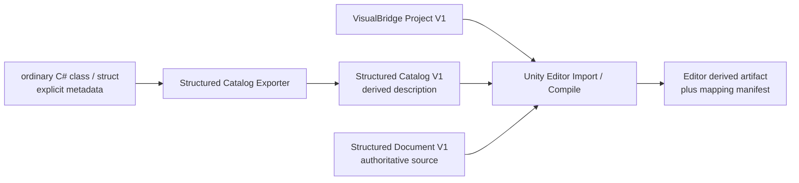
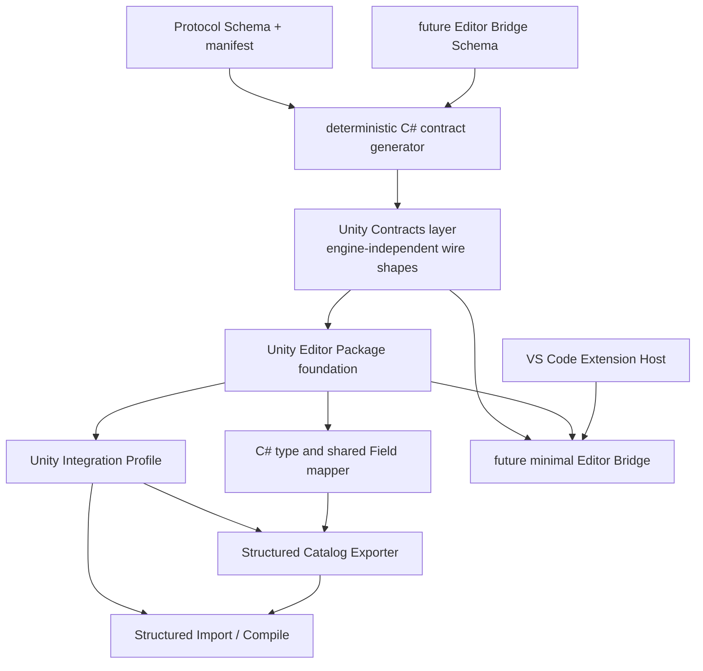
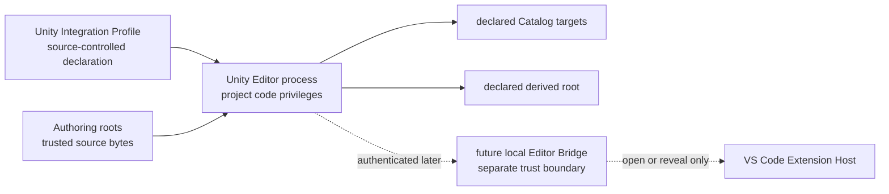

# VisualBridge Unity Editor 接入架构

## 1. 文档定位

本文定义 VisualBridge 在 Unity 接入前 Authoring 基线之后的 Unity Editor 集成架构。首个垂直切片只证明普通 C# `class` / `struct`、冻结的 Structured Catalog V1、Structured Document V1 与 Unity Editor 派生数据之间的离线闭环；它不把 Unity Runtime、Debug、DAP 或 Player 包含进来。

本文在 [`VisualBridgeArchitecture.md`](VisualBridgeArchitecture.md)、[`ProtocolContracts.md`](ProtocolContracts.md)、[`StructuredConfigModel.md`](StructuredConfigModel.md) 和四个领域正式契约之上补充 Unity 侧职责。已有 Project、Catalog、Document、Field、稳定 ID、Hash 和诊断语义继续以 `Protocol/Schema`、`Protocol/contract-manifest.json`、现有 TypeScript Core 及领域正式文档为准。本文不能通过概念描述覆盖或放宽这些已冻结契约。

当前仓库已经完成 C# contract generator、有效 UPM Package、Integration Profile V1、Structured Catalog Exporter 与 offline Import/Compiler；固定 Unity 样例可在没有 VS Code/Bridge 的条件下执行 Generate/Check。UPM Package ID 固定为 `com.kyle.visualbridge`，C# namespace/assembly 使用 `VisualBridge.<Module>`；私有 VSIX 保持 `UNLICENSED` 并携带不授予公共使用权的 proprietary notice。最小 Editor Bridge V1 已实现并于 2026-08-31 完成：正式消息 Schema 进入 Protocol、Unity 侧客户端与 VS Code 扩展宿主服务器落地、全部自动化门槛通过、真实 Unity Editor 与隔离 VS Code Extension Host 完成 open/reveal E2E（见第 12 章）。Runtime、Debug、DAP 与 Player 仍未实现。实施状态与剩余发布门槛见 [`UnityIntegrationRoadmap.md`](UnityIntegrationRoadmap.md)。

## 2. 首期范围

首期包含：

- 从现有 JSON Schema 与 contract manifest 确定性生成 Unity 可消费的 C# contract。
- 建立 `Packages/com.kyle.visualbridge` 的 Editor-only UPM Package 基础。
- 使用固定的 Unity Integration Profile V1，把一个 Unity Project 关联到该 Unity Project 内的一个 Authoring Project。
- 从显式登记的普通 C# `class` / `struct` 和元数据生成 Structured Catalog V1。
- 在 Unity Editor 中读取 Project、Structured Catalog 和 Structured Document，生成确定性的 Editor 派生产物与映射清单。
- 离线垂直切片之后的下一阶段单独设计并实现最小 Editor Bridge，使 Unity Editor 可以请求 VS Code 打开或定位 Authoring Document；该阶段已实现并于 2026-08-31 完成（见第 12 章）。

首期明确不包含：

- Unity Player 程序集、设备发现、Player 配对或远程传输。
- Runtime loader、Runtime Instance ID、运行时执行或热更新。
- Debug Session、DAP、断点、调用栈、变量、Trace 或多客户端控制模型。
- Graph、Entity 或 Table 的 Unity Export/Import/Compile 实现。
- `ScriptableObject` Authoring 包装资产、子资源或 Unity Inspector 第二编辑源。
- 通过 Editor Bridge 触发 Authoring 写入、Catalog 导出或编译。
- 为上述延期能力预留未验证的消息、空程序集或半成品运行路径。

## 3. 权威数据与冻结交接面

Authoring 源文件继续是唯一权威数据。Catalog 描述可以创建和校验什么，Document 保存项目实际创建的实例；Unity 导入结果、编译结果、索引、缓存和映射都是可删除、可重建的派生数据。

当前跨语言交接面固定为：

- `Protocol/Schema` 和 `Protocol/contract-manifest.json`；
- VisualBridge Project、Catalog 和 Authoring Document；
- 稳定 ID、alias、规范路径、Hash、版本和结构化诊断；
- Catalog 顶层 `source` 状态以及类型级来源追踪。

以下内容不是现有 Authoring 契约的一部分：

- Unity 内部对象引用、Asset GUID、Local File ID、实例地址或数组索引；
- Unity Importer、Compiler 或 Bridge 的内部服务接口；
- Editor/Player discovery、transport、authentication 或 session message；
- Debug mapping 和 Runtime identity。

新增跨语言字段必须先进入正式 Schema/manifest、生成物和正反例，不允许在 C# 与 TypeScript 两侧分别手写同名 DTO。

## 4. 分层依赖

依赖规则：

- Catalog Exporter 依赖 C# contract、Unity Package、Integration Profile 和共享 Field mapper，不依赖 Editor Bridge。
- Structured Import/Compile 依赖 Project、Catalog、Document 以及可验证的物理来源，不以连接中的 VS Code 为前置条件。
- Editor Bridge 依赖独立冻结的 Bridge Schema、同一 C# generator、Unity Editor Package 和 VS Code Host；它不依赖 Compiler，也不是首个离线切片的完成条件。
- Runtime、Debug 和 Player 不能反向成为 Contracts、Exporter 或 Compiler 的依赖。
- 首期不建立公开 Unity Adapter Registry。只有第二个真实领域切片证明共同边界后，才决定是否抽取 Catalog Generator、Importer 或 Compiler 注册 API。

## 5. Unity Package 边界

Unity Package 源只有 `Packages/com.kyle.visualbridge/` 一份，`UnityProject/` 只作为开发宿主。当前 Package 分为：

UPM package ID 固定为 `com.kyle.visualbridge`。`kyle` 只属于 Package publisher 标识，不进入 C# namespace 或 assembly 名；C# surface 统一以 `VisualBridge` 为前缀并跟随模块名，例如 `VisualBridge.Runtime`、`VisualBridge.Editor` 和 `VisualBridge.Protocol.Generated`。

- **Runtime metadata marker**：`VisualBridge.Runtime` 是 player-visible、`noEngineReferences: true` 的纯 Attribute/enum metadata surface，供游戏程序集声明 Catalog、Config 与 Field；它没有行为、Unity API、loader、执行或 Player integration，程序集名称不表示 Runtime 功能。
- **Generated contracts**：C# wire/data bags 位于 Editor assembly，只承载同源协议数据形状与 Schema hash，不引用 VS Code、Node 或 Webview，也不充当严格语义 validator。
- **Editor Integration**：Integration Profile、C# 元数据读取、Catalog Export、Structured Import/Compile、诊断以及后续最小 Editor Bridge；只在 Unity Editor 中加载。
- **Editor Tests**：针对 contract、Profile、Exporter、Compiler 和后续 Bridge 状态机的 EditMode 验证。

当前不创建 Runtime 功能。即使 metadata marker 对 Player assembly 可见，或生成 Contracts 能被普通 C# 编译，也不表示已经提供 Player、Runtime loader 或游戏运行时 API。

Package 不加载 VS Code 扩展源码或 TypeScript Core。Authoring Host 也不加载 Unity 程序集。两侧对同一输入得出一致结论，依靠冻结 Schema、生成 contract、共享固定样例和跨实现 parity 测试，而不是进程内共享实现。

## 6. C# contract generation

### 6.1 单一事实来源

C# generator 只读取现有 JSON Schema 与 contract manifest。当前四个生成产物 `Protocol/Generated/schema-index.json`、`contracts.d.ts`、`contracts.g.cs` 和 `Packages/com.kyle.visualbridge/Editor/Generated/VisualBridgeProtocolContracts.g.cs` 都来自同一输入；任何生成物都不得手改。两份 C# 输出 byte-identical。

当前 C# 输出范围由 manifest 的 `csharpGeneration.schemas` 与 `outputs` 机器登记，覆盖 Project、Catalog Source、Structured Catalog、Structured Document、Integration Profile、共享 Field/value shape 和其引用闭包；generator 源码不能临时挑选。加入 Editor Bridge 时再把正式 Bridge Schema 纳入相同登记。未进入 Unity 输出闭包的既有 MCP/Provider contract 仍继续参与全局 Schema drift gate。

### 6.2 确定性

生成器必须固定：

- UTF-8、LF、末尾换行和生成文件布局；
- namespace、类型、union branch 和成员的稳定命名；
- UTF-16 code-unit ordinal 顺序，不使用当前区域设置；
- 输入 Schema `$id`、原始 bytes Hash、manifest 版本和 generator 版本登记；
- clean checkout 中的 generate/check 行为。

连续两次生成必须产生完全相同的文件清单和 bytes。Schema、manifest 或生成物任一方发生漂移时，检查必须失败。

### 6.3 严格语义

生成 C# 类型不等于完成协议消费。生成类型是 wire/data bags；JSON Schema 的 `oneOf`、递归 Field、条件关系和 unknown-field 约束不会因为反序列化为 DTO 就自动成立。当前 Unity consumer 先读取 `JObject`，由 Profile loader、Authoring Project parser、Structured Catalog validator 和 Compiler 严格验证：

- `additionalProperties: false` 和 union/discriminator；
- Stable ID、normalized path、SHA-256、版本和长度上限；
- 只允许有限 number 的 JSON value；
- object、array、select、Reference 和共享 Field 递归约束；
- alias 冲突和 Catalog Registry 无歧义；
- unknown field、unknown version 和未解析 `$ref` 的拒绝行为。

序列化库必须通过固定 Unity 版本中的正反例验证后才能冻结。Unity `JsonUtility` 不能被默认当作可满足 Dictionary、union、opaque JSON 和严格 unknown-field 行为的实现。

## 7. Unity Integration Profile

### 7.1 所有权

现有 `VisualBridge.project.vbjson` 不包含 Unity Profile、生成范围或工具版本。当前不向 Project V1 写入未登记键，而是在 Unity Project 固定位置 `ProjectSettings/VisualBridgeIntegration.json` 保存受版本控制、Schema 化的 Integration Profile V1。Profile 是声明式配置，不是 Authoring 文档，也不保存连接和会话状态。

Profile V1 只允许四个字段：

- `formatVersion: 1`；
- `authoringProject`：一个 Unity Project 相对的 `VisualBridge.project.vbjson` 路径；
- `catalogExports`：非空 export unit 列表，每项显式登记 `catalogId`、`title`、`.vbstructuredcatalog` 输出和非空、唯一的 assembly-qualified CLR type 名列表；
- `compileOutputRoot`：V1 Compiler 当前冻结为 `Library/VisualBridge/Compiled`。

Profile Schema 已进入 `visualbridge-unity-integration-profile.schema.json` 和 C# 生成闭包。V1 不支持 Unity Project 外部 Authoring root；所有路径都从 Unity Project root 解析，拒绝绝对路径、冒号、反斜杠、空 segment、`.`/`..`、root alias、symlink/reparse-point 与既有硬链接 alias，并在创建目录和原子替换前复核 canonical identity。未来外部 root 或多个 Authoring Project 必须升级正式 contract，不能通过环境变量或私有键绕过。

### 7.2 路由

Profile V1 的一个 Unity Project 只关联一个 Unity Project 内的 Authoring Project。Export/Compile 每次都从固定 Profile 显式解析该 Project File，不使用进程级 `currentProject`；多 Project 关联不属于 V1。

Structured Document 自身不保存 `configTypeId`。Unity Compiler 必须：

1. 从 Project File 建立 Project 边界；
2. 按 `documentRoots`、`include` 和 `exclude` 唯一解析 Document Type；
3. 确认 `editor: "structured"`；
4. 使用 Document Type 的稳定 `id` 在其 Catalog Registry 中解析规范 Config Type 或 alias；
5. 再校验并编译 Document。

文件后缀、C# 类型名或 Catalog 加载顺序都不能替代上述路由。

## 8. 普通 C# 类型与共享 Field 映射

首期 Exporter 只扫描项目显式登记的普通 C# `class` / `struct` 和显式元数据。类型不需要继承 VisualBridge 基类，也不允许通过 `ScriptableObject` 包装层才能导出。

稳定身份规则：

- Catalog ID、Config Type ID、Field ID 和 alias 必须由显式 metadata 提供；
- C# namespace、完整类型名、成员名和程序集名只用于来源追踪与诊断，不能自动承担持久身份；
- 类型或成员重命名时，只要显式 ID 不变，Authoring identity 就不变；
- alias 只能显式声明，不能由旧名称猜测生成。

默认值规则：

- 默认值来自确定性的声明式 metadata 或明确支持的常量；
- Exporter 不调用构造函数、业务初始化方法、Unity 生命周期方法或临时对象来获取默认值；
- 不可表示或不确定的默认值使当前类型导出失败，不能静默替换为语言默认值。

共享 Field mapper 首期覆盖已有 Structured V1 能力所需的 string、有限 number、boolean、颜色、select、Reference、递归普通 object 和 List。`System.Int32` 与 `System.Single` 必须分别保留为 `int` 与 `float` 语义，不能合并成 `number` Data Type。Dictionary、开放泛型、递归类型环、多态、delegate 和未登记 Unity Object 引用在没有正式映射前 fail closed。

共享 Field wire shape 继续由现有四类 Catalog Schema 和 Core Form model 定义。Unity 可以实现独立 C# mapper 和 validator，但不能创建一套 Unity 专属字段协议。

## 9. Structured Catalog Exporter

Exporter 输出当前冻结的 Structured Catalog V1，不输出未来版本或私有扩展字段。

一次 Export 分为：

1. 解析并校验 Integration Profile 与目标 Authoring Project；
2. 收集显式登记的 C# 类型和 metadata；
3. 构建与排序 canonical source snapshot；
4. 计算准确的 `sourceHash`；
5. 建立 Structured Catalog 候选；
6. 在内存中完成 Schema、共享 Field、默认值和 Registry 校验；
7. 生成确定性 UTF-8 JSON；
8. 写前复核目标 Hash，并通过同目录临时文件与原子替换提交。

`sourceHash` 必须基于实际影响 Catalog 的规范来源快照，且至少覆盖参与导出的类型、成员、显式 ID/alias、字段 shape、默认值和 exporter compatibility version。反射枚举顺序、文件时间、绝对机器路径和 Unity 当前 UI 状态不得进入 Hash。准确输入域和 canonical bytes 必须由固定测试锁定。

Generate 模式负责生成带 `source.status: "current"` 的 Catalog。Check 模式只比较来源快照、Catalog bytes 和登记版本，发现 drift 时失败而不覆盖文件。VS Code 与 MCP 继续只读取 Catalog 与来源状态，不扫描 C#。

## 10. Structured Import / Compile

### 10.1 离线服务

首个垂直切片是离线、Editor-only 服务。它必须在 VS Code 未运行、Editor Bridge 未连接时独立完成。菜单、batchmode 和后续其他宿主入口只能包装同一个 Compile Service，不能分别实现 Project 路由或字段转换。

Compile 输入包括：

- Integration Profile 与明确的 Authoring Project selector；
- Project File 和目标 Document Type；
- 目标 Structured Catalog Registry；
- Structured Document 原始 bytes；
- Package、contract、compiler compatibility version。

Compile 在产生输出前必须拒绝：

- Project/File 路由缺失或歧义；
- Catalog parse/Registry error 或明确 stale 状态；
- 未解析 Config Type、unknown version 或 unknown field；
- 共享 Field、范围、对象、List 或 Reference error；
- 输入在计划与提交之间发生变化；
- 输出路径越界或既有未知文件冲突。

### 10.2 派生产物

当前派生产物固定写入 `Library/VisualBridge/Compiled`，这是 Unity Project 内可删除的 Editor cache，不是 Authoring root 或手写 `Assets`。输出包括每个文档的确定性 compiled artifact、source mapping 和顶层 `manifest.json`；它们不是公开 Protocol Schema，也不承诺可由 Player 加载。若未来需要写入 `Assets`、参与 Build 或成为运行时二进制，必须另行设计 Runtime ownership、Asset import、版本与迁移。

每个派生产物带独立 mapping manifest，至少记录：

- Project ID、Document Type ID、Document ID 和规范 Config Type ID；
- Authoring source `baseHash`、Catalog Hash/`sourceHash`；
- contract、Package 和 compiler compatibility version；
- 派生产物路径与内容 Hash。

Mapping 不能写回 Authoring Document，也不能使用 Unity Object 地址或数组索引作为跨进程身份。它不是 Runtime Instance mapping。

Compiler 先在内存中构建完整 artifact plan 和 diagnostics，再写临时文件并原子替换。失败不改变上次有效输出。孤儿清理只允许根据同一 compiler 维护的 manifest 删除已知派生产物，不能扫描和删除未知文件。

### 10.3 确定性与并发

相同 Project、Catalog、Document 和 compatibility version 必须产生 byte-identical artifact 与 mapping。Compiler 读取 Authoring/Catalog bytes 时记录 Hash，并在提交前复核；外部修改返回冲突，不能自动覆盖或用旧计划重试。

首期 Unity Compiler 是只读 Authoring consumer。只有 Catalog Exporter 可以写 Profile 明确声明的 Catalog 目标；Compiler、Bridge、Editor tests 和 batchmode 验证都不得修改 Project File 或 Authoring Document。

## 11. 信任与安全边界

- Unity Editor 和项目程序集以当前用户权限运行，不是沙箱。显式 metadata、Profile 和目录 allowlist 只能限制 VisualBridge 的受支持行为，不能阻止恶意项目代码自行访问文件。
- 未信任的 Authoring bytes、Catalog 和 Profile 在反序列化后仍必须经过严格验证；C# 类型加载不能触发业务初始化方法。
- Exporter 只写声明的 Catalog 目标；Compiler 只写声明的派生根；Bridge 不写 Authoring 或 Catalog。
- 临时文件、日志、test results、discovery records 和 token 不得落入 Authoring 源或被当成可提交产品数据。
- 未知目标文件和未知外部 bytes 必须保留并报告，不得为“恢复一致性”而覆盖。

## 12. Editor Bridge

Editor Bridge 不是 Structured offline slice 的前置，也不能成为 Export/Compile 的隐式依赖。2026-08-30 完成的 discovery/transport spike 与威胁模型在真实 Unity 6000.3.10f1 编辑器进程、隔离 VS Code 1.105.1 扩展宿主与本机进程间实测了候选传输，以下设计据此冻结。

### 12.1 Spike 证据

| 实验 | 结果 |
| --- | --- |
| 独立进程传输矩阵（Node ↔ C#） | named pipe connect 0–3ms、往返 6–7ms；loopback TCP connect 9–15ms、往返 9–15ms；无效 token 与非 JSON 均被拒绝；不存在的管道超时（慢失败），死端口立即拒绝（快速失败） |
| 服务器重启与崩溃 | 正常重启替换记录（新管道名/token/pid/generation）并支持重连；崩溃后记录残留，由心跳陈旧性（实测 10.7s 拒绝）兜底 |
| 真实 Unity 编辑器进程（batchmode） | pipe connect 1ms、往返 2ms；TCP 4ms/5ms；无效 token 被拒。C# `NamedPipeClientStream` 需要裸管道名（剥除 `\\.\pipe\` 前缀），JSON 转义必须严格——正式实现必须用生成契约解析记录 |
| Domain Reload（真实编辑器） | reload 时服务器观察到断开、静态连接状态清零、reload 后立即重连成功——Unity 侧连接不能跨 Domain Reload 存活 |
| 隔离 VS Code 1.105.1 扩展宿主 | 扩展宿主内 named pipe 服务器接受外部本机进程的 `open` 交换并正确响应 |
| 多窗口 discovery | 陈旧心跳与死 pid 记录被过滤，候选按 `windowId` 显式选择后正确路由 |
| Mono 进程内管道互锁（实施期发现） | Unity Mono 运行时中同进程 Mono↔Mono named pipe 的双端 `Write` 均永久阻塞（最小复现确认）；Mono 客户端对 Node 服务器的管道写入在真实编辑器内正常（见上表）。因此 Unity 客户端优先使用 TCP 端点，EditMode 协议测试使用 TCP 对端，管道路径由真实 Node 服务器的 E2E 覆盖 |

WebSocket 被拒绝：扩展宿主需新增 `ws` 依赖、HTTP upgrade 握手开销、无浏览器客户端场景；NDJSON over pipe/TCP 更简单且实测更快。

### 12.2 冻结设计

- **传输与分帧**：discovery 记录同时登记 named pipe 与 loopback TCP 端点。Unity 客户端优先连接 TCP 端点：`NetworkStream` 支持读写超时，真实编辑器内实测往返 4–5ms，且可避开 Unity Mono 运行时进程内 NamedPipe 流的互锁缺陷；named pipe 端点保留为 TCP 不可用时的回退，并供未来支持 overlapped IO 的客户端使用。消息为 NDJSON 行分帧，不复用 stdio MCP Tool envelope。
- **Discovery 记录**：文件型，位于 `os.tmpdir()` / `Path.GetTempPath()` 下的 `visualbridge-bridge/<windowId>.json`，每个 VS Code 窗口一份。字段：`formatVersion`、`protocolVersion`、`capabilities`、`windowId`、`projectRoots`（该窗口打开的 Authoring Project 根）、`pipePath`、`tcpPort`、`token`、`pid`、`generation`。心跳为服务器每秒更新 mtime；陈旧判定为心跳年龄超阈值（5s）或 pid 不再存活。
- **认证**：每窗口 ≥192-bit 随机 token，仅存于 discovery 记录（用户本地临时目录，默认用户级 ACL）；连接建立后首条消息验证 token，失败即断开。token 防偶发误连与跨用户访问，不防同用户恶意进程。
- **版本与 capability 协商**：记录声明 `protocolVersion` 与 capabilities；客户端不匹配即拒绝，不降级。
- **实例 generation**：服务器每次 listen 递增 generation 并重写记录；客户端重连时检测 generation 变化并丢弃旧会话状态。Unity 侧每次 Domain Reload/进程重启生成新的客户端实例标识；每个请求携带 `requestId` 供幂等去重。
- **重连退避**：客户端 1s 起指数递增至 30s 上限；每次尝试前重新枚举 discovery 记录。
- **多窗口路由**：Unity 按 Integration Profile 的 `authoringProject` 与记录 `projectRoots` 匹配过滤候选；唯一候选直接路由（与 Project Registry 唯一解析语义一致）；多候选必须在 Unity 侧弹出显式选择；禁止"最近连接"或全局 `currentUnity` 猜测。
- **清理与故障恢复**：服务器正常关闭时删除自身记录；崩溃残留由心跳/pid 检测兜底；连接状态不写回 Authoring Document、Project File 或 Integration Profile。
- **消息范围**：第一版只允许 Unity Editor 请求 VS Code 打开或定位 Project Registry 能唯一解析的 Authoring Document；不提供 Authoring Operation、Catalog 写入、Compile、Runtime Attach 或 Debug。消息结构进入正式 Protocol Schema，由同一 generator 产生 TypeScript/C# contract。

### 12.3 威胁模型边界

Unity Editor 与 VS Code 扩展宿主都以当前用户权限运行且非沙箱；Bridge 的安全目标是防误路由与最小暴露，不是防御同用户恶意进程。named pipe / loopback TCP 仅限本机；伪造 discovery 记录的后果上限是获知请求中的文档路径并假冒接受（VS Code 端只执行 open/reveal，无写入面）；请求/响应只含稳定 ID 与路径，不含 Authoring 文档内容。无效 token、版本/capability 不匹配、陈旧 generation、死 pid/陈旧心跳记录与 Domain Reload 后的旧请求必须有自动化拒绝覆盖；本地同用户 DoS（占用管道名/端口）不在防御目标内。

Runtime、Debug 和 Player 仍需各自独立架构、身份模型、权限与真实垂直切片。Editor Bridge 的传输即使验证成功，也不自动成为 Player 或远程调试协议。

### 12.4 实施与验证（2026-08-31）

- **Unity 侧**：`Packages/com.kyle.visualbridge/Editor/Bridge/` 提供严格校验器、discovery 枚举器、同步请求/响应客户端与服务门面；`Tools/VisualBridge/Editor Bridge/Open in VS Code…` 菜单提供显式窗口选择的最小 UI；`VisualBridge.Editor.VisualBridgeBridgeBatch.RunE2E` 供真实编辑器 E2E 使用。
- **VS Code 侧**：扩展激活并完成项目/文档索引后启动 `EditorBridgeServer`（named pipe + loopback TCP 双端点、per-window discovery 记录与心跳、token 握手）；open 经 Project Registry 唯一解析，reveal 经文档索引唯一解析后复用 `revealReference` 命令；多候选一律显式拒绝（`bridge.documentAmbiguous`），不做最近连接猜测。
- **验证**：24 例三方 parity fixture（AJV / Unity strict validator / 扩展宿主解析）一致；Unity EditMode 覆盖握手、generation、能力、非法 JSON、断开、discovery 过滤与多窗口显式选择；扩展宿主集成测试覆盖无效 token、非 JSON、非 hello 首消息、unresolved/ambiguous open 与 reveal 全链路；真实 Unity Editor 6000.3.10f1 与隔离 VS Code 1.105.1 Extension Host 完成 open/reveal E2E（`npm run test:bridge-e2e`）；Bridge 关闭时 Catalog Check 与 Structured Compile Generate/Check 独立通过。

## 13. 领域扩展边界

Structured 是首个 Unity 切片，因为它能以最小范围验证 Project 类型绑定、共享 Field、稳定身份、Catalog Export 和派生编译。后续扩展必须继续遵守领域正式文档：

- Entity 只扫描普通运行时 `class` / `struct`，导出显式 Entity Type、Component Group、Component Type 和递归 Field ID；不恢复 `ScriptableObject` Authoring 包装层。
- Graph 必须输出 Graph Catalog V4，保留 `int`/`float`、Graph Type、typed subgraph、端口身份、连接规则、List port mode 和实例约束；不得输出旧 Catalog 版本。
- Table 必须消费 Catalog 定义的 Semantic Table、cell encoding、partition 和 effective row 语义；不得按 CSV 列位置或 XLSX 内部对象自行猜测业务结构。

第二个领域切片开始前应复核 Structured 服务边界。只有至少两个真实 Exporter/Compiler 使用相同生命周期、诊断和 artifact plan 后，才建立公开 Unity Adapter API。领域扩展与本机 Runtime 接入的执行顺序、各项 exit criteria 见 [`UnityDomainAndRuntimeRoadmap.md`](UnityDomainAndRuntimeRoadmap.md)；`ScriptableObject` Authoring 包装层确认为旧设计迁移残留，新体系不采用。

### 13.1 Entity Catalog Export 落地记录（VB-UX-01，2026-08-31）

Entity 是第二个 Unity 领域切片，只覆盖 Catalog Export；Entity 文档的 Unity 侧 Import/Compile 由 VB-UX-02 承接。设计要点：

- **metadata API**：`VisualBridge.Runtime` 新增四个 attribute——assembly 级 `VisualBridgeEntityCatalog(catalogId, title)`（每程序集一个 entity catalog）与 `VisualBridgeEntityComponentGroup(catalogId, id, title, Aliases)`（AllowMultiple）；类型级 `VisualBridgeEntityType(catalogId, id, title, Aliases, Description, AllowedComponentGroupIds)` 与 `VisualBridgeEntityComponent(catalogId, id, title, groupId, Aliases, Description, MenuPath)`。字段继续使用共享的 `VisualBridgeField`，因为 entity-catalog 与 structured-catalog 的 field/valueDefinition/editor $defs 完全同构。
- **路由**：Integration Profile 的 `catalogExports[].output` 扩展名决定 Exporter——`.vbstructuredcatalog` 走 Structured Exporter，`.vbentitycatalog` 走 `VisualBridgeEntityCatalogExporter`；Structured Compiler 同样按扩展名跳过非 Structured 导出单元。Schema pattern 与 C# loader 同步放开两种扩展名。
- **稳定身份**：entityType、componentType、componentGroup 三类身份（id + aliases）各自在单 catalog 内唯一，跨 catalog 全局唯一（`profile.catalogIdentityConflict`），与 VS Code Entity Registry 的全局命名空间语义一致；C# 全名只出现在 componentType 的 `source.typeName` 追踪信息中。`allowedComponentGroupIds` 与 `groupId` 必须引用同 catalog 内声明的组（`catalog.invalidReference`）；组收集采用两遍处理，类型注册顺序不影响结果。
- **产物结构**：输出即 `visualbridge-entity-catalog.schema.json` 的 Catalog V1——`{formatVersion, catalogId, title, source, componentGroups, entityTypes, componentTypes}`，其中 `source.sourceHash` 来自 canonical snapshot（含 componentGroups、按 id 排序的 entityType/componentType 及其 AQN）的 SHA-256；序列化、原子写、Generate/Check 与 changedBeforeReplace 语义复用 Structured Exporter 的共享实现（该实现以 internal 成员方式共享，是 VB-UX-03 Adapter API 复核的直接输入）。
- **绑定校验**：每个 entity catalog 输出必须被 Authoring Project 中 `editor == "entity"` 的 DocumentType 通过 `catalogs` 声明（`profile.catalogNotDeclared`）；不要求 per-type 覆盖，因为 entity 文档按 `entityTypeId` 引用 catalog 而非按类型路由文件。
- **验证基线**：严格 JObject 校验器 `VisualBridgeEntityCatalogValidator` 镜像 Schema（复用 Structured 校验器的字段校验共享实现）；EditMode 覆盖确定性、Check 不写盘、类型顺序无关、fail-closed 错误码、扩展名路由与绑定校验；开发宿主样例（Hero/Enemy 实体、Health/Movement 组件）经 batchmode Generate/Check 产出提交 Catalog `Gameplay.vbentitycatalog`，并通过 Node 生产 `parseEntityCatalog`/`parseEntityDocument`/`buildEntityCatalogRegistry` 校验。

### 13.2 Entity Import / Compile 落地记录（VB-UX-02，2026-08-31）

Entity 编译镜像 Structured Compiler 的生命周期与事务语义，由 `VisualBridgeEntityCompiler` 承载：

- **输入与前置**：Integration Profile（输出根冻结为 `Library/VisualBridge/Compiled`，reparse point 拒绝）→ Entity Catalog Check（drift 即 `compile.catalogDrift`）→ Authoring Project 严格解析 → Profile/Project/Catalog/文档全部纳入输入快照（SHA-256），提交前 `VerifyInputs` 拒绝 `compile.inputChanged`。
- **路由**：`.vbentity` 文档按 `editor == "entity"` 的 DocumentType include/exclude 唯一路由（`compile.ambiguousRoute`/`compile.documentOutsideRoot`）；DocumentType id 必须在其声明的 entity catalog 中按 id/alias 唯一解析到 entityType（`compile.entityTypeUnknown`/`compile.entityTypeAmbiguous`），文档的 `entityTypeId` 与之不符报 `compile.entityTypeMismatch`。文档校验为纯 JSON 级、对照 Catalog 字段定义执行——不实例化业务类型；未知字段 `compile.unknownField`、类型不符 `compile.typeMismatch`、别名 canonical 化、缺失字段以 Catalog `defaultValue` 物化（mapping 记 `origin: metadataDefault`）。组件校验含局部 id 唯一、`componentTypeId` 解析与组白名单（空白名单即全不允许，与 VS Code 侧 `isEntityComponentTypeAllowed` 语义一致，`compile.componentGroupNotAllowed`）。
- **产物结构**：`documents/{projectId}/{documentTypeId}/{documentId}.vbcompiled.json`（kind `visualbridge.entity.compiled`，`data` 含 `properties` 与按文档顺序的 `components[]`，字段按 canonical ID 排序）、`mappings/.../​*.vbsource.json`（kind `visualbridge.entity.sourceMapping`，逐字段 `{sourcePath, artifactPath, origin}`）、`manifest.entity.json`（kind `visualbridge.entity.compileManifest`，托管 outputs 清单）——与 Structured 产物共用 `documents/`、`mappings/` 子树但 manifest 分文件，互不接管对方托管集。
- **原子性与恢复**：复用 Structured Compiler 的事务实现（tmp → VerifyInputs → 基线复核 `compile.outputChangedBeforeReplace` → 备份 → Replace/Move → 失败逆序回滚，残留 bak 供人工恢复）；stale 输出按旧 manifest 托管集计算，Generate 删除、Check 报 drift；Check 模式不写盘。
- **验证基线**：EditMode 14 例覆盖确定性双跑、默认值物化与零业务构造、drift 不写盘、stale 删除/保留、全部 fail-closed 错误码、失败保留上次产物、别名 canonical 化、ambiguousRoute 与 Structured+Entity 共存；开发宿主样例 `Hero.vbentity` 经 batchmode Generate/Check 产出产物并通过二次运行字节一致校验。

### 13.3 Unity Adapter API 复核决策（VB-UX-03，2026-08-31）

本节是第 13 节复核条件的正式决策记录。触发条件已满足：仓库拥有 Structured 与 Entity 两套真实 Exporter/Compiler，且它们经历了完整实现与验证周期。

**两切片对比证据**：

| 维度 | Structured | Entity | 结论 |
| --- | --- | --- | --- |
| 生命周期 | Load Profile → 扩展名过滤 → BuildPlan → 绑定校验 → 输出比对 → 原子写；Compiler 另有输入快照/事务/stale 清算 | 完全同构（镜像实现） | 生命周期高度一致，可共享 |
| 诊断 | `VisualBridgeIntegrationException` + `catalog.*`/`profile.*`/`compile.*` 错误码 | 同一异常与工具函数，新增 `compile.entityType*`/`compile.component*` 系列 | 已共享 |
| artifact plan | `manifest.json` + `documents/` + `mappings/` | `manifest.entity.json` + 相同子树 | 布局同构，manifest 按域分文件 |
| 注册方式 | Profile `catalogExports` 扩展名路由 + per-domain metadata attribute + per-domain batch/菜单 | 同 | 已是统一模式 |
| 字段/序列化/事务 | 实现所有者 | 经 internal 成员复用（Exporter 约 15 个成员、Compiler 24 个成员），无逻辑复制 | 复用已发生且成本可控 |
| 领域差异点 | 文档校验经反射物化 C# 实例 | 文档校验为纯 JSON 级对照 Catalog（无反射物化） | 有意分化，抽象收益低 |

**备选方案**：

- A. 现在建立公开 Unity Adapter API（Catalog Generator / Importer / Compiler / Debug Mapping 注册点）。
- B. 维持 per-domain batch 服务模式 + internal 共享层，公开 API 延后。
- C. 把 internal 共享层重构为显式 internal 模块（不公开，但结构化共享边界）。

**决策：B**（现有 internal 成员共享即 C 的轻量形态，暂不单独重构）。

拒绝 A 的理由：

1. 仅 2/4 领域落地。Graph（Catalog V4、端口/子图/连接规则，导出形态与字段模型差异最大）与 Table（纯消费方、无 Exporter、CSV/XLSX 载体与 table layout）恰是最能检验抽象是否成立的两类反例；此时冻结注册点 API 有较高概率在 VB-UX-05/06 被迫破坏性修订。
2. 公开 API 是永久 Package 契约：一旦公开，任何调整都需要版本协商；而编译产物格式本身还要经 VB-UX-07 Runtime 产物形态 spike 重估——先冻结产物消费方的注册契约，等于用最不确定的输入做最持久的承诺。
3. 当前不存在第三方消费者（私有 `UNLICENSED` 包），公开 API 没有现实需求方，只有假想需求方。
4. 复用价值已经通过 internal 共享兑现：字段构建、序列化、Hash、原子事务、路径校验零复制；per-domain 剩余重复仅 batch 包装（约 70 行/域）与领域绑定的注册表构建，属低频稳定代码。

重开条件（满足其一即重开决策，届时按本节格式追加新记录）：

- Graph 切片（VB-UX-05/06）完成后按其 exit criteria 做第三次轻量复核，若两域差异击穿 internal 共享层则升级为 C 或 A；
- 出现真实第三方集成需求（非假想消费者）；
- VB-UX-07 Runtime 产物形态冻结后，若产物消费方需要统一注册面。

**边界声明**：Table（VB-UX-04）与 Graph（VB-UX-05/06）继续按 per-domain batch 服务模式实施——各自实现 Exporter/Compiler/Batch/菜单，经 internal 成员复用共享字段构建、序列化、Hash 与事务实现，不新增公开注册点，也不把 internal 共享层当作公开契约对待。

第三次轻量复核（VB-UX-06 验收项，2026-08-31）：Graph Compiler（第三个、也是契约面最大的切片）实现时**零新增 private→internal 改动**——Entity/Table 建立的共享层（字段构建、序列化、Hash、事务、路径校验，约 20 个 internal 成员）原样承载了 Graph 的全部生命周期需求。VB-UX-03 的方案 B 决策成立，无需修订；internal 共享层在四个领域全部落地后结构稳定，若未来重开决策（见重开条件）可整体提取而不破坏既有切片。

### 13.4 Table Import / Compile 设计记录（VB-UX-04，2026-08-31）

Table 是第一个纯消费方切片：Unity 侧不建立 Table Exporter（权威数据在 VS Code 侧的 Table 文档与 Catalog），只实现编译。产物形态设计（任务前置结论）：

- **载体边界**：V1 只编译 CSV family。XLSX 是 OOXML zip+xml，Unity 侧无内置等价物且 Package 不引入第三方解压/解析依赖；遇到 `.xlsx` 路由到 table documentType 时以 `table.xlsxUnsupported` 明确拒绝。CSV 解析复刻 VS Code 侧 `csv-parse` 语义（UTF-8 严格、BOM 剥离、quote 转义、relax_column_count、空行保留）。
- **消费语义**：完整复刻权威链路——nameKeyRow/dataStartRow（tableLayout 缺失报 `compile.tableLayoutMissing`）、nameKey（含 aliases、trim 精确匹配）列映射、cell encoding（scalar/json/delimited 递归、空串→defaultValue）、key column 校验（空值 `table.emptyKey`、单 sheet 内重复 `table.duplicateKey`）、rowId 生成（有 key 时 `${definitionId}:${physicalName}:key-${stableValueKey}`）、跨分区去重（`error` 失败、keepFirst 跳过、keepLast 原位替换）。
- **编译单元与聚合**：Table 没有虚构的 Document ID；产物按 documentType 聚合。documentType.id 必须在其声明 catalog 中按 id/alias 唯一解析到 tableType（`compile.tableTypeUnknown`/`compile.tableTypeAmbiguous`，与 Entity 的 entityType 路由同构）。该 documentType 路由到的全部匹配文件（按路径 UTF-16 序排序）各自成为一个物理 sheet（`${definitionId}:${fileBaseName}`），按 sheet definition 拼接后做全局有效行去重。与 VS Code 侧"同目录 family"作用域的差异：编译器把整个 documentType 视为一个编译单元、去重跨全部文件——单 family 场景（样例与绝大多数用法）两者等价，多目录分布同一分区键时以声明 duplicatePolicy 全局裁决。
- **产物结构**：`documents/{projectId}/{documentTypeId}/{tableTypeId}.vbcompiled.json`（kind `visualbridge.table.compiled`，`data` 为 `{sheets:[{definitionId, rows:[{rowId, cells}]}]}`，行按有效顺序、cells 按 canonical 列 ID 排序、值为解码后 JSON 值）、`mappings/{projectId}/{documentTypeId}/{tableTypeId}.vbsource.json`（kind `visualbridge.table.sourceMapping`，逐 cell 记 `{sourcePath, artifactPath, origin}`——空/缺 cell 物化默认值记 `metadataDefault`）、`manifest.table.json`（kind `visualbridge.table.compileManifest`）。事务、输入快照、stale 清算复用共享实现。
- **Catalog 信任**：table catalog 不在 profile 导出闭包中（无 Exporter），以提交文件为准；`visualbridge-table-catalog.schema.json` 进入 Protocol C# 生成闭包，Unity 侧新增严格校验器 `VisualBridgeTableCatalogValidator` 镜像 Schema（含 cellEncoding oneOf、partition namePattern、rowDisplayNamePattern 占位符约束）。

落地与验证记录（同日）：`VisualBridgeTableCompiler`/`VisualBridgeTableCompilerBatch`（菜单 Generate/Check Table Compiled Data）按上述设计实现；`VisualBridgeAuthoringProject` 暴露 `TableLayout`。EditMode 新增 14 例（确定性双跑、默认值物化与 mapping origin、drift 不写盘、stale 生命周期、keepFirst/keepLast、delimited 解码、tableTypeUnknown、missingColumn、duplicateKey、duplicatePartitionKey、xlsxUnsupported、tableLayoutMissing、invalidCell、失败保留产物）随全套 98/98 通过。开发宿主样例（`Gameplay.vbtablecatalog` + `Tables/Skills_Main.csv`）经 batchmode Generate/Check 产出 `sample.unity.skills` 产物（rowId `skills:Skills_Main:key-101` 与 VS Code 约定一致），table catalog 经 Node 生产 `parseTableCatalog`/`buildTableCatalogRegistry`/`matchTableSheetDefinitions` 校验。已知实现边界：keepLast 为原位替换（TS 侧为删除后 append，仅中间插入其他行时顺序不同）；rowDisplayNamePattern 仅校验占位符形状（不校验列引用，编译器不消费该 pattern）；解码后 cell 不执行 editor 数值约束（与权威 cellCodec 一致）。Project File 变更（如新增 table documentType）会改变 `projectSha256` 输入，全部编译器按输入 Hash 语义报 drift，需统一重新 Generate——这是设计内行为。

### 13.5 Graph Catalog V4 Export 设计记录（VB-UX-05，2026-08-31）

Graph 是契约面最大的领域切片，输出 Graph Catalog V4（`formatVersion 4`，不接受旧版本）。设计：

- **metadata API**（`VisualBridge.Runtime` 新增）：assembly 级 `VisualBridgeGraphCatalogAttribute(catalogId, title)`（每程序集一个 graph catalog）与 `VisualBridgeGraphDataTypeAttribute(id, title)`（AllowMultiple，可选 Color/AcceptsAnySource/Accepts——root `dataTypes` 需显式声明，因 title 必填无法自动推导）；类型级 `VisualBridgeGraphTypeAttribute(catalogId, id, title)`（命名参数 Aliases/Description/Usage(root|subgraph|any)/SupportedCatalogIds/PortConnectionInput/PortConnectionOutput/AllowedNodeTypeIds/AllowedNodeTags/AllowedNodeTraits/AllowSubgraphs/AllowedSubgraphTypeIds）；`VisualBridgeNodeTypeAttribute(catalogId, id, title, category)`（Aliases/Description/Icon/MenuPath/Tags/Traits）；graphType 类上的 AllowMultiple `VisualBridgeGraphNodeConstraintAttribute(id, nodeTypeId, MinInstances, MaxInstances)` 与 `VisualBridgeGraphInitialNodeAttribute(nodeTypeId, title)`；字段级 `VisualBridgePortAttribute(id, title, kind, direction)`（Aliases/Description/DataTypeId/MaxConnections——data 端口 DataTypeId 缺省时由 CLR 类型映射 int/float/string/bool 推导，flow 端口禁止）与 `VisualBridgeDynamicPortGroupAttribute(id, title, direction, listPortMode)`（MaxItems/DataTypeId——item 由 `List<T>` 元素类型经共享字段模型推导）。
- **selector 映射**：graphType 的 AllowedNodeTypeIds/AllowedNodeTags/AllowedNodeTraits 生成单个 nodeSelector（nodeTypeIds OR、tags OR、traits AND、三维 AND——与 VS Code `matchesNodeSelector` 语义一致）；nodeConstraint 的 selector V1 仅支持 nodeTypeId 形态。
- **typed subgraph**：nodeType 带 `SubgraphGraphTypeIds`（`VisualBridgeNodeTypeAttribute` 命名参数）时导出 `subgraph.graphTypeIds`；静态/动态 flow 端口禁止（Schema 约束，校验器执行）。
- **端口与字段分离**：`[VisualBridgePort]` 字段是端口声明，不进入 properties（与 Schema 的 ports/properties 分离一致）；同一字段同时声明 Port 与 Field 报 `catalog.duplicateMetadata`。
- **身份**：graphType/nodeType/dataType/port/dynamicPortGroup 的 id+aliases 各自全局无歧义；C# 全名只进 `source.typeName`。supportedCatalogIds 必须包含自身 catalog 且引用已声明 catalog（跨 catalog 引用由 VS Code Registry 校验，导出侧校验自引用与已知 catalog 集合）。
- **复用与校验**：Exporter 复用 Structured Exporter 的 internal 共享层（BuildFields/序列化/原子写/两遍处理）；严格校验器 `VisualBridgeGraphCatalogValidator` 镜像 Schema（复用共享字段校验）；三方 parity fixture（AJV / Unity validator / 扩展宿主）覆盖端口身份、连接规则、typed subgraph 与实例约束的正反例。
- **绑定校验**：graph catalog 输出（`.vbgraphcatalog` 扩展名路由）必须被 `editor == "graph"` 的 DocumentType 声明；Profile Schema pattern 放开三种 catalog 扩展名。

### 13.6 Graph Import / Compile 设计记录（VB-UX-06，2026-08-31）

Graph 编译镜像既有 Compiler 生命周期，由 `VisualBridgeGraphCompiler` 承载；产物形态设计（任务前置结论）：

- **路由**：`.vbflow` 等 graph 文档按 `editor == "graph"` 的 DocumentType include/exclude 唯一路由。**与 Entity/Table 不同，不要求 documentType.id 解析到 graphType**——VS Code 侧创建文档时 root graphType 由作者从 catalog 选择，documentType.id 仅作显示；编译器改为校验每个文档 root graph 的 `graphTypeId` 在声明 catalog 中解析为非 subgraph graphType（`compile.graphTypeUnknown`，usage 校验 `compile.invalidGraphTypeUsage`）。
- **fail-closed 边界**：VS Code 文档诊断中 warning 级的「未知类型」在编译器为错误（无法物化与校验）——`compile.nodeTypeUnknown`/`compile.graphTypeUnknown`；error 级语义全部复刻：身份唯一（graphId/nodeId/edgeId/interfacePortId/dynamicPortId 全文档唯一、duplicateSemanticConnection/Property）、边校验（方向、kind、dataType 可赋值性、有效连接上限=min(graphType 规则, 端口 maxConnections)）、节点允许性（selector 匹配、subgraph 白名单与调用类型匹配、接口端口冲突）、实例约束、动态端口（组解析、上限、身份冲突）、接口端口（data/flow 规则、根图禁 dynamic）、属性值校验。
- **canonical 化与默认值**：nodeType/graphType/port 引用经别名解析为 canonical id 进产物；节点与图的缺失属性以 Catalog defaultValue 物化（mapping 记 `origin: metadataDefault`），未知属性报 `compile.unknownField`（对齐 Entity）。
- **产物结构**：`documents/{projectId}/{documentTypeId}/{documentId}.vbcompiled.json`（kind `visualbridge.graph.compiled`；`data` 为 `{graphs:[{id, graphTypeId, title, properties, interfacePorts, nodes, edges}]}`——保留 position（文档 required 字段、无权威分类将其排除在业务数据外）、节点/边按 id 排序、properties 键按 canonical ID 排序）；`mappings/.../{documentId}.vbsource.json`（逐属性 `{sourcePath, artifactPath, origin}`）；`manifest.graph.json`（kind `visualbridge.graph.compileManifest`）。Catalog drift 检查走 `VisualBridgeGraphCatalogExporter` Check（graph catalog 由 Unity 导出，对齐 Entity Compiler）。
- **Registry**：复用 `VisualBridgeGraphCatalogValidator` 校验单 catalog，另做跨 catalog 的 nodeType/graphType/dataType 身份合并与冲突检测（对应 VS Code `buildGraphCatalogRegistry` 语义）。

落地与验证记录（同日）：`VisualBridgeGraphCompiler`/`VisualBridgeGraphCompilerBatch`（菜单 Generate/Check Graph Compiled Data）按上述设计实现，VS Code `graph.*` 诊断到编译器 `compile.*` 错误码的映射表留档于实现（warning 级类型别名一律静默 canonical 化、未知类型 fail-closed）。EditMode 新增 19 例（确定性双跑、默认值物化与 alias canonical 化、Check 不写盘、stale 生命周期、subgraph 正路径、11 个错误码负路径、失败保留产物、Batch 契约）随全套 133/133 通过；batchmode 垂直切片：Graph Compile Generate/Check 与 Structured/Entity/Table 编译、Graph Catalog 全部退出码 0；样例 `Encounter.vbflow` 编译产物与 mapping 经二次运行字节一致校验，四套 manifest（structured/entity/table/graph）共存互不干扰。产物 subgraph 节点保留 `subgraphId`（与 position 同理：文档 required 字段，无权威分类排除）。

### 13.7 Runtime 产物形态冻结决策（VB-UX-07，2026-08-31）

本节是 Runtime 产物形态 spike 的正式决策记录（阶段 B 首个任务，输入为四领域产物设计留档 §13.1/13.2/13.4/13.6）。

**实测负载**（Unity 包同款 Newtonsoft.Json 3.2.2，.NET harness）：

| 负载 | 大小 | 解析耗时 |
| --- | --- | --- |
| Structured 单文档产物 | 1,154 B | 0.084 ms |
| Entity 单文档产物 | 1,378 B | 0.035 ms |
| Table 单文档产物（2 行） | 1,128 B | 0.028 ms |
| Graph 单文档产物 | 2,210 B | 0.049 ms |
| 合成 10k 行 Table 产物 | 835,831 B | 32-36 ms（冷/热一致） |

规模化外推约 3.5 μs/行：10 万行 ≈ 350 ms 一次性加载成本，属加载屏可接受量级；内存由 JObject 分配主导，未来可用 typed reader 优化而不改格式。

**备选方案**：A（Editor 侧物化为 Unity 原生资产，Player 走常规加载）vs B（`VisualBridge.Runtime` 升级为 Player 运行时库直读编译产物）。

**决策：B，分两步走。**

- V1（阶段 B 内）：`VisualBridge.Runtime` 从纯 metadata marker 升级为 Player 可见的加载库，直接读取 `Library/VisualBridge/Compiled` 下带 `formatVersion`/`kind` 判别的编译产物；Newtonsoft 3.2.2 既是包既有依赖又提供 AOT 程序集，Player 兼容。
- 产物格式**保持内部但版本化**，不立即声明公开跨语言 Schema：公开化与版本兼容原则推迟到 VB-UX-09（Runtime Bridge 协议冻结）——远程与调试负载的需求彼时才齐。内部格式演进边界：结构性变更必须递增 `formatVersion` 或新增 `kind` 值；`inputs`/`mappings` 可增字段，既有字段语义永不改变。

拒绝 A 的理由：物化会在编译产物之外制造第二份派生数据（新的 drift 面与同步问题）；每域需要第二套 Unity 资产 schema；`ScriptableObject` 载体已被排除（§13），物化只能走代码生成或反射序列化，成本高于收益；调试映射（VB-UX-10 的稳定身份回溯）在物化资产中会丢失或需要重复携带。B 不排斥未来的物化导出——若出现 Addressables 等具体需求，物化器可作为消费同一产物的下游步骤叠加。

**边界与遗留项**：独立 Player 构建不含工程的 `Library` 目录，产物进入构建（如 StreamingAssets 拷贝或构建后处理）属 VB-UX-09 及后续 Runtime 任务的工程接线，不影响本格式决策；本任务不写正式实现。

## 14. 命令与验证层级

当前仓库没有独立发布的 VisualBridge CLI。命令行入口是 Protocol npm script 与 Unity batchmode `-executeMethod`，菜单和 batch wrapper 调用相同的 Exporter/Compiler 服务，不建立第二套业务规则：

- `npm run generate:protocol` / `npm run check:protocol`：生成或检查四个 Protocol 产物；
- `VisualBridge.Editor.VisualBridgeStructuredCatalogBatch.Generate` / `.Check`：Catalog Generate/Check；Catalog batch 以 `0` 表示成功、`2` 表示 drift、`1` 表示失败；
- `VisualBridge.Editor.VisualBridgeStructuredCompilerBatch.Generate` / `.Check`：Compiled artifact Generate/Check；Compiler batch 以 `0` 表示成功、`1` 表示 drift、`2` 表示失败；
- Unity Test Framework `-runTests -testPlatform EditMode`：运行 Package Editor tests。

所有 Unity 调用都必须显式提供 `-projectPath`、独立 `-logFile`，测试还需 `-testResults`；仅检查进程退出码不够，还要审计日志与 XML。根 README 给出固定 Unity `6000.3.10f1` 的可直接运行 PowerShell 命令。

验证分为五层：

1. **Protocol/Node gate**：生成漂移、Schema/manifest、现有 Parser/Registry、共享 Field parity 和文档检查。
2. **dotnet 快速编译**：对 Unity 生成的 C# project 执行 `dotnet build`，用于快速发现类型和程序集错误；它不等价于 Unity 导入成功。
3. **Unity batchmode refresh/import**：使用固定 Unity Editor 版本真实打开 `UnityProject`、解析本地 Package、刷新 AssetDatabase 并完成脚本编译。
4. **Unity EditMode 与 batch command**：运行 EditMode tests，并以 batch entry point 实际执行 Catalog Export 和 Structured Compile，检查 test results、日志、退出码和输出 Hash。
5. **Bridge E2E**：后续在真实 Unity Editor 与隔离 VS Code Extension Host 之间验证 open/reveal；仅有协议单元测试或 batchmode 不能替代此证明。

当前开发宿主固定记录为 Unity `6000.3.10f1`。改变验证版本或声明更低最低版本前，必须重新执行 Package import、编译、EditMode 和垂直切片验证。完整版本兼容矩阵与使用者操作手册见 [`UnityIntegrationManual.md`](UnityIntegrationManual.md)。

完整 Unity 任务顺序、每项 exit criteria 和发布门槛见 [`UnityIntegrationRoadmap.md`](UnityIntegrationRoadmap.md)。

## 15. 已冻结决策

- 首个 Unity 垂直切片是 Structured、offline、Editor-only。
- Editor Bridge 不是首切片前置，在离线 Export/Compile 完成后单独进入。
- Runtime、Debug、DAP 和 Player 不在本路线图范围内。
- Authoring Document 权威；Catalog 和 Unity artifact 是派生数据。
- Structured Compile 必须读取 Project File 并按 Document Type 解析 Config Type。
- C# contract 只从现有 Schema/manifest 生成，不建立手写第二来源。
- 普通 C# `class` / `struct` 与显式 metadata 是 Catalog 来源；C# 全名不是稳定身份。
- Exporter 不执行业务初始化方法获取默认值。
- Compiler 不修改 Authoring Project/File/Document，失败不破坏上次有效派生物。
- `VisualBridge.Runtime` 只允许 player-visible、无 Unity API/无行为的 metadata marker；当前不建立 Runtime 功能、Unity Adapter public API 或 `ScriptableObject` Authoring 工作流。
- dotnet 只是快速编译；真实 Unity batchmode import、EditMode 和垂直切片执行是独立发布门槛。
- Runtime 实例发现采用「实例自写临时目录注册记录 + 心跳/pid 双信号陈旧判定 + 磁盘持久 generation + 显式选择」模型（第 17 章，VB-UX-08 实测冻结）；mid-play domain reload 的监听失效窗口由编辑器侧兜底处理。

## 16. 已关闭与仍待关闭的决策

Structured offline slice 已关闭：

- JSON 使用 `com.unity.nuget.newtonsoft-json` `3.2.2`；生成 C# DTO 是 wire/data bags，严格语义由 `JObject` validators 执行；
- manifest 以 `csharpGeneration.schemas` / `outputs` 登记 C# closure 与两份 byte-identical 输出；
- Profile 固定为 `ProjectSettings/VisualBridgeIntegration.json`，V1 只关联一个 Unity Project 内 Authoring Project，并拒绝外部/别名路径；
- metadata API 固定为 assembly `VisualBridgeStructuredCatalog`、type `VisualBridgeStructuredConfig` 和 field-only `VisualBridgeField`；
- Exporter canonical source snapshot、`sourceHash`、Generate/Check 与原子提交由确定性测试锁定；
- Compiler artifact、source mapping 与 managed manifest 当前固定为 `Library/VisualBridge/Compiled` 内部 Editor 格式，由 Compiler 测试锁定，尚未升级为公开跨语言 Schema。

已随 VB-UI-06/07 关闭（2026-08-31）：

- Editor Bridge 的 discovery、transport、authentication、message Schema 与真实 open/reveal E2E（见第 12 章）；
- Protocol、Package、VSIX、generator、compiler 与 Bridge 的完整发布兼容矩阵、空缓存 clean-checkout 复现和分发基线（兼容矩阵见 [`UnityIntegrationManual.md`](UnityIntegrationManual.md)，复现与基线记录见 [`UnityIntegrationRoadmap.md`](UnityIntegrationRoadmap.md) VB-UI-07）。

仍待条目必须在对应路线图任务中通过正式 contract、实现和自动验证关闭，不能由实现私有约定长期替代；offline artifact 若将来跨越 Editor 内部边界，也必须先进入正式 Schema。

## 17. Runtime 实例发现（冻结设计，VB-UX-08，2026-08-31）

本节由 spike 实测冻结，是阶段 B 各任务（VB-UX-09 起）实现 Runtime 通道的发现层契约；实测证据为本机 Windows 10 + Unity 6000.3.10f1 batchmode 驱动。

### 17.1 注册记录

- 位置：`<系统临时目录>/visualbridge-runtime/<instanceId>.json`（与 Editor Bridge 的 `visualbridge-bridge` 目录分离，互不读写对方记录）。
- instanceId：Play 模式实例 `editor-<Editor进程pid>`，Player 实例 `player-<Player进程pid>`——同一 Editor 的多次 Play 会话复用同一 instanceId。
- 字段：`kind`（`"editor-play"` | `"player"`）、`protocolVersion`、`capabilities`、`tcpPort`（仅监听 `127.0.0.1`）、`token`（≥192 位十六进制）、`pid`、`generation`、`startedAt`。
- 心跳：每秒 touch 记录 mtime；陈旧判定 = **心跳 >5 秒或 pid 已死双信号**——mid-play domain reload 窗口内 pid 仍活而心跳冻结（实测 Run A：泄漏记录冻结 2 分 17 秒仍可检测），此时只有心跳超时可用。

### 17.2 生命周期语义（实测冻结）

- **Play 实例**：进入 Play（含其触发的 domain reload）后 `RuntimeInitializeOnLoadMethod` 每次执行——注册或恢复磁盘记录（同 instanceId 下 `generation` 递增；实测 Run D：gen 1→2 且旧端口重绑成功，证明退出 Play 的 reload 已释放 socket）；正常退出 Play 时回收线程并删除记录。
- **关键否定事实**：mid-play domain reload（如 play 中脚本重编译）**不会**重跑 `RuntimeInitializeOnLoadMethod`——监听与心跳线程随 `ThreadAbortException` 全灭，记录泄漏且 pid 仍活。冻结对策：真实实现（VB-UX-09）必须由编辑器侧 `[InitializeOnLoad]` 兜底——reload 后检测「记录存在但监听已死」并标记失效或重新拉起；V1 允许的最坏行为是记录短暂泄漏、由心跳超时判定陈旧。
- **禁 Domain Reload 场景**：statics 跨 Play 周期存活且 `RuntimeInitializeOnLoadMethod` 仍每次执行（实测 Run B）——实现必须带 static 守卫防双重初始化，且每次 init 重置生命周期标志（否则心跳/accept 线程立即退出、记录泄漏——实测直接复现）。
- **generation 必须持久在磁盘记录中**，不能只存 static（mid-play reload 清空 statics；跨会话恢复靠磁盘，同 Editor Bridge 的 server generation 模式）。
- **Player 实例**：进程启动约 1 秒内注册；干净退出（`Application.quitting`）回收并删记录；强杀由 pid 死 + 心跳冻结双信号检测（实测 `taskkill /F` 后 mtime 冻结于死亡时刻）。Windows x64 Player 构建实测 97.5 MB / 36.7 秒（空场景），注册、TCP 监听、心跳与定时退出在 `-batchmode -nographics` 下全部正常。
- **多实例**：Play 与 Player 实例并发注册实测并存（instanceId/kind/端口互不冲突，心跳独立），VS Code 侧枚举后显式选择，沿用 Editor Bridge 的「无全局当前实例」原则。

### 17.3 威胁模型（本机信任边界）

- **信任域**：本机同用户进程视为同一信任域（与 Editor Bridge 一致）。token 首条消息握手防「无意连接与陈旧会话」，不防同用户恶意进程（其本可直接读写磁盘与内存）。
- **攻击面与处置**：(a) 临时目录记录被同用户进程伪造/篡改/覆盖——接受（同信任域）；记录写入用原子替换，读取方校验 token 格式与代际。(b) 恶意进程抢占端口诱导连接——连接后 token 握手失败即断开（对齐 Editor Bridge `bridge.invalidToken` 语义）。(c) 记录残留——心跳/pid 双信号陈旧判定，绝不连接陈旧记录。(d) 端点暴露——仅 `127.0.0.1`，远程场景属阶段 C，另行威胁模型。
- **与 Editor Bridge 威胁模型的分界**：Editor Bridge 记录由 VS Code 写、Unity 读；Runtime 记录由 Unity/Player 写、VS Code 读。两套目录、token、代际与能力集完全独立，互不通用——Editor Bridge 保持 open/reveal 只读语义，Runtime 通道的写语义（调试控制）只存在于本模型的 token 握手之后。

### 17.4 工程告示

`BuildPipeline.BuildPlayer` 会改写被跟踪的 ProjectSettings（Standalone batching、Graphics、URP、UnityConnect 等，实测确认）——将来把「构建带 VisualBridge Runtime 的 Player」接入工具链时（关联 §13.7 的 StreamingAssets 遗留项），构建步骤必须隔离或回滚这些脏文件，不进入产品 diff。

## 18. Runtime Bridge 协议（冻结设计，VB-UX-09，2026-08-31）

本节冻结本机 Runtime 通道的协议设计；Schema 见 `visualbridge-runtime-bridge.schema.json`（`runtimeBridge` 版本 1），发现层遵循第 17 章。

### 18.1 共享协议核的实现方式

Editor Bridge Schema 字节冻结不改。共享核落地为：Runtime Bridge Schema 中与 Editor Bridge 语义一致的 core 形状（hello/welcome/error 消息结构、NDJSON 行分帧、≥192 位 hex token 首条消息认证、协议版本/能力协商、实例 generation）+ 每条 hello/welcome 携带的 `coreVersion: 1` 声明字段。Editor Bridge V1 事后认定为 core 兼容先例；其未来 V2 升级时才改为 `$ref` 共享 defs。新通道必须复用 core 形状并声明 coreVersion——这是本仓库的协议规范，不是可选建议。共享核独立于各通道的 `protocolVersion` 演进，互不牵连。

### 18.2 消息集

- `hello`（client→instance）：token、protocolVersion(1)、coreVersion(1)、clientInstanceId(uuid)、capabilities。
- `welcome`（instance→client）：instanceId（`editor-<pid>`/`player-<pid>`）、kind、generation、capabilities(`snapshot`/`events`)、startedAt。
- `request`/`response`（requestId 配对）：V1 仅 `getSnapshot` 动作（可选 `documentTypeIds` 过滤）；ok 响应携带 `documents[]`（`{documentTypeId, documentId, kind, data}`——data 为解析后的编译产物），error 响应携带 `runtime.*` 错误码。
- `event`（instance→client）：V1 仅 `artifactsChanged`——Play 模式下监听编译产物目录变化并向已订阅客户端推送新快照。
- `error`（连接级）：`runtime.invalidToken/invalidJson/invalidMessage/unknownMessageType/protocolVersionMismatch/unknownRequest/internalError`；首条消息必须 hello，token 不符即断开（对齐 Editor Bridge）。
- 传输：仅 `127.0.0.1` TCP（无命名管道端点——发现记录无 pipePath 字段）；客户端单线程同步请求/响应模型（Mono 管道死锁教训，见 §12）。

### 18.3 实现边界

- Unity 侧：`VisualBridge.Runtime` 按第 13.7 节决策 B 升级——asmdef 增加 Newtonsoft 预编译引用，新增 `VisualBridgeRuntimeArtifactStore`（Play 模式读 `Library/VisualBridge/Compiled`，Player 回退 `StreamingAssets/VisualBridge/Compiled`）与 `VisualBridgeRuntimeBridgeServer`（监听/注册记录/心跳，遵循第 17 章生命周期语义）；`VisualBridge.Editor` 以 `[InitializeOnLoad]` 兜底 mid-play reload 窗口。调试语义（断点/调用栈）不进入本版本——属 VB-UX-10。
- VS Code 侧：`RuntimeBridgeService` 枚举 `visualbridge-runtime` 发现目录、显式选择实例、连接与订阅；本任务不提供 UI（DAP 适配器与 UI 属后续任务），以测试命令暴露状态供自动化。
- 三方 parity fixture：`visualbridge-runtime-bridge-cases.json`（24 例）由 AJV（generate.mjs）、Unity 严格校验器（EditMode）与扩展宿主测试共同消费。