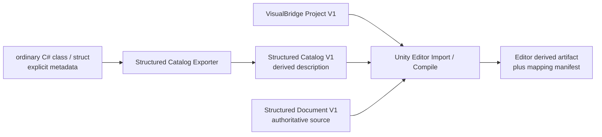
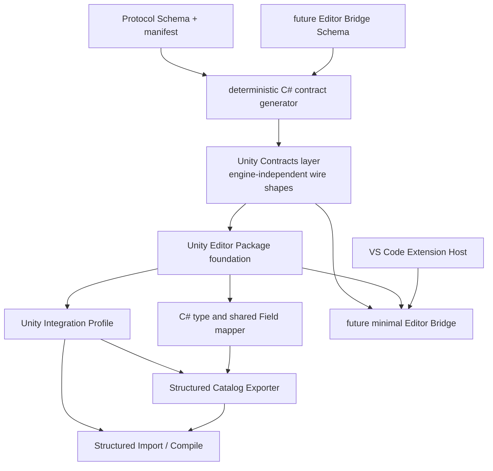
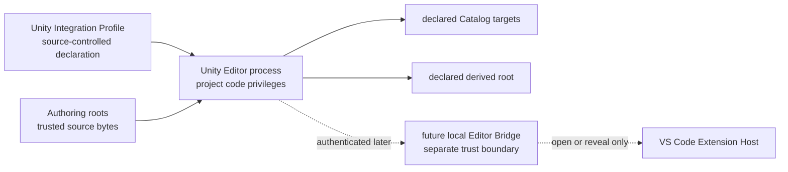

# VisualBridge Unity Editor 接入架构

## 1. 文档定位

本文定义 VisualBridge 在 Unity 接入前 Authoring 基线之后的 Unity Editor 集成架构。首个垂直切片只证明普通 C# `class` / `struct`、冻结的 Structured Catalog V1、Structured Document V1 与 Unity Editor 派生数据之间的离线闭环；它不把 Unity Runtime、Debug、DAP 或 Player 包含进来。

本文在 [`VisualBridgeArchitecture.md`](VisualBridgeArchitecture.md)、[`ProtocolContracts.md`](ProtocolContracts.md)、[`StructuredConfigModel.md`](StructuredConfigModel.md) 和四个领域正式契约之上补充 Unity 侧职责。已有 Project、Catalog、Document、Field、稳定 ID、Hash 和诊断语义继续以 `Protocol/Schema`、`Protocol/contract-manifest.json`、现有 TypeScript Core 及领域正式文档为准。本文不能通过概念描述覆盖或放宽这些已冻结契约。

当前仓库已经完成 C# contract generator、有效 UPM Package、Integration Profile V1、Structured Catalog Exporter 与 offline Import/Compiler；固定 Unity 样例可在没有 VS Code/Bridge 的条件下执行 Generate/Check。UPM Package ID 固定为 `com.kyle.visualbridge`，C# namespace/assembly 使用 `VisualBridge.<Module>`；私有 VSIX 保持 `UNLICENSED` 并携带不授予公共使用权的 proprietary notice。Editor Bridge 只完成了实施前范围复核，transport、discovery、authentication、消息 Schema 和实现均未冻结；该任务已于 2026-08-30 按项目方要求暂停。Runtime、Debug、DAP 与 Player 仍未实现。实施状态、恢复条件与剩余发布门槛见 [`UnityIntegrationRoadmap.md`](UnityIntegrationRoadmap.md)。

## 2. 首期范围

首期包含：

- 从现有 JSON Schema 与 contract manifest 确定性生成 Unity 可消费的 C# contract。
- 建立 `Packages/com.kyle.visualbridge` 的 Editor-only UPM Package 基础。
- 使用固定的 Unity Integration Profile V1，把一个 Unity Project 关联到该 Unity Project 内的一个 Authoring Project。
- 从显式登记的普通 C# `class` / `struct` 和元数据生成 Structured Catalog V1。
- 在 Unity Editor 中读取 Project、Structured Catalog 和 Structured Document，生成确定性的 Editor 派生产物与映射清单。
- 离线垂直切片之后的下一阶段单独设计并实现最小 Editor Bridge，使 Unity Editor 可以请求 VS Code 打开或定位 Authoring Document；该阶段当前仍为 `pending`，只完成范围复核并已暂停，恢复时必须先完成 discovery/transport spike 与威胁模型，不能把复核结论当作冻结设计。

首期明确不包含：

- Unity Player 程序集、设备发现、Player 配对或远程传输。
- Runtime loader、Runtime Instance ID、运行时执行或热更新。
- Debug Session、DAP、断点、调用栈、变量、Trace 或多客户端控制模型。
- Graph、Entity 或 Table 的 Unity Export/Import/Compile 实现。
- `ScriptableObject` Authoring 包装资产、子资源或 Unity Inspector 第二编辑源。
- 通过 Editor Bridge 触发 Authoring 写入、Catalog 导出或编译。
- 为上述延期能力预留未验证的消息、空程序集或半成品运行路径。

## 3. 权威数据与冻结交接面

Authoring 源文件继续是唯一权威数据。Catalog 描述可以创建和校验什么，Document 保存项目实际创建的实例；Unity 导入结果、编译结果、索引、缓存和映射都是可删除、可重建的派生数据。

当前跨语言交接面固定为：

- `Protocol/Schema` 和 `Protocol/contract-manifest.json`；
- VisualBridge Project、Catalog 和 Authoring Document；
- 稳定 ID、alias、规范路径、Hash、版本和结构化诊断；
- Catalog 顶层 `source` 状态以及类型级来源追踪。

以下内容不是现有 Authoring 契约的一部分：

- Unity 内部对象引用、Asset GUID、Local File ID、实例地址或数组索引；
- Unity Importer、Compiler 或 Bridge 的内部服务接口；
- Editor/Player discovery、transport、authentication 或 session message；
- Debug mapping 和 Runtime identity。

新增跨语言字段必须先进入正式 Schema/manifest、生成物和正反例，不允许在 C# 与 TypeScript 两侧分别手写同名 DTO。

## 4. 分层依赖

依赖规则：

- Catalog Exporter 依赖 C# contract、Unity Package、Integration Profile 和共享 Field mapper，不依赖 Editor Bridge。
- Structured Import/Compile 依赖 Project、Catalog、Document 以及可验证的物理来源，不以连接中的 VS Code 为前置条件。
- Editor Bridge 依赖独立冻结的 Bridge Schema、同一 C# generator、Unity Editor Package 和 VS Code Host；它不依赖 Compiler，也不是首个离线切片的完成条件。
- Runtime、Debug 和 Player 不能反向成为 Contracts、Exporter 或 Compiler 的依赖。
- 首期不建立公开 Unity Adapter Registry。只有第二个真实领域切片证明共同边界后，才决定是否抽取 Catalog Generator、Importer 或 Compiler 注册 API。

## 5. Unity Package 边界

Unity Package 源只有 `Packages/com.kyle.visualbridge/` 一份，`UnityProject/` 只作为开发宿主。当前 Package 分为：

UPM package ID 固定为 `com.kyle.visualbridge`。`kyle` 只属于 Package publisher 标识，不进入 C# namespace 或 assembly 名；C# surface 统一以 `VisualBridge` 为前缀并跟随模块名，例如 `VisualBridge.Runtime`、`VisualBridge.Editor` 和 `VisualBridge.Protocol.Generated`。

- **Runtime metadata marker**：`VisualBridge.Runtime` 是 player-visible、`noEngineReferences: true` 的纯 Attribute/enum metadata surface，供游戏程序集声明 Catalog、Config 与 Field；它没有行为、Unity API、loader、执行或 Player integration，程序集名称不表示 Runtime 功能。
- **Generated contracts**：C# wire/data bags 位于 Editor assembly，只承载同源协议数据形状与 Schema hash，不引用 VS Code、Node 或 Webview，也不充当严格语义 validator。
- **Editor Integration**：Integration Profile、C# 元数据读取、Catalog Export、Structured Import/Compile、诊断以及后续最小 Editor Bridge；只在 Unity Editor 中加载。
- **Editor Tests**：针对 contract、Profile、Exporter、Compiler 和后续 Bridge 状态机的 EditMode 验证。

当前不创建 Runtime 功能。即使 metadata marker 对 Player assembly 可见，或生成 Contracts 能被普通 C# 编译，也不表示已经提供 Player、Runtime loader 或游戏运行时 API。

Package 不加载 VS Code 扩展源码或 TypeScript Core。Authoring Host 也不加载 Unity 程序集。两侧对同一输入得出一致结论，依靠冻结 Schema、生成 contract、共享固定样例和跨实现 parity 测试，而不是进程内共享实现。

## 6. C# contract generation

### 6.1 单一事实来源

C# generator 只读取现有 JSON Schema 与 contract manifest。当前四个生成产物 `Protocol/Generated/schema-index.json`、`contracts.d.ts`、`contracts.g.cs` 和 `Packages/com.kyle.visualbridge/Editor/Generated/VisualBridgeProtocolContracts.g.cs` 都来自同一输入；任何生成物都不得手改。两份 C# 输出 byte-identical。

当前 C# 输出范围由 manifest 的 `csharpGeneration.schemas` 与 `outputs` 机器登记，覆盖 Project、Catalog Source、Structured Catalog、Structured Document、Integration Profile、共享 Field/value shape 和其引用闭包；generator 源码不能临时挑选。加入 Editor Bridge 时再把正式 Bridge Schema 纳入相同登记。未进入 Unity 输出闭包的既有 MCP/Provider contract 仍继续参与全局 Schema drift gate。

### 6.2 确定性

生成器必须固定：

- UTF-8、LF、末尾换行和生成文件布局；
- namespace、类型、union branch 和成员的稳定命名；
- UTF-16 code-unit ordinal 顺序，不使用当前区域设置；
- 输入 Schema `$id`、原始 bytes Hash、manifest 版本和 generator 版本登记；
- clean checkout 中的 generate/check 行为。

连续两次生成必须产生完全相同的文件清单和 bytes。Schema、manifest 或生成物任一方发生漂移时，检查必须失败。

### 6.3 严格语义

生成 C# 类型不等于完成协议消费。生成类型是 wire/data bags；JSON Schema 的 `oneOf`、递归 Field、条件关系和 unknown-field 约束不会因为反序列化为 DTO 就自动成立。当前 Unity consumer 先读取 `JObject`，由 Profile loader、Authoring Project parser、Structured Catalog validator 和 Compiler 严格验证：

- `additionalProperties: false` 和 union/discriminator；
- Stable ID、normalized path、SHA-256、版本和长度上限；
- 只允许有限 number 的 JSON value；
- object、array、select、Reference 和共享 Field 递归约束；
- alias 冲突和 Catalog Registry 无歧义；
- unknown field、unknown version 和未解析 `$ref` 的拒绝行为。

序列化库必须通过固定 Unity 版本中的正反例验证后才能冻结。Unity `JsonUtility` 不能被默认当作可满足 Dictionary、union、opaque JSON 和严格 unknown-field 行为的实现。

## 7. Unity Integration Profile

### 7.1 所有权

现有 `VisualBridge.project.vbjson` 不包含 Unity Profile、生成范围或工具版本。当前不向 Project V1 写入未登记键，而是在 Unity Project 固定位置 `ProjectSettings/VisualBridgeIntegration.json` 保存受版本控制、Schema 化的 Integration Profile V1。Profile 是声明式配置，不是 Authoring 文档，也不保存连接和会话状态。

Profile V1 只允许四个字段：

- `formatVersion: 1`；
- `authoringProject`：一个 Unity Project 相对的 `VisualBridge.project.vbjson` 路径；
- `catalogExports`：非空 export unit 列表，每项显式登记 `catalogId`、`title`、`.vbstructuredcatalog` 输出和非空、唯一的 assembly-qualified CLR type 名列表；
- `compileOutputRoot`：V1 Compiler 当前冻结为 `Library/VisualBridge/Compiled`。

Profile Schema 已进入 `visualbridge-unity-integration-profile.schema.json` 和 C# 生成闭包。V1 不支持 Unity Project 外部 Authoring root；所有路径都从 Unity Project root 解析，拒绝绝对路径、冒号、反斜杠、空 segment、`.`/`..`、root alias、symlink/reparse-point 与既有硬链接 alias，并在创建目录和原子替换前复核 canonical identity。未来外部 root 或多个 Authoring Project 必须升级正式 contract，不能通过环境变量或私有键绕过。

### 7.2 路由

Profile V1 的一个 Unity Project 只关联一个 Unity Project 内的 Authoring Project。Export/Compile 每次都从固定 Profile 显式解析该 Project File，不使用进程级 `currentProject`；多 Project 关联不属于 V1。

Structured Document 自身不保存 `configTypeId`。Unity Compiler 必须：

1. 从 Project File 建立 Project 边界；
2. 按 `documentRoots`、`include` 和 `exclude` 唯一解析 Document Type；
3. 确认 `editor: "structured"`；
4. 使用 Document Type 的稳定 `id` 在其 Catalog Registry 中解析规范 Config Type 或 alias；
5. 再校验并编译 Document。

文件后缀、C# 类型名或 Catalog 加载顺序都不能替代上述路由。

## 8. 普通 C# 类型与共享 Field 映射

首期 Exporter 只扫描项目显式登记的普通 C# `class` / `struct` 和显式元数据。类型不需要继承 VisualBridge 基类，也不允许通过 `ScriptableObject` 包装层才能导出。

稳定身份规则：

- Catalog ID、Config Type ID、Field ID 和 alias 必须由显式 metadata 提供；
- C# namespace、完整类型名、成员名和程序集名只用于来源追踪与诊断，不能自动承担持久身份；
- 类型或成员重命名时，只要显式 ID 不变，Authoring identity 就不变；
- alias 只能显式声明，不能由旧名称猜测生成。

默认值规则：

- 默认值来自确定性的声明式 metadata 或明确支持的常量；
- Exporter 不调用构造函数、业务初始化方法、Unity 生命周期方法或临时对象来获取默认值；
- 不可表示或不确定的默认值使当前类型导出失败，不能静默替换为语言默认值。

共享 Field mapper 首期覆盖已有 Structured V1 能力所需的 string、有限 number、boolean、颜色、select、Reference、递归普通 object 和 List。`System.Int32` 与 `System.Single` 必须分别保留为 `int` 与 `float` 语义，不能合并成 `number` Data Type。Dictionary、开放泛型、递归类型环、多态、delegate 和未登记 Unity Object 引用在没有正式映射前 fail closed。

共享 Field wire shape 继续由现有四类 Catalog Schema 和 Core Form model 定义。Unity 可以实现独立 C# mapper 和 validator，但不能创建一套 Unity 专属字段协议。

## 9. Structured Catalog Exporter

Exporter 输出当前冻结的 Structured Catalog V1，不输出未来版本或私有扩展字段。

一次 Export 分为：

1. 解析并校验 Integration Profile 与目标 Authoring Project；
2. 收集显式登记的 C# 类型和 metadata；
3. 构建与排序 canonical source snapshot；
4. 计算准确的 `sourceHash`；
5. 建立 Structured Catalog 候选；
6. 在内存中完成 Schema、共享 Field、默认值和 Registry 校验；
7. 生成确定性 UTF-8 JSON；
8. 写前复核目标 Hash，并通过同目录临时文件与原子替换提交。

`sourceHash` 必须基于实际影响 Catalog 的规范来源快照，且至少覆盖参与导出的类型、成员、显式 ID/alias、字段 shape、默认值和 exporter compatibility version。反射枚举顺序、文件时间、绝对机器路径和 Unity 当前 UI 状态不得进入 Hash。准确输入域和 canonical bytes 必须由固定测试锁定。

Generate 模式负责生成带 `source.status: "current"` 的 Catalog。Check 模式只比较来源快照、Catalog bytes 和登记版本，发现 drift 时失败而不覆盖文件。VS Code 与 MCP 继续只读取 Catalog 与来源状态，不扫描 C#。

## 10. Structured Import / Compile

### 10.1 离线服务

首个垂直切片是离线、Editor-only 服务。它必须在 VS Code 未运行、Editor Bridge 未连接时独立完成。菜单、batchmode 和后续其他宿主入口只能包装同一个 Compile Service，不能分别实现 Project 路由或字段转换。

Compile 输入包括：

- Integration Profile 与明确的 Authoring Project selector；
- Project File 和目标 Document Type；
- 目标 Structured Catalog Registry；
- Structured Document 原始 bytes；
- Package、contract、compiler compatibility version。

Compile 在产生输出前必须拒绝：

- Project/File 路由缺失或歧义；
- Catalog parse/Registry error 或明确 stale 状态；
- 未解析 Config Type、unknown version 或 unknown field；
- 共享 Field、范围、对象、List 或 Reference error；
- 输入在计划与提交之间发生变化；
- 输出路径越界或既有未知文件冲突。

### 10.2 派生产物

当前派生产物固定写入 `Library/VisualBridge/Compiled`，这是 Unity Project 内可删除的 Editor cache，不是 Authoring root 或手写 `Assets`。输出包括每个文档的确定性 compiled artifact、source mapping 和顶层 `manifest.json`；它们不是公开 Protocol Schema，也不承诺可由 Player 加载。若未来需要写入 `Assets`、参与 Build 或成为运行时二进制，必须另行设计 Runtime ownership、Asset import、版本与迁移。

每个派生产物带独立 mapping manifest，至少记录：

- Project ID、Document Type ID、Document ID 和规范 Config Type ID；
- Authoring source `baseHash`、Catalog Hash/`sourceHash`；
- contract、Package 和 compiler compatibility version；
- 派生产物路径与内容 Hash。

Mapping 不能写回 Authoring Document，也不能使用 Unity Object 地址或数组索引作为跨进程身份。它不是 Runtime Instance mapping。

Compiler 先在内存中构建完整 artifact plan 和 diagnostics，再写临时文件并原子替换。失败不改变上次有效输出。孤儿清理只允许根据同一 compiler 维护的 manifest 删除已知派生产物，不能扫描和删除未知文件。

### 10.3 确定性与并发

相同 Project、Catalog、Document 和 compatibility version 必须产生 byte-identical artifact 与 mapping。Compiler 读取 Authoring/Catalog bytes 时记录 Hash，并在提交前复核；外部修改返回冲突，不能自动覆盖或用旧计划重试。

首期 Unity Compiler 是只读 Authoring consumer。只有 Catalog Exporter 可以写 Profile 明确声明的 Catalog 目标；Compiler、Bridge、Editor tests 和 batchmode 验证都不得修改 Project File 或 Authoring Document。

## 11. 信任与安全边界

- Unity Editor 和项目程序集以当前用户权限运行，不是沙箱。显式 metadata、Profile 和目录 allowlist 只能限制 VisualBridge 的受支持行为，不能阻止恶意项目代码自行访问文件。
- 未信任的 Authoring bytes、Catalog 和 Profile 在反序列化后仍必须经过严格验证；C# 类型加载不能触发业务初始化方法。
- Exporter 只写声明的 Catalog 目标；Compiler 只写声明的派生根；Bridge 不写 Authoring 或 Catalog。
- 临时文件、日志、test results、discovery records 和 token 不得落入 Authoring 源或被当成可提交产品数据。
- 未知目标文件和未知外部 bytes 必须保留并报告，不得为“恢复一致性”而覆盖。

## 12. Editor Bridge 后续切片

Editor Bridge 不是 Structured offline slice 的前置，也不能成为 Export/Compile 的隐式依赖。完成离线切片后，Bridge 任务先以威胁模型和真实 Unity/VS Code spike 冻结：

- Unity Project、Authoring Project 与具体 VS Code 窗口的可信关联；
- discovery 信息的保存位置、权限和清理；
- 本机传输、认证、配对、版本协商和 capability negotiation；
- Domain Reload、进程重启、实例 generation、陈旧消息和重连退避；
- 一个 Project 对多个 VS Code 窗口时的显式选择；
- 日志、审计、错误与不确定故障恢复。

在这些决策经过 spike 和文档更新前，不预选 Project Discovery File、WebSocket、named pipe 或其他实现。第一版 Bridge 只允许 Unity Editor 请求 VS Code 打开或定位 Project Registry 能唯一解析的 Authoring Document；消息结构必须进入新的正式 Schema，并由同一 generator 产生 TypeScript/C# contract。

Bridge 首版不复用 stdio MCP Tool envelope，不启动 Project Provider，不提供 Authoring Operation、Catalog 写入、Compile、Runtime Attach 或 Debug。连接状态不写回 Authoring Document、Project File 或 Integration Profile。多窗口路由不能依赖全局 `currentUnity` 或“最近连接”猜测。

Runtime、Debug 和 Player 仍需各自独立架构、身份模型、权限与真实垂直切片。Editor Bridge 的传输即使验证成功，也不自动成为 Player 或远程调试协议。

## 13. 领域扩展边界

Structured 是首个 Unity 切片，因为它能以最小范围验证 Project 类型绑定、共享 Field、稳定身份、Catalog Export 和派生编译。后续扩展必须继续遵守领域正式文档：

- Entity 只扫描普通运行时 `class` / `struct`，导出显式 Entity Type、Component Group、Component Type 和递归 Field ID；不恢复 `ScriptableObject` Authoring 包装层。
- Graph 必须输出 Graph Catalog V4，保留 `int`/`float`、Graph Type、typed subgraph、端口身份、连接规则、List port mode 和实例约束；不得输出旧 Catalog 版本。
- Table 必须消费 Catalog 定义的 Semantic Table、cell encoding、partition 和 effective row 语义；不得按 CSV 列位置或 XLSX 内部对象自行猜测业务结构。

第二个领域切片开始前应复核 Structured 服务边界。只有至少两个真实 Exporter/Compiler 使用相同生命周期、诊断和 artifact plan 后，才建立公开 Unity Adapter API。

## 14. 命令与验证层级

当前仓库没有独立发布的 VisualBridge CLI。命令行入口是 Protocol npm script 与 Unity batchmode `-executeMethod`，菜单和 batch wrapper 调用相同的 Exporter/Compiler 服务，不建立第二套业务规则：

- `npm run generate:protocol` / `npm run check:protocol`：生成或检查四个 Protocol 产物；
- `VisualBridge.Editor.VisualBridgeStructuredCatalogBatch.Generate` / `.Check`：Catalog Generate/Check；Catalog batch 以 `0` 表示成功、`2` 表示 drift、`1` 表示失败；
- `VisualBridge.Editor.VisualBridgeStructuredCompilerBatch.Generate` / `.Check`：Compiled artifact Generate/Check；Compiler batch 以 `0` 表示成功、`1` 表示 drift、`2` 表示失败；
- Unity Test Framework `-runTests -testPlatform EditMode`：运行 Package Editor tests。

所有 Unity 调用都必须显式提供 `-projectPath`、独立 `-logFile`，测试还需 `-testResults`；仅检查进程退出码不够，还要审计日志与 XML。根 README 给出固定 Unity `6000.3.10f1` 的可直接运行 PowerShell 命令。

验证分为五层：

1. **Protocol/Node gate**：生成漂移、Schema/manifest、现有 Parser/Registry、共享 Field parity 和文档检查。
2. **dotnet 快速编译**：对 Unity 生成的 C# project 执行 `dotnet build`，用于快速发现类型和程序集错误；它不等价于 Unity 导入成功。
3. **Unity batchmode refresh/import**：使用固定 Unity Editor 版本真实打开 `UnityProject`、解析本地 Package、刷新 AssetDatabase 并完成脚本编译。
4. **Unity EditMode 与 batch command**：运行 EditMode tests，并以 batch entry point 实际执行 Catalog Export 和 Structured Compile，检查 test results、日志、退出码和输出 Hash。
5. **Bridge E2E**：后续在真实 Unity Editor 与隔离 VS Code Extension Host 之间验证 open/reveal；仅有协议单元测试或 batchmode 不能替代此证明。

当前开发宿主固定记录为 Unity `6000.3.10f1`。改变验证版本或声明更低最低版本前，必须重新执行 Package import、编译、EditMode 和垂直切片验证。

完整 Unity 任务顺序、每项 exit criteria 和发布门槛见 [`UnityIntegrationRoadmap.md`](UnityIntegrationRoadmap.md)。

## 15. 已冻结决策

- 首个 Unity 垂直切片是 Structured、offline、Editor-only。
- Editor Bridge 不是首切片前置，在离线 Export/Compile 完成后单独进入。
- Runtime、Debug、DAP 和 Player 不在本路线图范围内。
- Authoring Document 权威；Catalog 和 Unity artifact 是派生数据。
- Structured Compile 必须读取 Project File 并按 Document Type 解析 Config Type。
- C# contract 只从现有 Schema/manifest 生成，不建立手写第二来源。
- 普通 C# `class` / `struct` 与显式 metadata 是 Catalog 来源；C# 全名不是稳定身份。
- Exporter 不执行业务初始化方法获取默认值。
- Compiler 不修改 Authoring Project/File/Document，失败不破坏上次有效派生物。
- `VisualBridge.Runtime` 只允许 player-visible、无 Unity API/无行为的 metadata marker；当前不建立 Runtime 功能、Unity Adapter public API 或 `ScriptableObject` Authoring 工作流。
- dotnet 只是快速编译；真实 Unity batchmode import、EditMode 和垂直切片执行是独立发布门槛。

## 16. 已关闭与仍待关闭的决策

Structured offline slice 已关闭：

- JSON 使用 `com.unity.nuget.newtonsoft-json` `3.2.2`；生成 C# DTO 是 wire/data bags，严格语义由 `JObject` validators 执行；
- manifest 以 `csharpGeneration.schemas` / `outputs` 登记 C# closure 与两份 byte-identical 输出；
- Profile 固定为 `ProjectSettings/VisualBridgeIntegration.json`，V1 只关联一个 Unity Project 内 Authoring Project，并拒绝外部/别名路径；
- metadata API 固定为 assembly `VisualBridgeStructuredCatalog`、type `VisualBridgeStructuredConfig` 和 field-only `VisualBridgeField`；
- Exporter canonical source snapshot、`sourceHash`、Generate/Check 与原子提交由确定性测试锁定；
- Compiler artifact、source mapping 与 managed manifest 当前固定为 `Library/VisualBridge/Compiled` 内部 Editor 格式，由 Compiler 测试锁定，尚未升级为公开跨语言 Schema。

仍待 VB-UI-06/07 关闭：

- Editor Bridge 的 discovery、transport、authentication、message Schema 与真实 open/reveal E2E；
- Protocol、Package、VSIX、generator、compiler 与未来 Bridge 的完整发布兼容矩阵、空缓存复现和分发基线。

仍待条目必须在对应路线图任务中通过正式 contract、实现和自动验证关闭，不能由实现私有约定长期替代；offline artifact 若将来跨越 Editor 内部边界，也必须先进入正式 Schema。
