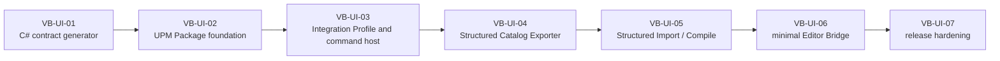

# VisualBridge Unity Editor 接入任务清单

## 1. 目标与边界

本清单定义 [`UnityIntegrationArchitecture.md`](UnityIntegrationArchitecture.md) 的实施顺序。它从已经完成的 VB-PU-01 至 VB-PU-08 Authoring 基线开始，以一个 Structured、offline、Editor-only 垂直切片验证 C# contract generation、UPM Package、Catalog Export 和 Unity Import/Compile；之后才进入最小 Editor Bridge。

本路线图不实现 Runtime、Debug、DAP、Player、远程连接、设备发现、Graph/Entity/Table Unity 编译或 `ScriptableObject` Authoring 包装层。Editor Bridge 不是 Structured offline slice 的前置条件，也不能承载 Export/Compile。上述后续方向已在 [`UnityDomainAndRuntimeRoadmap.md`](UnityDomainAndRuntimeRoadmap.md) 中完成下一大阶段规划（全部任务 `pending`，前置条件为本路线图 VB-UI-07 关闭）；`ScriptableObject` Authoring 包装层在该清单中被明确记录为旧设计残留，新体系不采用。

当前进度：VB-UI-01 至 VB-UI-07 全部完成。VB-UI-06 最小 Editor Bridge 已于 2026-08-31 完成：spike 与威胁模型冻结了传输/discovery/认证设计，正式消息 Schema 进入 Protocol 并生成 TS/C# 契约，Unity 侧客户端与 VS Code 扩展宿主服务器实现并通过全部自动化门槛，真实 Unity Editor 与隔离 Extension Host 完成 open/reveal E2E。VB-UI-07 发布门槛、文档与基线已于 2026-08-31 关闭：Package README、Unity 接入手册、完整 compatibility matrix、空缓存 clean-checkout 复现与分发基线全部落地（见第 3 章验证记录）。下一大阶段（Entity/Table/Graph 离线编译、本机 Runtime 接入、远程/设备连接）见 [`UnityDomainAndRuntimeRoadmap.md`](UnityDomainAndRuntimeRoadmap.md)。这里的 `complete` 只代表各任务冻结范围，不表示 Runtime、Debug、DAP、Player 或其他三个领域已实现。

2026-08-30 暂停检查点：私有 VSIX 已加入 proprietary `LICENSE` notice，同时保持 manifest `private: true` 与 `UNLICENSED`；Unity Package ID 已固定为 `com.kyle.visualbridge`，C# namespace/assembly 统一使用 `VisualBridge.<Module>`，`kyle` 不进入 C# 标识。上述变更已经过 Node、VSIX、Protocol、dotnet、Unity batchmode、Structured Generate/Check、Compile Check 和 EditMode 回归并提交推送（提交 `4b6b66d`）。

2026-08-30 恢复决定：项目方在上述检查点之后授权恢复 VB-UI-06 实施，并明确授权在 `Packages/com.kyle.visualbridge/Tests/Editor/` 新增 Bridge contract/连接状态机的 Unity EditMode 测试以满足本任务 Exit criteria；验收门槛保持不变。恢复实施仍从 discovery/transport spike、威胁模型和真实多窗口/Domain Reload 验证开始，在选型证据完成前不写正式 Bridge 实现，也不得把此前的范围复核结论当作冻结设计。

状态含义：

- `pending`：尚未开始。
- `in_progress`：当前任务正在实现、验证或等待同一任务内的提交推送。
- `complete`：范围、contract、实现、文档、自动化验证、提交和推送全部完成。
- `blocked`：只有不可恢复的外部环境或必须由项目方决定且无法从现有契约推出的歧义才能使用。

## 2. 依赖顺序



`VB-UI-06` 排在离线切片之后是范围控制，不表示 Editor Bridge 技术上必须调用 Compiler。Bridge 只复用 C# contract、Unity Package 基础和 VS Code Host；Exporter/Compiler 必须在 Bridge 不存在或未连接时独立工作。

## 3. 任务清单

### VB-UI-01 确定性 C# contract generator — `complete`

范围：

- 在现有 Protocol Contract 工具链中增加 JSON Schema/manifest 到 C# 的确定性生成。
- 以机器登记声明 Unity C# 输出根及完整 `$ref` 闭包；首期覆盖 Project、Catalog Source、Structured Catalog、Structured Document 和共享 Field/value shape。
- 生成稳定 namespace/type/member、opaque JSON 表达以及来源 Hash/版本登记。生成类型是 wire/data bags；严格 union/discriminator、unknown field 和递归语义由 Unity strict `JObject` validators 执行。
- 将 C# 生成物纳入现有 Protocol generate/check、clean-checkout drift 和跨平台 LF 门槛。
- 建立 TypeScript、JSON Schema 与 C# 正反例 parity；未知字段、错误版本、非法 Stable ID/path/Hash、非有限 number 和错误递归 Field 必须一致拒绝。
- 不为 Node Host 私有 journal/lock 生成公共 Unity API，不手写重复 DTO。

Exit criteria：

- 同一 checkout 连续生成两次具有相同文件清单和 bytes。
- 修改任一输入 Schema/manifest 而不更新 C# 输出时，drift check 失败；手改生成物同样失败。
- 当前 14 份 Schema 的既有 TypeScript/index gate 保持通过，四个生成产物及 Unity C# 输出闭包可独立编译。
- 固定正反例在 AJV、现有 Parser 和 Unity strict `JObject` validators 中得到相同接受/拒绝结果；不得用 DTO 反序列化成功替代语义验证。
- `npm run check:protocol`、`npm test`、`npm run check:docs` 和 `git diff --check` 通过。
- 没有 Unity Package、Exporter、Compiler、Bridge、Runtime 或 Player 实现混入本任务。

### VB-UI-02 UPM Package 与 Editor-only 程序集基础 — `complete`

依赖：VB-UI-01。

范围：

- 建立 `Packages/com.kyle.visualbridge` 的有效 UPM `package.json`、程序集定义、生成 contract 目录和 Editor Tests 边界。
- 让 `UnityProject` 以本地 Package 依赖加载唯一 Package 源，不复制 Package 代码到 `Assets`。
- 冻结并实现经过 Unity 6000.3.10f1 验证的严格 JSON serializer/validator 组合。
- 建立 Package、Protocol 和 generator compatibility 检查以及结构化诊断基础。
- `VisualBridge.Runtime` 只提供 player-visible、`noEngineReferences`、无行为/无 Unity API 的 metadata marker Attribute/enum；不建立 Runtime 功能，Contracts 也不得被描述为 Player/Runtime API。

Exit criteria：

- Unity batchmode 能在干净的 `UnityProject` 中解析本地 Package、refresh/import、完成脚本编译并正常退出。
- Unity 生成 C# project 后，相关 Contracts/Editor project 与 `UnityProject/Assembly-CSharp-Editor.csproj` 可通过 `dotnet build`；报告 dotnet 只属于快速编译证据。
- Unity EditMode contract/serialization 正反例测试通过，test results 与 Editor log 无编译或未处理异常。
- Package import 不产生未声明的 Authoring/Catalog 修改，Git diff 只包含任务内预期源码和 Package 元数据。
- 当前 Node、VSIX 和文档门槛保持通过。

### VB-UI-03 Integration Profile 与批处理宿主 — `complete`

依赖：VB-UI-02。

范围：

- 冻结 `ProjectSettings/VisualBridgeIntegration.json`、Profile V1 Schema、一个 Unity Project 内 Authoring Project 关联、Export unit 与 `Library/VisualBridge/Compiled` 输出根。
- 将 Profile Schema 纳入 Protocol 与 C# generator，不在 `VisualBridge.project.vbjson` 写入未登记 Unity 字段。
- 统一 canonical path、symlink/reparse-point、硬链接 alias、目标不存在性和写入范围检查；V1 不允许外部 Authoring root。
- 建立一个 Editor Service Host，使菜单、Unity batchmode `-executeMethod` 和后续入口调用同一服务。
- 建立结构化诊断、退出码、日志和 dry-run/check 模式；当前不发布独立产品 CLI。
- 固定一个 Unity C# Structured 类型与现有 Structured fixture 的跨实现样例。

Exit criteria：

- Profile 的合法、未知字段、错误版本、歧义 Project、越界路径、symlink/reparse-point 和未授权输出目标均有 C#/Schema 正反例。
- 同一 Profile 在菜单服务和 batchmode 服务中解析为相同 canonical plan。
- batchmode 的失败通过非成功退出状态、结构化日志或结果文件明确暴露，不能只在 Console 写一行后返回成功。
- batchmode refresh/import 与 EditMode Profile tests 通过；dotnet 快速编译单独通过。
- 服务宿主没有 Catalog 业务映射、Structured Compiler 或 Editor Bridge 特例。

### VB-UI-04 Structured Catalog Exporter — `complete`

依赖：VB-UI-03。

范围：

- 冻结普通 C# `class` / `struct`、Config Type、Field、alias、默认值和来源追踪所需的显式 metadata API。
- 只扫描 Profile 显式登记的类型；实现共享 C# Field mapper，覆盖首期 scalar、颜色、select、Reference、递归 object、List 和 `int`/`float` 区分。
- 正式定义 canonical source snapshot 与 `sourceHash` 输入 bytes。
- 生成 Structured Catalog V1，使用现有 Catalog Source、Field wire shape、稳定 ID 和 Registry 语义。
- 提供 Generate 与 Check；Generate 通过写前 Hash、同目录临时文件和原子替换写入声明目标，Check 不覆盖 drift。
- Unsupported type、默认值、循环结构、ID/alias 冲突和目标 Catalog 外部变化全部 fail closed。

Exit criteria：

- Unity batchmode 对固定 C# 样例实际执行 Export，输出通过现有 JSON Schema、Structured Catalog Parser、共享 Field validator 和 Registry。
- 相同输入连续导出两次 byte-identical；反射或源声明枚举顺序变化不改变结果。
- 保持显式 Stable ID 时重命名 C# 类型/成员不改变 Authoring identity；C# 全名只改变来源追踪信息。
- Exporter 没有执行构造函数、业务初始化方法或 Unity 生命周期方法来获取默认值。
- Check 能区分 current、source drift、Catalog bytes drift 和外部写入冲突，失败不覆盖目标。
- Unity batchmode refresh/import、Exporter batch command、EditMode 正反例、dotnet 快速编译以及 Node Schema/Parser parity 全部通过。
- 没有 Entity、Graph、Table Exporter 或公开 Unity Adapter Registry 混入。

### VB-UI-05 Structured offline Import / Compile 垂直切片 — `complete`

依赖：VB-UI-04。

范围：

- 从 Profile 显式选择 Authoring Project，并按 Project Registry 的 root/include/exclude 语义唯一解析 Structured Document Type。
- 使用 Document Type ID 解析 Structured Config Type；不从扩展名、C# 全名或文件内不存在的 `configTypeId` 猜测。
- 读取并严格校验 Project、Catalog Registry、Structured Document、共享 Field 和 Reference。
- 建立完整 compile plan、确定性 Editor 派生产物与 mapping manifest；首期输出位于声明的 Unity Editor generated/cache root，不承诺 Player 格式。
- 使用输入 Hash、写前复核、临时文件、原子替换和已知 manifest 完成安全提交与孤儿清理。
- 菜单与 batchmode 调用同一 Compile Service；VS Code 和 Editor Bridge 均不是运行前置。

Exit criteria：

- 在 VS Code 未运行且不存在 Bridge 的情况下，Unity batchmode 完成 refresh/import、Catalog check 和 Structured Compile。
- 固定 Structured 样例成功 materialize 为预期的普通 C# 数据语义，并产生 byte-identical artifact/mapping；连续编译结果相同。
- 歧义路由、stale Catalog、unknown Config Type/Field、错误默认/Reference、输入 Hash 变化和输出冲突都拒绝完整计划。
- 任一失败不修改 Project File、Authoring Document、Catalog 或上次有效派生产物。
- orphan 清理只删除当前 mapping manifest 登记的已知产物，保留未知文件。
- Unity EditMode 覆盖成功、负例、确定性、冲突与失败恢复；batch command 的结果和日志可由 CI 判定。
- dotnet 快速编译、Unity batchmode refresh/import、EditMode、Exporter/Compiler E2E、Node Schema/Parser parity 和现有完整 Node/VSIX 门槛全部通过。
- 没有 Runtime loader、Build integration、Debug、Player 或 Graph/Entity/Table Compile 混入。

### VB-UI-06 最小 Unity Editor Bridge — `complete`

依赖：VB-UI-05。该依赖用于保证先完成离线切片，不表示 Bridge 调用 Compiler。

实施记录：2026-08-30 项目方授权恢复并授权新增 Bridge contract/连接状态机 Unity EditMode 测试（见文首恢复决定）。同日完成 discovery/transport spike 与威胁模型，设计冻结进 [`UnityIntegrationArchitecture.md`](UnityIntegrationArchitecture.md) 第 12 章；正式消息 Schema（`visualbridge-editor-bridge.schema.json`）进入 Protocol 与 C# 生成闭包。2026-08-31 完成 Unity 侧客户端（严格校验器、discovery 枚举、同步请求/响应、服务门面与菜单）与 VS Code 扩展宿主服务器（双端点监听、discovery 记录与心跳、token 握手、open/reveal 路由）。

验证记录：24 例三方 parity fixture（AJV / Unity strict validator / 扩展宿主）一致；Unity EditMode 13 例 Bridge 测试随全套 55 例通过；扩展宿主集成测试覆盖无效 token、非法 JSON、非 hello 首消息、协议版本、unresolved/ambiguous open 与 reveal 全链路并随受限模式回归通过；真实 Unity Editor 6000.3.10f1 与隔离 VS Code 1.105.1 Extension Host 完成 open/reveal E2E（`npm run test:bridge-e2e`，结果 `open=ok; reveal=ok`）；Bridge 关闭时 Catalog Check 与 Structured Compile Generate/Check 退出码全部为 0；`npm run check`、`npm test`、`npm run build`、`npm run test:vscode:host`、`npm run test:vscode:cli`、`check:protocol`、`check:mcp`、`git diff --check` 与四个 Unity 生成 csproj 的 `dotnet build` 全部通过。

范围：

- 先完成 discovery/transport spike 与威胁模型，实测 Unity 6000.3.10f1、VS Code Extension Host、Domain Reload 和多个窗口。
- 在 [`UnityIntegrationArchitecture.md`](UnityIntegrationArchitecture.md) 中冻结选定的 discovery、local transport、authentication、token、版本、capability、instance generation、重连和清理策略。
- 新增正式 Bridge Schema，并通过同一 generator 产生 TypeScript/C# contract；不复用 stdio MCP Tool envelope。
- Unity Editor 只发送 open/reveal Authoring Document 请求；VS Code Host 使用 Project Registry 唯一解析并打开目标。
- 多 Authoring Project、多 VS Code 窗口和多 Unity Editor 必须显式路由，不建立全局 `currentUnity`。
- Bridge 不写 Authoring/Catalog、不触发 Export/Compile、不启动 Provider，也不包含 Runtime/Debug/Player 消息。

Exit criteria：

- spike 证据、威胁模型、选型理由和正式消息 Schema 已进入文档与 Protocol；不再保留由实现自行决定的关键连接语义。
- 无效 token、错误 Project、版本/capability 不匹配、陈旧 generation、Domain Reload、进程重启、记录残留和重连退避有自动化覆盖。
- 多窗口场景要求显式选择，不能按最近连接或全局状态静默路由。
- Unity EditMode 覆盖 C# contract 与连接状态机；VS Code Host 测试覆盖发现、路由、拒绝和资源释放。
- 使用真实 Unity Editor 与隔离 Extension Host 完成 open/reveal E2E；batchmode 或协议单元测试不能替代此证明。
- Bridge 关闭或不可用时，VB-UI-04/05 的 Export/Compile 仍完整通过。
- Protocol、Package、VSIX、dotnet、Unity 和文档门槛全部通过，Schema 中不存在 Runtime Attach、Debug 或 Player 字段。

### VB-UI-07 发布门槛、文档与基线 — `complete`

依赖：VB-UI-01 至 VB-UI-06。

实施记录：2026-08-31 完成。`Packages/com.kyle.visualbridge/README.md`（含 Unity `.meta`）落地：程序集边界、metadata 标注、菜单/batch 入口、产物布局、Bridge 使用与边界。`UnityIntegrationManual.md` 新增并注册进文档索引：环境与完整 compatibility matrix（Node 22.22.1、npm 10.9.4、VS Code 1.105.1、VSIX `kyl.visualbridge` 0.1.0、Unity 6000.3.10f1、Newtonsoft 3.2.2、Protocol 版本表）、Profile 配置与错误码、Catalog/Compile 操作、日志、冲突恢复表与 Bridge 使用。同一批次完成 VB-UX-00 复查发现的五份英文领域文档补译（GraphSemanticModel、ProjectTransaction、ReleaseQuality、TableSemanticModel、VSCodeGraphEditor，见 `UnityDomainAndRuntimeRoadmap.md` VB-UX-00 记录）。

验证记录：空缓存 clean-checkout 复现（临时目录全新 `git clone` HEAD `14ffbdd`）依次通过 `npm ci`（0 漏洞）、`npm run check`、空 `Library` 的 Unity batchmode refresh（退出码 0、日志无编译错误/未处理异常、Package Manager 解析本地包）、两个生成 csproj 的 `dotnet build`、Catalog Generate/Check 与 Structured Compile Generate/Check（退出码全 0）、EditMode 55/55、`npm test`（test:host 51 例全过）、`npm run build`、`npm run package:vscode`、`npm run test:vscode:cli`、`npm run check:docs` 与真实 open/reveal E2E（`open=ok; reveal=ok`）；复现后工作区除新生的 Package README `.meta`（已提交）外保持干净，Unity cache、测试结果与 token 均在忽略边界内。分发基线确认：根/扩展/Unity Package 三个 manifest 均 `private` + `UNLICENSED`，VSIX 含私有 LICENSE 声明，Package 元数据（`com.kyle.visualbridge` 0.1.0、`unity 6000.3`、Newtonsoft `3.2.2`）与 VSIX 身份一致。已知环境偏差两项并披露：本机 Node 25.6.0 使 `npm ci` 需 `npm_config_engine_strict=false` 豁免（正式 CI 必须用 22.22.1）；网络受限使 VS Code 测试运行时缓存由本地预置而非现场下载。`git diff --check` 通过。

范围：

- 固定 Protocol、generator、UPM Package、Unity Editor、VSIX 和 Compiler/Bridge compatibility matrix。
- 完成 Package README、Unity 接入手册、Profile 配置、Catalog Export、Structured Compile、日志、冲突恢复和 Bridge 使用说明。
- 把 C# generation、Package import、batch Export/Compile、EditMode 和 Bridge Host/E2E 接入可重复发布门槛。
- 从空缓存/干净 checkout 复现 Node 安装、Protocol/C# generation、Package import、编译、测试、VSIX 打包和 Unity 垂直切片。
- 确认私有 `UNLICENSED` 策略、Package 元数据、版本和分发产物，不猜测公共许可证。
- 删除完成任务的 `Doc/Temp` 和测试临时产物，更新正式文档索引与完整性矩阵。

Exit criteria：

- `npm run check`、`npm test`、`npm run build`、`npm run package:vscode`、`npm run test:vscode:host`、`npm run test:vscode:cli`、`npm run check:docs` 和 `git diff --check` 全部通过。
- 相关 Unity 生成 C# project 的 `dotnet build` 通过，并明确只作为快速编译证据。
- 固定 Unity 6000.3.10f1 的 batchmode refresh/import、Catalog Check/Generate、Structured Compile、EditMode tests 和 test result/log 审计全部通过。
- 真实 Unity Editor 与隔离 VS Code Extension Host 的 open/reveal E2E 通过。
- clean checkout 的生成物和派生产物可重复；工作区没有 Unity cache、test results、discovery/token、用户文件或未知生成数据。
- Authoring 源文件、提交 Catalog 和预期派生产物的 ownership 清晰，所有失败/恢复路径有文档和证据。
- Runtime、Debug、DAP、Player 和后三领域 Unity 实现仍未进入本路线图。

## 4. 每个任务的强制工作流

1. 在 `main` 上检查 `git status`、相关正式文档、当前提交和 CodeGraph 状态，保留所有既有用户修改。
2. 使用 CodeGraph 查找入口和影响范围，再用源码、Schema 与固定样例确认；涉及公开 contract 时先更新 Schema/manifest 和正式设计。
3. 先建立正反例、跨实现 fixture 与 deterministic expectation，再实现 generator、Package 或 Editor Service。
4. 每个公开 wire shape 先进入 Schema/manifest，再重新生成 TypeScript/C#；禁止手写重复 DTO 或私有兼容字段。
5. 快速反馈先运行受影响 Node 检查和 dotnet 编译；dotnet 通过不能把任务标记为 Unity 已验证。
6. 运行固定 Unity 版本的 batchmode refresh/import、适用的 `-executeMethod` 垂直切片和 EditMode tests；同时检查进程退出、Editor log 与 test results。
7. Unity 测试和 batchmode 产生的 `Library`、`Temp`、日志、result XML、`.csproj` 或 discovery/token 必须保持在既有忽略/临时边界，不进入产品 diff。
8. 完成受影响验证后运行当前完整 Node/VSIX/docs 门槛与 `git diff --check`；源码变化后执行 `codegraph sync .`。
9. 审查最终 diff，确认没有越界的 Runtime、Debug、Player、其他领域实现、用户文件或无关修改。
10. 删除 `Doc/Temp` 中对应任务计划，将当前任务标记为 `complete`；只有路线图仍有下一项时，才把下一项标记为 `in_progress`。
11. 使用单一关注点的祈使句提交，推送 `main`，确认本地 HEAD 与 `origin/main` 一致后再进入下一任务。

## 5. Unity 验证门槛

### 5.1 dotnet 快速编译

Unity refresh 生成或更新 C# project 后，至少运行适用的 Editor project 和：

```powershell
dotnet build .\UnityProject\Assembly-CSharp-Editor.csproj
```

若任务引入非 Editor C# 编译面，再运行：

```powershell
dotnet build .\UnityProject\Assembly-CSharp.csproj
```

Unity 生成的 `.csproj` 不能手工修改。dotnet 只验证 C# 编译，不执行 AssetDatabase、Package Manager、Unity serialization、Domain Reload 或 EditMode 生命周期。

### 5.2 Unity batchmode refresh/import

每个 Unity Package 源码任务都要用 `UnityProject/ProjectSettings/ProjectVersion.txt` 固定的 Editor 版本真实打开开发宿主。batchmode 调用必须使用显式 `-projectPath`、独立日志文件和非交互退出，并验证：

- Package Manager 解析本地 `com.kyle.visualbridge`；
- AssetDatabase refresh/import 完成；
- Unity 脚本编译无 error；
- Editor log 没有未处理异常、程序集加载或 serializer/validator 初始化失败；
- Git 工作区没有意外 Package lock、ProjectSettings、Authoring 或用户文件修改。

仅看到进程退出码 0 不足以通过，必须检查日志中的编译/导入结果。

### 5.3 Unity EditMode 与垂直切片

适用任务使用 Unity Test Framework 的 EditMode 平台，并写入显式 test results 文件。CI 同时检查退出状态、结果 XML 和 Editor log。Exporter/Compiler 还必须通过 batchmode `-executeMethod` 或后来冻结的等价入口真实执行，不能只调用纯 C# 单元测试冒充 Unity 垂直切片。

Structured offline slice 的最小真实链路是：

```text
Unity C# type
  -> batchmode Structured Catalog Export
  -> Node Schema / Parser / Registry check
  -> batchmode Structured Import / Compile
  -> deterministic artifact + mapping
  -> second run byte comparison
```

### 5.4 Bridge E2E

Bridge 的 batchmode/EditMode 测试负责 contract、状态机、错误和 Domain Reload 边界；最终 open/reveal 仍必须由真实 Unity Editor 和隔离 VS Code Extension Host 共同证明。该 E2E 不能作为 VB-UI-01 至 VB-UI-05 的前置，也不能替代 offline Export/Compile 验证。

## 6. 首期完成定义

只有 VB-UI-01 至 VB-UI-07 全部为 `complete`，才可以声称完成 VisualBridge 首个 Unity Editor 接入里程碑。该里程碑的准确含义是：

- 普通 C# Structured 类型能够确定性导出 Structured Catalog V1；
- VS Code/MCP 继续编辑同一权威 Structured Document；
- Unity Editor 能在离线条件下确定性导入/编译该 Document 为可重建派生产物；
- 最小 Editor Bridge 能以已验证的可信关联请求 VS Code open/reveal；
- Protocol、Package、VSIX、Node 与 Unity 验证门槛可重复通过。

它不表示已经完成 Runtime、Debug、DAP、Player、远程传输或 Graph/Entity/Table Unity 支持。进入任何一项之前必须另立正式架构与路线图，不在本清单末尾自动续接。
