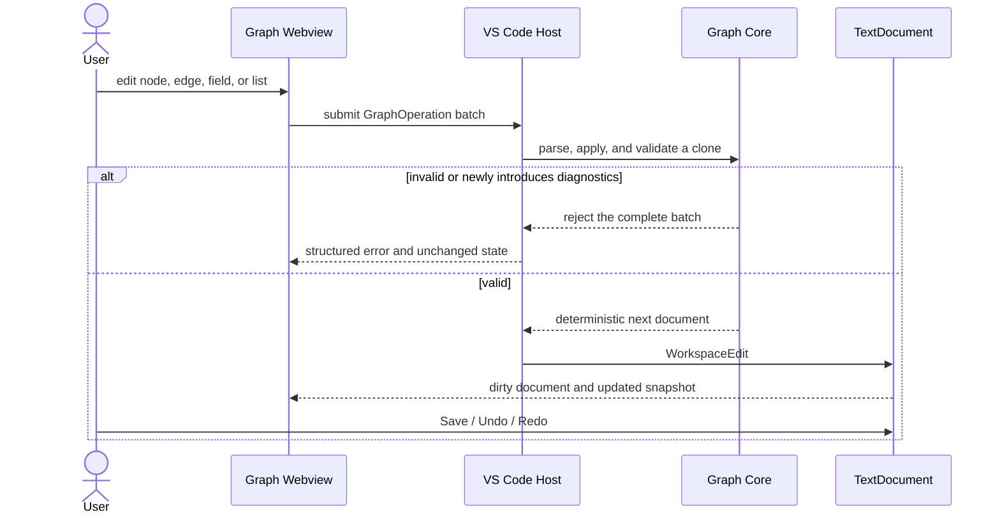

# VisualBridge Graph V3

Graph Document V3 与 Graph Catalog V4 为语义编辑器带来了多 Catalog 注册、Catalog 定义的 Graph Type、实例约束、初始 Node、类型化内嵌 subgraph 以及以 Catalog 为根的 Node 菜单。Unity、运行时编译与调试通信尚未接入。

## Project 声明

`VisualBridge.project.vbjson` 标记文件启用该编辑器并声明其 Graph Catalog：

```json visualbridge-schema=visualbridge-project.schema.json visualbridge-parser=project
{
  "formatVersion": 1,
  "projectId": "ExampleGame",
  "documentRoots": ["Graph"],
  "documentTypes": [
    {
      "id": "logicGraph",
      "editor": "graph",
      "include": ["Graph/**/*.vbgraph"],
      "exclude": [],
      "catalogs": [
        "Catalog/Common.vbgraphcatalog",
        "Catalog/Logic.vbgraphcatalog"
      ]
    }
  ]
}
```

Catalog 路径相对于该标记文件解析。宿主将它们加载进同一个注册表。Catalog ID 与 Data Type ID 必须全局唯一；Node Type 与 Graph Type 的 ID 和 alias 在各自的命名空间内必须全局无歧义。冲突会使整个注册表失效，而不是按加载顺序解决。注册表无效时，既有的未知 Node 仍可读取和编辑，但新建类型化 Node 与类型替换不可用。

`editor: "graph"` 选择宽泛的 Graph 编辑器类别，而 `id` 是项目定义的 Graph 子类型。上文的 `.vbgraph` 后缀只是默认的便利关联：项目可以在 `include` / `exclude` 中声明任意后缀。自定义后缀通过 `VisualBridge: Open Document` 或工作区编辑器关联打开，随后由同一个 Project Registry 解析。`VisualBridge: Create Graph Document` 先选择子类型，再从该子类型的 include 模式推导建议后缀。

## Catalog 示例

```json visualbridge-schema=visualbridge-graph-catalog.schema.json visualbridge-parser=graph-catalog
{
  "formatVersion": 4,
  "catalogId": "example.logic",
  "title": "通用",
  "source": { "status": "unknown" },
  "dataTypes": [
    { "id": "int", "title": "Integer", "color": "#4DA3FF", "accepts": [] },
    { "id": "float", "title": "Float", "color": "#4FC3F7", "accepts": ["int"] },
    { "id": "stringFromAny", "title": "String From Any", "acceptsAnySource": true, "accepts": [] }
  ],
  "graphTypes": [
    {
      "id": "example.main-flow",
      "aliases": [],
      "title": "Main Flow",
      "usage": "root",
      "supportedCatalogIds": ["example.common", "example.logic"],
      "portConnectionRules": { "input": "single", "output": "multiple" },
      "allowedNodeSelectors": [{ "tags": ["common"] }],
      "properties": [],
      "nodeConstraints": [
        { "id": "entry", "selector": { "traits": ["flowEntry"] }, "minInstances": 1, "maxInstances": 1 }
      ],
      "initialNodes": [{ "nodeTypeId": "example.flow.step" }],
      "allowSubgraphs": true
    }
  ],
  "nodeTypes": [
    {
      "id": "example.flow.step",
      "aliases": ["legacy.flow.step"],
      "title": "Step",
      "icon": "▶",
      "category": "Operation",
      "menuPath": ["操作", "整数"],
      "tags": ["common"],
      "traits": ["flowEntry", "flowInput", "flowOutput"],
      "source": {
        "providerId": "unity",
        "assemblyName": "Example.Runtime",
        "typeName": "Example.StepData",
        "wrapperTypeName": "Example.StepNode"
      },
      "ports": [
        { "id": "flow.in", "aliases": [], "title": "In", "kind": "flow", "direction": "input", "maxConnections": 1 },
        { "id": "flow.out", "aliases": [], "title": "Out", "kind": "flow", "direction": "output", "maxConnections": 1 },
        { "id": "value", "aliases": ["Value"], "title": "Value", "kind": "data", "direction": "input", "dataTypeId": "int", "maxConnections": 1 }
      ],
      "dynamicPortGroups": [
        {
          "id": "branches",
          "aliases": ["OutPort"],
          "title": "Branches",
          "port": { "kind": "flow", "direction": "output", "maxConnections": 1 },
          "item": {
            "valueType": "number",
            "defaultValue": 0,
            "editor": { "kind": "number", "readOnly": false, "min": 0, "max": 100 }
          },
          "maxItems": 8
        }
      ],
      "properties": [
        {
          "id": "amount",
          "aliases": ["Value"],
          "title": "Amount",
          "description": "Value consumed by the step.",
          "valueType": "number",
          "dataTypeId": "int",
          "defaultValue": 0,
          "editor": { "kind": "number", "readOnly": false, "min": 0, "max": 100 }
        }
      ]
    }
  ]
}
```

`valueType` 描述 JSON 标量形态和编辑器控件，因此整数字段和浮点字段都使用 `valueType: "number"`。运行时语义归属于 `dataTypeId`：C# 数值契约使用互不相同的稳定 ID，例如 `int` 和 `float`，绝不共用一个 `number` Data Type。未来的 Unity exporter 会把 `System.Int32` 映射为 `int`，把 `System.Single` 映射为 `float`。目标 Data Type 可以显式列出可接受的来源类型；本示例让 `float` 接受 `int`，以建模 C# 的加宽转换，同时保持 `float` 到 `int` 无效。`acceptsAnySource: true` 是一个单向输入规则：`stringFromAny` 字段仍为其回退编辑器声明 `valueType: "string"`，但与其匹配的数据输入接受所有来源 Data Type。普通 `string` 字段保持严格，实际运行时转换由 Node 完成，而不是由 VisualBridge 插入一个转换 Node。

## List 字段

声明了 `listPortMode` 的数据 `dynamicPortGroup` 表示一个可编辑的 `List<T>`。其有序的实例元素保留在 `node.dynamicPorts` 中，使每个元素在重排、Undo/Redo 和序列化过程中都拥有稳定 ID。保留旧字段名是为了兼容 Graph Document V3；在 `list` 模式下这些条目 ID 不是连接端点。

```json visualbridge-schema=visualbridge-graph-catalog.schema.json#/$defs/dynamicPortGroup
{
  "id": "values",
  "aliases": [],
  "title": "Values",
  "listPortMode": "element",
  "port": { "kind": "data", "direction": "input", "dataTypeId": "int", "maxConnections": 1 },
  "item": {
    "valueType": "number",
    "dataTypeId": "int",
    "defaultValue": 0,
    "editor": { "kind": "number", "readOnly": false }
  }
}
```

`listPortMode: "list"` 使用组 ID 创建一个输入手柄，并要求 `port.dataTypeId` 标识完整的列表类型，例如 `int-list`；连接后隐藏整个字面量列表编辑器。`listPortMode: "element"` 为每个稳定的条目 ID 创建一个输入手柄，要求 `port.dataTypeId` 等于 `item.dataTypeId`，并且只隐藏已连接元素的字面量编辑器。两种模式都要求提供数据输入模板和条目 `dataTypeId`。省略 `listPortMode` 则保留既有的动态 flow/data Port 行为。Graph 保留这种基于稳定 ID 的表示，而不采用仅有值的 Form List 实现，但其行操作栏遵循全项目一致的拖拽、向后添加与删除的图标顺序。

## 编辑行为

- 新文档选择一个与 root 兼容的 Graph Type；只有一个候选时自动选中。初始 Node 模板可立即实例化满足 Graph Type 最小实例约束所需的 Node。
- 从当前 Graph Type 的可搜索已注册类型中添加 Node。Node 属于声明它的 Catalog。`supportedCatalogIds` 先限定可用的 Catalog，再由 `allowedNodeSelectors` 选择性地精筛其中的 Node。声明 Catalog 的 `title` 是 Node 的根路径，`menuPath` 相对该根，因此 Catalog `通用`、路径 `操作 / 整数` 与 Node `加法` 显示为 `通用 / 操作 / 整数 / 加法`。搜索范围覆盖 Catalog 标题、名称、ID、类别、路径、tag 与 trait。已达数量上限的类型和类型化 subgraph 调用类型不会进入原子 Node 选择器。每个共享字段定义都已带有确定性的 `defaultValue`。
- 将未完成的连接拖放到空白画布区域，会打开一份经过过滤的兼容 Node Port 列表。选择其中一项会在落点位置以原子方式创建 Node 和 Edge；kind、方向、注册表全局的 Data Type 可赋值性、连接数上限、支持的 Catalog、允许的选择器以及数量约束都会被遵守。`portConnectionRules` 提供 Graph Type 的输入/输出上限，某个 Port 的 `maxConnections` 只能让该上限更严格。
- 通过选择兼容的调用 Node 类型与目标 Graph Type 来添加类型化内嵌 subgraph。调用 Node 将其静态字段/数据 Port 与子 Graph 的公开接口一并渲染。
- 渲染声明的 flow 与 data Port；flow Edge 为实线，data Edge 为虚线。
- 为每个 Data Type 提供由其 ID 派生的稳定内置颜色。Catalog 可选的 `#RRGGBB` 格式 `color` 会覆盖该默认值。属性输入、静态与动态数据手柄、接口 Port 和 data Edge 使用解析后的类型颜色；flow Port 保留独立的 flow 颜色。
- 允许连接成环。data Edge 绝不决定执行顺序。
- 当有效的新 Edge 使用一个已被占用且有效连接上限为一的 Port 时，自动替换既有 Edge。编辑器在同一个宿主操作批次中先移除旧 Edge 再添加新 Edge；多连接上限的 Port 仍会报告容量，而不是猜测应移除哪条 Edge。
- 双击 subgraph 进入其内部，并使用面包屑导航返回。
- 在调用点和子 Graph 画布两侧都渲染 subgraph 的公开接口。子画布拥有不可删除的 Input Parameters 与 Output Parameters 接口 Node。空列表暴露一个 Add 图标；已有条目的行将拖拽、向后添加与删除放在一起，支持直接重命名、指针排序和 `Alt+↑/↓`。在子 Graph 内部或父调用 Node 外部建立的第一个具体连接会锁定共享 Data Type。移除最后一个连接会将其解锁为 `any`。动态参数默认仍在父调用 Node 上可见，未锁定的 `any` 状态以浅灰色渲染。Graph Inspector 仍不管理接口。
- 通过 Node Type 的 `icon` 字段配置可选的文本字形。每个 Node 在标题前预留固定的图标槽位，即使某些类型省略图标也能保持标题对齐。工具栏复选框分别控制 Node Type 副标题和稳定的 Node 实例 ID；类型默认可见，ID 默认隐藏。两者都是瞬态视图状态，不参与序列化。
- 静态 flow 输入与输出紧随 Node Type 之后、属性编辑器和数据 Port 之前渲染。与属性绑定的数据输入保持在其编辑器旁边，其余静态数据 Port 排在属性区之后。动态手柄渲染在独立的元素行上，而不位于静态 Port 区。
- 双击 Node 头部编辑其标题。Catalog 定义的字段直接在每个 Node 上以文本、多行、数字/范围、复选框、下拉选择、JSON、Reference 和只读形式编辑。字段与其匹配的数据输入手柄共享一行；连接期间字面量编辑器被隐藏，回退值予以保留。断开连接后恢复该值与编辑器。
- Graph 属性复用共享的 Form 字段定义、递归校验器、Reference 遍历和 `FieldValueEditor`。Graph Catalog V4 没有单独的 `required` 方言；新实例化的字段使用其声明的确定性 `defaultValue`。
- 直接在 Node 上添加、选择、编辑、拖拽重排和移除实例级动态元素。每行只编辑元素值，并把其动态手柄放在行边缘；没有单独的 Port 名称编辑器。每行将共享的拖拽把手、向后添加与删除控件放在一起。删除会在一个操作中移除该元素及其相关 Edge。放下某行会提交一次重排操作并保留端点 ID，把手上的 `Alt+↑/↓` 提供键盘重排。
- 使用相同的稳定元素控件编辑 `List<T>` 元素。整列表 Port 模式在连接期间渲染一个组输入并隐藏所有元素编辑器；元素 Port 模式在每个元素后渲染一个手柄，并且只隐藏已连接元素的字面量编辑器。
- 在仅针对 Graph 的 Inspector 中只编辑当前 Graph 的标题和 Graph Type 定义的字段，该 Inspector 可折叠到右侧边缘。已指派的 Graph Type 为只读。
- Node Type 保持仅显示；绝不作为文本字段编辑。
- 在空白画布区域按住鼠标左键拖拽即可框选所有部分相交的 Node；按住鼠标中键拖拽即可平移。画布使用默认箭头光标，仅在按中键平移期间切换为抓取光标。多选的 Node 和 Edge 作为一个 Graph Operation 批次删除。当混合选区包含 Graph Type 最低数量要求的 Node 时，删除会移除其他选中项，仅保留满足这些约束所需的 Node；全部均为必需的选区仍不可用。
- 对选中的原子 Node 以及两端端点均被选中的 Edge 一起执行复制、粘贴和创建副本。粘贴出的实例获得全新的 Node ID 与 Edge ID。Graph Type 最小实例约束要求的单例 Node 和内嵌 subgraph 有意排除在 V1 剪贴板载荷之外。
- 右键点击原子 Node 或类型化 subgraph Node，可以全选同一规范类型的所有 Node、替换其类型、复制、创建副本或删除。右键点击 Edge 或选区可使用适用的选区操作。只提供同 kind、无损且保持 Graph Type 约束的替换候选；不可用的操作仍以禁用状态显示，并带有原因提示。
- 右键点击空白画布区域可执行 Graph 级的添加 Node、添加 subgraph 和粘贴操作。新增的 Node 与 subgraph 使用点击的画布位置。持久化编辑操作位于上下文菜单而非顶部工具栏。上下文菜单使用不透明的编辑器部件表面，使 Graph 与菜单文字在视觉上保持分离。
- 顶部工具栏提供手动"自动布局"按钮，对面包屑当前 Graph 提交一次 `graph.autoLayout` Operation：按连线方向做确定性分层重排，连向输入接口的 Node 落在首列、连向输出接口的 Node 抬升到边界列，完全无边的 Node 收进末尾独立列，坐标吸附 10px 网格。布局作为一个 `WorkspaceEdit` 提交（即一次 Undo/Redo 单元），完成后画布缩放适配全图；接口 Node 仍由画布按最大横坐标自动跟随。语义细节见 [`GraphSemanticModel.md`](GraphSemanticModel.md)。
- 在顶部工具栏显示 VS Code 文本文档的已保存/未保存状态。Graph Operation 通过 `WorkspaceEdit` 将文档置为脏；常规的 VS Code 保存会在宿主观察到保存事件后清除该指示器。
- 使用 MiniMap 进行大型 Graph 的导航。视口、选区、打开的菜单和剪贴板状态始终保持为瞬态编辑器状态。
- 通过共享的 Reference Service 解析 `graph.element` Reference，再使用完整的 Location 范围进入所属 Graph。Graph 目标会缩放适配完整画布；Node 与 Dynamic Port 目标会选中并居中所属 Node；Interface Port 目标会居中匹配的输入/输出接口 Node。确切元素会获得临时的焦点环高亮。请求 ID 确认机制保证面板未打开、被隐藏或正在重建其 Webview 时导航仍然可靠，而陈旧的 Graph/Node/Port 范围会被拒绝而不是靠猜测。
- 在 Webview 和 VS Code Problems 中显示结构性与语义诊断。

每个持久化动作都是一个通过 `WorkspaceEdit` 应用的 Graph Operation，保留 VS Code 脏状态与 Undo/Redo。每个文档操作都会存储操作前后的 Graph 与 Node 选区快照，因此 Undo 和 Redo 会恢复对应的选区。点击或框选只会更新当前快照，绝不产生 Undo 条目。Node 拖拽在拖拽结束时发出一个操作。外部磁盘变更仍需确认覆盖或丢弃并刷新。



完整的最终用户工作流（包括打开、导航、诊断、外部变更处理和键盘可访问的替代方式）见 [`AuthoringUserGuide.md`](AuthoringUserGuide.md)。

React Flow 始终是受控的视图层。选区、视口和瞬态拖拽位置不会写入 `.vbgraph`；Graph 文档与 Catalog 始终是权威数据。完整语义契约见 `GraphSemanticModel.md`。
