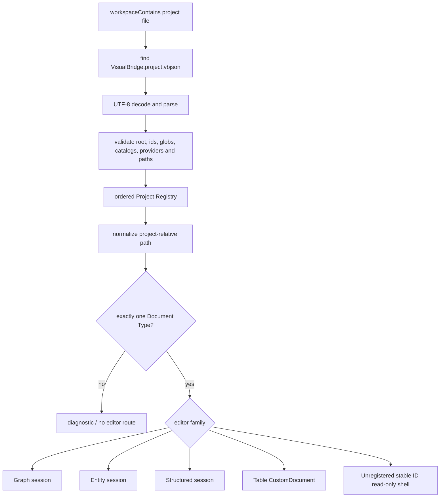
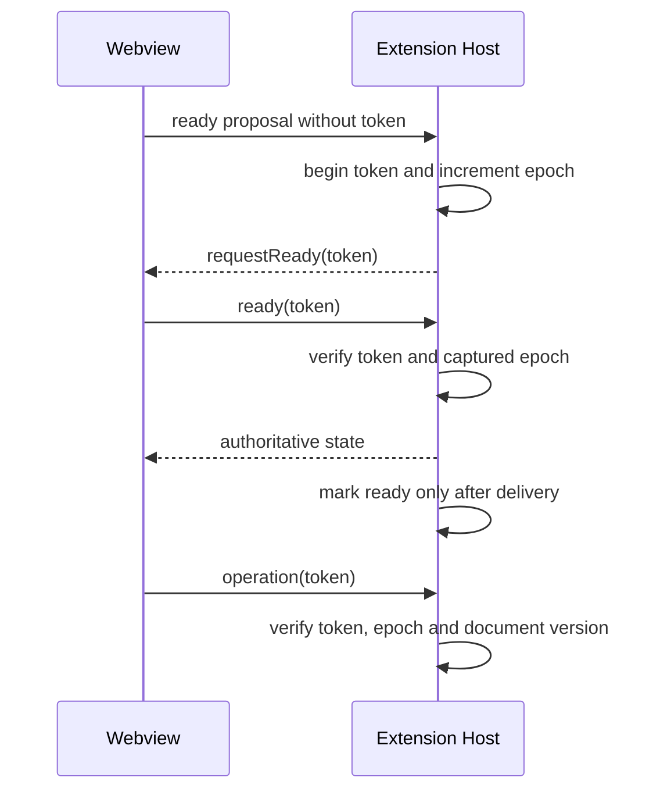

# VS Code Host

## 文档定位

本文记录 `Tools/VSCodeExtension` 当前已落地的宿主行为：激活、Project Registry、Custom Editor 路由、Webview 生命周期、保存/冲突、诊断和 Workspace Trust。领域格式与 Operation 仍由 Core 和 Built-in Extensions 拥有；本 Host 只把它们接入 VS Code API。

共享字段控件见 [`FormFieldEditor.md`](FormFieldEditor.md)，多文件写入与恢复见 [`ProjectTransaction.md`](ProjectTransaction.md)。

## 激活与公开入口

扩展在工作区包含 `VisualBridge.project.vbjson` 时激活。激活过程创建 Project Registry、Project Provider Service、Workspace Document Index、Reference Service、Reference Refactor、Document Lifecycle、三个文本文档编辑会话族、Table CustomDocument Provider、Project Settings Provider，以及 Documents、Catalogs、Problems / References 三棵 Tree View。服务、provider、watcher、diagnostic collection 和命令都进入扩展订阅统一释放。

manifest 当前公开 4 个 Custom Editor view type：

| View type | 载体与用途 |
| --- | --- |
| `visualbridge.projectSettingsEditor` | Project File 的 TextDocument 编辑器 |
| `visualbridge.documentEditor` | 默认 Graph/Entity/Structured 文本文档入口 |
| `visualbridge.documentEditor.option` | 项目自定义后缀使用的显式打开入口 |
| `visualbridge.tableEditor` | CSV family/XLSX 的 CustomDocument 编辑器 |

`visualbridge.documentEditor` 与 `.option` 由同一个 Provider 接受，再由 Project Registry 的可扩展稳定 `documentTypes[].editor` ID 路由：已注册的 `graph`、`entity`、`structured` 进入领域会话，未注册 ID 进入显示 Project/Type/Adapter/路径和当前源码的通用只读 Document Shell。Shell 不建立领域编辑、语义索引、Reference 或 Lifecycle。Table 独立使用 CustomDocument，因为一个逻辑文档可能拥有多个 CSV 物理源或一个二进制 workbook。所有 view 都允许同一文档打开多个编辑器实例，并设置 `retainContextWhenHidden: false`。

三棵 Tree View 是 `visualbridge.documents`、`visualbridge.catalogs` 和 `visualbridge.documentDetails`。Documents 中的文件是叶子节点，文件名后直接显示 Problems 与 References 图标和数量；选择文件会让同层级、可折叠的 `visualbridge.documentDetails` 显示该文件的两组扁平详情。文件行的两个内联图标可展开并聚焦对应分组，Problems 使用中文说明，问题项右键可复制中文详情。manifest 贡献 25 条用户命令：Project 刷新/打开、Project Settings、四类文档创建、通用创建、元素安全删除；Document Browser 的刷新、搜索、全量校验、打开、创建、复制、重命名路径、移动、安全删除、显示 Problems、显示 References、复制问题详情、揭示引用和重命名引用目标；Catalog Browser 的刷新与打开。内部测试命令不计入这 25 条公开命令。

## Project Registry 与编辑器路由

Registry 使用文件 watcher 监听 Project File 的创建、修改和删除，并合并短时间内的重复事件。每次刷新重新发现并解析工程，拒绝无效 UTF-8、无效 Project、重复 `projectId`、Document Type 归属歧义、Catalog 编辑器冲突、越界/不可用路径和逃出根目录的 canonical path。多个 Project 嵌套时按根路径从具体到宽泛排序，使最近工程边界优先。

打开文件时，Host 先得到所属 Project 的规范相对路径，再按 `documentRoots`、`include` 和 `exclude` 查找匹配的 Document Type。只有唯一匹配才进入编辑器；文件后缀本身不决定业务类型。Table 路由到 `visualbridge.tableEditor`，其余文本类型进入通用文档 view，再由已注册 Adapter 创建 Graph/Entity/Structured 会话或由未注册稳定 ID 创建只读 Shell。Document Browser 只聚合已有语义 Adapter 的索引项；`VisualBridge: Open Document` 和默认文件关联最终都经过同一 Registry 判断。

## Webview ready、token 与 epoch

Webview 的 `ready` 不是可跨生命周期复用的布尔值。每个 panel 使用 Host 生成的 token 和单调递增 epoch：

除首次 ready proposal 外，所有 Webview 上行消息都必须携带当前 token。Host 在任何异步工作前捕获 epoch/文档版本，并在准备写入前再次复核；旧页面、旧 picker、旧 Operation 或已释放 panel 的消息不能落到新会话。`postMessage` 通过安全包装处理已释放 Webview，并把投递失败当作未送达，而不是未捕获异常。

panel 隐藏时 Host 使当前 epoch/token 失效并把 reveal mailbox 标为不可用；再次可见时建立新 token 并重新握手。由于 `retainContextWhenHidden` 为 false，Host 同时支持页面仍存活和页面已重建两种情况，不依赖 Webview 私有内存恢复权威状态。

Graph、Entity 和 Table 的 reveal 使用 mailbox。请求有 request id，Webview ACK 后才从队列移除；隐藏或销毁时未确认请求可交接到可用 panel。Table 在同一逻辑 CustomDocument 的多个 panel 间使用 generation/latest-wins 选择当前目标。Structured 引用当前只需打开文档，没有元素级 reveal mailbox。

## 文本文档：Undo/Redo、保存和外部冲突

Graph、Entity 和 Structured 使用 `CustomTextEditorProvider` 连接 `vscode.TextDocument`。一次 Webview Operation 经 Core 应用和序列化后，以单次 `WorkspaceEdit.replace` 写回完整文本。由此 dirty 状态、Save、Undo 和 Redo 都属于 VS Code 文本文档模型；会话监听 `onDidChangeTextDocument`，在 Undo/Redo 后重新解析并向 Webview 发送带 `historyAction` 的权威状态。

每个会话记录磁盘基线 Hash。Operation 真正应用前会读取当前磁盘并处理外部变化：文档未脏时可以重新载入新基线；文档已脏时必须由用户选择覆盖外部内容、放弃本地内容并重新载入，或取消。未选择时不写入，不静默覆盖，也不在 stale token/version 后自动重复 Operation。

同一 URI 的多个 panel 各自拥有 token/epoch 和诊断快照，但共享 VS Code TextDocument。任何 panel 产生的 WorkspaceEdit 都会通过 TextDocument change 事件刷新其他 panel。诊断按 owner 聚合：释放一个 panel 只移除该 owner 的快照，最后一个 owner 释放时才清理 URI 的编辑器诊断，避免 split editor 互相清空 Problems。

Project Settings 同样建立在 TextDocument/WorkspaceEdit 上，并使用相同的 ready/token/epoch 原则；它的合法字段、路径归属和冲突行为由 [`ProjectCatalogManagement.md`](ProjectCatalogManagement.md) 定义。

## Table CustomDocument：编辑、保存、备份和冲突

Table 使用 `CustomEditorProvider<TableCustomDocument>`，内存语义模型是 VS Code dirty 状态的当前内容。每个成功的 Table Operation 发出 `onDidChangeCustomDocument` edit event，并携带以 before/after 快照实现的 `undo` 与 `redo` 回调。多个 panel 共享同一 CustomDocument 和编辑历史。

保存时 Host 从当前模型确定性渲染全部物理 source，复核每个 source 的基线 Hash/存在性，再通过 Project Transaction 一次提交。CSV family 的多个分表必须作为一个逻辑保存单元；XLSX 以原始 workbook bytes 为 carrier 修改目标 worksheet，保留不属于目标表格语义的 workbook 内容。任一冲突都不允许先写一部分 source。

`saveCustomDocumentAs`、`revertCustomDocument` 和 `backupCustomDocument` 均由 Provider 实现。backup 是 Host 私有恢复载体，记录逻辑文档所需的物理 source bytes；从 `backupId` 打开时恢复未保存状态。backup 不是 Authoring 格式，也不能替代保存时对当前磁盘基线的检查。

检测到外部 source 改变时，Table Operation 会被拒绝，保存事务也会以“未写入任何 source”的冲突失败；用户必须通过 Revert/重新打开从磁盘恢复后再编辑。当前 Table 保存没有静默合并或强制覆盖分支。已提交但后续索引刷新失败与提交前失败是不同结果：前者不得声称“未应用”，也不得自动重复物理写入，只能报告内容已提交而刷新失败并允许安全刷新。

## Diagnostics、Problems 与 Output

激活时建立四个 Diagnostic Collection：

- `visualbridge-project`：Project File、工程边界与声明错误。
- `visualbridge-document`：当前编辑文档和 Table 诊断。
- `visualbridge-workspace`：Workspace Index、跨文档引用与全量校验。
- `visualbridge-catalog`：Catalog 解析、冲突和来源状态。

所有 collection 直接进入 VS Code Problems。刷新或 owner 变化必须以当前完整快照替换对应 URI 的诊断；项目移除、文档关闭或最后 owner 释放时清理其诊断，不能让旧问题长期残留。Document Browser 的 Validate All 会刷新 Workspace Index，并可引导用户打开 Problems；Catalog Browser 和 Project Registry 分别维护自己的 collection。

名为 `VisualBridge` 的 log Output Channel 记录激活、Project、Provider、Index、编辑器、事务和恢复信息。日志用于解释行为和保留错误上下文；可操作错误仍应通过诊断或 VS Code notification 呈现，不能要求用户只查日志。

## Workspace Trust 与运行边界

manifest 声明支持 untrusted workspace，但这只表示声明式 Project/Catalog/Document 能在受限模式下解析和编辑。Project Provider 是工程提供的可执行 `.mjs`，只有在 workspace trusted、工程使用本地 `file` URI 且声明了 provider 时才启动；授予 Trust 后服务重新建立 provider hosts。provider 始终运行在独立 Node 进程，不能加载进 Extension Host。

扩展明确不支持 virtual workspace。Lifecycle、Table 多来源写入、Project Transaction 和 provider 都以本地文件系统语义为前提；Remote/Web 场景不能从单文件读取成功推断为受支持。

## 验证边界

Host 自动化使用固定 VS Code `1.105.1` 的隔离 Extension Development Host，工作区由 `TestData` 复制，不能修改仓库样例或用户配置。VSIX 验收还需在隔离的 User Data 与 Extensions 目录安装并确认实际激活；仅打包成功或 CLI 报告安装成功，不证明 Webview、资源或命令路由有效。

当前仓库固定 Node.js `22.22.1` 和 npm `10.9.4`。开发、Host 测试和 provider/MCP 运行应使用该基线，不能把更宽松的本机 Node 范围当成发布契约。
