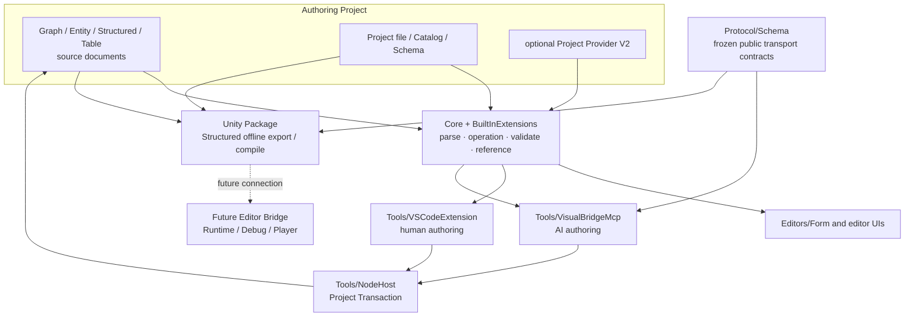
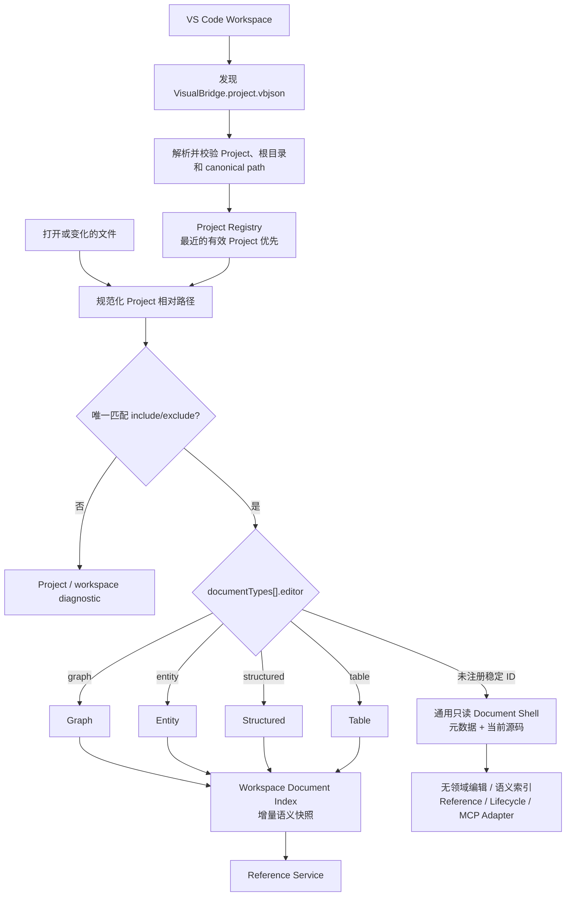
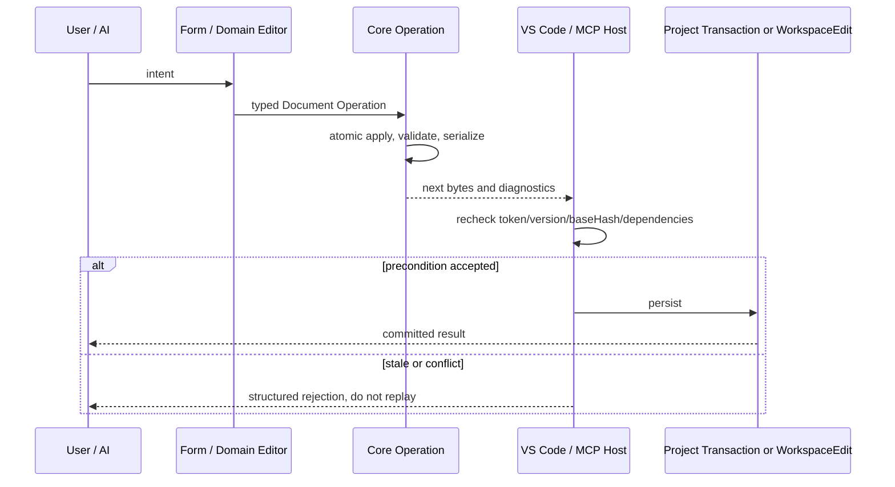

# VisualBridge 架构设计

## 文档定位

本文描述 VisualBridge，一个基于 VS Code 的游戏语义内容创作平台。平台用于承载游戏逻辑、游戏流程、结构化属性、数据引用和运行时调试等不依赖模型与实时渲染的编辑工作，并通过 Unity Bridge 与 Unity Editor 和 Player 协作。

本文是当前 VisualBridge 单仓库的架构基线，主要确定：

- Authoring Project、Document、当前扩展入口和未来 Runtime 的边界。
- VS Code 基础插件、项目扩展、Unity Bridge 和 MCP 的职责。
- 编辑数据、描述文件、生成数据和运行时数据的所有权。
- Unity/Player 通信、实例发现和多客户端调试尚待设计时必须遵守的边界。
- 平台仓库的现状和游戏工程的建议目录结构。
- 分阶段开发路径。

本文不约束具体游戏项目。当前已实现的 JSON Schema、协议、编辑器和 Host 行为以 `Protocol/Schema`、源码及对应正式文档为准；Unity Bridge、Runtime、Debug 等尚未落地的边界继续在实施阶段单独设计，不能用本文的概念图臆造字段。

## 产品定位

平台定位为“游戏语义内容创作工具”，不试图重新实现 Unity Editor。

适合迁移到 VisualBridge 的工作：

- 游戏逻辑图。
- 游戏流程、状态机和规则编排。
- 行为树、任务、对话和关卡流程。
- 属性配置和结构化数据。
- 表格型配置。
- 跨文档和游戏数据引用。
- 批量查找、校验、重构和格式迁移。
- 节点、状态和流程级调试（未来 Unity/Debug 阶段）。
- AI 读取、生成和修改游戏内容。

继续保留在 Unity 的工作：

- Scene 和 Prefab 空间编辑。
- 模型、材质、Shader、贴图和渲染预览。
- 强依赖 SceneView、Gizmo 和 GameObject 的编辑器。
- 动画、Timeline 和需要实时画面反馈的内容。
- Unity 原生资产导入与平台构建。

两侧通过 Catalog、稳定引用和调试协议协作，而不是互相加载对方的 UI 或内部对象。

## 设计目标

### 核心目标

- 用一个通用 VS Code 基础插件承载多种游戏语义文档。
- Authoring Project 能同时包含编辑文件、描述文件、项目扩展和工具入口。
- VisualBridge 原生文档采用适合 Git、代码评审和 AI 修改的文本格式；`.xlsx` 和 `.csv` 等 Table Document 载体通过 Codec 与 MCP 访问。
- C#、游戏配置或外部数据能够生成编辑器所需的 Catalog 和引用描述。
- 项目业务扩展不需要修改基础插件。
- VS Code 和 MCP 使用同一套核心编辑与校验能力。
- 未来 Unity Editor 和 Player 接入时使用同一份经过独立设计的上层调试契约。
- 未来多个 VS Code 窗口、AI Agent 和 Unity 实例接入时能够明确路由和协调。
- 平台先通过少量垂直切片验证，再逐步扩展文档类型。

### 非目标

- 当前 Authoring 基线不实现多人实时协同编辑。
- 当前 Authoring 基线不支持 VS Code Web、Codespaces 和 Remote SSH。
- 当前 Authoring 基线不提供任意业务代码的安全沙箱。
- 当前 Authoring 基线不替代 Unity 的场景和资源编辑器。
- 当前 Authoring 基线不建立中心化云服务。
- 本文不重复各领域正式文档已经冻结的字段，也不预先冻结尚未实现的 Unity/Debug 格式和兼容策略。

## 核心原则

### 源文件是唯一权威数据

Authoring 文档是游戏语义内容的源数据。Unity 导入资产、运行时数组、索引、缓存和调试状态都是派生数据。

```text
Authoring Source Documents
    -> 校验与编译
    -> Unity Editor 数据
    -> Runtime 数据
```

VS Code Webview 只是源文件的可视化视图，不能维护第二份权威文档状态。所有编辑最终通过 Document Operation 作用于当前 Document Type 声明的权威文件载体。

### 描述与实例分离

Catalog 和 Schema 描述“可以编辑什么”；Authoring Document 描述“项目实际创建了什么”。

```text
类型、节点、端口、属性、引用规则
    -> Catalog / Schema

节点实例、属性值、连接、流程
    -> Authoring Document
```

Catalog 可以由 Unity C#、外部配置或项目扩展生成。Document 不复制能够从 Catalog 推导的内容。

### 稳定身份与显示信息分离

当前 Project、Document、Document Type、Element、Reference 和 Graph 连接都使用稳定 ID。文件名、路径、显示名称和 C# 类型名允许变化，不能直接承担永久身份。未来 Runtime Instance 若需要跨进程寻址，必须另行定义稳定身份及其与 Authoring ID 的映射；当前协议没有 Runtime Instance ID。

### 平台机制与业务语义分离

当前基础插件提供工程发现、文档编辑、Catalog、引用、诊断、事务和 MCP Authoring 机制。技能、道具、战斗节点、任务规则等业务语义由 Catalog 和已授权 Project Provider 提供；Unity 通信和调试机制尚未实现。

### 声明优先，代码扩展兜底

属性、类型、菜单、引用和常见校验优先通过 JSON 声明表达。只有动态查询、复杂校验和特殊 UI 才使用可执行扩展。

### AI 与人工使用同一核心

VS Code 和 MCP 都依赖 VisualBridgeCore 与 Built-in 语义包，不分别实现 Parser、Catalog、Operation、Validator、Reference 或 Serializer。普通 VS Code 文本文档编辑使用 TextDocument / WorkspaceEdit 以保留 Undo/Redo；VS Code Lifecycle、Reference Refactor、Table 多来源保存与所有 MCP 写入通过 `Tools/NodeHost` 共用可恢复 Project Transaction。完整锁、Hash、journal 和恢复契约见 [`ProjectTransaction.md`](ProjectTransaction.md)。

## 总体架构



当前实线部分已经在单仓库中落地。Unity Package 已消费同源生成的 C# wire/data bags，并通过 strict `JObject` validator 完成 Profile、Project、Structured Catalog/Document 的离线 Export/Compile；虚线仍表示尚未实现的 Editor Bridge、Runtime、Debug、DAP 与 Player 边界。

## Authoring Project

### 工程概念

Authoring Project 是平台自己的工程边界，与 Unity Project 和 VS Code Workspace 是不同概念：

- Unity Integration Profile V1 固定为每个 Unity Project 关联一个位于该 Unity Project 内的 Authoring Project；VS Code Registry 仍只根据工作区中的 Project File 建立边界，不读取 Unity 工程状态。未来多 Project 关联需要先升级 Profile contract。
- 一个 VS Code 窗口可以加载多个 Authoring Project。
- 一个 Authoring Project 可以声明多个 Project 相对文档根目录。
- VS Code 使用的 Project File 可以位于本地工作区内任意工程目录；Unity slice 通过独立的 `ProjectSettings/VisualBridgeIntegration.json` 指向 Unity Project 内的 Project File，不向 Project V1 增加 Unity 字段。

可编辑根目录由固定的 `VisualBridge.project.vbjson` 标识。该文件使用 VisualBridge 专属文件名和 `.vbjson` 后缀，内容为 JSON。VS Code 插件只有在工作区中发现并成功解析该文件后，才启用 VisualBridge 工程功能。

### 当前可运行工程结构

```text
AuthoringRoot/
├─ VisualBridge.project.vbjson
├─ Catalog/
│  ├─ Gameplay.vbgraphcatalog
│  ├─ Gameplay.vbentitycatalog
│  ├─ Gameplay.vbstructuredcatalog
│  └─ Gameplay.vbtablecatalog
├─ Logic/
├─ Entities/
├─ Config/
├─ Tables/
└─ Providers/
   └─ optional-provider.mjs
```

目录职责：

- `VisualBridge.project.vbjson`：当前唯一的工程边界与插件启用标识。
- `Catalog`：Project File 显式引用的四类外部描述文件；目录名可以自定义。
- `Logic`、`Entities`、`Config` 和 `Tables`：示例中的 Authoring 源目录；实际名称和后缀完全由 `documentRoots` 与 `include` / `exclude` 决定。
- `Providers`：可选的已构建 Project Provider V2 `.mjs` 入口；只有 Project 声明且宿主授权后运行。

维护中的通用 Authoring 结构见 [`Samples/PreUnityAuthoring`](../Samples/PreUnityAuthoring/README.md)；Unity 固定样例位于 `UnityProject/VisualBridgeAuthoring`。当前 Structured Compiler 只在 `UnityProject/Library/VisualBridge/Compiled` 创建可删除派生数据，不创建 `.visualbridge/generated`、`.visualbridge/cache` 或 `Library/VisualBridge/Discovery`；Bridge discovery 位置仍未设计。

### VisualBridge Project File 职责

VisualBridge Project File 当前声明：

- `projectId` 和 `formatVersion`。
- `documentRoots` 与每个 Document Type 的 `include` / `exclude`。
- Document Type 的稳定 `id`、可扩展稳定 `editor` Adapter ID 和 Catalog 路径。
- 全 Project 的 Table 行布局。
- 可选 Project Provider V2 的入口、参数和能力上限。

当前 Schema 不包含项目 Webview Manifest、Unity Profile、生成范围或工具版本字段。未来需要这些能力时必须先扩展正式 Schema、Core Parser、Project Settings 和 Host 验证，不能把未登记键写进 Project File。

VisualBridge Project File 不保存编辑器窗口状态、连接端口、当前调试会话和其他临时信息。

当前路由核心由 `formatVersion`、`projectId`、`documentRoots` 和 `documentTypes` 构成，并可带 `tableLayout` 与 `providers`。每个 Document Type 至少声明稳定 `id`、可扩展稳定 Adapter ID `editor`、包含规则 `include`，并可声明排除规则 `exclude` 和工程相对 `catalogs` 数组。Schema 与 Core 接受任意合法稳定 `editor` ID；当前注册并提供完整语义的值为 `graph`、`entity`、`structured` 和 `table`。未注册 ID 仍可被 Project Registry 唯一匹配，VS Code 只为其打开显示元数据和当前源码的通用只读 Document Shell，不建立领域编辑、Catalog 语义、语义索引、Reference 或 Lifecycle；MCP Project 读取/清单保留该声明并报告 `adapterAvailable: false`，其他依赖领域 Adapter 的语义操作不可用。`id` 表示项目在该 Adapter 下扩展的业务子类；文件扩展名完全由 `include` / `exclude` 决定，不参与 Adapter 判断。同一个实际文件必须只匹配一个 Document Type，业务子类不得依赖声明顺序解决 Glob 重叠。路径和 Glob 统一使用 `/` 分隔，所有文档根目录和 Catalog 必须位于 Project File 所在目录内。

### 工程发现和索引

插件首先在当前 VS Code Workspace 中发现 VisualBridge Project File。只有发现并成功解析该文件的工程才创建 ProjectContext。打开 Authoring 文件时，再从当前文件目录向上寻找最近的 VisualBridge Project File，以确定文件归属。



工程索引只使用已注册 Adapter 的既有 Parser、Catalog Registry、Validator 和 Reference Collector，不为未注册稳定 ID 建立简化或猜测语义。当前 VS Code Host 在激活时建立四个内置 Adapter 的文档基线，随后按 Project、Document Type、Catalog 依赖和逻辑物理来源增量复用不可变语义单元；Reference Service 消费同一 Project Snapshot。刷新支持事件合并、取消、进度与陈旧 generation 丢弃，增量与强制完整重建必须产生相同稳定排序、诊断和引用结果。完整契约见 [`WorkspaceIndexPerformance.md`](WorkspaceIndexPerformance.md)。

项目级重构同样建立在语义索引和 Reference Provider 之上。当前支持唯一解析的 `document`、`entity.component`、`graph.element` 和 `table.row`：Core 生成按完整目标位置匹配的确定性影响计划，各 Document Type 通过正式语义变换、Validator 和 Serializer 生成修改，VS Code 与 MCP Host 使用源哈希、临时载体和 rollback 副本提交多文件事务。不得退化为跨工程文本替换。完整约束见 [`ProjectRefactoring.md`](ProjectRefactoring.md)。

Document Lifecycle 负责创建、复制、物理路径移动和安全删除。它与稳定 ID 重构共享索引、Reference Provider 和 Project Transaction，但路径不承担身份：Path Move 保持字节与稳定 ID 不变，Stable ID Rename 继续走 Project Refactoring。V1 只允许一个宿主无关 Lifecycle Service，并要求 strict preview/apply、调用方完整提交 `stableIdRemap`、Delete closure 和 Reference coverage；VS Code、Browser 与 MCP 不分别实现文件操作规则。完整契约见 [`DocumentLifecycle.md`](DocumentLifecycle.md)。

## Document System

### Document Type

平台以 Document Type 作为核心扩展点。当前每种内置文档类型提供：

```text
DocumentType
├─ TypeId 与文件匹配规则
├─ Schema 与版本
├─ Parser / Serializer
├─ Editor 类型
├─ Edit Operations
├─ Validators
├─ Reference Rules
└─ Lifecycle Adapter / Stable ID Remap / Delete Closure
```

当前 Unity Structured Exporter/Compiler 不属于 VS Code Document Type Adapter 注册契约；它们依据冻结的 Profile、Project、Catalog/Document 与显式 C# metadata 独立运行。Debug Mapping 仍未设计。

当前平台支持：

- Graph Document：逻辑图、状态机、游戏流程。
- Entity Document：Entity 根配置与可组合 Component 列表。
- Structured Document：属性、对象和集合配置。
- Table Document：表格型配置。

对话、任务、行为树和时间轴等文档在核心稳定后增加。

### Graph Document V3 与 Graph Catalog V4

当前落地的 Graph Document 使用 `.vbgraph` JSON 文本格式，并通过 Graph Catalog 提供语义规则：

- 顶层包含 `formatVersion`、`documentId`、`rootGraphId` 和平铺的 `graphs` 集合。
- 每个 Graph 自身包含稳定 ID、显示名称、JSON 属性和公开接口；右侧 Graph Inspector 只编辑当前 Graph，并可折叠到画布侧边。
- 一个文件拥有根图及其内嵌子图；子图节点以稳定 `subgraphId` 独占另一个 Graph，包含关系不得递归成环。
- Node、Node Type、Port、Property、Graph 和 Graph Interface 均使用独立于显示名称与实现类名的稳定 ID。
- Edge 显式区分 `flow` 与 `data`。流程边决定执行顺序并允许环路；数据边只传值，不决定执行顺序。
- Graph Document Type 可以加载多个 Graph Catalog。Registry 记录每个节点类型的所属 Catalog，并统一解析 Graph Type、节点类型、跨 Catalog Data Type 和旧类型 alias。
- Graph Catalog V4 定义节点类型、端口方向、连接种类、数据类型及其可选显示颜色、连接数量、属性、默认值和旧类型别名。未配置颜色时编辑器按 Data Type ID 从内置色板稳定取色；颜色只影响字段、数据端口与数据连线的呈现。Graph Type 以 `supportedCatalogIds` 粗筛节点 Catalog，再以可选 `allowedNodeSelectors` 精筛节点。
- C# 数值语义在 Data Type ID 中保持为独立的 `int` 与 `float`，不得合并成 `number`。属性的 `valueType: "number"` 仅描述 JSON 数值形态和编辑控件；Unity Catalog Exporter 将 `System.Int32`/`System.Single` 分别映射到 `int`/`float`。
- `List<T>` 字段由带稳定元素 ID 的数据动态组承载，并以 `listPortMode` 在“整个 List 一个输入端口”和“每个元素一个输入端口”之间二选一。元素顺序变化不改变连线身份；整个 List 连接时覆盖完整字面列表，元素连接时只覆盖对应元素。
- `portConnectionRules` 定义 Graph Type 输入/输出端口的 `single` 或 `multiple` 规则；端口 `maxConnections` 只能进一步收紧。跨 Catalog 数据连接继续遵守同一套全局 Data Type 兼容规则。
- 编辑器向有效但已占用的单连接端口创建新连线时，在同一批 Operation 中先删除旧连线再添加新连线；多连接端口达到上限后仍拒绝连接，不自动猜测应替换哪一条。
- 子图通过稳定公开接口与父图连接；跨图连接不能绕过接口直接指向内部节点。子图输入/输出接口节点可创建稳定 ID 的动态数据参数；其类型由子图内部或父图外部首次具体连接锁定，只要任一侧仍有连接就保持，全部断开后恢复 `any`。动态参数在子图接口节点和父图调用节点中始终显示，未锁定的 `any` 状态使用浅灰色。
- Graph Webview 使用 React 与 React Flow 的受控模式实现画布交互；React Flow 状态仅作为视图状态，不作为文档格式或权威数据源。
- Parser 拒绝未知结构，Serializer 对 Graph、节点、连线和属性键进行确定性排序；接口数组保留用户拖动后的声明顺序。找不到 Catalog 节点类型时仍保留全部原始节点数据。
- Core Operation 覆盖 Graph、节点、内嵌子图、公开接口、连线、安全节点类型替换和稳定元素 ID 重命名；`graph.renameElement` 会同步修正所有结构与连接端点。

节点标题与 Catalog 字段直接在画布节点上编辑，节点类型只展示不可直接改写。用户通过节点右键菜单请求替换，Core 仅接受不会丢失属性或连线的候选，并以一个 Operation 完成替换。完整落地契约见 [`GraphSemanticModel.md`](GraphSemanticModel.md)。当前实现范围仍只包含离线编辑，不连接 Unity。

### Entity Document V1 与共享字段模型

当前落地的 Entity Document 保存 Entity 根属性和有序 Component 实例。Entity Catalog V1 声明 Component Group、Entity Type、允许的 Group、Component Type、菜单路径、来源追踪和字段定义；同一 Document Type 可以加载多个 Catalog，并以全局无歧义的稳定 ID / alias 建立 Registry。

Entity 的组织方式借鉴旧配置编辑器的 Entity、分组和 Component 卡片概念，但 Authoring JSON 直接替代 `ScriptableObject` 编辑数据，不迁移 `ScriptableObject`、子资源、包装配置或 Export 按钮。正式游戏项目只保留运行时真正使用的普通 C# class / struct。

字段能力位于 Core 与共享 Form Editor，而不是 Entity 私有实现。数值、颜色、选择项、引用、List 和非框架普通自定义结构体都通过递归字段定义表达；`valueType` 描述 JSON 形态，`dataTypeId` 保留 `int`、`float` 和游戏结构等运行时语义。Graph、Structured、Table 与后续编辑器应复用这套字段解析、校验和 UI 原语。字段 List 的布局与交互同样属于共享 Form Editor：元素操作区统一放置 dnd-kit 拖拽手柄、在后添加和删除图标，排序结束后以一次字段提交进入宿主 Document Operation。Entity Component、Table Record 与 Graph 稳定端口列表也必须沿用“拖拽、在后添加、删除”的图标顺序和紧邻操作组；它们仍分别提交自己的 Operation，不把领域身份或连接规则下沉到 Form Editor。

Entity Document 的默认便利后缀是 `.vbentity`，但业务文件可以使用 Project File 声明的任意扩展名。完整格式、Operation、编辑器行为和未来 Unity 生成约束见 [`EntityComponentModel.md`](EntityComponentModel.md)。

### Structured Config V1

当前落地的 Structured Config 保存一个普通 C# class / struct 对应的单根配置对象。Project File 的 `editor: "structured"` 只选择编辑器大类；Document Type 的稳定 `id` 直接解析到 Structured Catalog Registry 中一个 Config Type 的规范 ID 或 alias，`include` / `exclude` 负责自定义文件扩展名。类型绑定只有 Project Document Type 一个权威来源，Structured 文件不重复保存 `configTypeId`。

Structured Catalog V1 声明 Config Type、来源追踪和共享 Field Definition。文件只包含 `formatVersion`、稳定 `documentId` 和完整 `properties`，不保存标题、路径或 C# 类型名。创建时递归物化全部默认字段；编辑器复用共享 Form/Reference 原语，修改以 `structured.setField` 批次进入 Core；MCP 复用同一语义，并与 Graph、Entity、Table 和 Refactor 共用 `baseHash` 检查与可恢复 Project Transaction。

当前不提供旧格式兼容或迁移层。Unity Structured offline slice 已实现 Catalog Export 与 Editor 派生编译，但不提供 Runtime loader/行为、Debug、DAP、Player 或 `ScriptableObject` 工作流。Authoring 契约见 [`StructuredConfigModel.md`](StructuredConfigModel.md)，Unity 边界见 [`UnityIntegrationArchitecture.md`](UnityIntegrationArchitecture.md)。

### Table 与 Excel

Table Document 是平台的通用表格语义模型。Excel 是它支持的一种文件载体和交换格式，不单独形成一套与 Document System 平行的编辑体系。

```text
Table Document
├─ Semantic Table Model
├─ Schema / Column Rules
├─ Table Operations
├─ Validation / Reference
├─ Table Editor Webview
└─ Codec
   ├─ Authoring Text Codec
   └─ Excel Workbook Codec
```

工程必须明确每类表格的数据所有权：

- Authoring Text 为权威数据，Excel 只用于导入和导出；这是面向 Git、AI 和多人协作的默认建议。
- `.xlsx` 为权威数据，由 Excel Workbook Codec 统一解析和写回；适用于必须延续现有 Excel 工作流的工程。

无论采用哪种所有权，UI、MCP 和 Unity Compiler 都面向 Semantic Table Model 与 Table Operations，不直接操作工作簿内部二进制结构。工程描述文件和 Provider 可以扩展列类型、枚举、数据引用、Unity 资产引用、校验、预览和跳转能力。

AI 不直接读取或改写 `.xlsx` 和 `.csv` 载体。即使 `.csv` 在物理上是文本，对 AI 也视为 Table Document 载体；AI 必须通过 MCP 提供的表格查询、搜索和修改能力访问 Semantic Table Model。MCP 内部统一使用 Table Codec 和 Table Operations，避免 AI 绕过 Schema、引用和校验规则。

当前 Table V1 只承诺受约束的游戏数据工作簿。宏、图表、透视表、外部链接、复杂公式和完整样式往返保真不在通用 Table Editor 的承诺范围内。

当前 Table V1 已落地 Table Catalog、CSV/XLSX Codec、Table Operation、记录式主从编辑器与固定样例。Project File 统一配置一基的 `nameKeyRow` 和 `dataStartRow`；C# 导出的 Catalog 负责列稳定 ID、类型、共享字段编辑器、单元格编码，以及由稳定 Column ID 占位符组成的 `rowDisplayNamePattern`（例如 `{id}_{name}`）。一个逻辑 Sheet 可以通过 `{part}` 命名模板映射到多个同结构 CSV 文件或 XLSX Worksheet，并按稳定列 ID 执行 `error`、`keepFirst` 或 `keepLast` 去重策略。物理源不因去重而丢失，编译和查询使用策略解析后的有效行。完整契约见 [`TableSemanticModel.md`](TableSemanticModel.md)。

### 编辑器原语

当前基础插件提供有限但高复用的编辑器原语：

- Graph Canvas。
- 可折叠 Graph Inspector，以及节点内联字段编辑。
- 共享 Form Field Editor：数值、颜色、选择项、对象、集合和 JSON。
- Entity / Component Editor。
- Structured Config Editor。
- Table Editor。
- Reference Picker。
- 递归 Object 和 List Editor。
- Search、Command Palette 和 Problems。

Dictionary 专用编辑器、通用 Diff Preview 和 Runtime Trace Overlay 尚未实现；未来若需要，必须先明确可复用语义和真实用例，不能把普通 object/list 控件描述成已经具备这些能力。

业务 Document Type 应优先组合原语，而不是为每种配置重新实现完整 Webview。

### 编辑事务

所有编辑通过领域操作完成：



编辑事务至少具备：

- `baseHash` 或等价版本前置条件。
- 批量操作和全部成功/全部失败语义。
- 稳定 ID 生成。
- 完整文档校验。
- 确定性格式化。
- 结构化诊断和变更摘要。

DocumentSession 保存当前编辑基线的 Hash。VS Code 在实际写入前再次检查目标文件；如果目标文件自基线建立后已被其他窗口、AI、MCP 或外部程序修改，不自动合并或静默覆盖，而是向用户提供：

- 覆盖：使用当前 DocumentSession 内容覆盖磁盘上的外部变更。
- 放弃并刷新：放弃当前未写入变更，重新读取目标文件并刷新编辑窗口。

用户未做出选择时不执行写入。MCP 遇到同类 `baseHash` 冲突时返回结构化冲突结果，不自动覆盖。

VS Code 的文本 Document 通过 `WorkspaceEdit` 保留 Undo/Redo。`.xlsx` 等二进制 Document 通过 Custom Document 的编辑事件、保存和备份机制与 VS Code 协作。MCP 采用原子文件写入。两者使用同一 Operation 模型，但按文件载体使用不同的宿主持久化适配。

共享字段的 UI 提交粒度见 [`FormFieldEditor.md`](FormFieldEditor.md)，VS Code 的 TextDocument、Table CustomDocument、Webview token/epoch 和诊断所有权见 [`VSCodeHost.md`](VSCodeHost.md)。

### Document Lifecycle V1

Lifecycle 不属于普通 Document Operation：它会改变物理 source manifest、创建新身份或删除可被 Reference Provider 寻址的目标，因此必须先 preview、后 apply。调用方在 preview operation 中完整提供 Copy `stableIdRemap` 或 Create `parameters`；preview 返回 `previewHash`、`planPayload` 和包含 dependencies/baseHashes/mutations 的规范 plan。Apply 原样带回 operation、hash、payload、bases 和 dependencies，并在 Project 锁内重建相同计划。任何变化都以 conflict 结束，不自动套用旧计划。

V1 只允许同一 Project、同一 Project Document Type 内操作。Graph/Entity/Structured 的 Path Move 保持单文件字节不变；Table 的 CSV family 以完整分表 manifest 为一个逻辑 Document，XLSX 以整个 Workbook 为单位。Copy 由领域 Adapter 显式 remap 全部可寻址内部身份；Delete 在 Reference coverage 不完整或闭包外存在入站 occurrence 时拒绝，不提供通用级联。

所有公开写入口都受 Safe Delete guard 约束。直接移除 Component、Graph Node/Interface/Dynamic Port 或 Table Row 的普通 Operation 在 Lifecycle apply 上下文外返回 `lifecycle.required`；领域编辑器、Document Browser 与目标 MCP 入口必须调用同一 Lifecycle Service。目标 Project Transaction 将 physical mutation 表达为 `replace`、`create`、`delete` 或 `move`，同时校验 `baseHash` 与 mutation 的 `targetMustBeAbsent`。

Lifecycle preview/apply 要求 Project 中没有未保存的 VisualBridge TextDocument 或 Table CustomDocument；干净的已打开 Table Editor 不会单独阻止 Lifecycle。Explorer、Git 和外部脚本不是协作写者，只能依靠文件监听、Hash/absence 复核和重新索引检测；本地文件系统事务不承诺 Remote Workspace、突然断电或最后一次原子文件系统调用处的数据库级隔离。

### 数据所有权

源文件只保存领域必要信息，不保存能够推导的运行时数据，例如：

- Unity Object 本地引用。
- 运行时数组索引。
- 临时连接状态。
- 调试断点和当前执行位置。
- UI 组件内部序列化状态。
- Provider 缓存。

编辑布局是否属于源文件由 Document Type 决定；如果布局影响协作和可读性，则作为明确的 Editor Metadata 保存。

## Catalog 与 Reference System

### Catalog

Catalog 是外部工具理解游戏类型的统一入口，可能包含：

- 数据类型和属性。
- 节点类型、端口和连接规则。
- 默认值、范围、枚举和 UI Hint。
- Unity Asset 的稳定引用与显示信息。
- 游戏数据引用类型。
- 废弃、别名和最小迁移信息。

Catalog 默认是确定性生成的文本文件。是否提交 Git 由项目策略决定；如果希望 VS Code、AI 和 CI 在不启动 Unity 时工作，则应提交必要 Catalog。

同一 Document Type 声明的多个 Catalog 会构成一个 Registry。Catalog ID 和 Data Type ID 全局唯一；Node Type 与 Graph Type 的规范 ID 和 alias 在各自命名空间内全局无歧义。节点归属声明它的 Catalog，Catalog `title` 是该节点在创建列表中的根路径，节点 `menuPath` 在根路径后继续扩展。Registry 统一校验跨 Catalog 引用，不按文件加载顺序解决冲突。

### Reference Kind

统一引用系统以 Reference Kind 区分数据来源，例如：

```text
unity.asset
game.item
game.skill
game.level
authoring.document
authoring.element
```

Reference Provider 提供：

- 搜索候选项。
- 根据 ID 解析名称和摘要。
- 校验引用。
- 跳转定义和查找引用。
- 按需提供预览信息。

编辑器、MCP 和 AI 都使用相同 Reference Service，不直接理解各业务数据库。

当前 Reference System 已在 Core、Graph、Entity、Structured、Table、VS Code 与 stdio MCP 中落地。共享 Field Definition 使用 `reference.kind`、结构化 `target` 和 `allowMissing` 声明引用，文档只保存字符串或数值稳定键。内置 `document`、`entity.component`、`graph.element` 与 `table.row` Provider 分别按 Document Type、Entity Component 实例、完整 Graph 元素作用域和 Table Catalog 有效分表行解析稳定目标；VS Code 提供原生选择、诊断和精确跳转，其中 Entity Location 会展开并高亮 Component 卡片，Graph Location 会切换 Graph、选择/居中 Node 并高亮 Port；MCP 提供相同的结构化 search/resolve 与带预览基线的项目重构。完整契约见 [`ReferenceSystem.md`](ReferenceSystem.md)。

## VS Code 基础插件

### 职责

基础插件负责：

- Authoring Project 发现和 ProjectContext 管理。
- Document Type 和 Extension Registry。
- Custom Text Editor 和通用 Webview 生命周期。
- 文档索引、引用索引和诊断。
- Edit Transaction 与 `WorkspaceEdit` 协调。
- Tree View、状态栏、命令和管理页面。

Unity 实例发现/连接和 Debug Adapter/DAP 属于后续 Unity/Debug 阶段，不是当前基础插件组成。

基础插件不包含项目业务节点、游戏配置语义和项目专用引用查询。

### 插件生命周期

- 基础插件是一个 N 合一 VS Code 扩展，当前内部功能模块包括 Document Browser、Graph、Entity、Table/Excel、Structured Config、Project Settings 和 Catalog Browser；Debug 与 Unity Connection 尚未实现。
- 插件实例按 VS Code Extension Host/窗口创建。
- 一个插件实例只有一个 Project Registry、Workspace Index、Reference Service 和 Provider Service。
- 一个窗口可以持有多个 ProjectContext；未来 UnityConnection 的数量和所有权尚未设计。
- 每个打开文档创建独立 EditorSession/WebviewPanel。
- 关闭 Webview 不终止其他文档或 Project 服务。
- 不使用全局 `currentProject`、`currentUnity` 或 `currentDocument`。

当前 VSIX 把 Core、Built-in Host Adapter 和各编辑器 Provider 静态打包；激活时建立 Project Registry、Workspace Index、Reference/Provider Service 并注册命令、视图和 Custom Editor。打开具体文件时才建立该文件的 DocumentSession 并加载对应 Webview UI bundle。每个文件拥有独立会话、脏状态和 Undo/Redo；多个文件共享当前窗口的 Extension Host，不为每个文件启动一份扩展进程。

VS Code 扩展一旦在某个窗口内激活，通常持续到该窗口关闭或重新加载。关闭编辑器时释放该面板的会话、监听和 Webview 资源；Project Registry、Workspace Index 与共享服务继续随 ExtensionContext 存活，Table Document 按 VS Code Custom Document 生命周期释放。Project Provider 子进程按 Project/Host 生命周期管理，不由某类 Webview 的最后一个面板决定。当前没有编辑器 Worker 或运行时订阅。不同 VS Code 窗口拥有独立的 Extension Host、共享服务和文档会话。

### 原生 Explorer 与文件编辑器关联

用户继续使用 VS Code 原生 Explorer 处理普通文件，不要求先执行“启动插件”命令。基础插件同时提供补充性的 Document Browser，以 Project / Document Type 语义组织 Authoring Document、诊断和引用；它不是第二份文件所有权或权威状态。VS Code 工作区中只有发现并成功解析 VisualBridge Project File 后，才启用这些功能。插件启用后，用户在 Explorer、Document Browser、Quick Open、搜索结果或引用跳转中打开该工程声明的指定类型文件时，才创建对应的编辑窗口：

```text
VS Code 原生 Explorer
  -> Workspace 中发现 VisualBridge Project File
  -> 启用 Extension Shell 并创建 ProjectContext
  -> 打开工程声明的指定类型文件
  -> Custom Editor 匹配并校验文件归属
  -> 已注册 Adapter 创建领域 DocumentSession 并加载 Webview bundle
  -> 未注册稳定 ID 创建只读 Document Shell

VisualBridge Document Browser
  -> 共享索引按 Project / Document Type 聚合
  -> 搜索、创建、校验、引用与错误入口
  -> 打开时仍交回同一 Project Registry 路由
```

插件工程功能的启用条件是“当前 Workspace 中存在有效的 VisualBridge Project File”；具体编辑窗口的创建条件是“有效 ProjectContext 内的指定类型文件被打开”。打开入口不依赖 Explorer；Document Browser、Quick Open、搜索结果、引用跳转和命令打开应获得相同行为。

文件关联遵循以下规则：

- 平台专属格式可以将对应 Custom Editor 声明为默认编辑器。
- `.xlsx`、`.json` 等通用格式不得通过用户级全局关联强制接管。
- Authoring Project 需要默认接管通用格式时，应通过 `.code-workspace` 或工作区级 `workbench.editorAssociations` 只影响当前工程窗口。
- VisualBridge Project File 负责声明该工程启用的 Document Type、文件匹配规则和功能模块；Custom Editor 打开后仍需验证文件属于有效 ProjectContext。
- 插件不得用扩展名直接推断 `graph`、`entity` 等编辑器大类；必须由 Project Registry 先解析匹配的 Document Type，再读取其 `editor` 和稳定 `id`。
- VS Code 扩展清单中的 Custom Editor selector 是静态的。`.vbgraph`、`.vbentity` 等只提供默认便利关联；Project 自定义扩展名通过 Document Browser、可选的通配 Custom Editor、`VisualBridge: Open Document` 或工程级 `workbench.editorAssociations` 进入相同路由。
- Project Registry 匹配到未注册稳定 `editor` ID 时，文本 Custom Editor 显示通用只读 Shell 的 Project、Document Type、Adapter ID、路径和当前源码；它不创建领域 DocumentSession，也不参加语义索引、Reference、Lifecycle 或领域诊断。
- 未发现有效 VisualBridge Project File 时不启用工程功能；不属于有效 ProjectContext 的通用文件不创建业务 DocumentSession，并使用默认编辑器打开。
- Custom Editor 的静态声明只表示编辑器可用；没有打开对应文件时不创建该文件的会话或 Webview，不能据此推断内部 TypeScript 模块采用动态 import。

对于 `.xlsx` 等二进制文件使用 Custom Editor Provider 和 Workbook Codec；对于平台文本格式可以使用 Custom Text Editor Provider。两者最终都进入统一的 Document Operation、校验、引用和保存流程。

### Webview 边界

Webview 使用 HTML、CSS 和 JavaScript/React 实现复杂编辑器。Webview 只负责视图与交互，不直接访问文件系统、Node.js、Unity 或调试连接。

```text
Webview
  -> 用户意图
Extension Host
  -> VisualBridgeCore
  -> Host Persistence / Provider
```

Custom Editor resolver 只负责建立 DocumentSession、设置 HTML 与注册消息监听，然后必须返回给 VS Code；不得在 resolver 返回前等待发送初始状态。Webview 脚本加载后发送 `ready`，Extension Host 再解析当前权威 Document、Catalog、Reference 与诊断并发送首个状态。此握手避免 resolver 与尚未完成加载的 Webview 相互等待，之后的每次消息仍携带文档版本或 revision 以拒绝陈旧编辑。

当 `retainContextWhenHidden` 为 `false` 时，面板隐藏会使当前 Webview 生命周期失效，但 VS Code 不保证页面立即销毁。Host 必须递增该面板的生命周期 epoch、清除 ready 状态并保留尚未确认的定位请求；旧 epoch 中已经排队的 `ready`、Operation 或 ACK 不得修改新生命周期。面板首次挂载只发送无 token 的 ready proposal；Host 随后发送带新生命周期 token 的 `requestReady` challenge，Webview 回显 token，并把它附加到该生命周期的每一条上行消息。面板重新显示时 Host 重新生成 token：仍存活的页面主动回应，已重建的页面则先重新发送 proposal。Host 只接受当前可见生命周期的 token，且只有回显后的首个权威状态发送成功才能标记就绪并投递定位请求。

多编辑器场景中的定位请求只归属一个面板，并以逻辑文档级 generation 保证“最新请求获胜”；新请求必须取消同一文档所有面板和文档队列中的旧请求。承载当前 generation 的面板在确认前关闭时，请求必须立即交给同一文档的其他已就绪面板，或回到文档级等待队列；任一面板 ACK 释放 mailbox 后还要重试等待中的接管。

## Unity 集成与后续 Bridge 边界

### 定位

首个 Unity Structured offline、Editor-only 垂直切片已经实现：

- `ProjectSettings/VisualBridgeIntegration.json` Profile V1 显式登记一个 Unity Project 内的 Authoring Project、Structured export units 和固定编译输出根；
- Package metadata marker 以 Attribute 显式登记普通 C# `class` / `struct`、Catalog/Config/Field stable ID、alias、默认值和 editor hint；
- Editor Exporter 确定性生成或检查 Structured Catalog V1，不执行配置类型构造函数或业务初始化；
- Editor Compiler 严格读取 Project、Catalog 与 Document，按 `documentRoots`/`include`/`exclude` 和 Document Type ID 唯一路由，在 `Library/VisualBridge/Compiled` 生成可重建 artifact、source mapping 与 managed manifest；
- 菜单、Unity batchmode Generate/Check 与 EditMode tests 复用同一 Export/Compile 服务，VS Code 和 Bridge 均不是前置。

Graph Catalog V4、Entity 与 Table 的 Unity Export/Compile 仍未实现。后续 Graph Exporter 必须把稳定 `catalogId`/显示根 `title`、Graph/Node Type 的显式全局无歧义 ID、节点 Catalog 归属、Graph 用途、`supportedCatalogIds`、`portConnectionRules`、允许节点 selector、实例数量约束、初始节点以及 typed subgraph 目标类型写入确定性 Catalog；C# 全名只作为 `source` 追踪信息，不能充当持久身份。后续 Entity Catalog Exporter 只扫描正式项目中使用的普通 class / struct，不引入 `ScriptableObject` 包装层，并将数值、颜色、List 和普通自定义结构递归映射到全项目共享字段模型。

是否采用 Unity Adapter 注册 Catalog Generator、Importer、Compiler 或 Debug Mapping 仍待真实 Unity 垂直切片决定；当前 Authoring 协议只冻结 Catalog/Document 输入输出和稳定身份约束，不冻结 Unity 内部注册 API。

### 编译边界

VisualBridge Authoring Host 不直接加载 Unity 程序集，Unity Package 也不加载 VS Code 插件代码。当前双方冻结并落地的离线交接面是 Profile、Catalog、Authoring Document、Schema 与稳定 ID；Editor Bridge 通信协议仍未设计。

```text
Current Authoring Host
  -> Node / VS Code / MCP

Current Unity Package
  -> Unity C# environment

Frozen offline handoff today
  -> Profile / Catalog / Document / Schema / stable IDs

Not frozen today
  -> Editor Bridge discovery / transport / runtime / debug protocol
```

## Extension System

### 当前扩展层级与未来候选

当前平台只支持声明式 Catalog/Project 配置和 Project Provider V2。项目 Webview Module 与 VS Code 伴生扩展 API 是未来候选，不是可用入口：

| 类型 | 运行代码 | 主要用途 |
| --- | --- | --- |
| 声明式扩展 | 否 | Schema、类型、属性、节点、菜单、连接规则 |
| 项目 Provider | 是 | V2 的引用查询与复杂校验；领域操作和数据转换属于后续候选能力 |
| 项目 Webview Module（未实现） | 是 | 未来无法用通用控件表达的自定义 UI 候选 |
| VS Code 伴生扩展 API（未实现） | 是 | 未来深度 VS Code API、跨项目通用能力候选 |

### 声明式扩展

声明式扩展应覆盖大部分项目需求，可在不执行工程代码的情况下加载。常见属性编辑使用内置 Form、Reference Picker 和 Object/List Editor。

### 项目 Provider

项目 Provider 作为独立进程运行，通过固定的 NDJSON JSON-RPC 2.0 V2 协议与基础插件通信。Provider V2 只提供：

- Reference Provider。
- 自定义 Validator。

Provider V2 不提供 Document Operation、导入、转换或辅助命令。只有出现第二个真实修改用例并证明可复用边界后，才设计返回既有领域 Operation 的后续能力。

Provider 不直接访问 VS Code API，V2 协议也不提供文件写入接口；但独立进程仍以当前用户权限运行，不是操作系统沙箱，因此它在技术上能够绕过协议直接访问文件。Provider 必须被视为受信任工程代码，宿主通过源文件 Hash、外部变更检测和写入冲突拒绝防止静默覆盖。

### Project Provider 运行策略

Project File 声明构建后的规范化 `.mjs` 入口和逐项字符串参数。共享 Node Host 固定以当前 Node 可执行文件、`shell: false` 和清理后的环境启动该入口，不直接运行 `.ts`，也不把工程代码导入 Extension Host。VS Code 只在 Workspace Trust 允许时启动；MCP 默认禁用，只有启动环境显式启用且入口真实路径位于绝对路径 allowlist 时启动。初始化、能力上限、超时/取消、崩溃退避、隔离、源文件 Hash 监测、结构化日志与故障处理见 [`ProjectProvider.md`](ProjectProvider.md)。

### 自定义 UI

当前 Host 不加载 Project 自定义 Webview Module；所有 Webview 都是随私有 VSIX 构建和审核的内置编辑器。未来若增加该能力，浏览器/Webview 仍不能直接运行 TypeScript/TSX，自定义 React 属性编辑器必须构建为 JavaScript/CSS，并遵守 Workspace Trust、CSP、依赖和版本边界。扩展优先级应保持：

```text
声明式 UI
  -> 内置 UI + 已构建 Project Provider
  -> 最后才使用自定义 Webview Module
```

### VS Code 伴生扩展

当前基础插件没有可供伴生扩展注册能力的公开版本化 API。未来若真实用例需要 VS Code 原生 API、跨项目复用或独立发布，应先设计该 API，再以正式独立扩展实现；项目目录中的代码不能自动成为 VS Code Extension。

### 安全边界

- 未信任工程只加载源文档、Catalog 和声明式扩展。
- VS Code 只在 Workspace Trust 允许时启动当前 Project Provider；未来若引入项目 Webview 代码，必须应用独立的 Trust、CSP 和依赖审查。
- 独立 MCP 没有 VS Code Workspace Trust，默认不执行 Project Provider；只有宿主显式授权、Project 声明且规范化入口位于允许列表时才启动，单次 Tool 请求不能提升权限。
- VisualBridge Project File 只显式声明当前 Provider，不自动扫描并执行其他脚本。
- Provider 使用可验证的可执行入口和参数，不拼接 Shell 命令。
- Provider 是当前用户权限下的受信任工程代码，独立进程只提供故障隔离而不构成 OS 沙箱。
- 扩展能力以 ProjectContext 为作用域，项目关闭时全部释放。
- 项目扩展不能替换核心文件解析、稳定 ID 和通信安全策略。

## AI 与 MCP

### 职责选择

在本平台中：

- MCP 是 AI 进行受校验语义查询、修改、Lifecycle 和 Refactor 的正式 API。
- AI 可以把普通文本源文件、Catalog 和 Schema 作为只读上下文，但受支持的语义写入仍必须通过 MCP；`.xlsx` 和 `.csv` Table Document 的读取与写入都必须通过 MCP Semantic Table Model。
- VS Code 是人工可视化入口。

```text
VisualBridgeCore
├─ VS Code Adapter
└─ MCP Adapter
```

MCP 不自行重复实现文档规则。VisualBridgeCore 提供 Project、Document Adapter、Field、Reference 等宿主无关公共契约；Graph、Entity、Structured、Table Built-in 包提供各自的 Parser、Catalog Registry、Operation、Validator、Reference Collector 和 Serializer；MCP 只负责路由与 Host 事务。

### MCP Server 生命周期

当前使用项目级 stdio MCP Server，由 AI Host 按会话启动：

```text
AI Host
  -> 启动 Node MCP Server 子进程
  -> 通过 stdin/stdout 调用
  -> AI 会话结束后关闭子进程
```

当前 MCP Server 独立加载 Authoring Project，不要求 VS Code 正在运行，也不连接 Unity。多个 AI Agent 启动各自的 MCP Server，通过 `baseHash`、Project 锁、依赖 Hash 和原子文件事务协调。Unity 连接与调试并发模型属于后续 Unity/Debug 阶段。

当前已落地的 `Tools/VisualBridgeMcp` V2 是仅面向本地 Authoring Project 的 stdio 入口。它从进程工作目录或 `VISUALBRIDGE_WORKSPACE` 环境变量确定发现根目录，只保留 Project、Catalog、Document、Apply Operations、Document Lifecycle、Reference 和 Refactor 七个稳定工具；旧的 Graph、Entity、Structured、Table 专用工具不保留兼容别名。Project read/listDocuments 会保留所有合法稳定 `editor` ID，并以 `adapterAvailable` 明确当前 MCP 是否注册对应 Adapter。除 Project discover 外，所有工具都按各自 strict Schema 显式携带 `projectFile`；Catalog、Document 与 Apply Operations 还必须携带 `documentTypeId` 和 `editor`，Reference、Refactor 与 Lifecycle 则使用各自的 kind/target 或 source/target 结构。最终领域 Adapter 仍由 Project Registry 解析出的 `DocumentType.editor` 决定；未注册 ID 的语义操作返回不支持，调用方也不能借请求字段绕过文件归属或自定义扩展名规则。

Core 定义宿主无关的 `SemanticDocumentAdapter`、`DocumentCodec` 与 `CatalogAdapter` 契约，四个 Built-in 包只组合各自既有 Parser、Catalog Registry、Validator、Operation、Reference Collector 和 Serializer。MCP Host 的 Document Adapter Registry 负责路由；没有注册项时只在 Project 能力清单中报告 `adapterAvailable: false`，不会提供 Catalog、Document、Operation、Reference、Refactor 或 Lifecycle 语义。文件系统、安全路径、锁、Hash 和持久化仍留在 Host；Table 的 CSV family 与 XLSX 保持多来源/二进制 Codec，不伪装成单文本文件。MCP 支持按来源 `baseHash` 原子执行普通 Operation，并按完整依赖清单预览和提交 Document Lifecycle 与项目级引用重构。Project Provider V2 可在启动时授权后提供自定义 Reference 和 Validator，但不提供写能力。当前不提供独立 CLI，不连接 Unity，也不包含 Runtime 或 Debug 能力。具体工具、结果信封与写入流程见 [`VisualBridgeMcp.md`](VisualBridgeMcp.md)。

### MCP 能力边界

MCP 提供少量稳定的项目级能力：

- 查询工程、Document Type、Catalog 和扩展能力。
- 列出、读取、搜索和校验文档。
- 批量执行 Document Operations。
- 通过 Semantic Table Model 搜索、查询和修改 `.xlsx` 与 `.csv` Table Document。
- 搜索和解析数据引用。
- 预览并执行项目级引用重构事务。
- 预览并执行 Document 创建、复制、移动和安全删除。

后续 Unity/Debug 阶段可以在独立协议冻结后增加 Runtime 发现与 Attach、断点、执行控制、调用栈和变量；这些不是当前 `Tools/VisualBridgeMcp` 能力，也不是 Unity 接入前路线图的完成条件。

不为每个节点或属性操作创建大量顶层 Tool。领域差异通过 Document Operation Schema 表达。

当前统一 V2 工具面固定为 `visualbridge_project`、`visualbridge_catalog`、`visualbridge_document`、`visualbridge_apply_operations`、`visualbridge_document_lifecycle`、`visualbridge_references` 和 `visualbridge_refactor_reference`。Graph、Entity、Structured 与 Table 共用同一 Project selector 和 Adapter 路由。写入必须携带读取时得到的 SHA-256 `baseHash`；所有 MCP 写入共用 Project Transaction 锁、阶段化临时来源、持久化复验与可恢复事务日志。冲突、无效事务和不确定故障使用不同的结构化状态，冲突不会自动重试或覆盖。外部非 VisualBridge 写入不参与协作锁，因此提交仍会在替换前和替换后检查 Hash；若恢复时发现未知外部字节，会保留这些字节并升级为 Tool Error。

## 后续 Unity 连接与 Debug 设计入口

当前仓库没有 Unity 实例发现、连接、Runtime Attach、Debug Session、DAP 或 MCP Debug Tool；本节只记录进入后续设计时必须回答的问题，不定义路径、字段、传输或状态机。

### 实例发现与通信待决项

- Project、Unity Editor 与 Player 实例如何建立可信关联，以及发现信息保存在哪里；
- 本机与远程场景分别使用何种传输、认证、配对、版本协商和重连策略；
- Domain Reload、进程重启和多窗口/多 AI Client 下如何区分实例代际与陈旧消息；
- 多 Project、多 Runtime 的路由是否需要显式会话选择，以及如何避免全局“当前 Unity”；
- 安全边界、端点暴露、凭据生命周期、审计和错误恢复如何验证。

Project Discovery File、Loopback/network WebSocket 只是可能的技术选项，不是本架构基线的已定协议。选型必须由单独设计、威胁模型和真实 Unity 垂直切片验证后，才能进入 Protocol Schema。

### Debug 待决项

- Source Document 元素如何与特定运行版本和 Runtime Instance 建立稳定、可校验的映射；
- VS Code DAP、AI/MCP 与 Unity Bridge 是否共享调试服务，以及各自的权限和生命周期；
- 多客户端读写权限采用单控制者、租约或其他模型时，如何处理抢占、断线和恢复；
- 断点、调用栈、变量、事件等待、分页和 Trace 需要哪些最小消息与上限；
- Source/Catalog 漂移如何显示并阻止把新 Authoring 身份错误映射到旧 Runtime。

无论后续选择什么方案，会话状态都不能写回 Authoring 源文档，文件名、数组索引或对象地址也不能在没有正式身份契约时被当作稳定跨进程标识。具体 ID、Hash、sequence、cursor、Controller/Observer 和重新加载流程均尚未冻结。

## 平台仓库结构

VisualBridge 当前使用单仓库管理平台核心、VS Code Host、MCP、Node Host、Protocol 和 Unity Package：

```text
VisualBridge/
├─ Doc/
│  ├─ README.md
│  ├─ VisualBridgeArchitecture.md
│  └─ Temp/
├─ Protocol/
│  ├─ Schema/
│  ├─ Messages/
│  ├─ Generated/
│  └─ contract-manifest.json
├─ Core/
│  ├─ Catalog/
│  ├─ Debug/
│  ├─ Diagnostics/
│  ├─ Document/
│  ├─ Edit/
│  ├─ Extension/
│  ├─ Form/
│  ├─ Project/
│  ├─ Provider/
│  └─ Reference/
├─ Editors/
│  ├─ Shared/
│  ├─ Graph/
│  ├─ Entity/
│  ├─ Form/
│  ├─ Structured/
│  └─ Table/
├─ BuiltInExtensions/
│  ├─ Graph/
│  ├─ Entity/
│  ├─ StructuredConfig/
│  └─ Table/
├─ Tools/
│  ├─ DependencyPolicy/
│  ├─ Documentation/
│  ├─ LargeCorpus/
│  ├─ NodeHost/
│  ├─ ProtocolContract/
│  ├─ SampleValidation/
│  ├─ VSCodeExtension/
│  └─ VisualBridgeMcp/
├─ Packages/
│  └─ com.kyle.visualbridge/
└─ UnityProject/
```

原则：

- Unity Package 源码只有一份，UnityProject 作为开发宿主。
- VS Code 插件源码不进入 UPM Package。
- Protocol 和 Schema 独立于 Unity 与 VS Code。
- VisualBridgeCore 不引用 VS Code API、Unity API 或 Webview DOM。
- MCP 和 VS Code Adapter 依赖同一 VisualBridgeCore。
- `Doc` 保存已落地的内容和正式架构文档。开发过程中的设计稿和任务文档放入 `Doc/Temp`，任务完成后删除。

## 开发方案

### 阶段一：Project 与 Document Core

- 建立 VisualBridge Project File 发现、校验和 ProjectContext。
- 建立 Document Type、稳定 ID、Parser、Operation 和诊断模型。
- 完成最小 Graph Document。
- 完成最小 MCP Server，用于检查和修改源文件。

阶段目标是证明“文本源文件 -> VisualBridgeCore -> 校验与确定性修改”。

Project、Graph Core、Entity Core、Structured Core、Table Core、共享 Form Field、Reference System、Project Refactoring、Document Index 和 stdio MCP 垂直切片现已落地。四类文档分别由 `TestData` 固定样例及 Node 自动化测试持续验证；随后新增的 Unity Structured offline slice 由独立 Profile/Package/Exporter/Compiler 与 Unity EditMode/batchmode 门槛验证。Runtime、Debug、DAP、Player 和其他三个领域的 Unity 实现仍不在当前能力内。

### 阶段二：VS Code 编辑闭环

- 注册 Custom Text Editor。
- 实现 Graph Canvas、节点内联字段和可折叠 Graph Inspector 的最小能力。
- 实现 Entity / Component 卡片编辑和共享 Form Field 的最小能力。
- 实现 CSV/XLSX Table、项目级表头行、分表标签与共享字段检查器。
- 通过 `WorkspaceEdit` 完成文本 Document 的保存和 Undo/Redo，并实现外部变更检测、覆盖确认与放弃刷新。
- 建立统一 Document Browser、跨文档搜索/创建、Problems、引用关系和状态栏。

阶段目标是人工与 AI 能编辑同一源文件，并得到一致结果。

VS Code 宿主边界使用官方 `@vscode/test-electron` 在最低支持版本 `1.105.1` 的隔离 Extension Host 中验证。固定测试工作区必须由 `TestData` 复制生成，不能修改仓库样例或用户现有 VS Code 配置；Host 测试负责自动激活、Project 发现、命令和 Custom Editor 路由，打包后的 VSIX 另由本机 VS Code CLI 在隔离 User Data / Extensions 目录中验证安装身份与完整运行资源。CLI 安装成功不等同于 Webview 功能通过，领域交互继续由 Core / Editor 测试和针对性的真实页面验证负责。

### 阶段三：Catalog、Reference 与项目扩展

- 完成 Unity 接入前的 Authoring / Catalog 交接契约、Catalog Registry、过期状态和只读 Catalog Browser；该基线最初使用已提交固定 Catalog，后续 Structured Unity slice 已增加同源 C# contract 与确定性 Catalog Exporter。
- 已落地 Reference Service、通用 Reference Picker、反向关系、项目重构和 Project Provider V2。
- 已落地 Project Provider 的独立 `.mjs` 进程、重启、诊断、Workspace Trust 与 MCP allowlist 边界。
- VB-PU-01 至 VB-PU-08 共同构成 Unity 接入前的 Authoring 基线；Project Settings、Catalog 状态、增量索引、Provider 缓存/取消、Table 虚拟化、共享 Form 与 VS Code Host 均属于该基线。其后的 Structured Catalog Export/Compile 已落地，Discovery 和连接协议仍待独立阶段。

Project Settings 的 Project Operation、文件归属校验、外部修改冲突和 Catalog Browser 行为见 [`ProjectCatalogManagement.md`](ProjectCatalogManagement.md)。Catalog 顶层 `source` 明确区分 `unknown`、`current` 与 `stale`；Host 从当前字节计算只读 `contentHash`，不在 Browser 中回写外部维护的 Catalog。

阶段目标是让项目业务能力在不修改基础插件的情况下接入。

Unity 接入前基线的范围与完成门槛见 [`PreUnityDevelopmentRoadmap.md`](PreUnityDevelopmentRoadmap.md)。当前 Structured Export/Compile 的准确范围见 [`UnityIntegrationArchitecture.md`](UnityIntegrationArchitecture.md)；Project Discovery、Editor Bridge transport、Runtime 和 Debug 仍需另行设计，不能从离线实现推导协议字段。

### 阶段四：Unity Editor 连接

- 已完成普通 C# class/struct 到 Structured Catalog V1 的确定性 Exporter，以及 Authoring Structured Document 的最小 offline Import/Compile 垂直切片。
- 下一步先以独立设计确定 Unity Project/实例发现、传输、认证、版本协商和重连边界；不预选 Discovery File 或 WebSocket。
- 在已证明的传输与权限边界上实现最小 Editor Bridge，只允许 Unity 请求打开/定位 Authoring 文档。

### 阶段五：Debug 与 MCP

- 以真实调试用例重新设计 Debug Session、运行时身份、Source 对齐和多客户端权限，不继承 Authoring MCP 的字段或传输假设。
- 决定是否以及如何接入 VS Code DAP、MCP Runtime Attach 和 AI 调试能力；这些都不是当前 stdio MCP V2 的兼容扩展承诺。
- 用自动化和实际 Unity/Player 垂直切片验证选定的会话、断线和并发模型。

### 阶段六：更多 Document Type

- Graph、Entity、Structured、Table 与 `document`/`entity.component`/`graph.element`/`table.row` 引用和项目级重构已完成当前版本；继续增加新的 Document Type 或 Reference Provider。
- 验证 Form、Reference、Validation 和扩展机制是否真正通用。
- 根据两个垂直切片提炼共享 API，避免只为 Graph 过度抽象。

### 阶段七：Player 与生态

- 基于已验证的 Unity Bridge 协议决定 Player 是否复用传输和上层消息，而不是预设 WebSocket。
- 设计并实现设备发现、配对和安全策略。
- 增加更多 Document Type、伴生扩展和语言服务。
- 完善版本迁移、CI、发布和项目模板。

## 关键风险

### 过度通用化

平台从第一天定义通用边界，但不预先实现所有编辑器。通过 Graph 和 Structured Config 两个垂直切片验证抽象。

### Catalog 漂移

生成过程必须确定，并提供 Hash 和过期诊断。工具可以使用已提交 Catalog，但必须知道它是否与当前 C# 或外部数据一致。

### 扩展代码安全

当前 Project Provider 是可执行工程代码，必须显式声明、受 Workspace Trust/MCP allowlist 控制，并隔离于基础 Extension Host。未来若增加 Project Webview Module，也必须先设计等价的 Trust、CSP、依赖和隔离边界；当前不能通过 Project File 加载它。

### 多客户端并发

当前文档修改通过 `baseHash` 和原子事务协调，且不提供实时协同编辑。未来调试是否采用 Controller/Observer、租约或其他并发模型，必须在 Unity/Debug 阶段依据真实用例另行决定。

### Node 版本一致性

Provider 运行构建后的 `.mjs`，使用 Host 当前 Node 可执行文件；工程必须保证入口与该 Node 版本兼容，并把依赖打包或放在入口可解析的位置。版本或加载错误只隔离当前 Provider，不进入 Extension Host。

### Unity Domain Reload

Domain Reload 会使未来 Unity 连接和运行时身份失效，因此后续协议必须显式处理断开、实例代际与状态重建；具体重连、退避和重新握手策略尚未冻结。

### 大型工程性能

索引语义来自正式 Parser、Catalog Registry、Validator 和 Reference Collector。Document Browser 已使用按 Project、Document Type、Catalog 与逻辑物理来源依赖键的不可变增量快照：单文件变化只重跑对应语义单元，Catalog 变化重跑绑定类型，include/exclude 外事件不增加 generation。Reference 与 Index 共享快照，Provider 结果按依赖键缓存并支持取消，Table Record DOM 使用有稳定上限的虚拟化窗口。确定性生成器提供数千 Document/数万 Row 输入；正确性断言可失败 CI，耗时与内存仅生成报告。详见 [`WorkspaceIndexPerformance.md`](WorkspaceIndexPerformance.md)。

## 已确定的架构决策

- 平台定位为游戏语义内容创作工具，不替代 Unity 场景和渲染编辑。
- Authoring Project 是独立于 Unity Project 和 VS Code Workspace 的工程概念。
- Authoring Project 由本地工作区中的 Project File 和其 Project 相对 `documentRoots` 定界；当前不要求它与 Unity `Assets` 平级。
- VisualBridge Project File 固定命名为 `VisualBridge.project.vbjson`，内容为 JSON；只有发现有效 Project File 才启用插件工程功能。
- 源文档是唯一权威数据，Unity 数据是导入或编译结果。
- Catalog/Schema 描述能力，Document 保存实例。
- Document Type 是核心扩展点。
- 基础插件提供 Graph、Form、Table、Reference 等通用原语。
- 基础插件采用 N 合一扩展形式，Host 模块静态打包并在激活时注册；具体文件的 DocumentSession 和 Webview bundle 只在打开时建立。
- 用户使用 VS Code 原生 Explorer 处理普通文件，并可使用补充性的 Document Browser 浏览语义文档、诊断和引用。默认 VisualBridge 后缀可以直接进入对应 Custom Editor；Project 自定义后缀由 Document Browser、`VisualBridge: Open Document` 或工程级编辑器关联进入通配 Custom Editor，随后统一由 Project Registry 按 Document Type 路由。
- 插件实例按 VS Code 窗口隔离，每个文件创建独立 DocumentSession，多个文件共享当前窗口的 Extension Host。
- 平台专属格式可以默认关联自定义编辑器，`.xlsx` 等通用格式只通过 Authoring Project 的工作区级关联在当前工程窗口接管。
- Table Document 提供统一语义模型，Excel 是可选权威载体或导入导出 Codec；AI 不直接读写 `.xlsx` 和 `.csv`，必须通过 MCP 的搜索、查询和修改能力访问。
- 物理路径不承担语义身份。Document Lifecycle 以一个共享 Service 承担 Create、Copy、Path Move 和 Safe Delete；稳定 ID Rename 继续使用 Project Refactoring。
- Document Lifecycle V1 使用 strict preview/apply、调用方完整提交 `stableIdRemap`、Safe Delete closure、Reference coverage 和 `replace`/`create`/`delete`/`move` Project Transaction 状态；目标不存在性与来源 Hash 都是并发前置条件。
- VS Code 写入前检测目标文件是否已被外部修改；Graph、Entity、Structured 文本编辑器在脏状态下要求用户选择覆盖、放弃并刷新或取消，Table 与多来源事务始终拒绝静默覆盖并要求重新加载。
- VS Code 和 MCP 共享 VisualBridgeCore。
- MCP 是 AI 进行受校验语义查询与写入的正式 API；普通文本可作为只读上下文，但直接改写不属于受支持流程，Table 载体必须始终经 MCP。
- stdio MCP Server 由 AI Host 按会话启动。
- Project Provider V2 固定运行 Project 声明的构建后 `.mjs` 入口，不直接执行 `.ts`；当前仓库、Provider 和 MCP V2 固定使用 Node.js `22.22.1`，MCP 运行已构建的 `Tools/VisualBridgeMcp/dist/server.js`。
- 项目 `.ts` 不直接加载到 VS Code Extension Host。
- 自定义 Webview TypeScript/TSX 仍需要构建为 JavaScript/CSS。
- 内置 Graph Canvas 使用 React 与 React Flow；React Flow 的节点和连线数据由 Graph Document 派生，用户交互必须转换为 Graph Operation 后才能写入源文档。
- 内置 Entity Editor 使用 Entity Catalog V1 组织 Entity、Component Group 与 Component Type；Entity JSON 是权威数据且不依赖 `ScriptableObject`。Entity Operation 批量应用具有原子性，Serializer 确定性输出。
- Core Form Field 与共享 Form Editor 是跨 Graph、Entity、Structured 和 Table 的公共字段基础，保留 JSON 形态与运行时 `dataTypeId` 的区别，并递归支持普通自定义结构和 List。
- Graph Catalog V4 支持多 Catalog Registry、节点 Catalog 归属、显示根名、Graph Type 支持 Catalog、允许节点精筛、输入/输出连接数量规则、直接节点数量约束和 typed subgraph 调用契约；节点的 `menuPath` 是相对所属 Catalog 显示根名的扩展路径。当前 Parser 只接受 V4，并与其他领域共用 `Core/Form` 字段契约，不读取旧 Catalog V1-V3 或旧 `required` 字段方言。Graph Document 继续保持 V3，并为根图和每个内嵌图保存独立 `graphTypeId`。
- Graph Type 一经设置暂不允许任意修改；节点和子图创建、删除及安全替换必须保持数量约束，子图调用节点的静态数据端口与子图公开接口共同形成父图端口契约。
- 声明式扩展优先，项目 Provider 处理复杂逻辑。
- Unity/Player 的发现、传输、认证、多客户端调试模型和运行时身份字段均留待 Unity/Debug 阶段以真实垂直切片决定；当前 Authoring 协议不冻结 Project Discovery File、WebSocket、Controller/Observer 或 Debug ID 组合。
- VisualBridge 使用单仓库管理 Core、VS Code、MCP、Unity Package 和 Protocol，Unity Package 目录名为 `com.kyle.visualbridge`。
- 正式文档保存在 `Doc`；开发中的临时设计和任务文档保存在 `Doc/Temp`，完成后删除。

## 留待实施阶段确定

Graph V3、Graph Catalog V4、Entity/Structured/Table V1、Project V1、Project Provider V2、MCP V2、Unity Integration Profile V1 和最小 Editor Bridge V1 已由各自正式文档与 Schema 定义。`Protocol/Schema` 当前冻结 15 份正式 JSON Schema，并确定性生成四个产物：`Protocol/Generated/contracts.d.ts`、`schema-index.json`、`contracts.g.cs`，以及 Package 内的 `VisualBridgeProtocolContracts.g.cs`。两份 C# 输出是 wire/data bags，不是语义 validator；Unity Profile/Project/Catalog/Document consumer 以 strict `JObject` validator 执行 unknown-field、版本、union/value shape、ID/path/hash 与 Registry 约束。以下条目是尚未落地的扩展，不表示现有格式与工具字段未定义：

- Protocol、C# 生成物、Unity Package 与 Compiler/Bridge 的完整发布兼容矩阵；当前生成闭包、Schema Hash 与 Package `0.1.0` 基线已由 Protocol gate 固定。
- 新类型的稳定 ID 生成、alias 迁移与旧数据导入策略；当前内置类型的稳定 ID/alias 规则保持由各领域文档定义。
- Structured Config 已完成首个 Unity offline Import/Compile；其当前派生产物仍是 Editor 内部格式。Table 以及 Graph/Entity 进入 Unity 后的跨语言冻结仍待各自垂直切片，当前 JSON/CSV/XLSX Authoring 格式保持有效。
- 未来 Unity/DAP 协议的错误码、诊断位置和生成契约；当前 Provider JSON-RPC V2、MCP V2 Operation 与错误信封已经固定。
- 可选 Provider SDK 的发布形态；当前 Provider 直接面向 [`ProjectProvider.md`](ProjectProvider.md) 与 JSON Schema，入口/Node/依赖策略已经固定。
- Entity / Form 之外的 Webview UI SDK、组件模型、隔离和热重载方式。
- Unity Catalog Generator、Importer 和 Compiler API。
- WebSocket 消息、认证、配对和安全策略。
- 多客户端控制、断线恢复和调试事件缓存策略。
- Player 设备发现方式。
- VS Code、UPM Package、MCP 和 Protocol 的版本联动。
- 旧数据导入、迁移和兼容周期。
- 平台发布、安装、更新和企业内部插件分发方式。

上述内容应在对应开发阶段形成独立设计文档，并保持本文确定的数据所有权、组件边界和身份模型。
