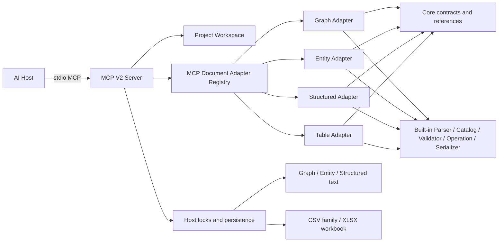
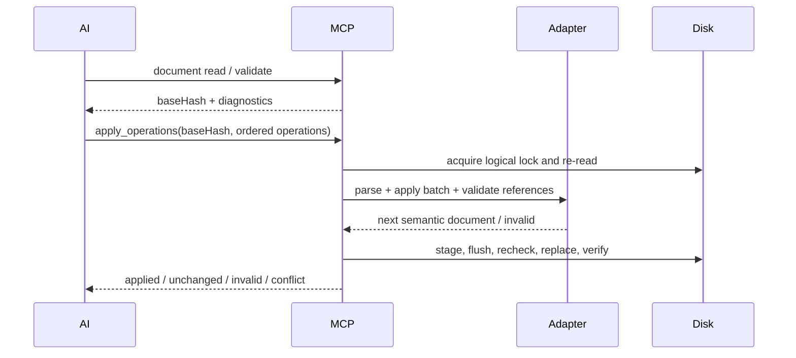

# VisualBridge MCP Server V2

## 定位与范围

`Tools/VisualBridgeMcp` 是本地 Authoring Project 的 stdio MCP 入口。它让 AI 通过与 VS Code 相同的 Project、Catalog、Document Operation 和 Reference 语义访问 Graph、Entity、Structured、Table，不直接读写业务载体，也不复制领域规则。

当前范围：

- 发现、读取 VisualBridge Project，并分页列出其声明文档。
- 读取和搜索四类内置 Catalog Registry。
- 读取、搜索和校验四类内置 Document。
- 通过一个统一入口批量执行 GraphOperation、EntityOperation、StructuredOperation 或 TableOperation。
- 搜索、解析稳定引用，以及预览和提交项目级引用重构。
- 使用 `baseHash`、锁、临时载体、替换前复查、原子替换和冲突拒绝保护写入。

当前没有独立 CLI，不启动 Project Provider，不连接 Unity，也不包含 Exporter、Importer、Runtime、Debug、DAP 或 WebSocket 功能。

## 架构



Core 的 `SemanticDocumentAdapter`、`DocumentCodec` 和 `CatalogAdapter` 只描述宿主无关语义。Built-in 包把已有 Parser、Registry、Validator、Operation、Reference Collector 与 Serializer 组合成 Adapter。MCP Host Registry 按 Project 已解析出的 `DocumentType.editor` 选择 Adapter；请求中的 `editor` 只是显式选择约束，不能绕过 Project 的 `include` / `exclude`、自定义扩展名或唯一 Document Type 匹配。

文件系统发现、安全路径、symlink 越界拒绝、Hash、锁和持久化属于 MCP Host。Table 保留多物理来源和二进制 Codec，不被降级为单文本文件。

## 进程生命周期

AI Host 每个会话启动一个进程，通过 stdin/stdout 通信。发现根目录按以下顺序确定：

1. 环境变量 `VISUALBRIDGE_WORKSPACE`。
2. 进程当前目录。

运行要求是 Node.js `>=20`。新 checkout 先在仓库根目录安装并构建：

```text
npm install
npm run build --workspace @visualbridge/mcp
```

构建后的入口：

```text
node Tools/VisualBridgeMcp/dist/server.js
```

通用 AI Host 配置形态如下；实际配置文件位置由 Host 决定：

```json
{
  "mcpServers": {
    "visualbridge": {
      "command": "node",
      "args": ["D:/GitHub/VisualBridge/Tools/VisualBridgeMcp/dist/server.js"],
      "env": {
        "VISUALBRIDGE_WORKSPACE": "D:/GameAuthoring"
      }
    }
  }
}
```

stdout 只承载 MCP 协议，诊断写入 stderr。发现过程递归查找 `VisualBridge.project.vbjson`，跳过 `.git`、`.codegraph`、`node_modules` 和 Unity `Library`。无效 Project 与重复 `projectId` 返回发现问题，不成为可选择上下文。

## V2 稳定工具面

V2 只暴露六个工具；V1 的 Graph、Structured、Table 专用工具已删除，不保留兼容别名。

| 工具 | action | 用途 |
| --- | --- | --- |
| `visualbridge_project` | `discover` / `read` / `listDocuments` | 发现 Project、读取定义与 Adapter 能力、分页列出声明文档。 |
| `visualbridge_catalog` | `read` / `search` | 读取 Registry 分区或搜索 Catalog 类型定义。 |
| `visualbridge_document` | `read` / `search` / `validate` | 读取、搜索或校验 Document 实例；始终只读。 |
| `visualbridge_apply_operations` | 无 action | 原子执行一个有序且非空的领域 Operation 批次。 |
| `visualbridge_references` | `search` / `resolve` | 搜索或解析稳定引用。 |
| `visualbridge_refactor_reference` | `preview` / `apply` | 预览或提交项目级稳定引用重构。 |

写入从 `visualbridge_document` 分离，使 MCP annotation 能准确声明只读性；`visualbridge_apply_operations` 和 `visualbridge_refactor_reference` 使用保守的 destructive hint。

所有输入对象都是 strict schema，未知顶层字段会被拒绝。除 `project.discover` 外，调用者必须使用发现结果中的显式 `projectFile`。Catalog、Document 与 Operation 同时要求 `documentTypeId` 和 `editor`，避免协议行为随 Project 中类型数量变化。

## 公共结果信封

每个成功结果都使用：

```json
{
  "contractVersion": 2,
  "status": "ok",
  "data": {}
}
```

只读请求返回 `status: "ok"`。写入返回 `applied`、`unchanged`、`invalid` 或 `conflict`，领域数据仍位于 `data`，不会在 `data.status` 中重复信封状态。Project、路径、Catalog、权限、Schema、I/O 或事务不确定错误使用 MCP Tool Error：

```json
{
  "contractVersion": 2,
  "status": "error",
  "error": {
    "code": "path.notFound",
    "message": "...",
    "details": {}
  }
}
```

输出 JSON Schema 以 `status` 判别两个互斥分支：成功/业务结果必须有 `data` 且不能有 `error`，`error` 必须有错误对象且不能有 `data`。`invalid` 和 `conflict` 是可预期的业务结果，不设置 `isError`。调用者不能把冲突当成可用旧基线自动重试。

## Project 使用手册

先发现：

```json
{
  "action": "discover"
}
```

再读取一个 Project：

```json
{
  "action": "read",
  "projectFile": "Game/VisualBridge.project.vbjson"
}
```

`read` 返回完整 Project 定义、每个 Document Type 的 `adapterAvailable` 和当前内置 `supportedEditors`。`listDocuments` 可按 `editor`、`documentTypeId` 和路径查询过滤，并使用不透明 `cursor` / `nextCursor` 分页。调用方必须把 Cursor 原样回传给产生它的同类查询；解析或修改属于不受支持的行为，跨查询复用会被拒绝。

```json
{
  "action": "listDocuments",
  "projectFile": "Game/VisualBridge.project.vbjson",
  "editor": "table",
  "query": "Skills",
  "limit": 50
}
```

Cursor V1 绑定原始请求中的 Tool、action、Project、Document Type、editor、path、kind、query 与 selector，不绑定页面大小，并用 checksum 拒绝意外修改。跨查询 Cursor 返回 `cursor.queryMismatch`，损坏、checksum 不匹配或未知版本返回 `cursor.invalid`。

## Catalog 契约

Catalog 查询必须显式传入：

```json
{
  "action": "search",
  "projectFile": "Game/VisualBridge.project.vbjson",
  "documentTypeId": "hero-config",
  "editor": "entity",
  "kind": "componentTypes",
  "query": "health",
  "selector": {
    "entityTypeId": "game.entity.hero"
  },
  "limit": 50
}
```

内置 kind：

| editor | read kind | search kind |
| --- | --- | --- |
| `graph` | `summary`, `dataTypes`, `graphTypes`, `nodeTypes` | `dataTypes`, `graphTypes`, `nodeTypes` |
| `entity` | `summary`, `componentGroups`, `entityTypes`, `componentTypes` | `componentGroups`, `entityTypes`, `componentTypes` |
| `structured` | `summary`, `configTypes` | `configTypes` |
| `table` | `summary`, `tableTypes`, `sheets`, `columns` | `tableTypes`, `sheets`, `columns` |

`search` 必须显式传可搜索 kind；`summary` 只用于 `read`。Catalog read 示例：

```json
{
  "action": "read",
  "projectFile": "Game/VisualBridge.project.vbjson",
  "documentTypeId": "logicGraph",
  "editor": "graph",
  "kind": "graphTypes"
}
```

Catalog search 查找类型定义；Document search 查找当前实例，两者不混用。Graph Node Type 搜索继续遵守 Graph Type 的 supported Catalog 和 selector 约束；Entity Component Type 搜索可按 Entity Type 过滤；Table Sheet/Column 返回完整稳定 owner identity。

## Document 读取、搜索与校验

Graph、Entity、Structured 文本和 Table 载体都通过同一个工具：

```json
{
  "action": "read",
  "projectFile": "Game/VisualBridge.project.vbjson",
  "documentTypeId": "hero-config",
  "editor": "entity",
  "path": "Config/Entities/Player.herojson"
}
```

公共返回至少包含 `projectId`、`projectFile`、`documentTypeId`、`editor`、规范化逻辑 `path`、`baseHash`、物理 `sources`、`valid` 和 `diagnostics`。结构损坏属于可读取的校验结果：`read` / `validate` 返回 `valid: false` 和诊断，而不是伪装成 I/O 错误。

Document search 的稳定实例范围：

- Graph：Graph、Node、Port、Edge 和字段路径。
- Entity：Entity、Component 和根/Component 字段路径。
- Structured：递归字段路径和值。
- Table：按 Catalog `rowDisplayNamePattern` 与 typed cells 搜索的 Row。

Table `read` 可通过 `selector.sheetId` 返回一个物理 Sheet 的语义 Row 页面；`search` 可通过 `selector.sheetDefinitionId` 和 `selector.effectiveOnly` 控制逻辑分表范围。返回的是 Operation-facing Row ID 与 typed cells，不是原始 CSV cell 或 Workbook 对象。

Document search 和 validate 示例：

```json
{
  "action": "search",
  "projectFile": "Game/VisualBridge.project.vbjson",
  "documentTypeId": "logicGraph",
  "editor": "graph",
  "path": "Graph/Battle.vbgraph",
  "query": "damage",
  "selector": { "kind": "node" },
  "limit": 50
}
```

```json
{
  "action": "validate",
  "projectFile": "Game/VisualBridge.project.vbjson",
  "documentTypeId": "game.table.skills",
  "editor": "table",
  "path": "Tables/Skills_A.csv"
}
```

Selector：

| editor / action | selector 字段 |
| --- | --- |
| Graph Catalog `nodeTypes` search | `graphTypeId?: string`, `includeSubgraphNodeTypes?: boolean` |
| Graph Document search | `kind?: graph \| node \| port \| edge \| field \| all` |
| Entity Catalog `componentTypes` search | `entityTypeId?: string` |
| Table Document read | `sheetId?: string` |
| Table Document search | `sheetDefinitionId?: string`, `effectiveOnly?: boolean` |

未列出的 selector 字段不会获得隐式语义；类型不符返回 Tool Error。

## Operation 使用手册

写入流程：



示例：

```json
{
  "projectFile": "Game/VisualBridge.project.vbjson",
  "documentTypeId": "hero-config",
  "editor": "entity",
  "path": "Config/Entities/Player.herojson",
  "baseHash": "<read returned SHA-256>",
  "operations": [
    { "type": "entity.setTitle", "title": "Player" },
    { "type": "entity.setComponentEnabled", "componentId": "move", "enabled": true }
  ]
}
```

Operation Schema 保证每项至少有稳定 `type`，具体字段由对应 Built-in Operation Parser 严格校验。批次保持输入顺序，在副本上完整执行；后段失败、产生新领域错误或产生新 Reference error 时返回 `invalid`，权威字节不变。

四类 Operation 的正式字段定义与约束：

| editor | Operation 定义 |
| --- | --- |
| `graph` | [`GraphSemanticModel.md`](GraphSemanticModel.md#mcp-v2-mapping) |
| `entity` | [`EntityComponentModel.md`](EntityComponentModel.md#entity-operation) |
| `structured` | [`StructuredConfigModel.md`](StructuredConfigModel.md#5-operation-与事务) |
| `table` | [`TableSemanticModel.md`](TableSemanticModel.md#7-semantic-document-and-operations) |

调用方必须按对应文档构造完整 Operation；不能把别的 editor 的同名字段或原始 JSON Patch 传给统一入口。

Graph、Entity、Structured、Table 和 Refactor 共用同一 Project Transaction；单文本写入也是该事务的一项：

```text
获取 Project 锁并恢复上次中断事务
  -> 锁内重读并比较 baseHash
  -> 通过 Adapter 解析并应用完整批次
  -> 校验领域语义和 Reference
  -> 确定性渲染到同目录临时文件并 flush
  -> 替换前再次比较目标 Hash
  -> 原子替换并验证持久化 Hash
  -> 写入 committed journal，清理 backup/journal
  -> 释放 Project 锁
```

Table 事务保留完整物理来源：CSV 分表的 combined `baseHash` 由排序后的成员路径和成员字节 Hash 构成，任何成员增删改都会使基线失效；XLSX 使用整个 Workbook 字节 Hash。所有变更源先渲染和 flush，再复查完整 manifest。已知替换或落盘验证失败会逆序恢复已替换来源；rollback 失败升级为 Tool Error，不能报告普通 conflict 或成功。

```mermaid
sequenceDiagram
  participant Host
  participant Lock as Project Lock
  participant Journal
  participant Sources as CSV/XLSX/Text Sources
  Host->>Lock: acquire and recover stale dead-owner transaction
  Host->>Sources: read + verify base/dependency hashes
  Host->>Sources: stage every changed source + flush
  Host->>Journal: write prepared entries + flush
  loop deterministic source order
    Host->>Sources: original -> backup; staged -> target
  end
  Host->>Sources: verify every persisted hash
  alt all hashes match
    Host->>Journal: mark committed
    Host->>Sources: remove backups
    Host->>Journal: remove journal
  else commit or verification fails
    Host->>Sources: conditionally restore backups in reverse order
    Note over Host,Sources: unknown external bytes are preserved
    Host-->>Host: Tool Error if recovery is not provably complete
  end
  Host->>Lock: release
```

Project 锁文件记录 token、进程与启动时间。持锁进程已经退出时，下一个写请求通过带世代号的 Recovery Guard 竞选唯一恢复者，再接管锁并按 journal 恢复；仍存活的持有者返回 `writeInProgress`。不走 VisualBridge 的外部写入不受协作锁控制，因此每次替换前仍复核 Hash。恢复按每项 backup 是否存在判断该来源是否已经替换：未替换来源保留当前外部字节，已替换来源只在目标仍为本事务 `afterHash` 或缺失时恢复；已有 backup 且目标出现未知外部 Hash 时保留外部字节和恢复材料并返回错误。

`.visualbridge-transaction.lock`、`.visualbridge-transaction.json`、`.visualbridge-transaction-recovery/`、它们的临时/陈旧变体，以及 `*.visualbridge-<transactionId>.tmp|rollback` 是 Host 保留名称；Project 文档发现即使遇到宽 glob 也必须忽略它们。journal 要求 UUID transaction ID，并在恢复前交叉验证逻辑路径、绝对路径、事务后缀和 Project Root；复制或伪造的 journal 不能操作其他业务文件或 Project 外文件。VS Code TextDocument 保存和其他外部工具不参与 MCP 的协作锁，它们由各自的 base Hash / 外部修改检测保护；MCP 不宣称能够消除非协作写者在最后一个文件系统原子操作处的操作系统级竞态。

可写 Document 的物理目标必须是 Project Root 内由规范化逻辑路径直接解析出的文件；事务不会跟随另一个路径或符号链接别名写入目标。

当前保证针对本地文件系统上的并发写入与进程中断恢复；锁的原子发布要求同卷 hard-link 能力。文件和 journal 会 `sync`，但目录项没有跨平台断电持久化承诺，因此不能把突然断电等同于数据库事务保证。

四种写入状态：

- `applied`：提交成功，`baseHash` 是请求前基线，`hash` 是新基线。
- `unchanged`：合法结果与当前权威字节一致，没有执行替换。
- `invalid`：Parser、Operation、领域校验或 Reference 校验拒绝；没有提交。
- `conflict`：基线不一致、锁已占用或替换前外部变化；没有覆盖。

已验证提交但恢复材料暂时无法清理时仍返回 `applied`，并附带 `maintenance.code: "transaction.finalizationPending"`；后续写请求会再次清理。只有目标或恢复结果无法证明时才返回 Tool Error。

## Reference 与 Refactor

`visualbridge_references` 提供 `document`、`entity.component`、`graph.element` 和 `table.row` Provider，区分 `resolved`、`missing`、`ambiguous` 与 `providerUnavailable`。目标使用稳定语义 selector；路径和显示名只出现在返回 Location。

| kind | target |
| --- | --- |
| `document` | `{ "documentTypeId": string }` |
| `entity.component` | `{ "documentTypeId": string }` |
| `graph.element` | `{ "documentTypeId": string, "elementKind": "graph" \| "node" \| "interfacePort" \| "dynamicPort" }` |
| `table.row` | `{ "tableTypeId": string, "sheetId": string, "documentTypeId"?: string }` |

完整 Provider、严格值类型和 Location 规则见 [`ReferenceSystem.md`](ReferenceSystem.md)；项目级目标变换与影响计划见 [`ProjectRefactoring.md`](ProjectRefactoring.md)。

```json
{
  "projectFile": "Game/VisualBridge.project.vbjson",
  "action": "search",
  "kind": "table.row",
  "target": {
    "documentTypeId": "game.table.skills",
    "tableTypeId": "game.table.skills",
    "sheetId": "skills"
  },
  "query": "Fireball",
  "limit": 20
}
```

把 `action` 改为 `resolve` 并传 `value` 可精确解析一个稳定值。

`visualbridge_refactor_reference.preview` 唯一解析旧目标，构建确定性影响计划，并返回 `previewHash` 与完整 `baseHashes`。`apply` 必须原样带回两者；Host 在 Project 锁内重建计划，Project、Catalog、Document 或 CSV family 任一依赖变化都会拒绝。Entity Component、Graph Element、Table Row 和 Document ID 都通过正式领域变换，不做项目级字符串替换。

```json
{
  "projectFile": "Game/VisualBridge.project.vbjson",
  "action": "preview",
  "kind": "entity.component",
  "target": { "documentTypeId": "hero-config" },
  "oldValue": "health",
  "newValue": "health_primary"
}
```

确认预览后，使用相同定义和值，将 `action` 改为 `apply`，并原样附上预览返回的 `previewHash` 与完整 `baseHashes`。不得删减未变化或不熟悉的来源 Hash。

## 从发现到冲突恢复

1. `visualbridge_project.discover`，选择唯一 `projectFile`。
2. `visualbridge_project.read`，确认 Document Type 和 `adapterAvailable`。
3. 用 `visualbridge_document.read` 获取当前 `baseHash` 与诊断。
4. 只在 `valid: true` 且理解 Operation Schema 时调用 `visualbridge_apply_operations`。
5. `applied` 后保存返回的新 `hash`；`unchanged` 不需要写盘；`invalid` 修正 Operation；`conflict` 必须重新读取并基于新文档重新计算修改。
6. Tool Error 先检查 `error.code`。`transaction.rollbackFailed`、`transaction.recoveryFailed`、`transaction.committedStateChanged`、`transaction.finalizationFailed` 或 `transaction.journalInvalid` 表示恢复材料可能被保留，必须先人工核对 `.visualbridge-transaction.json`、`.rollback` 与权威来源，不能删除锁或强行重试。

## 验证

```text
npm test --workspace @visualbridge/mcp
```

stdio 测试使用官方 MCP Client 和临时 Project 副本，精确验证六个工具、strict input/output schema、annotation、四类 Catalog/read/search/validate/apply、Entity 自定义 `.herojson`、无效批次字节不变、两个独立 MCP 进程的 stale `baseHash` 冲突、查询绑定 Cursor、损坏 Table 的统一无错误读取、CSV family、XLSX、Reference、项目级 Refactor、死亡持锁进程恢复，以及恢复遇到未知外部字节时不覆盖。没有 Unity 测试。
