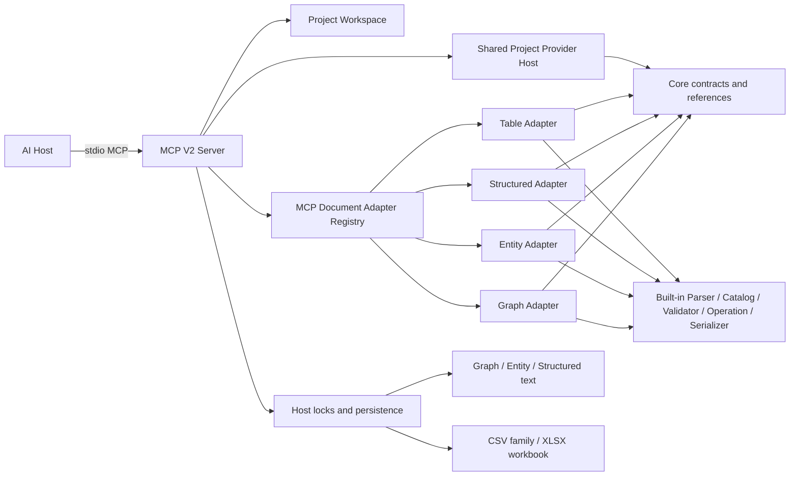
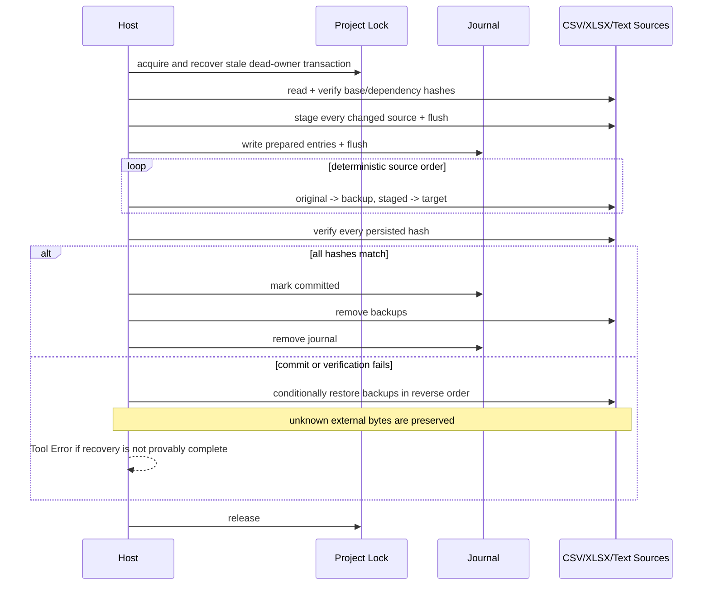

# VisualBridge MCP Server V2

## 定位与范围

`Tools/VisualBridgeMcp` 是本地 Authoring Project 的 stdio MCP 入口。它让 AI 通过与 VS Code 相同的 Project、Catalog、Document Operation 和 Reference 语义访问 Graph、Entity、Structured、Table，不直接读写业务载体，也不复制领域规则。

当前范围：

- 发现、读取 VisualBridge Project，并分页列出其声明文档。
- 读取和搜索四类内置 Catalog Registry。
- 读取、搜索和校验四类内置 Document。
- 通过一个统一入口批量执行 GraphOperation、EntityOperation、StructuredOperation 或 TableOperation。
- 搜索、解析稳定引用，以及预览和提交项目级引用重构。
- 通过统一 Lifecycle 入口预览或提交 Document 创建、复制、移动和安全删除。
- 只读检查本机 Unity Runtime 实例：枚举发现记录、读取运行时快照、查询文档 Source 映射与工作区漂移。
- 在启动时显式授权后，复用 Project Provider V2 的自定义 Reference 与 Validator。
- 使用 `baseHash`、锁、临时载体、替换前复查、原子替换和冲突拒绝保护写入。

当前没有独立 CLI，也不包含 Exporter、Importer、编辑器内 Debug/DAP 会话或 WebSocket 功能。唯一的 Unity 连接面是只读的 `visualbridge_runtime` 检查工具：它通过本机 Runtime Bridge 发现目录连接 Unity Runtime 实例（发现层与协议见 [UnityIntegrationArchitecture.md](UnityIntegrationArchitecture.md) 第 17/18 章），每次调用独立建连并在断开时释放调试租约。Project Provider 默认禁用，只有 Server 启动环境显式启用并给出规范化绝对入口 allowlist 后才运行；Tool 请求不能提升权限。

## 架构



Core 的 `SemanticDocumentAdapter`、`DocumentCodec` 和 `CatalogAdapter` 只描述宿主无关语义。Built-in 包把已有 Parser、Registry、Validator、Operation、Reference Collector 与 Serializer 组合成 Adapter。MCP Host Registry 按 Project 已解析出的 `DocumentType.editor` 选择 Adapter；请求中的 `editor` 只是显式选择约束，不能绕过 Project 的 `include` / `exclude`、自定义扩展名或唯一 Document Type 匹配。

文件系统发现、安全路径、symlink 越界拒绝、Hash、锁和持久化属于 MCP Host。Table 保留多物理来源和二进制 Codec，不被降级为单文本文件。

## 进程生命周期

AI Host 每个会话启动一个进程，通过 stdin/stdout 通信。发现根目录按以下顺序确定：

1. 环境变量 `VISUALBRIDGE_WORKSPACE`。
2. 进程当前目录。

运行要求固定为 Node.js `22.22.1` 和 npm `10.9.4`。新 checkout 先在仓库根目录按 lockfile 安装并构建：

```text
npm ci
npm run build --workspace @visualbridge/mcp
```

构建后的入口：

```text
node Tools/VisualBridgeMcp/dist/server.js
```

通用 AI Host 配置形态如下；这是 Host-specific template，不是 VisualBridge 协议契约，实际配置文件位置由 Host 决定：

```text
{
  "mcpServers": {
    "visualbridge": {
      "command": "node",
      "args": ["D:/GitHub/VisualBridge/Tools/VisualBridgeMcp/dist/server.js"],
      "env": {
        "VISUALBRIDGE_WORKSPACE": "D:/GameAuthoring"
      }
    }
  }
}
```

stdout 只承载 MCP 协议。Transport 错误和 Provider stderr 写入进程 stderr；Project 发现、路径、Schema 与工具执行失败通过结构化 MCP Tool Error 返回，不承诺额外 stderr 副本。发现过程递归查找 `VisualBridge.project.vbjson`，跳过 `.git`、`.codegraph`、`node_modules` 和 Unity `Library`。无效 Project 与重复 `projectId` 返回发现问题，不成为可选择上下文。

## V2 稳定工具面

V2 只暴露八个工具；V1 的 Graph、Structured、Table 专用工具已删除，不保留兼容别名。

| 工具 | action | 用途 |
| --- | --- | --- |
| `visualbridge_project` | `discover` / `read` / `listDocuments` | 发现 Project、读取定义与 Adapter 能力、分页列出声明文档。 |
| `visualbridge_catalog` | `read` / `search` | 读取 Registry 分区或搜索 Catalog 类型定义。 |
| `visualbridge_document` | `read` / `search` / `validate` | 读取、搜索或校验 Document 实例；始终只读。 |
| `visualbridge_apply_operations` | 无 action | 原子执行一个有序且非空的领域 Operation 批次。 |
| `visualbridge_references` | `search` / `resolve` | 搜索或解析稳定引用。 |
| `visualbridge_refactor_reference` | `preview` / `apply` | 预览或提交项目级稳定引用重构。 |
| `visualbridge_document_lifecycle` | `preview` / `apply` | 预览或提交创建、复制、路径移动和安全删除。 |
| `visualbridge_runtime` | `listInstances` / `getSnapshot` / `getDocumentSources` | 只读检查本机 Runtime 实例：发现记录、运行时快照、Source 映射与漂移。 |

写入从 `visualbridge_document` 分离，使 MCP annotation 能准确声明只读性；`visualbridge_apply_operations`、`visualbridge_refactor_reference` 和 `visualbridge_document_lifecycle` 使用保守的 destructive hint。

所有输入对象都是 strict schema，未知顶层字段会被拒绝。除 `project.discover` 外，调用者必须使用发现结果中的显式 `projectFile`。Catalog、Document 与 Operation 同时要求 `documentTypeId` 和 `editor`，避免协议行为随 Project 中类型数量变化。

### Document Lifecycle 工具

MCP V2 提供单一 `visualbridge_document_lifecycle` 工具。它只接受 `preview` / `apply`，通过 strict `operation.kind` 区分 `create`、`copy`、`move` 和 `delete`，不提供按 editor 拆分的兼容别名。四领域语义、跨宿主规范计划、并发冲突和原子事务已经进入自动化验证；完整契约见 [`DocumentLifecycle.md`](DocumentLifecycle.md)。

目标 preview 请求示例：

```json visualbridge-schema=visualbridge-mcp-tools.schema.json#/$defs/visualbridge_document_lifecycle.input
{
  "projectFile": "Game/VisualBridge.project.vbjson",
  "action": "preview",
  "operation": {
    "kind": "copy",
    "source": {
      "projectId": "sample.game",
      "documentTypeId": "hero-config",
      "editor": "entity",
      "path": "Config/Entities/Player.herojson"
    },
    "target": {
      "projectId": "sample.game",
      "documentTypeId": "hero-config",
      "editor": "entity",
      "path": "Config/Entities/PlayerClone.herojson"
    },
    "stableIdRemap": [
      { "identityKey": "document", "from": "player", "to": "player.clone" },
      { "identityKey": "component:health", "from": "health", "to": "health.clone" }
    ]
  }
}
```

Copy 调用方必须从语义 source 构造完整 `stableIdRemap`：每个 Adapter 报告的 owned identity 恰好出现一次，`from` 必须匹配当前值，`to` 必须保持类型、改变值并在其 `collisionScope` 内无冲突。Preview 只校验并规范化映射，不自动生成 ID。Graph 的映射覆盖 Document、Graph、Node、Interface/Dynamic Port 和 Edge；Entity 覆盖 Document/Component；Structured 覆盖 Document；Table 覆盖 `table.row` typed key，并在去重列与 key 列不同时覆盖 `table.dedup` identity。Table 的 operation-facing Row/physical Sheet ID 由目标 Codec 重新派生。Create 的新身份由 strict `operation.parameters` 显式提供。

Create/Copy 的唯一性检查先用每个现存 Document 的正式 Lifecycle Adapter 输出建立 Project-wide collision index，再按严格值类型、`kind` 和 `collisionScope` 查找目标。它覆盖没有 Reference definition 的 Graph Edge、Table dedup 等身份，不以字符串模式或 Reference Provider 代替 identity contract。remap 校验失败时 preview 仍同时返回已经确认的 `target.exists` / `target.typeMismatch` blocker，不丢失 target 分析结果。

Create 的 `parameters` 按 editor 固定且拒绝未知字段：

| editor | strict `parameters` | 语义 |
| --- | --- | --- |
| `graph` | `{ documentId, rootGraphId, graphTypeId?, initialNodeIds? }` | `initialNodeIds` 缺省为 `[]`；若 Graph Type 物化初始节点，必须按 factory 实际创建顺序提供恰好足够的稳定 ID。 |
| `entity` | `{ documentId, entityTypeId, title? }` | `title` 缺省为 `New Entity`，字段默认值来自 Entity Catalog。 |
| `structured` | `{ documentId }` | Config Type 由 Project Document Type ID 唯一绑定。 |
| `table` | `{ format: "csv" | "xlsx", physicalName? }` | `format` 是权威载体选择，绝不从扩展名推断；`physicalName` 只用于 CSV Sheet/partition 匹配，缺省取目标文件名的 carrier stem，XLSX 不接受它。 |

例如以下 Table Create preview 即使目标使用项目自定义扩展名，也会创建 XLSX，而不是按后缀猜测：

```json visualbridge-schema=visualbridge-mcp-tools.schema.json#/$defs/visualbridge_document_lifecycle.input
{
  "projectFile": "Game/VisualBridge.project.vbjson",
  "action": "preview",
  "operation": {
    "kind": "create",
    "target": {
      "projectId": "sample.game",
      "documentTypeId": "game.table.skills",
      "editor": "table",
      "path": "Tables/Skills.skilldata"
    },
    "parameters": { "format": "xlsx" }
  }
}
```

四种 operation 的字段固定为：Create 使用 `target` + strict `parameters`；Copy 使用 `source` + `target` + 完整 `stableIdRemap`；Move 使用 `source` + `target`；Delete 使用 `source` + strict stable `target`。Delete target 可以是 `document`、带 `componentId` 的 `entity.component`、带完整 Graph/owner 作用域的 `graph.element`，或带语义 read 返回的 `sheetId`/`rowId` 的 `table.row`。Document Delete 产生物理 `delete` mutations；Component/Graph Element/Table Row Delete 在安全检查后产生载体 `replace` mutation。

Preview 请求不能携带 apply 字段。它返回 `previewHash`、不透明 `planPayload`、顶层便于回传的 `baseHashes` / `dependencies`，以及结构化 `plan`；`plan` 包含规范 `operation`、`ownedIdentities`、规范 `stableIdRemap`、Reference impacts、blockers、依赖、基线和物理 mutations。Create 的 `baseHashes` 固定为 `{}`；Copy、Move、Document Delete 和 contained Delete 都包含 source 的完整 physical manifest Hash，CSV family 因而不是单文件基线。Create 返回的是领域 Adapter 的 raw owned identity 声明，不伪造尚未进入 Project index 的 Host `ReferenceLocation`。Create/Copy/Move 目标不存在性编码为 mutation 的 `targetMustBeAbsent: true`。Preview 即使存在业务 blocker 仍返回信封 `status: "preview"`，调用方必须检查 `data.plan.blockers`，不能直接 apply。

Core 的共享 dependency builder 为 MCP 与 VS Code 生成同一结构：每个 Project 恰好一个 `project`、一个聚合全部 Catalog source 的 `catalog`、一个基于规范 physical path/hash 的 `documentSet` 和一个规范化 `referenceIndex` dependency；四项的 `key` 都是 `projectId`。显示标题、说明和诊断不参与 Reference index Hash，Reference definition、value、resolution status、候选语义位置及物理来源变化会参与。路径统一为 `/`，输入顺序不影响 Hash。Lifecycle canonicalization 的全部字符串排序使用显式 UTF-16 code-unit 全序，不依赖系统 locale。

Apply 请求必须重复完全相同的 operation：

```json visualbridge-schema=visualbridge-mcp-tools.schema.json#/$defs/visualbridge_document_lifecycle.input
{
  "projectFile": "Game/VisualBridge.project.vbjson",
  "action": "apply",
  "operation": {
    "kind": "copy",
    "source": {
      "projectId": "sample.game",
      "documentTypeId": "hero-config",
      "editor": "entity",
      "path": "Config/Entities/Player.herojson"
    },
    "target": {
      "projectId": "sample.game",
      "documentTypeId": "hero-config",
      "editor": "entity",
      "path": "Config/Entities/PlayerClone.herojson"
    },
    "stableIdRemap": [
      { "identityKey": "document", "from": "player", "to": "player.clone" },
      { "identityKey": "component:health", "from": "health", "to": "health.clone" }
    ]
  },
  "previewHash": "aaaaaaaaaaaaaaaaaaaaaaaaaaaaaaaaaaaaaaaaaaaaaaaaaaaaaaaaaaaaaaaa",
  "planPayload": "canonical planPayload returned by preview",
  "baseHashes": {
    "Config/Entities/Player.herojson": "bbbbbbbbbbbbbbbbbbbbbbbbbbbbbbbbbbbbbbbbbbbbbbbbbbbbbbbbbbbbbbbb"
  },
  "dependencies": [
    {
      "kind": "project",
      "key": "sample.game",
      "hash": "cccccccccccccccccccccccccccccccccccccccccccccccccccccccccccccccc",
      "paths": ["VisualBridge.project.vbjson"]
    },
    {
      "kind": "catalog",
      "key": "sample.game",
      "hash": "dddddddddddddddddddddddddddddddddddddddddddddddddddddddddddddddd",
      "paths": ["Catalogs/Game.vbentitycatalog"]
    },
    {
      "kind": "documentSet",
      "key": "sample.game",
      "hash": "eeeeeeeeeeeeeeeeeeeeeeeeeeeeeeeeeeeeeeeeeeeeeeeeeeeeeeeeeeeeeeee",
      "paths": ["Config/Entities/Player.herojson"]
    },
    {
      "kind": "referenceIndex",
      "key": "sample.game",
      "hash": "ffffffffffffffffffffffffffffffffffffffffffffffffffffffffffffffff",
      "paths": ["Config/Entities/Player.herojson"]
    }
  ]
}
```

Apply 必须原样提交 preview 使用的完整 operation、`previewHash`、`planPayload`、完整 `plan.baseHashes` 和完整 `plan.dependencies`；服务端在 Project 锁内重建当前计划并比较。调用方不能删减“不相关”的来源或依赖，也不能在 apply 时重新生成身份。

Copy preview 只把副本内部引用记为 `internalRetarget`，把仍指向 closure 外或明确 `allowMissing` 的引用记为 `outboundPreserved`。它不产生 `targetLocationChanged`，因为 remap 后的副本是新身份；只有保持身份不变的 Move 使用该 impact 描述 Location path 变化。

上例中的 64 字符 Hash 和 `planPayload` 只是满足 Schema 的示意值；真实 apply 必须逐字使用同一次 preview 返回值，不能使用示例常量。Apply 缺少任一字段会被 Schema 拒绝；preview 反过来也会拒绝这些 apply-only 字段。

Delete target 是严格判别联合：

```text
{ kind: "document" }
{ kind: "entity.component", componentId }
{ kind: "graph.element", graphId, elementKind: "graph", elementId }
{ kind: "graph.element", graphId, elementKind: "node" | "interfacePort", elementId }
{ kind: "graph.element", graphId, elementKind: "dynamicPort", elementId, nodeId }
{ kind: "table.row", sheetId, rowId }
```

`sheetId` / `rowId` 必须来自当前 Table 语义 read/search 结果。Root Graph 不能作为元素删除，只能随 Document 删除；非 Root Graph 映射到 owning subgraph Node 的删除闭包。

Document Delete 的 `plan.ownedIdentities` 包含整个 Document；`entity.component`、`graph.element`、`table.row` contained Delete 只返回删除闭包 identities，便于调用方精确审计实际授权范围。

所有 Create/Copy/Move 都限制在同一 `projectId`、同一 `documentTypeId` 和同一 `editor`；目标必须重新通过 Project Registry 的唯一声明匹配，扩展名本身不选择 editor 或 format。Table 行为为：

- CSV create 用显式 `format: "csv"` 和 `physicalName`（或目标 carrier stem）选择一个可唯一匹配的 Sheet 定义。
- CSV family copy/move 总是处理完整 family。V1 只允许跨目录并保留所选入口和每个成员的 basename；任一目标存在都会阻止或使 apply 冲突。
- XLSX create 用显式 `format: "xlsx"` 创建一个 Workbook；copy/move 处理单一完整 Workbook，不根据路径后缀识别格式。
- Table copy 对非空 key/dedup identity 要求显式完整、保持值类型的 remap；delete document 删除整个 CSV family 或单个 XLSX Workbook，delete row 只替换拥有该 Row 的载体。

授权边界是“同一次精确 preview 的 apply”，不是通用文件权限：调用者提交 `apply` 只授权 `operation` 与回传 manifest 描述的 Project 内 mutations。服务端不会借此跨 Project、改变 Document Type、覆盖已存在目标、级联删除 blocker 引用或执行任意文件操作。`visualbridge_apply_operations` 也不能绕过该边界删除 Component、Graph Node/Interface/Dynamic Port 或 Table Row；这些请求返回 `lifecycle.required`。MCP 以磁盘快照为权威，无法读取 VS Code 未保存缓冲区，因此 VS Code 与 MCP 同时工作时仍必须先保存编辑器；Hash/依赖复核只负责拒绝已经落盘的外部变化。

## Runtime 检查工具

`visualbridge_runtime` 是只读的 Runtime 检查入口，消费已冻结的 Runtime Bridge V1 契约（发现层与协议见 [UnityIntegrationArchitecture.md](UnityIntegrationArchitecture.md) 第 17/18 章）：

| action | 行为 |
| --- | --- |
| `listInstances` | 读取发现目录（默认 `<临时目录>/visualbridge-runtime`，可用 `VISUALBRIDGE_RUNTIME_DIR` 覆盖）中的全部记录；心跳 >5 秒或 pid 已死标记 `staleReason`，不建立连接，也不暴露 `token`。 |
| `getSnapshot` | 连接实例完成 hello/welcome 握手后读取编译产物快照，可按 `documentTypeIds` 过滤；观察者语义，不要求租约。 |
| `getDocumentSources` | 连接实例并 `acquireLease` → `getDocumentSources` → 漂移计算 → `releaseLease` → 断开。 |

- 每次调用独立连接：租约绑定连接、断开自动释放，MCP 工具不长期持有租约，与 VS Code DAP 检查会话（attach 期间长期持租约）互不饿死；并发调用期间 DAP attach 可能收到 `runtime.leaseDenied`，属单控制者权限模型的既定语义。
- `instanceId` 形如 `editor-<pid>`（Editor Play 模式）或 `player-<pid>`（Player）；`documentTypeIds` 仅 `getSnapshot` 接受。action 与字段的跨字段条件约束由服务端运行时严格校验。
- 漂移 `drift`：`sourcePath` 是 project root 相对路径，服务在 workspace 已发现的各 project root 下解析；恰一处存在时读取字节比对 SHA-256（`false` 一致 / `true` 已漂移），零处或多处命中为 `"unknown"`。漂移只呈现，不写回任何 Authoring 源。
- 错误码：服务内部判定 `runtime.instanceNotFound` / `runtime.staleInstance`，其余 `runtime.*`（如 `runtime.leaseDenied`、`runtime.leaseRequired`）由实例按协议返回并透传。

```json visualbridge-schema=visualbridge-mcp-tools.schema.json#/$defs/visualbridge_runtime.input
{
  "action": "getSnapshot",
  "instanceId": "editor-1234",
  "documentTypeIds": ["game.graph"]
}
```

## 公共结果信封

每个成功结果都使用：

```json visualbridge-schema=visualbridge-mcp-tools.schema.json#/$defs/toolOutput
{
  "contractVersion": 2,
  "status": "ok",
  "data": {}
}
```

只读请求返回 `status: "ok"`。Lifecycle 预览返回 `preview`；Lifecycle apply 若当前可信计划含 blocker 返回 `blocked`。其他写入返回 `applied`、`unchanged`、`invalid` 或 `conflict`。领域数据始终位于 `data`，不会在 `data.status` 中重复信封状态。Project、路径、Catalog、权限、Schema、I/O、无法建立可信语义快照或事务不确定错误使用 MCP Tool Error：

```json visualbridge-schema=visualbridge-mcp-tools.schema.json#/$defs/toolOutput
{
  "contractVersion": 2,
  "status": "error",
  "error": {
    "code": "path.notFound",
    "message": "...",
    "details": {}
  }
}
```

输出 JSON Schema 以 `status` 判别两个互斥分支：成功/业务结果必须有 `data` 且不能有 `error`，`error` 必须有错误对象且不能有 `data`。`preview`、`blocked`、`invalid` 和 `conflict` 是可预期的业务结果，不设置 `isError`。`blocked` 表示同一计划在当前语义下不可授权，例如 Delete closure 有外部入站引用；`conflict` 表示 preview 后的 operation、Hash、依赖、计划、目标不存在性或事务状态发生变化。调用者不能把任一结果当作可覆盖旧基线的自动重试许可。

## Project 使用手册

先发现：

```json visualbridge-schema=visualbridge-mcp-tools.schema.json#/$defs/visualbridge_project.input
{
  "action": "discover"
}
```

再读取一个 Project：

```json visualbridge-schema=visualbridge-mcp-tools.schema.json#/$defs/visualbridge_project.input
{
  "action": "read",
  "projectFile": "Game/VisualBridge.project.vbjson"
}
```

`read` 返回完整 Project 定义、每个 Document Type 的 `adapterAvailable` 和当前内置 `supportedEditors`。`listDocuments` 可按 `editor`、`documentTypeId` 和路径查询过滤，并使用不透明 `cursor` / `nextCursor` 分页。调用方必须把 Cursor 原样回传给产生它的同类查询；解析或修改属于不受支持的行为，跨查询复用会被拒绝。

```json visualbridge-schema=visualbridge-mcp-tools.schema.json#/$defs/visualbridge_project.input
{
  "action": "listDocuments",
  "projectFile": "Game/VisualBridge.project.vbjson",
  "editor": "table",
  "query": "Skills",
  "limit": 50
}
```

普通 Project/Catalog 查询的 Cursor V1 绑定原始请求中的 Tool、action、Project、Document Type、editor、path、kind、query 与 selector，不绑定页面大小，并用 checksum 拒绝意外修改。Table Record/Catalog 查询使用快照绑定 Cursor，同时绑定有序物理来源 Manifest 和 Catalog 内容 Hash；Reference 查询使用 Core Reference Cursor，并绑定 Project Semantic Snapshot 依赖键。Project Provider V2 的 Reference Cursor 还封装 Provider Host 实例、入口 Hash、进程 generation、Provider continuation 与 Provider Snapshot Hash，所以可连续读取超过 200 条候选而不会在 Host 本地截断。Provider continuation 最多 16,384 个字符；MCP 外层 Reference Cursor 的输入上限为 262,144 个字符，以容纳 JSON 与 base64url 封装后的合法 continuation，调用方仍只能原样回传。跨查询 Cursor 返回 `cursor.queryMismatch`，损坏、checksum 不匹配或未知版本返回 `cursor.invalid`，来源、语义快照、Provider 入口/进程或候选快照改变返回 `cursor.snapshotChanged`。

## Catalog 契约

Catalog 查询必须显式传入：

```json visualbridge-schema=visualbridge-mcp-tools.schema.json#/$defs/visualbridge_catalog.input
{
  "action": "search",
  "projectFile": "Game/VisualBridge.project.vbjson",
  "documentTypeId": "hero-config",
  "editor": "entity",
  "kind": "componentTypes",
  "query": "health",
  "selector": {
    "entityTypeId": "game.entity.hero"
  },
  "limit": 50
}
```

内置 kind：

| editor | read kind | search kind |
| --- | --- | --- |
| `graph` | `summary`, `dataTypes`, `graphTypes`, `nodeTypes` | `dataTypes`, `graphTypes`, `nodeTypes` |
| `entity` | `summary`, `componentGroups`, `entityTypes`, `componentTypes` | `componentGroups`, `entityTypes`, `componentTypes` |
| `structured` | `summary`, `configTypes` | `configTypes` |
| `table` | `summary`, `tableTypes`, `sheets`, `columns` | `tableTypes`, `sheets`, `columns` |

`search` 必须显式传可搜索 kind；`summary` 只用于 `read`。Catalog read 示例：

```json visualbridge-schema=visualbridge-mcp-tools.schema.json#/$defs/visualbridge_catalog.input
{
  "action": "read",
  "projectFile": "Game/VisualBridge.project.vbjson",
  "documentTypeId": "logicGraph",
  "editor": "graph",
  "kind": "graphTypes"
}
```

Catalog search 查找类型定义；Document search 查找当前实例，两者不混用。Graph Node Type 搜索继续遵守 Graph Type 的 supported Catalog 和 selector 约束；Entity Component Type 搜索可按 Entity Type 过滤；Table Sheet/Column 返回完整稳定 owner identity。

## Document 读取、搜索与校验

Graph、Entity、Structured 文本和 Table 载体都通过同一个工具：

```json visualbridge-schema=visualbridge-mcp-tools.schema.json#/$defs/visualbridge_document.input
{
  "action": "read",
  "projectFile": "Game/VisualBridge.project.vbjson",
  "documentTypeId": "hero-config",
  "editor": "entity",
  "path": "Config/Entities/Player.herojson"
}
```

公共返回至少包含 `projectId`、`projectFile`、`documentTypeId`、`editor`、规范化逻辑 `path`、`baseHash`、物理 `sources`、`valid` 和 `diagnostics`。结构损坏属于可读取的校验结果：`read` / `validate` 返回 `valid: false` 和诊断，而不是伪装成 I/O 错误。

Document search 的稳定实例范围：

- Graph：Graph、Node、Port、Edge 和字段路径。
- Entity：Entity、Component 和根/Component 字段路径。
- Structured：递归字段路径和值。
- Table：按 Catalog `rowDisplayNamePattern` 与 typed cells 搜索的 Row。

Table `read` 可通过 `selector.sheetId` 返回一个物理 Sheet 的语义 Row 页面；`search` 可通过 `selector.sheetDefinitionId` 和 `selector.effectiveOnly` 控制逻辑分表范围。返回的是 Operation-facing Row ID 与 typed cells，不是原始 CSV cell 或 Workbook 对象。

Document search 和 validate 示例：

```json visualbridge-schema=visualbridge-mcp-tools.schema.json#/$defs/visualbridge_document.input
{
  "action": "search",
  "projectFile": "Game/VisualBridge.project.vbjson",
  "documentTypeId": "logicGraph",
  "editor": "graph",
  "path": "Graph/Battle.vbgraph",
  "query": "damage",
  "selector": { "kind": "node" },
  "limit": 50
}
```

```json visualbridge-schema=visualbridge-mcp-tools.schema.json#/$defs/visualbridge_document.input
{
  "action": "validate",
  "projectFile": "Game/VisualBridge.project.vbjson",
  "documentTypeId": "game.table.skills",
  "editor": "table",
  "path": "Tables/Skills_A.csv"
}
```

Selector：

| editor / action | selector 字段 |
| --- | --- |
| Graph Catalog `nodeTypes` search | `graphTypeId?: string`, `includeSubgraphNodeTypes?: boolean` |
| Graph Document search | `kind?: graph \| node \| port \| edge \| field \| all` |
| Entity Catalog `componentTypes` search | `entityTypeId?: string` |
| Table Document read | `sheetId?: string` |
| Table Document search | `sheetDefinitionId?: string`, `effectiveOnly?: boolean` |

未列出的 selector 字段不会获得隐式语义；类型不符返回 Tool Error。

## Operation 使用手册

写入流程：


示例（`baseHash` 是合法格式的 64 字符小写十六进制示例值）：

```json visualbridge-schema=visualbridge-mcp-tools.schema.json#/$defs/visualbridge_apply_operations.input
{
  "projectFile": "Game/VisualBridge.project.vbjson",
  "documentTypeId": "hero-config",
  "editor": "entity",
  "path": "Config/Entities/Player.herojson",
  "baseHash": "0123456789abcdef0123456789abcdef0123456789abcdef0123456789abcdef",
  "operations": [
    { "type": "entity.setTitle", "title": "Player" },
    { "type": "entity.setComponentEnabled", "componentId": "move", "enabled": true }
  ]
}
```

Operation Schema 保证每项至少有稳定 `type`，具体字段由对应 Built-in Operation Parser 严格校验。批次保持输入顺序，在副本上完整执行；后段失败、产生新领域错误或产生新 Reference error 时返回 `invalid`，权威字节不变。

四类 Operation 的正式字段定义与约束：

| editor | Operation 定义 |
| --- | --- |
| `graph` | [`GraphSemanticModel.md`](GraphSemanticModel.md#mcp-v2-映射) |
| `entity` | [`EntityComponentModel.md`](EntityComponentModel.md#entity-operation) |
| `structured` | [`StructuredConfigModel.md`](StructuredConfigModel.md#5-operation-与事务) |
| `table` | [`TableSemanticModel.md`](TableSemanticModel.md#7-语义文档与操作) |

调用方必须按对应文档构造完整 Operation；不能把别的 editor 的同名字段或原始 JSON Patch 传给统一入口。

在当前 Document Lifecycle contract 下，移除 Reference Provider 可寻址目标的普通 Operation 受 Lifecycle guard 保护：`entity.removeComponent`、`graph.removeNode`、`graph.removeInterfacePort`、`graph.removeDynamicPort` 和 `table.removeRow` 不能由 `visualbridge_apply_operations` 直接提交；没有 Lifecycle apply 授权上下文时返回 `lifecycle.required` 且不修改来源。`graph.removeEdge` 等不删除 Reference target 的结构操作仍走普通 Operation。

Graph、Entity、Structured、Table 和 Refactor 共用同一 Project Transaction；单文本写入也是该事务的一项：

```text
获取 Project 锁并恢复上次中断事务
  -> 锁内重读并比较 baseHash
  -> 通过 Adapter 解析并应用完整批次
  -> 校验领域语义和 Reference
  -> 确定性渲染到同目录临时文件并 flush
  -> 替换前再次比较目标 Hash
  -> 原子替换并验证持久化 Hash
  -> 写入 committed journal，清理 backup/journal
  -> 释放 Project 锁
```

Table 事务保留完整物理来源：CSV 分表的 combined `baseHash` 由排序后的成员路径和成员字节 Hash 构成，任何成员增删改都会使基线失效；XLSX 使用整个 Workbook 字节 Hash。所有变更源先渲染和 flush，再复查完整 manifest。已知替换或落盘验证失败会逆序恢复已替换来源；rollback 失败升级为 Tool Error，不能报告普通 conflict 或成功。



Project 锁文件记录 token、进程与启动时间。持锁进程已经退出时，下一个写请求通过带世代号的 Recovery Guard 竞选唯一恢复者，再接管锁并按 journal 恢复；仍存活的持有者返回 `writeInProgress`。不走 VisualBridge 的外部写入不受协作锁控制，因此每次替换前仍复核 Hash。恢复按每项 backup 是否存在判断该来源是否已经替换：未替换来源保留当前外部字节，已替换来源只在目标仍为本事务 `afterHash` 或缺失时恢复；已有 backup 且目标出现未知外部 Hash 时保留外部字节和恢复材料并返回错误。

`.visualbridge-transaction.lock`、`.visualbridge-transaction.json`、`.visualbridge-transaction-recovery/`、它们的临时/陈旧变体，以及 `*.visualbridge-<transactionId>.tmp|rollback` 是 Host 保留名称；Project 文档发现即使遇到宽 glob 也必须忽略它们。journal 要求 UUID transaction ID，并在恢复前交叉验证逻辑路径、绝对路径、事务后缀和 Project Root；复制或伪造的 journal 不能操作其他业务文件或 Project 外文件。VS Code TextDocument 保存和其他外部工具不参与 MCP 的协作锁，它们由各自的 base Hash / 外部修改检测保护；MCP 不宣称能够消除非协作写者在最后一个文件系统原子操作处的操作系统级竞态。

可写 Document 的物理目标必须是 Project Root 内由规范化逻辑路径直接解析出的文件；事务不会跟随另一个路径或符号链接别名写入目标。

当前保证针对本地文件系统上的并发写入与进程中断恢复；锁的原子发布要求同卷 hard-link 能力。文件和 journal 会 `sync`，但目录项没有跨平台断电持久化承诺，因此不能把突然断电等同于数据库事务保证。

当前 Project Transaction 支持显式 before/after mutation：`replace` 是 hash→hash，`create` 是 absent→hash，`delete` 是 hash→absent，`move` 是 source hash + destination absent→source absent + destination same hash。Create/Copy/Move mutation 的 `targetMustBeAbsent` 与 `plan.baseHashes` 同为 preview/apply 的并发前置条件。MCP 与 VS Code Lifecycle 的 Create、Copy、Delete、Move 已通过该事务提交、中断恢复和 Extension Host 测试。

Lifecycle 与普通 Operation 的业务状态：

- `preview`：只返回确定性计划，没有写入；存在 blocker 时仍是该状态。
- `applied`：提交成功，`baseHash` 是请求前基线，`hash` 是新基线。
- `unchanged`：合法结果与当前权威字节一致，没有执行替换。
- `invalid`：Parser、Operation、领域校验或 Reference 校验拒绝；没有提交。
- `blocked`：Lifecycle apply 的当前计划包含业务 blocker，没有提交。
- `conflict`：基线不一致、锁已占用或替换前外部变化；没有覆盖。

已验证提交但恢复材料暂时无法清理时仍返回 `applied`，并附带 `maintenance.code: "transaction.finalizationPending"`；后续写请求会再次清理。只有目标或恢复结果无法证明时才返回 Tool Error。

## Reference 与 Refactor

`visualbridge_references` 始终提供 `document`、`entity.component`、`graph.element` 和 `table.row` 内置 Provider，并在 MCP 启动时授权后注册 Project File 声明的自定义 kind。所有 Provider 都区分 `resolved`、`missing`、`ambiguous` 与 `providerUnavailable`；目标使用稳定语义 selector，路径和显示名只出现在返回 Location。`search` 返回可选 `nextCursor`；后续页必须原样传回 `cursor`。Cursor 绑定 kind、规范 target、规范 query、严格值类型候选位置，以及由 Project File、Catalog 和 Authoring 来源内容组成的物理 Manifest 与本次实际解析得到的精确语义快照。内置 Provider 只消费已捕获语义对象，不会在生成候选时二次读取可能已经改变的磁盘来源。

| kind | target |
| --- | --- |
| `document` | `{ "documentTypeId": string }` |
| `entity.component` | `{ "documentTypeId": string }` |
| `graph.element` | `{ "documentTypeId": string, "elementKind": "graph" \| "node" \| "interfacePort" \| "dynamicPort" }` |
| `table.row` | `{ "tableTypeId": string, "sheetId": string, "documentTypeId"?: string }` |

完整 Provider、严格值类型和 Location 规则见 [`ReferenceSystem.md`](ReferenceSystem.md)；项目级目标变换与影响计划见 [`ProjectRefactoring.md`](ProjectRefactoring.md)。

Project Provider 授权只从启动环境读取：`VISUALBRIDGE_PROVIDER_ENABLED=1` 且 `VISUALBRIDGE_PROVIDER_ALLOWLIST` 是入口绝对路径 JSON 数组。默认、`0` 或未设置均禁用；启用但 allowlist 非法时 Server 拒绝启动。声明、PowerShell 示例、进程生命周期、源文件直接写入检测和故障处理见 [`ProjectProvider.md`](ProjectProvider.md)。Provider Validator 诊断会并入 Document read/validate 和 Operation 的修改后校验；Provider error 保留原数据，外部写入冲突拒绝覆盖。

```json visualbridge-schema=visualbridge-mcp-tools.schema.json#/$defs/visualbridge_references.input
{
  "projectFile": "Game/VisualBridge.project.vbjson",
  "action": "search",
  "kind": "table.row",
  "target": {
    "documentTypeId": "game.table.skills",
    "tableTypeId": "game.table.skills",
    "sheetId": "skills"
  },
  "query": "Fireball",
  "limit": 20
}
```

把 `action` 改为 `resolve` 并传 `value` 可精确解析一个稳定值；`resolve` 不接受 Cursor。搜索返回 `nextCursor` 时，下一请求保持其他字段不变并把它作为 `cursor` 传入。`cursor.queryMismatch` 或 `cursor.snapshotChanged` 都要求从无 Cursor 的第一页重新开始。

`visualbridge_refactor_reference.preview` 唯一解析旧目标，构建确定性影响计划，并返回 `previewHash` 与完整 `baseHashes`。`apply` 必须原样带回两者；Host 在 Project 锁内重建计划，Project、Catalog、Document 或 CSV family 任一依赖变化都会拒绝。Entity Component、Graph Element、Table Row 和 Document ID 都通过正式领域变换，不做项目级字符串替换。

```json visualbridge-schema=visualbridge-mcp-tools.schema.json#/$defs/visualbridge_refactor_reference.input
{
  "projectFile": "Game/VisualBridge.project.vbjson",
  "action": "preview",
  "kind": "entity.component",
  "target": { "documentTypeId": "hero-config" },
  "oldValue": "health",
  "newValue": "health_primary"
}
```

确认预览后，使用相同定义和值，将 `action` 改为 `apply`，并原样附上预览返回的 `previewHash` 与完整 `baseHashes`。不得删减未变化或不熟悉的来源 Hash。

## 从发现到冲突恢复

1. `visualbridge_project.discover`，选择唯一 `projectFile`。
2. `visualbridge_project.read`，确认 Document Type 和 `adapterAvailable`。
3. 用 `visualbridge_document.read` 获取当前 `baseHash` 与诊断。
4. 只在 `valid: true` 且理解 Operation Schema 时调用 `visualbridge_apply_operations`。
5. 普通编辑按 `applied` / `unchanged` / `invalid` / `conflict` 处理；Lifecycle 先保存 `preview` 的完整回传字段，`blocked` 先处理引用或目标冲突，`conflict` 必须重新 preview，不能复用旧授权。
6. Tool Error 先检查 `error.code`。`transaction.rollbackFailed`、`transaction.recoveryFailed`、`transaction.committedStateChanged`、`transaction.finalizationFailed` 或 `transaction.journalInvalid` 表示恢复材料可能被保留，必须先人工核对 `.visualbridge-transaction.json`、`.rollback` 与权威来源，不能删除锁或强行重试。

## 验证

```text
npm test --workspace @visualbridge/mcp
```

stdio 测试使用官方 MCP Client 和临时 Project 副本，精确验证八个工具、strict input/output schema、annotation、四类 Catalog/read/search/validate/apply、Entity 自定义 `.herojson`、Lifecycle Create/Copy/Move/Delete、共享四项 dependency 结构、Copy 完整 source `baseHashes`、preview 冲突、普通删除 Operation guard、无效批次字节不变、两个独立 MCP 进程的 stale `baseHash` 冲突、查询绑定 Cursor、损坏 Table 的统一无错误读取、CSV family、XLSX、Reference、项目级 Refactor、死亡持锁进程恢复，以及恢复遇到未知外部字节时不覆盖。Runtime 检查工具以进程内假 Runtime 实例（真实 TCP + 发现记录心跳）验证 `listInstances`、快照过滤、租约抢占/释放与漂移三态。没有 Unity 测试。
