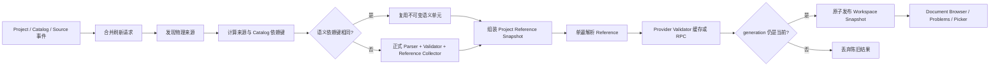
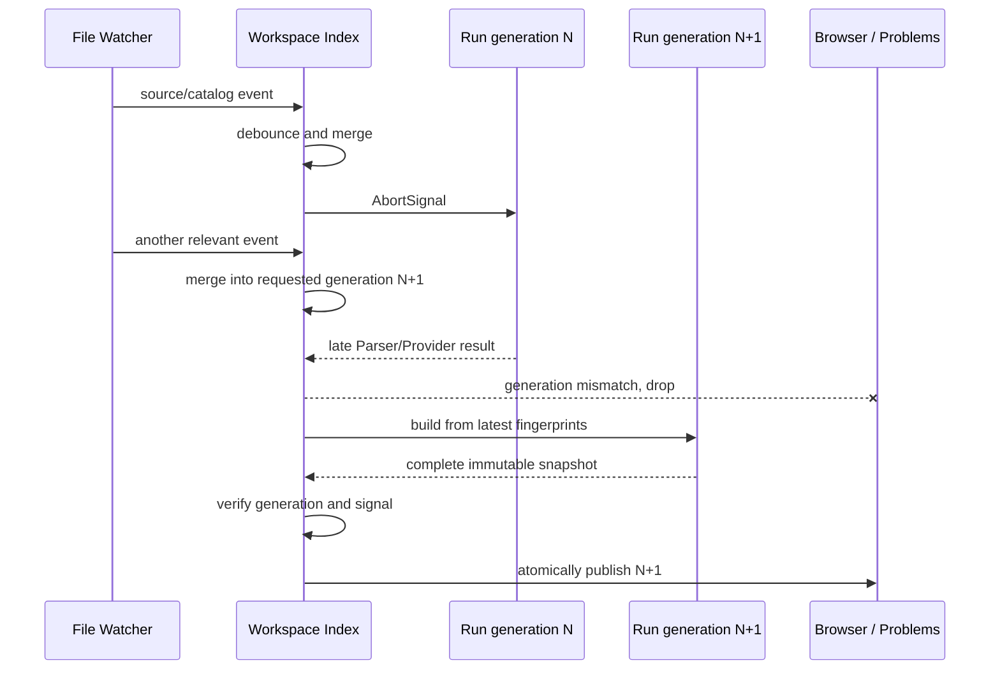

# Workspace Index 与大工程编辑性能

## 1. 文档定位

本文是 VisualBridge 在 Unity 正式接入前的 Workspace Document Index、不可变语义快照、Reference/Provider 缓存、稳定分页和 Table 大列表渲染的正式契约，同时提供面向使用者的刷新与故障处理说明。

本文只覆盖 Authoring Project、VS Code Host、MCP 与宿主无关语义包。Unity Catalog Exporter、Importer、Runtime 和 Debug 不在本阶段实现。

## 2. 目标与不变量

大工程优化不得以另一套简化语义换取速度。无论完整重建还是增量刷新，结果都必须来自相同的正式能力：

- Project Registry 与 Document Type 路由；
- Catalog Parser 与 Registry；
- Graph、Entity、Structured、Table 的 Parser、Validator 和 Reference Collector；
- Core Reference Service 与 Project Provider Host；
- `sortIndexedDocuments` 的稳定排序和既有诊断规则。

以下结果在完整重建和任意等价的增量事件序列之后必须一致：

- 文档顺序、标题、稳定 Document ID 和物理来源集合；
- Parser、Catalog、领域、Reference 与 Provider 诊断；
- 出站 Reference 的解析状态与候选位置；
- Document Browser 派生的反向引用；
- Table 分表合并、严格类型、去重和显示名。

性能数据只用于观察变化。耗时与内存不设跨机器固定失败阈值；语义一致性、调用范围、取消、DOM 上限和 Cursor 冲突属于自动化正确性门槛。

## 3. 总体结构



VS Code 的 `WorkspaceDocumentIndex` 只负责调度、进度和发布。`IncrementalSemanticSnapshotStore` 按稳定来源键与显式依赖键复用语义单元；`workspaceSemanticSnapshotBuilder` 使用正式领域 Parser 建立单元，并在全部单元就绪后组装 Project Reference Snapshot。`WorkspaceReferenceService` 消费该快照，不再为一次索引刷新独立扫描和解析同一 Project。

## 4. 语义单元与依赖键

一个语义单元对应一个逻辑 Authoring Document：

- Graph、Entity、Structured：一个物理文本文件对应一个单元；
- XLSX Table：一个 Workbook 对应一个单元；
- CSV Table：同一 Table Type 分表规则匹配到的物理文件族对应一个单元。

单元至少保存：

- Project、Document Type、editor、逻辑主路径与全部 `sourcePaths`；
- 有序的物理来源 Hash；
- Document Type 定义、Table Layout 和有序 Catalog 内容 Hash 形成的依赖键；
- 描述信息、Parser/Catalog/领域诊断和 Reference Occurrence；
- Reference 候选贡献所需的已解析文档；
- 可选的 `ProjectProviderDocumentSnapshot`。

依赖键按内容而不是时间戳判断。单元的物理来源、Document Type、Table Layout 或任一绑定 Catalog 变化时，旧单元不得复用。只改变一个普通文档时，其他单元继续复用；Catalog 变化只使绑定它的 Document Type 单元失效；CSV 分表创建、删除或改名使所属逻辑文件族整体失效。

| 事件 | 失效范围 | 说明 |
| --- | --- | --- |
| Project File 语义变化 | 当前 Project | Document Type、Catalog、Layout 与 Provider 声明可能一起变化 |
| Catalog 内容变化 | 绑定该 Catalog 的 Document Type | 重新建立 Registry，并重跑依赖单元的领域校验 |
| Graph/Entity/Structured 文件变化 | 对应逻辑文档 | 其他 Parser/Validator 不调用 |
| XLSX 变化 | 对应 Workbook | 一个物理源就是一个逻辑单元 |
| CSV 分表变化 | 对应 CSV 文件族 | 保持分表匹配与去重语义完整 |
| include/exclude 外的文件变化 | 无 | 不启动索引刷新 |

发现阶段仍需枚举已声明来源并计算内容指纹，以发现新增、删除和重命名。它不会因此重新运行每个领域 Parser。

## 5. 不可变快照与 Reference

语义缓存只在一轮构建完整成功后替换。已发布快照中的数组按稳定键排序并作为只读值暴露；后续刷新创建新快照，不能原地修改旧快照。

Reference 阶段在语义单元齐备后执行：

1. 按 Project 汇总 `document`、`entity.component`、`graph.element` 和 `table.row` 候选来源。
2. 以 Project Snapshot 创建 Reference Service。
3. `analyzeOccurrences` 对每个 Occurrence 只执行一次 `resolve`，同时返回诊断与解析结果，避免“先 validate、再 resolve”的重复 RPC。
4. 全部文档完成且 generation 仍有效后，Workspace Index 与 Reference Service 一起切换到新快照。

已打开的 Table Custom Document 仍可作为 Picker 的临时覆盖层；覆盖层不改写已提交 Workspace Snapshot，也不进入磁盘源 Hash。关闭编辑器后覆盖层移除，Reference 重新使用已提交来源。

## 6. 刷新合并、取消与陈旧结果



- 200 ms 的宿主去抖合并相邻文件事件。
- 新请求会中止当前运行；Parser、XLSX、Reference 和 Provider 等昂贵边界前后检查 `AbortSignal`。
- 同步 Parser 已经开始时可以完成计算，但其结果在 generation 不匹配时必须丢弃。
- 被取消或失败的运行不得清空上一个完整快照，也不得发布部分诊断。
- `Validate All Documents` 显示可取消进度；普通后台刷新通过状态和 Document Browser 更新，不持续弹通知。
- Project 外或 include/exclude 不匹配的文件不进入刷新队列。

## 7. Provider 缓存与安全边界

Provider Validator 缓存键包含：

- Project 身份；
- 当前不可变 Project Snapshot 依赖键；
- Document Type、规范路径与 `sourceHash`。

相同依赖键的成功诊断可以复用。Project 依赖、Provider Host、信任状态或源 Hash 改变时必须失效。取消、Provider unavailable、超时、协议错误和外部修改结果不写入成功缓存。实际 RPC 继续经过 Node Host 的请求超时、`$/cancelRequest`、能力校验、前后物理 Manifest 检查和候选位置边界检查；缓存不能放宽 Project Provider 的安全模型。

Project Provider V2 没有声明细粒度外部依赖，因此 Validator 缓存的安全默认仍是 Project Snapshot 级依赖，不猜测业务 Provider 只依赖某一个文件。Reference 分页另由外层 Cursor 绑定 Host 实例、入口 Hash、进程 generation 和 Provider `snapshotHash`。

## 8. Table 大列表虚拟化

Table Record 列表使用 MIT 许可的 `@tanstack/react-virtual`，保留现有 Base UI、dnd-kit、Lucide 与 VS Code 主题样式。固定契约为：

- 行高 48 px，overscan 8；
- `row.id` 同时作为选择身份、React key 与 Virtualizer key；
- 只创建可见窗口和 overscan 范围内的 Record DOM；
- 搜索前为每个 revision 预计算显示名和编码后的字段搜索文本；
- 虚拟行位置容器与 dnd-kit 的可排序行分层，拖动继续提交原始 source index；
- 有查询时禁止排序，避免过滤集合与物理顺序混淆；
- Reference Reveal、新增、复制和选择通过稳定 Row ID 定位并滚动到目标。

自动化使用 1,000 与 50,000 行的确定性输入挂载 Webview 实际使用的 `VirtualizedTableRecordViewport`、TanStack Virtualizer 和 dnd-kit sortable 行，直接断言真实 `.record-virtual-row` / sortable DOM 在同一 600 px 视口都不超过 30。用例同时覆盖首尾 overscan、手动滚动、稳定 Row ID 定位、搜索替换、选择与字段编辑状态保持；不以浏览器执行时间作为 CI 阈值。

## 9. 稳定分页与 Cursor

Table 与 Reference 搜索的 Cursor 是不透明结构化令牌。调用方只能原样回传，不能解析、拼接或跨查询复用。Cursor 至少绑定：

- Tool/action 或 Reference kind；
- 规范化 query 与严格 selector；
- 稳定候选排序位置，排序键包含 `typeof value`，所以数字 `101` 与字符串 `"101"` 不相等；
- 当前 Table 物理来源 Manifest Hash、相关 Catalog Hash，或 Reference Project Snapshot 依赖键。

同一不可变快照内逐页读取不得重复或遗漏。MCP 建立内置 Reference Service 时先按请求 kind 捕获并解析实际 Document/Table/Catalog 语义，再把这组精确语义对象与物理来源 Manifest 一起规范哈希；内置 Provider 只消费已捕获对象，不在搜索时二次读盘。这既关闭 Hash 捕获与候选加载之间的 TOCTOU，也避免来源改动后又恢复旧 Hash 时错误接受另一组候选。查询或 selector 改变返回 `cursor.queryMismatch`；令牌损坏返回 `cursor.invalid`；来源、Catalog、Reference Snapshot 或 Provider 依赖改变返回 `cursor.snapshotChanged`，不得在新快照上继续旧位置。

Table 搜索继续使用正式 `resolveEffectiveTableRows`、分表去重、列 Codec 和 `rowDisplayNamePattern`。Webview 与 MCP 复用相同的规范查询与行搜索文本函数，避免一个按编码单元格搜索、另一个按原始 JSON 搜索。

## 10. 确定性大工程输入与基准报告

大工程样例由脚本生成到系统临时目录，不向 Git 提交数千文件或数万行静态样例。生成器只使用整数 seed、计数 ID、稳定路径和 LF；禁止时间、环境随机数和 `randomUUID` 进入内容。Manifest 按路径排序，记录每个文件的 SHA-256、字节数和语义计数；相同 seed/profile 连续运行必须完全一致。

正确性 profile 使用正式 Project、Catalog 与四类 Document Parser/Validator，验证：

- 生成内容合法；
- 增量单源变化只加载一个语义单元；
- 增量结果与强制完整重建深度相等；
- 生成的 Table 分表保持严格类型、稳定去重与正式 Parser/Validator 语义；大 Table 与 Reference 的跨页无重复、无遗漏由各自的生产分页测试覆盖。

Benchmark 记录 Node、OS、CPU、内存、seed、profile，以及生成、正式解析/校验、单源修改、增量重建和完整重建阶段的耗时与 `rss`/`heapUsed`。报告同时记录 `loaded`、`reused` 和增量/完整结果是否相等，输出 JSON 与 Markdown；数字用于人工比较和 CI artifact，不作为跨机器固定阈值。

## 11. 使用手册

### 后台刷新

保存匹配的 Authoring Document 或 Catalog 后，插件自动合并事件并刷新。Document Browser 顶部刷新命令也走同一增量管线，不会无条件重跑全部 Parser。

### 完整校验

运行 `VisualBridge: Validate All Documents`。通知区显示发现、语义、Reference 和 Provider 阶段进度；可以取消。只有完整成功的结果才发布到 `VisualBridge Workspace` Problems，取消时继续保留上一次完整诊断。

### 判断是否为索引问题

1. 先查看 VisualBridge Output 中 `[documents]` 行，确认文档数、错误数以及本轮 `loaded/reused`。
2. 确认文件匹配 Project Settings 中唯一 Document Type 的 include/exclude。
3. 查看 Catalog Browser 的内容 Hash、冲突与 stale 状态。
4. Provider 诊断异常时确认 Workspace Trust、Provider 日志与 Project 源文件是否被进程外修改。
5. Cursor 报 `snapshotChanged` 时重新发起第一页搜索，不要手工修改 Cursor。

### 大 Table 编辑

Record 总数不会线性增加 DOM。搜索、选择、Reveal 和字段编辑保持稳定 Row ID；搜索状态下排序被禁用，清空搜索后可继续使用项目统一的拖动、在后新增和删除操作组。

## 12. 自动化与发布检查

PU-06 至少执行：

```text
npm run check
npm test
npm run build
npm run package:vscode
npm run test:vscode:host
npm run test:vscode:cli
git diff --check
```

还需运行确定性大工程 correctness 测试和 benchmark 报告命令。所有源码变化后同步 CodeGraph，再检查影响范围。本文档不要求也不允许新增 Unity 测试或 Unity 实现。
